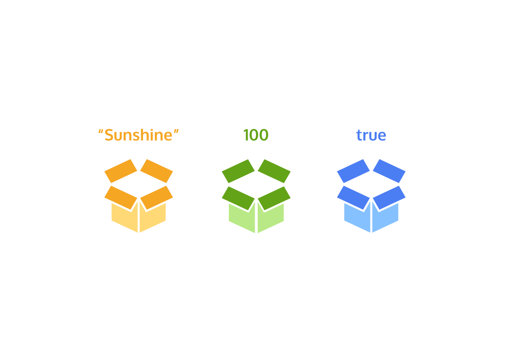

# Introduction to JavaScript

Get to know JavaScript data types and operators.

## 1. What is JavaScript ?

[Learn JavaScript | Codecademy](https://www.codecademy.com/courses/introduction-to-javascript/lessons/introduction-to-javascript/exercises/intro)

Last year, millions of learners from our community started with JavaScript. Why? JavaScript is primarily known as the language of most modern web browsers, and its early quirks gave it a bit of a bad reputation. However, the language has continued to evolve and improve. JavaScript is a powerful, flexible, and fast programming language now being used for increasingly complex web development and beyond! 

Since JavaScript remains at the core of web development, it’s often the first language learned by self-taught coders eager to learn and build. We’re excited for what you’ll be able to create with the JavaScript foundation you gain here. JavaScript powers the dynamic behavior on most websites, including this one. 

In this lesson, you will learn introductory coding concepts including data types and built-in objects—essential knowledge for all aspiring developers. Make sure to take notes and pace yourself. This foundation will set you up for understanding the more complex concepts you’ll encounter later.


------


## 2. Console

[Learn JavaScript | Codecademy](https://www.codecademy.com/courses/introduction-to-javascript/lessons/introduction-to-javascript/exercises/console)

The console is a panel that displays important messages, like errors, for developers. Much of the work the computer does with our code is invisible to us by default. If we want to see things appear on our screen, we can print, or *log*, to our console directly. 

In JavaScript, the `console` keyword refers to an object, a collection of data and actions, that we can use in our code. Keywords are words that are built into the JavaScript language, so the computer will recognize them and treats them specially. 

One action, or method, that is built into the `console` object  is the `.log()` method. When we write `console.log()` what we put inside the parentheses will get printed, or logged, to the console. 

It’s going to be very useful for us to print values to the console, so we can see the work that we’re doing. 

```js
console.log(5); 
```

This example logs `5`  to the console. The semicolon denotes the end of the line, or statement. Although in JavaScript your code will usually run as intended without a semicolon, we recommend learning the habit of ending each statement with a semicolon so you never leave one out in the few instances when they are required.

You’ll see later on that we can use `console.log()` to print different kinds of data.

**Instructions**

**1.** Use the `console.log` code in the editor to log your age to the console.
Run your code when you are ready to see the result.

```js
console.log(19);
```

**2.** On the next line, log a number representing the number of weeks you’ve been programming.

```js
console.log(23);
```

------


## 3. Comments

[Learn JavaScript | Codecademy](https://www.codecademy.com/courses/introduction-to-javascript/lessons/introduction-to-javascript/exercises/comments)

Programming is often highly collaborative. In addition, our own code can quickly become difficult to understand when we return to it— sometimes only an hour later ! For these reasons, it’s often useful to leave notes in our code for other developers or ourselves.  

As we write JavaScript, we can write comments in our code that the computer will ignore as our program runs. These comments exist just for human readers. 

Comments can explain what the code is doing, leave instructions for developers using the code, or add any other useful annotations. 

There are two types of code comments in JavaScript :

1. A *single line comment* will comment out a single line and is denoted with two forward slashes `//` preceding it.

   ```js
   // Prints 5 to the console
   console.log(5);
   ```

   You can also use a single line comment to comment after a line of code:

   ```js
   console.log(5);  // Prints 5 
   ```

2. A *multi-line comment* will comment out multiple lines and is denoted with `/*` to begin the comment, and `*/` to end the comment.

   ```js
   /*
   This is all commented 
   console.log(10);
   None of this is going to run!
   console.log(99);
   */
   ```

   You can also use this syntax to comment something out in the middle of a line of code :

   ```js
   console.log(/*IGNORED!*/ 5);  // Still just prints 5 
   ```


**Instructions**

```js
// app.js

console.log('It was love at first sight.');

console.log('The first time Yossarian saw the chaplain he fell madly in love with him.');
console.log('Yossarian was in the hospital with a pain in his liver that fell just short of being jaundice.');
console.log('The doctors were puzzled by the fact that it wasn\'t quite jaundice.');
console.log('If it became jaundice they could treat it.');
console.log('If it didn\'t become jaundice and went away they could discharge him.');
console.log('But this just being short of jaundice all the time confused them.');
```

**1.** Let’s practice adding some code comments.
To the right, we’ve provided you with the beginning of the book *Catch-22* by Joseph Heller.
On line 1, write a single line comment that says `Opening line`.

```js
// Opening line
```

**2.** Single line comments are great for adding context to your code. Multi-line  comments are often best suited to prevent a block of code from running.  However, both types of comments can be used for either purpose.
Use a multi-line comment so that the bottom 6 `console.log()` statements are all commented out.

```js
/*
console.log('The first time Yossarian saw the chaplain he fell madly in love with him.');
console.log('Yossarian was in the hospital with a pain in his liver that fell just short of being jaundice.');
console.log('The doctors were puzzled by the fact that it wasn\'t quite jaundice.');
console.log('If it became jaundice they could treat it.');
console.log('If it didn\'t become jaundice and went away they could discharge him.');
console.log('But this just being short of jaundice all the time confused them.');
*/
```

-----


## 4. Data Types

[Learn JavaScript | Codecademy](https://www.codecademy.com/courses/introduction-to-javascript/lessons/introduction-to-javascript/exercises/types)

*Data types* are the classifications we give to the different kinds of data that we use in programming.  In JavaScript, there are seven fundamental data types :

- *Number* : Any number, including numbers with decimals: `4`, `8`, `1516`, `23.42`.
- *String* : Any grouping of characters on your keyboard (letters, numbers, spaces, symbols, etc.) surrounded by single quotes: `' ... '` or double quotes `" ... "`. Though we prefer single quotes. Some people like to think of string as a fancy word for text.
- *Boolean* : This data type only has two possible values— either `true` or `false` (without quotes). It’s helpful to think of booleans as on and off switches or as the answers to a “yes” or “no” question.
- *Null* : This data type represents the intentional absence of a value, and is represented by the keyword `null` (without quotes).
- *Undefined* : This data type is denoted by the keyword `undefined` (without quotes).  It also represents the absence of a value though it has a different use than `null`.
- *Symbol* : A newer feature to the language, symbols are unique identifiers, useful in more complex coding. No need to worry about these for now.
- *Object* : Collections of related data.

The first 6 of those types are considered *primitive data types*. They are the most basic data types in the language. *Objects* are more complex, and you’ll learn much more about them as you progress through JavaScript. At first, seven types may not seem like that many, but soon you’ll observe the world opens with possibilities once you start leveraging each one. As you learn more about objects, you’ll be able to create complex collections of data.

But before we do that, let’s get comfortable with strings and numbers !

```js
console.log('Location of Codecademy headquarters: 575 Broadway, New York City');
console.log(40);
```

In the example above, we first printed a string. Our string isn’t just a single word ; it includes both capital and lowercase letters, spaces, and punctuation.
Next, we printed the number 40, notice we did not use quotes. 

**Instructions**

**1.** On line 1, log the string `'JavaScript'` to the console.

```js
console.log('JavaScript');
```

**2.** On line 2, log the number `2011` to the console.

```js
console.log(2011);
```

**3.** On line 3, print `'Woohoo! I love to code! #codecademy'` to the console.

```js
console.log('Woohoo! I love to code! #codecademy');
```

**4.** On line 4, print the number `20.49` to the console.

```js
console.log(20.49);
```

-----


## 5. Arithmetic Operators

[Learn JavaScript | Codecademy](https://www.codecademy.com/courses/introduction-to-javascript/lessons/introduction-to-javascript/exercises/math-operators)

Basic arithmetic often comes in handy when programming.
An *operator* is a character that performs a task in our code. JavaScript has several built-in in *arithmetic operators*, that allow us to perform mathematical calculations on numbers. These include the following operators and their corresponding symbols :

1. Add: `+`
2. Subtract: `-`
3. Multiply: `*`
4. Divide: `/`
5. Remainder: `%`

The first four work how you might guess : 

```js
console.log(3 + 4); // Prints 7
console.log(5 - 1); // Prints 4
console.log(4 * 2); // Prints 8
console.log(9 / 3); // Prints 3
```

Note that when we `console.log()` the computer will evaluate the expression inside the parentheses and print that result to the console. If we wanted to print the characters `3 + 4`, we would wrap them in quotes and print them as a string. 

```js
console.log(11 % 3); // Prints 2
console.log(12 % 3); // Prints 0
```

The remainder operator, sometimes called *modulo*, returns the number that remains after the right-hand number divides into the left-hand number as many times as it evenly can: `11 % 3` equals 2 because 3 fits into 11 three times, leaving 2 as the remainder.

**Instructions**

**1.** Inside of a `console.log()`, add `3.5` to your age. 
This is the age you’ll be when we start sending people to live on Mars.

```js
console.log(51 + 3.5);
```

**2.** On a new line write another `console.log()`. Inside the parentheses, take the current year and subtract `1969`.
The answer is how many years it’s been since the 1969 moon landing.

```js
console.log(2020 - 1969);
```

**3.** Create another `console.log()`. Inside the parentheses divide `65` by `240`.

```js
console.log(65 / 240);
```

**4.** Create one last `console.log()`. Inside the parentheses, multiply `0.2708` by `100`. 
That’s the percent of the sun that is made up of helium. Assuming we could stand on the sun, we’d all sound like chipmunks !

```js
console.log(0.2708 * 100);
```

-----


## 6. String Concatenation

[Learn JavaScript | Codecademy](https://www.codecademy.com/courses/introduction-to-javascript/lessons/introduction-to-javascript/exercises/string-concatenation)

Operators aren’t just for numbers ! When a  `+` operator is used on two strings, it appends the right string to the left string : 

```js
console.log('hi' + 'ya'); // Prints 'hiya'
console.log('wo' + 'ah'); // Prints 'woah'
console.log('I love to ' + 'code.')
// Prints 'I love to code.'
```

This process of appending one string to another is called *concatenation*. Notice in the third example we had to make sure to include a space at the end of the first string. The computer will join the strings exactly, so we needed to make sure to include the space we wanted between the two strings.  

```js
console.log('front ' + 'space'); 
// Prints 'front space'
console.log('back' + ' space'); 
// Prints 'back space'
console.log('no' + 'space'); 
// Prints 'nospace'
console.log('middle' + ' ' + 'space'); 
// Prints 'middle space'
```

Just like with regular math, we can combine, or chain, our operations to get a final result : 

```js
console.log('One' + ', ' + 'two' + ', ' + 'three!'); 
// Prints 'One, two, three!'
```

**Instructions**

**1.** Inside a `console.log()` statement, concatenate the two strings `'Hello'` and `'World'`. 
Note : You should concatenate the two strings exactly (without introducing any additional characters).

```js
console.log('Hello' + 'World'); //HelloWorld
```

**2.** We left off the space last time. Create a second `console.log()` statement in which you concatenate the strings `'Hello'` and `'World'`, but this time make sure to also include a space (`' '`) between the two words. 

```js
console.log('Hello' + ' ' + 'World'); // Hello World
```

-----


## 7. Properties

[Learn JavaScript | Codecademy](https://www.codecademy.com/courses/introduction-to-javascript/lessons/introduction-to-javascript/exercises/properties)

When you introduce a new piece of data into a JavaScript program, the browser saves it as an instance of the data type.  Every string instance has a property called `length` that stores the number of characters in that string. You can retrieve property information by appending the string with a period and the property name :

```js
console.log('Hello'.length); // Prints 5
```

The `.` is another operator ! We call it the *dot operator*. 

In the example above, the value saved to the `length` property is retrieved from the instance of the string, `'Hello'`. The program prints `5` to the console, because `Hello` has five characters in it.

**Instructions**

**1.** Use the `.length` property to log the number of characters in the following string to the console :

```js
'Teaching the world how to code'
```

```js
console.log('Teaching the world how to code'.length);
```

-----


## 8. Methods

[Learn JavaScript | Codecademy](https://www.codecademy.com/courses/introduction-to-javascript/lessons/introduction-to-javascript/exercises/built-in-methods)

Remember that methods are actions we can perform. JavaScript provides a number of string methods.
We *call*, or use, these methods by appending an instance with :

- a period (the dot operator)
- the name of the method
- opening and closing parentheses

E.g. `'example string'.methodName()`.

Does that syntax look a little familiar ? When we use `console.log()` we’re calling the `.log()` method on the `console` object. Let’s see `console.log()` and some real string methods in action !

```js
console.log('hello'.toUpperCase()); // Prints 'HELLO'
console.log('Hey'.startsWith('H')); // Prints true
```

Let’s look at each of the lines above :

- On the first line, the `.toUpperCase()` method is called on the string instance `'hello'`. The result is logged to the console. This method returns a string in all capital letters: `'HELLO'`.
- On the second line, the `.startsWith()` method is called on the string instance `'Hey'`. This method also accepts the character `'H'` as an input, or *argument*,  between the parentheses. Since the string `'Hey'` does start with the letter `'H'`, the method returns the boolean `true`. 

You can find a list of built-in string methods in the [JavaScript documentation](https://developer.mozilla.org/en-US/docs/Web/JavaScript/Reference/Global_Objects/String/prototype). Developers use documentation as a reference tool. It describes JavaScript’s keywords, methods, and syntax.

**Instructions**

```js
// app.js

// Use .toUpperCase() to log 'Codecademy' in all uppercase letters
console.log('Codecademy');

// Use a string method to log the following string without whitespace at the beginning and end of it.
console.log('    Remove whitespace   ');
```

**1.** Use the `.toUpperCase()` method to log the string `'Codecademy'` to the console in all capital letters.

```js
console.log('Codecademy'.toUpperCase()); // CODECADEMY
```

**2.** In the second `console.log()` statement in **app.js**, we have a string `'    Remove whitespace   '` which has spaces before and after the words `'Remove whitespace'`.
If we browse the  [JavaScript string documentation](https://developer.mozilla.org/en-US/docs/Web/JavaScript/Reference/Global_Objects/String/prototype), we find several built-in string methods that each accomplish a different goal. The one method that seems ideal for us is `.trim()`. 
Use the method to remove the whitespace at the beginning and end of the string in the second `console.log()` statement. 

```js
console.log('    Remove whitespace   '.trim()); // Remove whitespace
```

-----


## 9. Built-in Objects

[Learn JavaScript | Codecademy](https://www.codecademy.com/courses/introduction-to-javascript/lessons/introduction-to-javascript/exercises/libraries)

In addition to `console`, there are other [objects built into JavaScript](https://developer.mozilla.org/en-US/docs/Web/JavaScript/Reference/Global_Objects). Down the line, you’ll build your own objects, but for now these “built-in” objects are full of useful functionality.
For example, if you wanted to perform more complex mathematical operations than arithmetic, JavaScript has the built-in `Math` object.
The great thing about objects is that they have methods! Let’s call the `.random()` method from the built-in `Math` object:

```js
console.log(Math.random()); // Prints a random number between 0 and 1
```

In the example above, we called the `.random()` method by appending the object name with the dot operator, the name of the method, and opening and closing parentheses. This method returns a random number between 0 (inclusive) and 1 (exclusive).
To generate a random number between 0 and 50, we could multiply this result by 50, like so: 

```js
Math.random() * 50;
```

The example above will likely evaluate to a decimal. To ensure the answer is a whole number, we can take advantage of another useful `Math` method called `Math.floor()`. 
`Math.floor()` takes a decimal number, and rounds down to the nearest whole number. You can use `Math.floor()` to round down a random number like this:

```js
Math.floor(Math.random() * 50);
```

In this case :

1. `Math.random` generates a random number between 0 and 1.
2. We then multiply that number by `50`, so now we have a number between 0 and 50.
3. Then, `Math.floor()` rounds the number down to the nearest whole number.

If you wanted to see the number printed to the terminal, you would still need to use a `console.log()` statement :

```js
console.log(Math.floor(Math.random() * 50)); // Prints a random whole number between 0 and 50
```

To see all of the properties and methods on the `Math` object, take a look at [the documentation here](https://developer.mozilla.org/en-US/docs/Web/JavaScript/Reference/Global_Objects/Math).

**Instructions**

**1.** Inside of a `console.log()`, create a random number with `Math.random()`, then multiply it by `100`.

```js
console.log(Math.random() * 100); // 21.90774801087474
```

**2.** Now, use `Math.floor()` to make the output a whole number.
Inside the `console.log()` you wrote in the last step, put the existing `Math.random() * 100` code inside the parentheses of `Math.floor()`.

```js
console.log(Math.floor(Math.random() * 100)); // 19
```

**3.** Find a method on the [JavaScript `Math` object](https://developer.mozilla.org/en-US/docs/Web/JavaScript/Reference/Global_Objects/Math) that returns the smallest integer greater than or equal to a decimal number.
Use this method with the number `43.8`. Log the answer to the console.

```js
console.log(Math.ceil(43.8)); // 44
```

**4.** Use the [JavaScript documentation](https://developer.mozilla.org/en-US/docs/Web/JavaScript/Reference/Global_Objects/Number) to find a method on the built-in `Number` object that checks if a number is an integer. 
Put the number `2017` in the parentheses of the method and use `console.log()` to print the result.

```js
console.log(Number.isInteger(2017)); // true
```

-----


## 10. Review

[Learn JavaScript | Codecademy](https://www.codecademy.com/courses/introduction-to-javascript/lessons/introduction-to-javascript/exercises/review)

Let’s take one more glance at the concepts we just learned :

- Data is printed, or logged, to the console, a panel that displays messages, with `console.log()`.
- We can write single-line comments with `//` and multi-line comments between `/*` and `*/`.
- There are 7 fundamental data types in JavaScript: strings, numbers, booleans, null, undefined, symbol, and object.
- Numbers are any number without quotes: `23.8879`
- Strings are characters wrapped in single or double quotes: `'Sample String'`
- The built-in arithmetic operators include `+`, `-`, `*`, `/`, and `%`.
- Objects, including instances of data types, can have properties, stored information. The properties are denoted with a `.` after the name of the object, for example: `'Hello'.length`. 
- Objects, including instances of data types, can have methods which perform actions. Methods are called by appending the object or instance with a period, the method name, and parentheses. For example: `'hello'.toUpperCase()`.
- We can access properties and methods by using the `.`, dot operator. 
- Built-in objects, including `Math`, are collections of methods and properties that JavaScript provides.

-----

# Variables

Learn JavaScript variables.

## 1. Variables

[Learn JavaScript | Codecademy](https://www.codecademy.com/courses/introduction-to-javascript/lessons/variables/exercises/intro-variables)

In programming, a *variable* is a container for a value. You can think of variables as little containers for information that live in a computer’s memory. Information stored in variables, such as a username, account number, or even personalized greeting can then be found in memory. 

Variables also provide a way of labeling data with a descriptive name, so our programs can be understood more clearly by the reader and ourselves.

In short, variables label and store data in memory.  There are only a few things you can do with variables:

1. Create a variable with a descriptive name.
2. Store or update information stored in a variable.
3. Reference or “get” information stored in a variable.

It is important to distinguish that variables are not values; they contain values and represent them with a name. Observe the diagram with the colored boxes. Each box represents variables ; the values are represented by the content, and the name is represented with the label. 

In this lesson, we will cover how to use the `var`, `let`, and `const` keywords to create variables.

-----


## 2. Create a Variable : var

[Learn JavaScript | Codecademy](https://www.codecademy.com/courses/introduction-to-javascript/lessons/variables/exercises/var)

There were a lot of changes introduced in the ES6 version of JavaScript in 2015. One of the biggest changes was two new keywords, `let` and `const`, to create, or *declare*, variables. Prior to the ES6, programmers could only use the `var` keyword to declare variables. 

```js
var myName = 'Arya';
console.log(myName); // Output : Arya
```

Let’s consider the example above :

1. `var`, short for variable, is a JavaScript *keyword* that creates, or *declares*, a new variable.
2. `myName` is the variable’s name. Capitalizing in this way is a standard convention in JavaScript called *camel casing*. In camel casing you group words into one, the first word is lowercase, then every word that follows will have its first letter uppercased. (e.g. camelCaseEverything). 
3. `=` is the *assignment operator*. It assigns the value (`'Arya'`) to the variable (`myName`). 
4. `'Arya'` is the *value* assigned (`=`) to the variable `myName`. You can also say that the `myName` variable is *initialized* with a value of `'Arya'`. 
5. After the variable is declared, the string value `'Arya'` is printed to the console by referencing the variable name: `console.log(myName)`. 

There are a few general rules for naming variables :

- Variable names cannot start with numbers. 
- Variable names are case sensitive, so `myName` and `myname` would be different variables. It is bad practice to create two variables that have the same name using different cases.
- Variable names cannot be the same as *keywords*. For a comprehensive list of keywords check out [MDN’s keyword documentation](https://developer.mozilla.org/en-US/docs/Web/JavaScript/Reference/Lexical_grammar#Keywords).

Note: In the next exercises, we will learn why ES6’s `let` and `const` are the preferred variable keywords by many programmers. Because there is still a ton of code written prior to ES6, it’s helpful to be familiar with the pre-ES6 `var` keyword.

If you want to learn more about `var` and the quirks associated with it, check out the [MDN var documentation](https://developer.mozilla.org/en-US/docs/Web/JavaScript/Reference/Statements/var).

**Instructions**

**1.** Declare a variable named `favoriteFood` using the `var` keyword and assign to it the string `'pizza'`.

```js
var favoriteFood = 'pizza';
```

**2.** Declare a variable named `numOfSlices` using the `var` keyword and assign to it the number `8`.

```js
var numOfSlices = 8;
```

**3.** Under the `numOfSlices` variable, use `console.log()` to print the value saved to `favoriteFood`.
On the following line, use `console.log()` to print the value saved to `numOfSlices`.

```js
console.log(favoriteFood); // pizza
console.log(numOfSlices); // 8
```

-----


## 3. Create a Variable : let

[Learn JavaScript | Codecademy](https://www.codecademy.com/courses/introduction-to-javascript/lessons/variables/exercises/let)

As mentioned in the previous exercise, the `let` keyword was introduced in ES6. The `let` keyword signals that the variable can be reassigned a different value. Take a look at the example :

```js
let meal = 'Enchiladas';
console.log(meal); // Output: Enchiladas
meal = 'Burrito';
console.log(meal); // Output: Burrito
```

Another concept that we should be aware of when using `let` (and even `var`) is that we can declare a variable without assigning the variable a value. In such a case, the variable will be automatically initialized with a value of `undefined`:

```js
let price;
console.log(price); // Output: undefined
price = 350;
console.log(price); // Output: 350
```

Notice in the example above : 

- If we don’t assign a value to a variable declared using the `let` keyword, it automatically has a value of `undefined`. 
- We can reassign the value of the variable. 

**Instructions**

**1.** Create a `let` variable called `changeMe` and set it equal to the boolean `true`.

```js
let changeMe = true;
```

**2.** On the line after `changeMe` is declared, set the value of `changeMe` to be the boolean `false`.
To check if `changeMe` was reassigned, log the value saved to `changeMe` to the console.

```js
changeMe = false;
console.log(changeMe); // false
```

-------


## 4. Create a Variable : const

[Learn JavaScript | Codecademy](https://www.codecademy.com/courses/introduction-to-javascript/lessons/variables/exercises/const)

The `const` keyword was also introduced in ES6, and is short for the word constant. Just like with `var` and `let` you can store any value in a `const` variable. The way you declare a `const` variable and assign a value to it follows the same structure as `let` and `var`. Take a look at the following example :

```js
const myName = 'Gilberto';
console.log(myName); // Output: Gilberto
```

However, a `const` variable cannot be reassigned because it is *constant*. If you try to reassign a `const` variable, you’ll get a `TypeError`.

Constant variables *must* be assigned a value when declared.  If you try to declare a `const` variable without a value, you’ll get a `SyntaxError`. 

If you’re trying to decide between which keyword to use, `let` or `const`, think about whether you’ll need to reassign the variable later on. If you do need to reassign the variable use `let`, otherwise, use `const`. 

**Instructions**

**1.** Create a constant variable named `entree` and set it to equal to the string `'Enchiladas'`.

```js
const entree = 'Enchiladas';
```

**2.** Just to check that you’ve saved the value of `'Enchiladas'` to `entree`, log the value of `entree` to the console.

```js
console.log(entree); // Enchiladas
```

**3.** Great, let’s see what happens if you try to reassign a constant variable.
Paste the following code to the bottom of your program.

```js
entree = 'Tacos'
```

This code throws the following error when you run your code:

```error
TypeError: Assignment to constant variable.
```

After you clear this checkpoint, if you want to see about another quirk of `const` in action open the hint !

**Hint**

Since our program stops running after encountering an error, we need to delete the line of code from the previous step :

```js
entree = 'Tacos'
```

Now, let’s test what happens when you try to declare a `const` variable *without* a value. Paste in the following code to your program :

```js
const testing;
```

You should see a different error this time : 

```js
SyntaxError: Missing initializer in const declaration
```

If you read through this error, you’ll see that it’s related to syntax, you need to initialize a `const` variable with a value. 

------


## 5. Mathematical Assignment Operators

[Learn JavaScript | Codecademy](https://www.codecademy.com/courses/introduction-to-javascript/lessons/variables/exercises/mathematical-shortcuts)

Let’s consider how we can use variables and math operators to calculate new values and assign them to a variable. Check out the example below :

```js
let w = 4;
w = w + 1;

console.log(w); // Output: 5
```

In the example above, we created the variable `w` with the number `4` assigned to it. The following line, `w = w + 1`, increases the value of `w` from `4` to `5`.
Another way we could have reassigned `w` after performing some mathematical operation on it is to use built-in *mathematical assignment operators*. We could re-write the code above to be :

```js
let w = 4;
w += 1;

console.log(w); // Output: 5
```

In the second example, we used the `+=` assignment operator to reassign `w`. We’re performing the mathematical operation of the first operator `+` using the number to the right, then reassigning `w` to the computed value.
We also have access to other mathematical assignment operators: `-=`, `*=`, and `/=` which work in a similar fashion. 

```js
let x = 20;
x -= 5; // Can be written as x = x - 5
console.log(x); // Output: 15

let y = 50;
y *= 2; // Can be written as y = y * 2
console.log(y); // Output: 100

let z = 8;
z /= 2; // Can be written as z = z / 2
console.log(z); // Output: 4
```

Let’s practice using these mathematical assignment operators ! 

**Instructions**

**1.** Use the `+=` mathematical assignment operator to increase the value stored in `levelUp` by `5`.

```js
let levelUp = 10;
levelUp += 5;
console.log('The value of levelUp:', levelUp); // The value of levelUp: 15
```

**2.** Use the `-=` mathematical assignment operator to decrease the value stored in `powerLevel` by `100`.

```js
let powerLevel = 9001;
powerLevel -= 100;
console.log('The value of powerLevel:', powerLevel); // The value of powerLevel: 8901
```

**3.** Use the `*=` mathematical assignment operator to multiply the value stored in `multiplyMe` by `11`.

```js
let multiplyMe = 32;
multiplyMe *= 11;
console.log('The value of multiplyMe:', multiplyMe); // The value of multiplyMe: 352
```

**4.** Use the `/=` mathematical assignment operator to divide the value stored in `quarterMe` by `4`.

```js
let quarterMe = 1152;
quarterMe /= 4;
console.log('The value of quarterMe:', quarterMe); // The value of quarterMe: 288
```

-----


## 6. The Increment and Decrement Operator

[Learn JavaScript | Codecademy](https://www.codecademy.com/courses/introduction-to-javascript/lessons/variables/exercises/increment-decrement)

Other mathematical assignment operators include the *increment operator* (`++`) and *decrement operator* (`--`). 
The increment operator will increase the value of the variable by 1. The decrement operator will decrease the value of the variable by 1. For example :

```js
let a = 10;
a++;
console.log(a); // Output: 11
let b = 20;
b--;
console.log(b); // Output: 19
```

Just like the previous mathematical assignment operators (`+=`, `-=`, `*=`, `/=`), the variable’s value is updated *and* assigned as the new value of that variable.

**Instructions**

**1.** Using the increment operator, increase the value of `gainedDollar`. 

```js
let gainedDollar = 3;
gainedDollar++;
console.log(gainedDollar); // 4
```

**2.** Using the decrement operator, decrease the value of `lostDollar`. 

```js
let lostDollar = 50;
lostDollar--
console.log(lostDollar); // 49
```

-----


## 7. String Concatenation with Variables

[Learn JavaScript | Codecademy](https://www.codecademy.com/courses/introduction-to-javascript/lessons/variables/exercises/string-interpolation)

In previous exercises, we assigned strings to variables. Now, let’s go over how to connect, or concatenate, strings in variables.
The `+` operator can be used to combine two string values even if those values are being stored in variables :

```js
let myPet = 'armadillo';
console.log('I own a pet ' + myPet + '.'); 
// Output: 'I own a pet armadillo.'
```

In the example above, we assigned the value `'armadillo'` to the `myPet` variable. On the second line, the `+` operator is used to combine three strings : `'I own a pet'`, the value saved to `myPet`, and `'.'`. We log the result of this concatenation to the console as :

```js
I own a pet armadillo.
```

**Instructions**

**1.** Create a variable named `favoriteAnimal` and set it equal to your favorite animal.

```js
let favoriteAnimal = 'cat';
```

**2.** Use `console.log()` to print `'My favorite animal: ANIMAL'` to the console. Use string concatenation so that `ANIMAL` is replaced with the value in your `favoriteAnimal` variable.

```js
console.log('My favorite animal:' + favoriteAnimal); // My favorite animal:cat
```

-----


## 8. String Interpolation

[Learn JavaScript | Codecademy](https://www.codecademy.com/courses/introduction-to-javascript/lessons/variables/exercises/string-interpolation-ii)

In the ES6 version of JavaScript, we can insert, or *interpolate*, variables into strings using *template literals*. Check out the following example where a template literal is used to log strings together :

```js
const myPet = 'armadillo';
console.log(`I own a pet ${myPet}.`);
// Output: I own a pet armadillo.
```

Notice that :

- a template literal is wrapped by backticks ``` (this key is usually located on the top of your keyboard, left of the 1 key).
- Inside the template literal, you’ll see a placeholder, `${myPet}`. The value of `myPet` is inserted into the template literal.
- When we interpolate ``I own a pet ${myPet}.``, the output we print is the string : `'I own a pet armadillo.'`

One of the biggest benefits to using template literals is the readability of the code. Using template literals, you can more easily tell what the new string will be. You also don’t have to worry about escaping double quotes or single quotes. 

**Instructions**

**1.** Create a variable called `myName` and assign it your name.

```js
let myName = 'Gilles';
```

**2.** Create a variable called `myCity` and assign it your favorite city’s name.

```js
let myCity = 'Biarritz';
```

**3.** Use a single template literal to interpolate your variables into the sentence below. Use `console.log()` to print your sentence to the console in the following format :

```js
My name is NAME. My favorite city is CITY.
```

Replace `NAME` and `CITY` in the string above by interpolating the values saved to `myName` and `myCity`.

```js
console.log(`my name is ${myName}. My favorite city is ${myCity}`);
// my name is Gilles. My favorite city is Biarritz
```

-----


## 9. typeof operator

[Learn JavaScript | Codecademy](https://www.codecademy.com/courses/introduction-to-javascript/lessons/variables/exercises/typeof)

While writing code, it can be useful to keep track of the data types of the variables in your program. If you need to check the data type of a variable’s value, you can use the `typeof` operator.
The `typeof` operator checks the value to its right and *returns*, or passes back, a string of the data type. 

```js
const unknown1 = 'foo';
console.log(typeof unknown1); // Output: string

const unknown2 = 10;
console.log(typeof unknown2); // Output: number

const unknown3 = true; 
console.log(typeof unknown3); // Output: boolean
```

Let’s break down the first example. Since the value `unknown1` is `'foo'`, a string, `typeof unknown1` will return `'string'`. 

**Instructions**

**1.** Use `console.log()` to print the `typeof newVariable`.

```js
let newVariable = 'Playing around with typeof.';
console.log(typeof newVariable); // string
```

**2.** Great, now let’s check what happens if we reassign the variable.  Below the `console.log()` statement, reassign `newVariable` to `1`.

```js
let newVariable = 1;
console.log(typeof newVariable); // number
```

**3.** Since you assigned this new value to `newVariable`, it has a new type ! On the line below your reassignment, use `console.log()` to print `typeof newVariable` again.

```js
let newVariable = 1;
console.log(typeof newVariable); // number
console.log(typeof newVariable); // number
```

-----


## 10. Review Variables

[Learn JavaScript | Codecademy](https://www.codecademy.com/courses/introduction-to-javascript/lessons/variables/exercises/review-variables)

Nice work ! This lesson introduced you to variables, a powerful concept you will use in all your future programming endeavors.

Let’s review what we learned :

- Variables hold reusable data in a program and associate it with a name.
- Variables are stored in memory.
- The `var` keyword is used in pre-ES6 versions of JS.
- `let` is the preferred way to declare a variable when it can be reassigned, and `const` is the preferred way to declare a variable with a constant value.
- Variables that have not been initialized store the primitive data type `undefined`.
- Mathematical assignment operators make it easy to calculate a new value and assign it to the same variable.
- The `+` operator is used to concatenate strings including string values held in variables
- In ES6, template literals use backticks ``` and `${}` to interpolate values into a string.
- The `typeof` keyword returns the data type (as a string) of a value.

**Instructions**

To learn more about variables take on these challenges !

- Create variables and manipulate the values
- Check what happens when you try concatenating strings using variables of different data types
- Interpolate multiple variables into a string 
- See what happens when you use `console.log()` on variables declared by different keywords (`const`, `let`, `var`) before they’re defined. For example :

```js
console.log(test1);

const test1 = 'figuring out quirks';
```

- Find the data type of a variable’s value using the  `typeof` keyword on a variable.
- Use `typeof` to find the data type of the resulting value when you concatenate variables containing two different data types. 