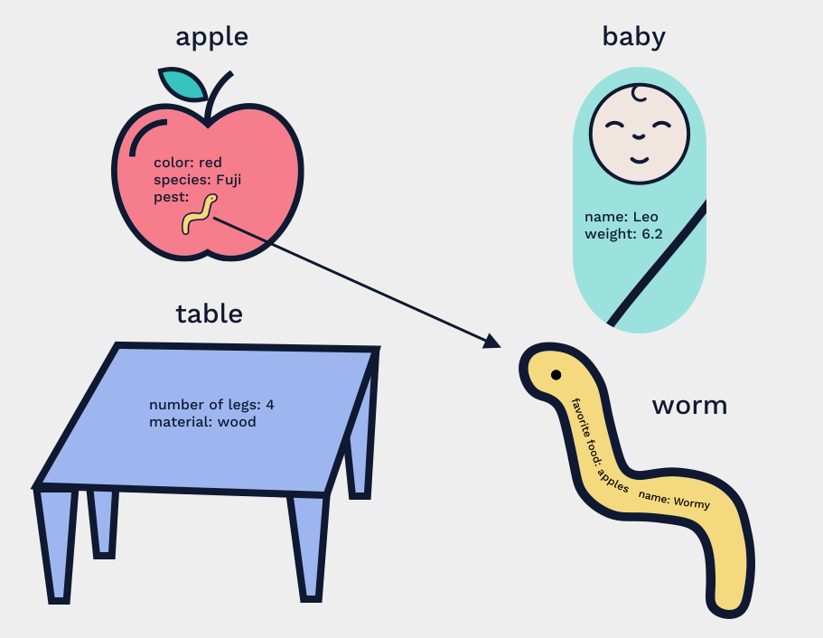
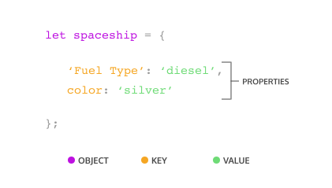
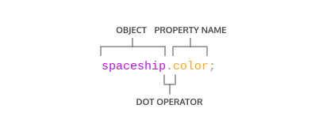
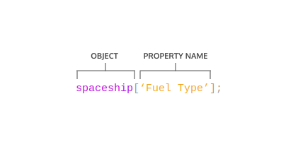
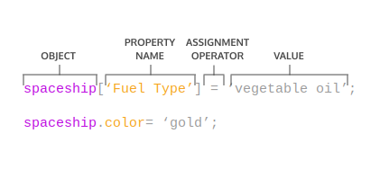

Learn how to store data and functions inside JavaScript objects. 

## 01. Introduction to Objects

[Learn JavaScript | Codecademy](https://www.codecademy.com/courses/introduction-to-javascript/lessons/objects/exercises/intro)

It’s time to learn more about the basic structure that permeates nearly every aspect of JavaScript programming : objects.

You’re probably already more comfortable with objects than you think, because JavaScript loves objects! Many components of the language are actually objects under the hood, and even the parts that aren’t— like strings or numbers— can still act like objects in some instances. 

There are only seven fundamental data types in JavaScript, and six of those are the primitive data types: string, number, boolean, null, undefined, and symbol. With the seventh type, objects, we open our code to more complex possibilities. We can use JavaScript objects to model real-world things, like a basketball, or we can use objects to build the data structures that make the web possible. 

At their core, JavaScript objects are containers storing related data and functionality, but that deceptively simple task is extremely powerful in practice. You’ve been using the power of objects all along, but now it’s time to understand the mechanics of objects and start making your own ! 



-----


## 02. Creating Object Literals

[Learn JavaScript | Codecademy](https://www.codecademy.com/courses/introduction-to-javascript/lessons/objects/exercises/objects)

Objects can be assigned to variables just like any JavaScript type. We use curly braces, `{}`, to designate an *object literal* :

```js
let spaceship = {}; // spaceship is an empty object
```

We fill an object with unordered data. This data is organized into *key-value pairs*. A key is like a variable name that points to a location in memory that holds a value.


A key’s value can be of any data type in the language including functions or other objects. 

We make a key-value pair by writing the key’s name, or *identifier*, followed by a colon and then the value. We separate each key-value pair in an object literal with a comma (`,`).  Keys are strings, but when we have a key that does not have any special characters in it, JavaScript allows us to omit the quotation marks :



```js
// An object literal with two key-value pairs
let spaceship = {
  'Fuel Type': 'diesel',
  color: 'silver'
};
```

The `spaceship` object has two properties `Fuel Type` and `color`. `'Fuel Type'` has quotation marks because it contains a space character. 

Let’s make some objects !

**Instructions**

**1.** The `spaceship` we have so far looks good but, unfortunately, is not very fast at hyperspace travel due to having an inferior fuel source. Make a new spaceship object named `fasterShip` with the same `color` as `spaceship` but with a `Fuel Type` equal to `'Turbo Fuel'`.

```js
let fasterShip = {
  'Fuel Type': 'Turbo Fuel',
  color: 'silver'
};
```

-----


## 03. Accessing Properties

[Learn JavaScript | Codecademy](https://www.codecademy.com/courses/introduction-to-javascript/lessons/objects/exercises/object-property-access)

There are two ways we can access an object’s property. Let’s explore the first way— dot notation, `.`.

You’ve used dot notation to access the properties and methods of built-in objects and data instances :

```js
'hello'.length; // Returns 5
```

With property dot notation, we write the object’s name, followed by the dot operator and then the property name (key) :

```js
let spaceship = {
  homePlanet: 'Earth',
  color: 'silver'
};
spaceship.homePlanet; // Returns 'Earth',
spaceship.color; // Returns 'silver',
```



If we try to access a property that does not exist on that object, `undefined` will be returned.

```js
spaceship.favoriteIcecream; // Returns undefined
```

Let’s get some more practice using dot notation on an object !

**Instructions**

**1.** Let’s use the dot operator to access the value of `numCrew` from the `spaceship` object in the code editor. Create a variable `crewCount` and assign the `spaceship`‘s `numCrew` property to it. 

**2.** Again using the dot operator, create a variable `planetArray` and assign the `spaceship`‘s  `flightPath` property to it.

```js
let spaceship = {
  homePlanet: 'Earth',
  color: 'silver',
  'Fuel Type': 'Turbo Fuel',
  numCrew: 5,
  flightPath: ['Venus', 'Mars', 'Saturn']
};
let crewCount = spaceship.numCrew;
console.log(crewCount); // 5
let planetArray = spaceship.flightPath;
console.log(planetArray); // [ 'Venus', 'Mars', 'Saturn' ]
```

-----


## 04. Bracket Notation

[Learn JavaScript | Codecademy](https://www.codecademy.com/courses/introduction-to-javascript/lessons/objects/exercises/object-property-access-ii)

The second way to access a key’s value is by using bracket notation, `[ ]`.

You’ve used bracket notation when indexing an array :

```js
['A', 'B', 'C'][0]; // Returns 'A'
```

To use bracket notation to access an object’s property, we pass in the property name (key) as a string.



We **must** use bracket notation when accessing keys that have numbers, spaces, or special characters in them. Without bracket notation in these situations, our code would throw an error.

```js
let spaceship = {
  'Fuel Type': 'Turbo Fuel',
  'Active Duty': true,
  homePlanet: 'Earth',
  numCrew: 5
};
spaceship['Active Duty'];   // Returns true
spaceship['Fuel Type'];   // Returns  'Turbo Fuel'
spaceship['numCrew'];   // Returns 5
spaceship['!!!!!!!!!!!!!!!'];   // Returns undefined
```

With bracket notation you can also use a variable inside the brackets to select the keys of an object. This can be especially helpful when working with functions:

```js
let returnAnyProp = (objectName, propName) => objectName[propName];

returnAnyProp(spaceship, 'homePlanet'); // Returns 'Earth'
```

If we tried to write our `returnAnyProp()` function with dot notation (`objectName.propName`) the computer would look for a key of `'propName'` on our object and not the value of the `propName` parameter. 

Let’s get some practice using bracket notation to access properties !

**Instructions**

**1.** Let’s use bracket notation to access the value of `'Active Mission'` from the `spaceship` object in the code editor. Create a variable `isActive` and assign the `spaceship`‘s  `'Active Mission'` property to it.

**2.** Using bracket notation and the `propName` variable provided, `console.log()` the value of the `'Active Mission'` property. 

```js
let spaceship = {
  'Fuel Type' : 'Turbo Fuel',
  'Active Mission' : true,
  homePlanet : 'Earth', 
  numCrew: 5
 };
let propName =  'Active Mission';
const isActive = spaceship['Active Mission'];
console.log(spaceship['Active Mission']); // true
```

-----


## 05. Property Assignment

[Learn JavaScript | Codecademy](https://www.codecademy.com/courses/introduction-to-javascript/lessons/objects/exercises/add-property)

Once we’ve defined an object, we’re not stuck with all the properties we wrote. Objects are *mutable* meaning we can update them after we create them ! 

We can use either dot notation, `.`, or bracket notation, `[]`,  and the assignment operator, `=`  to add new key-value pairs to an object or change an existing property. 



One of two things can happen with property assignment :

- If the property already exists on the object, whatever value it held before will be replaced with the newly assigned value.
- If there was no property with that name, a new property will be added to the object. 

It’s important to know that although we can’t reassign an object declared with `const`, we can still mutate it, meaning we can add new properties and change the properties that are there.

```js
const spaceship = {type: 'shuttle'};
spaceship = {type: 'alien'}; // TypeError: Assignment to constant variable.
spaceship.type = 'alien'; // Changes the value of the type property
spaceship.speed = 'Mach 5'; // Creates a new key of 'speed' with a value of 'Mach 5'
```

You can delete a property from an object with the `delete` operator. 

```js
const spaceship = {
  'Fuel Type': 'Turbo Fuel',
  homePlanet: 'Earth',
  mission: 'Explore the universe' 
};

delete spaceship.mission;  // Removes the mission property
```

**Instructions**

**1.** Reassign the `color` property of the `spaceship` object to have a value of `'glorious gold'` 

**2.** Without changing lines 1 - 6, add a `numEngines` property with a numeric value between 1 and 10 to the `spaceship` object.

**3.** Use the `delete` operator to remove the `'Secret Mission'` property from the `spaceship` object.

```js
let spaceship = {
  'Fuel Type' : 'Turbo Fuel',
  homePlanet : 'Earth',
  color: 'silver',
  'Secret Mission' : 'Discover life outside of Earth.'
};
spaceship.color = 'glorious gold';
spaceship.numEngines = 5;
delete spaceship['Secret Mission'];
```

```js
console.log(spaceship);
// { 'Fuel Type': 'Turbo Fuel',
//   homePlanet: 'Earth',
//   color: 'glorious gold',
//   numEngines: 5 }
```

-----


## 06. Methods

[Learn JavaScript | Codecademy](https://www.codecademy.com/courses/introduction-to-javascript/lessons/objects/exercises/methods)

When the data stored on an object is a function we call that a *method*. A property is what an object has, while a method is what an object does.

Do object methods seem  familiar? That’s because you’ve been using them all along! For example `console` is a global javascript object and `.log()` is a method on that object. `Math` is also a global javascript object and `.floor()` is a method on it. 

We can include methods in our object literals by creating ordinary, comma-separated key-value pairs. The key serves as our method’s name, while the value is an anonymous function expression.

```js
const alienShip = {
  invade: function () { 
    console.log('Hello! We have come to dominate your planet. Instead of Earth, it shall be called New Xaculon.')
  }
};
```

With the new method syntax introduced in ES6 we can omit the colon  and the `function` keyword.

```js
const alienShip = {
  invade () { 
    console.log('Hello! We have come to dominate your planet. Instead of Earth, it shall be called New Xaculon.')
  }
};
```

Object methods are invoked by appending the object’s name with the dot operator followed by the method name and parentheses:

```js
alienShip.invade(); // Prints 'Hello! We have come to dominate your planet. Instead of Earth, it shall be called New Xaculon.'
```

**Instructions**

**1.** Below the `retreatMessage` variable in the code editor, create an `alienShip` object. It should contain a method `.retreat()` which will `console.log()` the `retreatMessage`. 

**2.** Add another method to your object literal. This method, `.takeOff()`, should `console.log()` the string `'Spim... Borp... Glix... Blastoff!'`.

**3.** Invoke your two methods: first  `.retreat()` then `.takeOff()`.

```js
let retreatMessage = 'We no longer wish to conquer your planet. It is full of dogs, which we do not care for.';
let alienShip = {
  retreat() {
    console.log(retreatMessage)
  },
  takeOff() {
    console.log('Spim... Borp... Glix... Blastoff!')
  }
};
alienShip.retreat();
alienShip.takeOff();
```

```js
We no longer wish to conquer your planet. It is full of dogs, which we do not care for.
Spim... Borp... Glix... Blastoff!
```

-----


## 07. Nested Objects

[Learn JavaScript | Codecademy](https://www.codecademy.com/courses/introduction-to-javascript/lessons/objects/exercises/nested-objects)

In application code, objects are often nested— an object might have another object as a property which in turn could have a property that’s an array of even more objects !

In our  `spaceship` object, we want a `crew` object. This will contain all the crew members who do important work on the craft. Each of those `crew` members are objects themselves. They have properties like `name`, and `degree`, and they each have unique methods based on their roles. We can also nest other objects in the `spaceship` such as a `telescope` or nest details about the spaceship’s computers inside a parent `nanoelectronics` object.

```js
const spaceship = {
     telescope: {
        yearBuilt: 2018,
        model: '91031-XLT',
        focalLength: 2032 
     },
    crew: {
        captain: { 
            name: 'Sandra', 
            degree: 'Computer Engineering', 
            encourageTeam() { console.log('We got this!') } 
         }
    },
    engine: {
        model: 'Nimbus2000'
     },
     nanoelectronics: {
         computer: {
            terabytes: 100,
            monitors: 'HD'
         },
        'back-up': {
           battery: 'Lithium',
           terabytes: 50
         }
    }
}; 
```

We can chain operators to access nested properties. We’ll have to pay attention to which operator makes sense to use in each layer. It can be helpful to pretend you are the computer and evaluate each expression from left to right so that each operation starts to feel a little more manageable. 

```js
spaceship.nanoelectronics['back-up'].battery; // Returns 'Lithium'
```

In the preceding code :

- First the computer evaluates `spaceship.nanoelectronics`, which results in an object containing the `back-up` and `computer` objects. 
- We accessed the  `back-up` object by appending `['back-up']`. 
- The  `back-up` object has a `battery` property, accessed with `.battery` which returned the value stored there: `'Lithium'`

**Instructions**

**1.** Create a variable `capFave` and assign the `captain`‘s favorite food (the element in the 0th index of her `'favorite foods'` array) to it. Make sure to use bracket and dot notation to get the value of the food through nested access (don’t just copy the value into the variable!)

**2.** Right now the `passengers` property has a value of `null`. Instead, assign as its value an array of objects. These objects should represent the `spaceship`‘s passengers as individual objects. Make at least one passenger object in the array that has at least one key-value pair on it. 

**3.** Create a variable `firstPassenger` and assign the first passenger as its value (the element in the 0th index of the `spaceship.passengers` array you just made). Make sure to use bracket and dot notation to get the passenger object through nested access (don’t just copy the object into the variable!)

```js
const capFave = spaceship.crew.captain['favorite foods'][0];
spaceship.passengers = [{name: 'Space Dog'}]
const firstPassenger = spaceship.passengers[0];
```

```js
console.log(capFave);
// cookies

console.log(spaceship);
/*
{ passengers: [ { name: 'Space Dog' } ],
  telescope: { yearBuilt: 2018, model: '91031-XLT', focalLength: 2032 },
  crew: 
   { captain: 
      { name: 'Sandra',
        degree: 'Computer Engineering',
        encourageTeam: [Function: encourageTeam],
        'favorite foods': [Object] } },
  engine: { model: 'Nimbus2000' },
  nanoelectronics: 
   { computer: { terabytes: 100, monitors: 'HD' },
     'back-up': { battery: 'Lithium', terabytes: 50 } } } */

console.log(firstPassenger);
// { name: 'Space Dog' }
```

-----


## 08. Pass By Reference

[Learn JavaScript | Codecademy](https://www.codecademy.com/courses/introduction-to-javascript/lessons/objects/exercises/pass-by-reference)

Objects are *passed by reference*. This means when we pass a variable assigned to an object into a function as an argument, the computer interprets the parameter name as pointing to the space in memory holding that object.  As a result, functions which change object properties actually mutate the object permanently (even when the object is assigned to a `const` variable). 

```js
const spaceship = {
  homePlanet : 'Earth',
  color : 'silver'
};

let paintIt = obj => {
  obj.color = 'glorious gold'
};

paintIt(spaceship);

spaceship.color // Returns 'glorious gold'
```

Our function `paintIt()` permanently changed the color of our `spaceship` object. However, reassignment of the  `spaceship` variable wouldn’t work in the same way : 

```js
let spaceship = {
  homePlanet : 'Earth',
  color : 'red'
};
let tryReassignment = obj => {
  obj = {
    identified : false, 
    'transport type' : 'flying'
  }
  console.log(obj) // Prints {'identified': false, 'transport type': 'flying'}

};
tryReassignment(spaceship) // The attempt at reassignment does not work.
spaceship // Still returns {homePlanet : 'Earth', color : 'red'};

spaceship = {
  identified : false, 
  'transport type': 'flying'
}; // Regular reassignment still works.
```

Let’s look at what happened in the code example :

- We declared this `spaceship` object with `let`. This allowed us to reassign it to a new object with `identified` and `'transport type'` properties with no problems. 
- When we tried the same thing using a function designed to reassign the object passed into it, the reassignment didn’t stick (even though calling `console.log()` on the object produced the expected result). 
- When we passed `spaceship` into that function, `obj` became a reference to the memory location of the `spaceship` object, but *not* to the `spaceship` variable. This is because the `obj` parameter of the `tryReassignment()` function is a variable in its own right. The body of `tryReassignment()` has no knowledge of the `spaceship` variable at all! 
- When we did the reassignment in the body of  `tryReassignment()`, the `obj` variable came to refer to the memory location of the object `{'identified' : false, 'transport type' : 'flying'}`, while the `spaceship` variable was completely unchanged from its earlier value.

**Instructions**

**1.** Write a function `greenEnergy()` that has an object as a parameter and sets that object’s `'Fuel Type'` property to `'avocado oil'`. 

**2.** Write a function `remotelyDisable()` that has an object as a parameter and sets (or reassigns) that object’s `disabled` property to `true`.

**3.** Call your two functions with the `spaceship` object in the code editor, then `console.log()` the `spaceship` object to confirm those properties were changed/added. 

```js
let spaceship = {
  'Fuel Type' : 'Turbo Fuel',
  homePlanet : 'Earth'
};
let greenEnergy = obj => {
  obj['Fuel Type'] = 'avocado oil'
};
let remotelyDisable = obj => {
  obj.disabled = true
};
greenEnergy(spaceship);
remotelyDisable(spaceship);
console.log(spaceship);
```

```bash
{ 'Fuel Type': 'avocado oil',
  homePlanet: 'Earth',
  disabled: true }
```

-----


## 09. Looping Through Objects

[Learn JavaScript | Codecademy](https://www.codecademy.com/courses/introduction-to-javascript/lessons/objects/exercises/for-in)

Loops are programming tools that repeat a block of code until a condition is met. We learned how to iterate through arrays using their numerical indexing, but the key-value pairs in objects aren’t ordered!  [JavaScript has given us alternative solution for iterating through objects with the `for...in` syntax ](https://developer.mozilla.org/en-US/docs/Web/JavaScript/Reference/Statements/for...in).

`for...in` will execute a given block of code for each property in an object. 

```js
let spaceship = {
    crew: {
    captain: { 
        name: 'Lily', 
        degree: 'Computer Engineering', 
        cheerTeam() { console.log('You got this!') } 
        },
    'chief officer': { 
        name: 'Dan', 
        degree: 'Aerospace Engineering', 
        agree() { console.log('I agree, captain!') } 
        },
    medic: { 
        name: 'Clementine', 
        degree: 'Physics', 
        announce() { console.log(`Jets on!`) } },
    translator: {
        name: 'Shauna', 
        degree: 'Conservation Science', 
        powerFuel() { console.log('The tank is full!') } 
        }
    }
}; 
// for...in
for (let crewMember in spaceship.crew) {
  console.log(`${crewMember}: ${spaceship.crew[crewMember].name}`)
};
```

Our `for...in` will iterate through each element of the `spaceship.crew` object. In each iteration, the variable `crewMember` is set to one of `spaceship.crew`‘s keys, enabling us to log a list of crew members’ role and `name`.

**Instructions**

**1.** Using `for...in`, iterate through the `spaceship.crew` object in the code editor and `console.log()` a list of crew roles and names in the following format: `'[crew member's role]: [crew member's name]'`, e.g.,`'chief officer: Dan'`. 

```js
for (let crewMember in spaceship.crew) {
  console.log(`${crewMember}: ${spaceship.crew[crewMember].name}`)
};
```

```bash
captain: Lily
chief officer: Dan
medic: Clementine
translator: Shauna
```

**2.** Using `for...in`, iterate through the `spaceship.crew` object in the code editor and `console.log()` a list of crew names and degrees in the following format: `'[crew member's name]: [crew member's degree]'`, i.e.,`'Lily: Computer Engineering'`.

```js
for (let crewMember in spaceship.crew) {
  console.log(`${spaceship.crew[crewMember].name}: ${spaceship.crew[crewMember].degree}`)
};
```

```js
Lily: Computer Engineering
Dan: Aerospace Engineering
Clementine: Physics
Shauna: Conservation Science
```

-----


## 10. Review

[Learn JavaScript | Codecademy](https://www.codecademy.com/courses/introduction-to-javascript/lessons/objects/exercises/review-objects)

Way to go ! You’re well on your way to understanding the mechanics of objects in JavaScript. By building your own objects, you will have a better understanding of how JavaScript built-in objects work as well. You can also start imagining organizing your code into objects and modeling real world things in code. 

Let’s review what we learned in this lesson :

- Objects store collections of *key-value* pairs.
- Each key-value pair is a property—when a property is a function it is known as a method.
- An object literal is composed of comma-separated key-value pairs surrounded by curly braces.
- You can access, add or edit a property within an object by using dot notation or bracket notation.
- We can add methods to our object literals using key-value syntax with anonymous function expressions as values or by using the new ES6 method syntax.
- We can navigate complex, nested objects by chaining operators. 
- Objects are mutable—we can change their properties even when they’re declared with `const`.
- Objects are passed by reference— when we make changes to an object passed into a function, those changes are permanent. 
- We can iterate through objects using the `For...in` syntax.