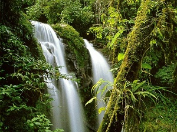

##  Un parcours semé d'embûches

### Histoire 

En l'an 2132, une planète habitée a été découverte aux confins de la  galaxie, et baptisée Algoréa. Dix ans plus tard, vous êtes envoyé(e) en  mission autour de cette planète dans le but d'établir un tout premier contact avec ses habitants. Malheureusement, la comète Hal a percuté  votre vaisseau alors que vous vous approchiez d'Algoréa. Vous avez été  contraint(e) de vous éjecter en urgence dans une capsule de sauvetage.  Vous atterrissez sur la planète avec pour seul bagage un robot de  maintenance.

Isolé(e) sur ce globe lointain, vous allez donc rencontrer ses  habitants, découvrir leurs coutumes et créer des liens afin d'entamer  une relation pacifique en attendant que la prochaine mission vienne vous récupérer. Vous allez pour cela profiter des capacités de votre robot ! Celui-ci est accompagné d'un manuel, qui vous sera bien utile dans  votre parcours. Ce robot est capable d'imprimer du texte, d'afficher des caractères sur un écran, de se déplacer et de bouger des objets.

Vous remarquez que le manuel propose de commander le robot à l'aide  de plusieurs langages, en écrivant du code sur un clavier. Une fois  votre choix effectué, vous vous dirigez vers un site qui semble abriter  la vie.


###  Objectif 

Vous allez afficher du texte et exécuter des opérations successives.


------


## 1 - Hello world!

⇒ afficher le texte « Hello world! »


### Sujet

Vous arrivez au pied d'une falaise. Là, un groupe de villageois tente frénétiquement d'ouvrir une majestueuse porte dans la paroi. Ces habitants d'un village proche vous expliquent que de terribles choses vont se produire si la porte n'est pas ouverte avant le « Grand Événement » qui aura lieu bientôt. Seul leur chef connaît la combinaison qui permettrait d'ouvrir la porte, mais il a disparu ! 

Les villageois sont persuadés que leur chef a été capturé par le Grand Sorcier qui vit au sommet de la montagne. Ils sont néanmoins terrorisés à l'idée d'aller à sa recherche, car cette montagne est maudite. Vous leur proposez d'y aller vous-même, accompagné de votre robot.

Cependant, les villageois regardent votre compagnon bizarrement. Pour les rassurer, vous vous dites qu'il serait de bon ton que votre robot affiche quelques mots sur son écran. La tradition au village est que les androïdes se présentent par le texte « Hello world! ». 


#### Ce que doit faire votre programme

Écrivez un programme permettant au robot d'afficher précisément le texte `Hello world!`. 

**Attention : s'il y a un espace en trop, s'il y a une majuscule au lieu d'une minuscule, ou s'il y a une quelconque autre différence avec le texte indiqué ci-dessus, les villageois sentiront que quelque chose cloche avec votre robot et n'auront pas confiance en lui.**


#### Afficher du texte

En Python, pour afficher du texte, on écrit  `print` puis, entre parenthèses, le texte à afficher, entre guillemets. Ainsi, pour afficher le mot « Bonjour », on écrira le code suivant :

```python
print("Bonjour")
```

En effet, *print* en anglais signifie « imprimer ».            

Chaque ligne du programme représente une *instruction*.


### Résoudre

```python
print("Hello world!")
```


### Conseils

- Vérifiez bien à partir des explications que vous n'avez commis aucune erreur. Vérifiez en particulier que vous avez bien écrit le texte : `Hello world!` avec une majuscule au début et un point d'exclamation à la fin.

  

### Correction

####  Histoire 

Votre robot a salué les villageois comme il fallait ; ceux-ci le regardent maintenant avec curiosité mais sans crainte.   Vous allez donc pouvoir vous rendre au sommet de la montagne.


####  Informations 

Les corrections montrent pour chaque sujet, une manière simple et élégante de le résoudre,   et souvent des explications et conseils pratiques qui vous seront utiles pour la suite.

Même si vous avez validé un sujet avec facilité,   nous vous conseillons fortement de lire systématiquement la correction.

Vous remarquerez que nous y proposons des solutions dans tous les langages que nous prenons en charge ;   si vous êtes curieux, vous pouvez ainsi facilement voir comment le même programme s'écrit avec chacun.   Nous vous conseillons cependant de vous concentrer sur un seul langage à la fois lors de votre apprentissage.


####  Programme 

Il fallait reprendre l'exemple du manuel en utilisant un texte différent, c'est-à-dire `Hello world!`.

Il fallait bien respecter la *casse*, c'est-à-dire la distinction entre minuscules et majuscules.   Il fallait également respecter les espaces et la ponctuation.


####   Un peu de culture 

Afficher le texte [Hello world!](http://fr.wikipedia.org/wiki/Hello_world) est traditionnellement ce que l'on expérimente en premier avec un nouvel environnement de programmation.


------


## Cours : Représentation de la sortie d'un programme

Par la suite, nous indiquerons le résultat d'un programme avec un trait rouge et une petite flèche.   Par exemple, pour le programme qui affiche le texte « Bonjour » :

```python
print("Bonjour")
```

```python
↳ Bonjour
```

   Ce résultat est appelé la *sortie* du programme : c'est ce qui ressort de son exécution.

   **Vous ne devez pas écrire la flèche « ↳ » ou le texte « Bonjour » directement dans votre programme !**


------


## 2 - Présentation

⇒ corriger les erreurs de syntaxe d'un programme


### Sujet

L'un des villageois, Camthalion, est très intéressé par votre robot.   Il vous a longuement observé(e) alors que vous écriviez votre programme, et a souhaité écrire le sien.   Le robot affiche cependant les lignes dans le mauvais ordre. Pouvez-vous y remédier ?


#### Ce que vous devez faire

Camthalion a écrit le programme ci-dessous :

```python
print("Ma devise est 'Parler peu mais parler bien'.")
print("Je m'appelle Camthalion")
print("Coucou !")
```

et il obtient en sortie :

```shell
↳ Ma devise est 'Parler peu mais parler bien'.
↳ Je m'appelle Camthalion
↳ Coucou !
```

Il veut que son programme affiche à la place : 

```shell
↳ Coucou !
↳ Je m'appelle Camthalion
↳ Ma devise est 'Parler peu mais parler bien'.
```

   Il vous demande d'effectuer les modifications nécessaires.


#### Afficher plusieurs lignes de texte                                 

Pour afficher plusieurs lignes de texte, il faut écrire des instructions d'affichage successives (une par ligne) :

```shell
print("Bonjour !")
print("Comment vas-tu ?")
```

```shell
Bonjour !
Comment vas-tu ?
```


### Résoudre

```python
print("Coucou !")
print("Je m'appelle Camthalion")
print("Ma devise est 'Parler peu mais parler bien'.")
```


### Correction

####  Histoire 

Vous avez aidé Camthalion à corriger le programme et il est tout  surpris de voir votre robot prétendre s'appeler comme lui et avoir la  même devise !   Vous lui expliquez que le robot ne s'appelle pas Camthalion comme il  l'a indiqué, mais qu'il a simplement exécuté le programme,   et affiché le texte demandé. Rassuré, le villageois vous souhaite  bonne chance dans votre expédition.


#### Programme 

 Il fallait échanger la première et la troisième instruction d'affichage.

```python
print("Coucou !")
print("Je m'appelle Camthalion")
print("Ma devise est 'Parler peu mais parler bien'.")
```

------


## Cours : Afficher du texte : erreurs possibles

Quand on écrit un programme informatique, il faut être très rigoureux car un simple caractère mal placé   peut perturber l'ordinateur du robot. Si le format de votre code n'est pas bon,   il ne va pas aller plus loin et va simplement vous indiquer que vous avez commis une erreur.

Quand ça arrive, il faut d'abord **tenter de comprendre le message d'erreur**   et ensuite **relire attentivement la zone de code concernée**,   en particulier pour s'assurer qu'il ne manque pas de symbole tel qu'une parenthèse ou un guillemet.

Voici quelques exemples de messages d'erreur.


### Attention aux parenthèses ! 

Si on oublie une parenthèse, cela produit une des erreurs suivantes : 

```python
print("Bonjour"
```

```python
↳ SyntaxError: unexpected EOF while parsing
```


```python
print "Bonjour")
```

```shell
↳ SyntaxError: invalid syntax
```


### Attention aux guillemets ! 

Si on ne place pas correctement les guillemets, cela produit une des erreurs suivantes : 

```python
print("Bonjour)
```

```shell
↳ SyntaxError: EOL while scanning string literal
```


```python
print(Bonjour)
```

```shell
↳ NameError: name 'Bonjour' is not defined
```


```python
print(Bonjour tout le monde)
```

```shell
↳ SyntaxError: invalid syntax
```


### Conclusion

Il faut être précis et ne rien oublier. Si l'on rencontre une erreur, on pensera à bien tout vérifier.   Les messages décrivent très souvent la source exacte du problème, en  anglais : il faut les lire et essayer de comprendre leur signification.

Un message d'erreur vous donnera aussi toujours le numéro de la ligne qui a causé le souci.   Ce numéro n'est pas toujours exact : l'ordinateur peut n'être dérangé qu'après votre erreur.   Il vous faudra donc souvent regarder avant l'emplacement indiqué.


------


## 3 - Plan de la montagne

⇒ afficher plusieurs lignes de texte


### Sujet

Pour vous aider à mener votre parcours vers le haut de la montagne, les villageois vous donnent quelques indications.   Plutôt que de les mémoriser, vous décidez d'utiliser votre robot pour les imprimer sur un bout de papier.


#### Ce que doit faire votre programme

 Écrivez un programme qui affiche exactement le texte qui suit :

```shell
↳ Tout droit tu grimperas,
↳ La clé tu trouveras,
↳ Habile tu seras,
↳ Quand tu les porteras,
↳ Et avec le chef tu reviendras !
```


### Résoudre

```python
print("Tout droit tu grimperas,")
print("La clé tu trouveras,")
print("Habile tu seras,")
print("Quand tu les porteras,")
print("Et avec le chef tu reviendras !")
```


### Conseils

- Voici le début de la solution :

  ```python
  print("Tout droit tu grimperas,")
  print("La clé tu trouveras,")
  ```

  Vérifiez que votre programme est écrit de la même façon, en particulier en ce qui concerne les symboles : `{`, `}`, `;`, `(`, `)`, `"`, `\` ou encore la virgule `,` dans le texte à afficher.


### Correction

#### Histoire

Votre robot a bien imprimé les indications, sans erreur. Elles sont  vraiment énigmatiques ; vous verrez bien à quoi elles correspondent !


#### Programme

```python
print("Tout droit tu grimperas,")
print("La clé tu trouveras,")
print("Habile tu seras,")
print("Quand tu les porteras,")
print("Et avec le chef tu reviendras !")
```


------


## 4 - Dans le fourré

⇒ déplacer le robot sur une grille avec des obstacles


### Sujet

Sur l'étroit chemin qui mène à la montagne, vous parvenez à une énorme porte qui vous empêche de passer.   Les villageois vous ont prévenu que la clé de cette porte demeure dans le fourré qui se trouve juste à côté.   Celui-ci est organisé selon des cases avec des pièges et des buissons, dont on vous a fourni le plan.

Cependant, vous n'êtes pas sûr que le plan soit tout à fait exact et vous redoutez les pièges du fourré.   Vous décidez donc d'envoyer votre robot chercher la clé pour vous.


#### Ce que doit faire votre programme

Votre programme doit diriger votre robot dans la grille suivante :


Le robot  se trouve initialement à l'entrée du fourré   et doit atteindre la case où se trouve la clé    sans passer par les cases où se trouvent des buissons infranchissables    ni celles qui contiennent un piège .   Vous n'avez pas besoin de programmer le chemin retour.


####  Effectuer des mouvements

Afin que vous puissiez manipuler le robot dans votre langage de programmation, nous avons créé un module appelé   « robot ».

Quand un sujet exige que le robot effectue des mouvements,   l'énoncé contiendra un cadre « Commandes pour cet exercice » décrivant les instructions à utiliser.

Pour disposer de ces instructions en Python, vous devez inclure la ligne suivante en haut de votre programme :   

```python
from robot import *
```

Si elle est nécessaire, vous la trouverez dans le squelette à compléter.


####  Commandes pour cet exercice 

Pour déplacer le robot dans le fourré, nous proposons les quatre instructions suivantes :   

```python
Aller en haut
Aller en bas
Aller à gauche
Aller à droite
```

chacune demandant au robot de se déplacer d'**une case** dans une direction sur la grille.   

En Python, vous devrez les écrire comme suit : 

```python
haut()
bas()
gauche()
droite()
```

Notez bien que le robot ne tourne pas : il se déplace de case en case sur la grille, vers le haut, le bas, la gauche ou la droite.   


### Résoudre

```python
from robot import *
haut()
haut()
haut()
droite()
droite()
bas()
bas()
droite()
```


### Conseils

- Commencez par dessiner des flèches sur une feuille, correspondant aux déplacements successifs du robot case par case. Une fois que vous les  avez bien vérifiés, vous pouvez écrire les instructions correspondantes  dans votre programme.

  Si vous n'arrivez pas à vous repérer sur une feuille blanche, vous  pouvez éventuellement recopier les cases du labyrinthe et écrire les  flèches à l'intérieur.

- Les premières instructions de la solution sont (en français) : 

  ```pyth
  Aller en haut
  Aller en haut
  Aller en haut
  Aller à droite
  ```

  À vous de continuer. 


### Correction

#### Histoire 

Votre robot a réussi à atteindre la clé et vous la ramène ensuite, ce qui vous permet de débloquer la porte.   Vous essayez de pousser tout doucement la porte rouillée pour ne pas  attirer l'attention des créatures maléfiques que les villageois  craignent tant ;   mais vos efforts sont vains : loin de réduire le bruit, l'ouverture  de la porte produit un long grincement strident   à donner des frissons à quiconque se trouverait dans les parages.


#### Algorithme

En regardant le plan, on peut voir la liste des déplacements que le robot doit faire pour rejoindre la case où est la clé,   et en déduire la séquence d'instructions à lui fournir.


#### Programme

```python
from robot import *
haut()
haut()
haut()
droite()
droite()
bas()
bas()
droite()
```


------


## Cours : Mouvements : nécessité du module


Si on oublie la ligne qui fournit les instructions pour bouger le robot, comme dans le programme suivant :

```python
haut()
droite()
bas()
gauche()
```

on obtient une erreur :

```python
↳ line 1, in
↳   haut()
↳ NameError: name 'haut' is not defined
```

La lecture du programme s'interrompt à la première instruction de mouvement ;      le message indique que le nom de la fonction n'est pas reconnu.   

Si on obtient une erreur de ce genre, on pensera donc à vérifier que l'on a bien écrit la ligne donnant accès aux fonctions du robot.


------


## 5 - Empilement de cylindres

⇒ déplacer 4 disques dans les tours de Hanoï


### Sujet

Vous avancez prudemment sur une corniche le long d'une falaise ; vous devez accéder au sommet de la paroi.

Vous tombez finalement sur un renfoncement. Au fond de cette petite  grotte se trouve un magnifique empilement de quatre gros disques de  pierre !   En déplaçant cette pile de disques sur la corniche, vous pourrez  l'escalader et atteindre le haut de la falaise.

|  |  |
| :---------------------------------------------------: | :-------------------------------------------------: |
|            Structure actuelle de la grotte            |                 Résultat recherché                  |

L'empilement est malheureusement très lourd, même pour votre robot : celui-ci ne peut porter qu'un seul disque à la fois.   De plus, il semble évident qu'un disque ne pourra pas supporter un disque plus gros que lui. Moyennant cela, il va vous falloir reformer l'empilement à l'entrée de la grotte, dans un espace très exigu.


#### Ce que doit faire votre programme

On peut considérer qu'il y a trois zones dans la grotte : 

-  zone 1 : le fond, où se trouvent les quatre cylindres, empilés du plus large au plus étroit ; 
-  zone 2 : le centre, où vous pouvez placer temporairement des disques les uns au-dessus des autres ; 
-  zone 3 : l'entrée de la grotte, où vous devez reformer l'empilement complet. 

Le but est de déplacer tous les disques de la zone 1 à la zone 3 en respectant ces deux règles : 

-  on ne peut déplacer qu'un disque à la fois, car ils sont très lourds ; 
-  on ne peut jamais poser un disque sur un disque plus petit que lui, car sinon l'empilement s'effondrerait ! 


####  Commandes pour cet exercice 

 Le robot peut exécuter cette instruction : 

```python
Déplacer zoneSource -> zoneDestination
```

Lorsqu'il la reçoit, le robot prend le disque se situant au sommet de la zone désignée par *zoneSource* et le place au sommet de la zone désignée par *zoneDestination* (au sol si la zone est vide).   

Pour identifier une zone, écrivez à la place de *zoneSource* et *zoneDestination* le numéro de la zone concernée.   

En Python, l'instruction s'écrit : 

```python
deplacer(zoneSource, zoneDestination)
```

N'oubliez pas d'inclure la ligne suivante en haut de votre programme pour l'utiliser :      

```python
from robot import *
```


### Résoudre

```python
from robot import *
deplacer(1, 2)
deplacer(1, 3)
deplacer(2, 3)
deplacer(1, 2)
deplacer(3, 1)
deplacer(3, 2)
deplacer(1, 2)
deplacer(1, 3)
deplacer(2, 3)
deplacer(2, 1)
deplacer(3, 1)
deplacer(2, 3)
deplacer(1, 2)
deplacer(1, 3)
deplacer(2, 3)
```

   

### Conseils

- Pour vous inspirer, vous pouvez expérimenter l'énigme avec de vrais  objets : vous pouvez par exemple découper 4 bouts de papier de taille  différente, et les déplacer sur une table en respectant les règles de  l'énigme pour voir ce que vous pouvez obtenir.

  Une fois que vous avez trouvé la solution, il ne vous reste plus qu'à écrire les différentes étapes dans votre programme !

- Pour déplacer le plus gros cylindre, il faut d'abord déplacer les 3  cylindres les plus petits dans la seconde zone, c'est-à-dire arriver à  cette situation :

  

  Essayez donc de commencer par déplacer seulement 3 cylindres !


### Correction

####  Histoire

Vous avez réussi à déplacer tous les disques et grimpez alors plus  haut dans la falaise. Vous arrivez maintenant tout près du sommet de la montagne ! Vous ne  savez pas ce qui vous attend et avancez donc tout doucement.


#### Algorithme

Pour résoudre un problème comme celui-là, il est utile de commencer par étudier des exemples plus petits. 


**Supposons que l'on ait un seul disque.** 

On peut alors résoudre le problème très facilement en déplaçant le  disque de la zone 1 à la zone 3. Nous pouvons le noter de cette façon :

```
1 -> 3
```


**Supposons que l'on ait 2 disques.** 

La séquence suivante permet de résoudre le problème : 

```
1 -> 2
1 -> 3
2 -> 3
```


**Supposons que l'on ait 3 disques.** 

Pour bouger le plus grand disque, il faut d'abord déplacer les deux  autres sur la deuxième zone. Il s'agit donc de déplacer une pile de deux disques d'une zone vers  une autre — c'est le problème que l'on vient de résoudre juste avant !   Nous l'avons fait vers la zone 3 ; nous voulons à présent déplacer  les deux disques vers la zone 2 pour pouvoir mettre le dernier dans la  zone 3.

Il suffit donc de reprendre les mêmes déplacements, en permutant les rôles des zones 2 et 3 ; donc en échangeant les deux numéros dans les instructions. Cela correspond à :

```
1 -> 3
1 -> 2
3 -> 2
```

 À ce stade, on peut alors bouger le grand disque vers la zone 3. 

```
1 -> 3
```

Enfin, on peut ramener les deux autres disques, en adaptant encore une fois la solution du problème avec deux disques, cette fois en permutant les rôles des zones 1 et 2.

```
2 -> 1
2 -> 3
1 -> 3
```


**Et maintenant, avec 4 disques.** 

On va déplacer les 3 disques du haut sur la deuxième tour, bouger le  plus grand en zone 3, puis déplacer les 3 disques au-dessus du grand. Pour déplacer une pile de 3 disques, on utilise la méthode développée ci-dessus.


#### Programme 

Pour clarifier, on a séparé le programme en 3 phases : déplacer en zone 2 les trois plus petits disques, puis déplacer le plus grand, et enfin déplacer à nouveau les trois petits disques.

```python
from robot import *

deplacer(1, 2)
deplacer(1, 3)
deplacer(2, 3)
deplacer(1, 2)
deplacer(3, 1)
deplacer(3, 2)
deplacer(1, 2)

deplacer(1, 3)

deplacer(2, 3)
deplacer(2, 1)
deplacer(3, 1)
deplacer(2, 3)
deplacer(1, 2)
deplacer(1, 3)
deplacer(2, 3)
```


####  Un peu de culture 

Le problème des [tours de Hanoï](http://fr.wikipedia.org/wiki/Tours_de_Hanoï) est un grand classique. Publié en 1892, il est dû au mathématicien français Édouard Lucas. Les tours de Hanoï sont souvent utilisées en informatique pour présenter la [récursivité](http://fr.wikipedia.org/wiki/Algorithme_récursif), une notion fondamentale que l'on approfondira par la suite. Si vous continuez à avancer dans le cours, vous serez bientôt capable d'écrire en moins de 10 lignes un programme qui résout le problème des tours de Hanoï pour un nombre quelconque de disques !


------


## Cours : Soumissions, conseils et forum d'entraide

### Soumettre plusieurs fois 

Lorsque le site vous indique que votre programme ne marche pas comme  il faudrait, prenez le temps de comprendre ce qui ne va pas, puis modifiez votre programme de sorte qu'il marche la prochaine  fois. Il ne sert à rien d'essayer 15 soumissions en changeant un petit truc et en espérant qu'au bout d'un moment ça va marcher !

Évitons d'être des [Shadoks](http://fr.wikipedia.org/wiki/Les_Shadoks) !


 Copyright © : Jacques Rouxel 


### Conseils automatiques 

Si vous êtes bloqué sur un exercice, des conseils automatiques sont parfois disponibles.   Vous pouvez les afficher dans l'onglet « Conseils » quand vous êtes sur la page d'un exercice.

Ici encore, il n'est pas utile de demander tous les conseils d'un  coup. Il faut demander le premier,   chercher à se servir des explications fournies, et si vraiment on est encore bloqué, alors on peut demander le conseil suivant.


### Forum d'entraide 

Si les conseils sont absents ou ne vous suffisent pas,   vous pouvez poser une question sur le forum d'entraide, toujours dans l'onglet « Conseils ».   Les autres personnes ayant résolu l'exercice avant vous pourront alors vous aider.   Elles ne vous donneront pas la solution directement mais vous guideront afin que vous la trouviez par vous-même !

Ne soyez pas frileux sur le forum : ce sont des volontaires qui vous répondront !   Exprimez-y-vous dans un langage correct, avec une formule de salutation, en décrivant votre situation.


------


## 6 - Recette secrète

⇒ résoudre une énigme de transvasement de récipients


### Sujet

Vous voici arrivé(e) tout en haut de la montagne. Vous allez enfin pouvoir libérer le chef du village !   Vous tombez des nues lorsque vous l'apercevez en train de discuter tranquillement avec le Grand Sorcier.   Loin de s'être fait kidnapper par ce dernier, il l'a rejoint pour préparer une mixture en vue de la célébration qui a lieu dans quelques jours.

La mixture en question est composée de trois ingrédients à mélanger en proportions parfaitement exactes :   5 volumes d'huile, 4 volumes d'eau, et 3 volumes d'un ingrédient secret. Le chef et le Grand Sorcier   disposent de deux tonneaux non gradués de contenances 5 litres et 3 litres,    avec lesquels ils pourront facilement doser l'huile et l'ingrédient secret.   Mais il leur manque le tonneau de 4 litres car le chef l'a oublié au village !

   

Si l'on transfère le contenu d'un tonneau dans l'autre, jusqu'à avoir vidé le premier ou rempli le second,   par le calcul, on peut savoir précisément combien d'eau se trouve dans chacun des deux tonneaux.   Ainsi, vous vous dites qu'il doit bien y avoir un moyen d'utiliser les tonneaux disponibles pour mesurer exactement 4 litres d'eau.   Vous utilisez votre robot pour chercher la solution.


####  Ce que doit faire votre programme

Vous vous trouvez devant une source d'eau qui jaillit de la montagne, et vous disposez de deux tonneaux vides   de capacités 5 litres et 3 litres. Écrivez un programme qui effectue une série de transvasements   permettant d'obtenir exactement 4 litres d'eau dans le plus grand tonneau. 

**Arrêtez-vous bien dès que le grand tonneau contient exactement 4 litres.**


####  Commandes pour cet exercice

Pour doser l'eau dans les tonneaux, vous disposez de ces trois instructions :   

```python
Remplir tonneau
Vider tonneau
Transférer tonneauSource -> tonneauDestination
```

Pour identifier un tonneau à l'emplacement de *tonneau*, *tonneauSource* ou *tonneauDestination*, utilisez sa contenance : 3 ou 5.

Quand on transvase un tonneau dans l'autre, on s'arrête lorsque le tonneau source est vide ou lorsque le tonneau destination est plein à ras bord. Ainsi, après chaque opération, on peut savoir exactement combien de litres d'eau se trouvent dans les deux tonneaux.

En Python, les trois instructions s'écrivent comme suit :

```python
remplir(tonneau)
vider(tonneau)
transferer(tonneauSource, tonneauDestination)
```


Le programme suivant expérimente les trois instructions décrites ci-dessus.

```python
from robot import *
remplir(5)
transferer(5, 3)
vider(5)
```


### Résoudre

```python
from robot import *
remplir(5)
transferer(5, 3)
vider(3)
transferer(5, 3)
remplir(5)
transferer(5, 3)
```


### Conseils

- De la même manière que pour le problème précédent, vous pouvez  utiliser de vrais objets : par exemple, vous pouvez prendre 8 bouts de  papier, chacun d'entre eux correspondant à un litre, et les déplacer en  respectant les règles.

- Au départ, il n'y a que deux opérations possibles : soit remplir le  tonneau de 3 litres, soit remplir le tonneau de 5 litres. On a alors un  tonneau vide et l'autre plein.

  Si l'on a commencé par remplir le tonneau de 3 litres, on a ensuite trois possibilités avec une deuxième instruction.

  1. Remplir le tonneau de 5 litres. Les deux tonneaux seront alors pleins. 
  2. Vider le tonneau de 3 litres. On se retrouve à la situation de départ. 
  3. Transférer du tonneau de 3 litres vers le tonneau de 5 litres.  On se retrouve alors avec 3 litres d'eau dans le tonneau de 5 litres, et 0 dans le tonneau de 3 litres. 

  À quelles situations peut-on arriver si l'on commence à la place par remplir le tonneau de 5 litres ?

  Pour organiser votre recherche, vous pouvez par exemple faire un  schéma en indiquant par des flèches qu'il est possible de passer d'une  situation à une autre.

- Éventuellement, vous pouvez chercher le problème dans l'autre sens,  comme lorsque l'on regarde la solution d'un labyrinthe en commençant par l'arrivée !

  Quelles opérations peuvent nous permettre d'obtenir 4 litres dans le  tonneau de 5 litres ? Il s'agit nécessairement d'un transvasement, car  si l'on vide ou que l'on remplit le tonneau, il ne peut alors que  contenir 0 ou 5 litres.

  En fait, il y a deux possibilités :

  - si le tonneau de 5 litres est plein et que le tonneau de 3  litres contient 2 litres, transvaser le tonneau de 5 litres dans celui  de 3 litres ; 
  - si le tonneau de 5 litres contient 1 litre et que le tonneau de 3 litres est plein, transvaser le tonneau de 3 litres dans celui de 5  litres. 

  Ainsi aura-t-on 4 litres dans le grand tonneau.

  À présent, on peut se demander comment obtenir 2 litres dans le petit tonneau, ou 1 litre dans le grand tonneau.


### Correction

#### Histoire 

Vous avez réussi : le Grand Sorcier et le chef du village vont pouvoir terminer la préparation.   Vous décidez d'attendre qu'ils aient fini. Ensuite, vous redescendrez au village avec le chef.   Cette rencontre ainsi que la recette doivent rester un secret ; aussi, vous promettez de garder le silence !


#### Algorithme 

Lorsqu'on doit résoudre ce genre d'énigmes, si l'on ne trouve pas la  solution après quelques minutes en se basant sur son intuition,   il vaut mieux passer à une méthode de recherche systématique. Cela  prend un peu de temps mais c'est très efficace.

Pour s'assurer de trouver à tous les coups la solution, on va  explorer toutes les situations possibles,   c'est-à-dire toutes les contenances des deux bidons que l'on peut  obtenir en suivant les règles,   jusqu'à avoir trouvé celle que l'on cherche. On commence par  représenter la situation initiale, où l'on a 0 litre dans chacun des  bidons :


Pour chaque situation que l'on obtient au cours de cette exploration,   on va effectuer toutes les opérations possibles à partir de cette  situation et noter les nouvelles situations obtenues.   Depuis la situation initiale, deux opérations sont autorisées :  remplir le bidon de 3 litres, et remplir le bidon de 5 litres,   ce qui nous donne deux nouvelles situations possibles :


On écrit « **→**3 » pour indiquer qu'on remplit le bidon de 3, « 5→3 » pour indiquer qu'on transfère celui de 5 dans celui de 3   et « 5→ » pour indiquer qu'on vide celui de 5.

On va appliquer ce principe pour chaque nouvelle situation obtenue,   en énumérant à chaque fois toutes les opérations possibles donnant  d'autres situations.   On peut énumérer ainsi toutes les situations qu'il est possible  d'atteindre depuis la situation initiale par une succession d'opérations valides,   donc on est assuré de trouver la solution si elle existe.

Ainsi, depuis les deux nouvelles situations qu'on a atteintes à l'étape précédente, on peut en atteindre trois nouvelles.   Ce sont toutes les situations que l'on peut atteindre en deux opérations au total :


Attention : lorsque des opérations mènent à des situations déjà vues, les flèches vers ces situations ne sont pas représentées,   car le dessin deviendrait trop chargé et difficile à lire.   Par exemple, l'opération consistant à vider un bidon pour revenir à  la situation initiale n'est pas représenté.

On continue ainsi de suite, jusqu'à avoir atteint une situation dans laquelle on a 4 litres dans le bidon de 5,   accessible en 6 opérations en partant de la situation de départ :


En suivant le chemin allant de (0 ; 0) à (3 ; 4), on a la suite des opérations à faire.   Il existe d'autres solutions, mais celle-ci est la plus rapide avec uniquement 6 opérations à faire.


#### Programme 

```python
from robot import *
remplir(5)
transferer(5, 3)
vider(3)
transferer(5, 3)
remplir(5)
transferer(5, 3)
```


####  Un peu de culture 

Cette énigme est un grand classique. Elle apparaît en particulier dans le film [*Une journée en enfer*](http://fr.wikipedia.org/wiki/Une_journée_en_enfer) avec Bruce Willis.


