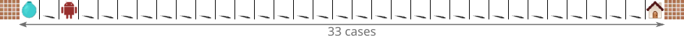
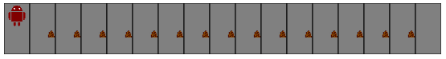
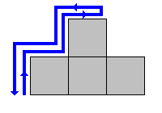
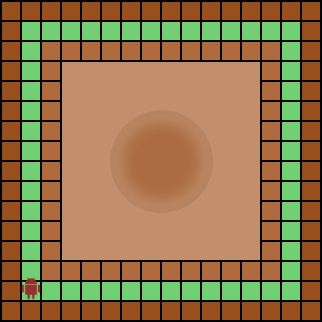
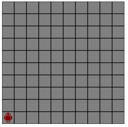
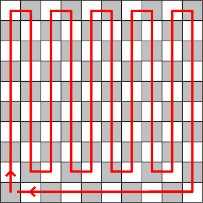

## Du soutien au village

### Histoire

Vous avez raccompagné le chef au village, à la grande joie de ses  habitants qui vous sont très reconnaissants. Vous décidez de passer un  peu de temps avec ces villageois, pour comprendre leur mode de vie et  leurs coutumes en participant à leurs diverses activités quotidiennes.

### Objectif

Vous allez découvrir comment écrire de manière concise un programme  qui répète de nombreuses fois la même action, dans le but de traiter une tâche répétitive.


------


## 1 - Punition

⇒ afficher un grand nombre de fois le même texte


### Sujet

Les enfants du village vous ont posé beaucoup de questions sur ce que font les enfants sur Terre.   Ils ont été supris d'apprendre que, comme eux, les enfants terriens doivent aller à l'école.   Et ils ont trouvé très étonnant que ceux-ci doivent lever le doigt pour demander la permission de parler en classe,   car eux doivent pencher la tête pour cela.

Ce que vous n'aviez pas prévu, c'est qu'une petite fille trouverait  amusant de lever le doigt comme une terrienne.   Sa maîtresse n'a pas du tout apprécié car, pour cette tribu, lever le doigt de cette manière est une grave insulte au grand sorcier !   La petite fille a été sévèrement punie et vous la retrouvez en  pleurs. Vous vous sentez un peu responsable et décidez de l'aider à faire sa  punition.


#### Ce que doit faire votre programme

Votre programme doit écrire 135 fois la phrase : "Je dois respecter  le Grand Sorcier.", en plaçant cette phrase exactement une fois sur chaque ligne.   Attention, si votre programme n'affiche pas exactement cette phrase  avec les points et la majuscule là où il faut, il faudra tout  recommencer.

**Important :** votre programme ne doit pas faire plus d'une douzaine de lignes.


####  Répéter une action

Si pour vous il est rébarbatif de répéter une tâche de nombreuses fois, cela ne pose aucun problème à votre robot.   Celui-ci est donc très pratique pour cela.

Ainsi, imaginons que l'on souhaite écrire 5 fois « Coucou ». On pourrait le faire avec le programme suivant :

```python
print("Coucou")
print("Coucou")
print("Coucou")
print("Coucou")
print("Coucou")
```

C'est plutôt convenable ici… Mais si on veut effectuer par exemple 1 000 affichages, cela va devenir bien plus fastidieux !

Pour plus d'efficacité, on aimerait indiquer directement que l'on souhaite répéter l'affichage en *boucle*,   de la même manière qu'on pourrait écrire en français :

```python
Répéter 5 fois
   Afficher "Coucou"
```

On décale l'instruction à répéter vers la droite avec des espaces,  pour indiquer qu'elle « appartient » à l'instruction précédente.   Effectuer des décalages comme ceci est très courant en programmation : on appelle ça l'*indentation*.

Ainsi, en Python, pour répéter 5 fois l'instruction qui affiche « Coucou », on va écrire le programme ci-dessous.

```python
for loop in range(5):
   print("Coucou")
```

```shell
↳ Coucou
↳ Coucou
↳ Coucou
↳ Coucou
↳ Coucou
```

Pour coder la répétition, nous avons utilisé la structure suivante :

```python
for loop in range(5):
   ...
```

et nous avons mis l'instruction à répéter à la place des `...`, après trois espaces. Cette indentation est **obligatoire**.

Vous pouvez donc écrire une boucle de cette façon, en indiquant le nombre de répétitions à la place du chiffre 5.   Nous éluciderons par la suite les mystères de cette écriture.   Prenez garde à ne pas oublier le deux-points « `:` » à la fin de la ligne.


### Résoudre

```python
for loop in range(135):
   print("Je dois respecter le Grand Sorcier.")
```


### Conseils

- Votre programme doit :

  ```python
  Répéter 135 fois
     Afficher "Je ne dois jamais pointer mon doigt vers le ciel."
  ```

  Vous devez donc utiliser une boucle comme dans l'exemple du sujet.


### Correction

#### Histoire 

La maîtresse est satisfaite et la petite fille est consolée. De votre côté, vous allez pouvoir dormir la conscience tranquille.


#### Algorithme 

Il fallait modifier l'exemple du cours en changeant le nombre de répétitions à faire ainsi que le texte à afficher. 


#### Programme

```python
for loop in range(135):
   print("Je dois respecter le Grand Sorcier.")
```


------


## Cours : Répétition : erreurs possibles

Il est facile de se tromper dans les boucles lorsqu'on n'a pas l'habitude.      Ainsi, si on oublie le « `:` » à la fin de la ligne, on obtient une erreur :   

```python
for loop in range(5)
   print("Bonjour !")
```

```shell
↳ SyntaxError: invalid syntax
```

Et si l'on oublie d'indenter, c'est-à-dire si on oublie les trois espaces, on obtient également une erreur :   

```python
for loop in range(5):
print("Bonjour !")
```

```shell
↳ SyntaxError: expected an indented block
```

Face à ce type d'erreur, on pensera donc à vérifier que le deux-points est bien présent et que l'indentation a été faite.   


------


## Cours : Indentation : la touche tabulation

Vous serez très souvent amené à utiliser l'indentation dans vos programmes.   Dans les éditeurs de code comme celui que nous proposons sur le site, vous pouvez utiliser   la [touche tabulation](http://fr.wikipedia.org/wiki/Touche_tabulation) de votre clavier   pour modifier le niveau d'indentation, plutôt que d'écrire vous-même les espaces à la main.

Lorsque vous revenez à la ligne, l'indentation est conservée, ce qui  vous permet d'écrire facilement des instructions au même niveau.   Pour revenir au niveau précédent, vous devez appuyer sur la touche  tabulation pendant que   la [touche majuscule](http://fr.wikipedia.org/wiki/Touche_majuscule) est enfoncée,   comme lorsque vous écrivez une lettre majuscule. Attention : il s'agit de la touche majuscule,   pas de la touche verrouillage majuscule située juste au-dessus (et juste en dessous de la touche tabulation).

Voyons comment l'indentation évolue, dans un programme qui affiche cinq fois « Bonjour ! » puis une fois « Au revoir ! » :

```python
for loop in range(5):
   print("Bonjour !")
print("Au revoir !")
```

 Le niveau d'indentation : 

- augmente (Tab) lorsque l'on **rentre dans la boucle**,   
- et il diminue (Maj+Tab) lorsqu'on **sort de la boucle**.

Notez que nous avons choisi sur le site d'utiliser trois espaces pour l'indentation.   Si vous le souhaitez, vous pouvez changer cette valeur dans les préférences de votre compte.


------


## 2 - Mathématiques de base

⇒ corriger les erreurs de syntaxe d'un programme


### Sujet

Un enfant vous a demandé l'autorisation de travailler un peu sur  votre robot afin de réviser ses leçons de mathématiques.   Après plus d'une heure, n'ayant pas de nouvelles de sa part,   vous allez le voir et il vous explique qu'il n'arrive pas à faire  fonctionner son programme. Vous souhaitez donc l'aider à le corriger.


#### Ce que doit faire votre programme

Corrigez les erreurs contenues dans le programme ci-dessous   afin qu'il affiche 13 fois de suite le texte `9 * 8 = 72`.

```python
for loop in range(13)
print("9 * 8 = 72)
```


### Résoudre

```python
for loop in range(13):
   print("9 * 8 = 72")
```


### Conseils

- Il y a des caractères manquants. En Python, il y a également une erreur d'indentation.


### Correction

#### Histoire 

Avec votre aide, l'enfant réussit à faire marcher votre robot, ce qui lui permet de réviser sa leçon.


#### Programme 

Il fallait corriger trois erreurs :

- il manquait le « `:` » à la fin de la première ligne, 
- il manquait l'indentation à la seconde ligne, 
- il manquait un guillemet autour du texte à afficher. 

```python
for loop in range(13):
   print("9 * 8 = 72")
```


------


## 3 - Transport d'eau

⇒ répéter des instructions de déplacement


### Sujet

Alors que vous cherchez un endroit tranquille pour vous reposer,   vous remarquez dans une rue une personne âgée qui avance lentement  tout en portant sur sa tête un grand récipient rempli d'eau.   Vous décidez de lui venir en aide, et de programmer votre robot pour  qu'il aille aider cette personne à transporter l'eau jusqu'à sa maison.


#### Ce que doit faire votre programme

Votre programme doit diriger le robot dans la rue schématisée ci-dessous :



La rue est représentée par 33 cases entre deux murs de briques. Votre robot se trouve au départ sur la 3e case.   Votre programme doit le déplacer jusqu'à l'endroit où se trouve la personne âgée, au récipient d'eau en bleu,   puis afficher précisément le texte "Bonjour, laissez-moi vous aider" (avec un retour à la ligne à la fin de la phrase).   Ensuite, il doit ramasser le récipient qui se trouve sur cette même case, et avancer de 32 cases pour le déposer à la maison.   Il ne doit à aucun moment se déplacer sur les cases contenant un mur.

Votre programme ne doit pas faire plus d'une vingtaine de lignes.


####  Commandes pour cet exercice

Pour résoudre ce problème, le robot va devoir effectuer les opérations suivantes :

```python
Aller à gauche
Aller à droite
Ramasser le récipient
Déposer le récipient
```

Deux instructions permettent au robot de ramasser un objet qui se trouve au même emplacement que lui,      et de déposer l'objet qu'il porte à l'endroit où il se trouve. Elles s'écrivent comme suit en Python :   

```python
ramasser()
deposer()
```

Au final, vous devez donc utiliser ces quatre instructions pour résoudre ce problème :

```python
gauche()
droite()
ramasser()
deposer()
```


En guise de support, voici un programme qui amène le robot jusqu'à la maison, et affiche une exclamation :

```python
from robot import *
for loop in range(30):
   droite()
print("Rentré !")
```


### Résoudre

```python
from robot import *

gauche()
gauche()
print("Bonjour, laissez-moi vous aider")

ramasser()
for loop in range(32):
   droite()
deposer()
```


### Conseils

- Votre robot doit effectuer les opérations suivantes, dans l'ordre :

  ```python
  Aller au récipient
  Afficher "Bonjour, laissez-moi vous aider"
  Ramasser le récipient
  Aller à la maison
  Déposer le récipient
  ```

- Utilisez une boucle pour déplacer le robot vers la droite.


### Correction

#### Histoire 

Votre robot a parfaitement rempli sa mission, sans renverser la moindre goutte d'eau. La personne remercie chaleureusement votre robot et lui donne un biscuit pour le récompenser de sa bonne action.

#### Algorithme 

En regardant le schéma de la rue, on voit que le robot doit aller de deux cases vers la gauche, afficher son petit texte, ramasser le récipient, puis aller de 32 cases vers la droite, et y déposer le récipient.   Pour le déplacement de 32 cases, il fallait absolument utiliser une boucle afin d'avoir un code concis. Si on voulait, on pouvait aussi utiliser une boucle pour le déplacement de deux cases vers la gauche.

#### Programme 

```python
from robot import *
for loop in range(2):
   gauche()
print("Bonjour, laissez-moi vous aider")
ramasser()
for loop in range(32):
   droite()
deposer()
```


------


## 4 - Le secret du Goma

⇒ répéter un groupe de deux actions


### Sujet

Vous avez remarqué un rituel assez étrange : tous les trois jours,   les villageois passent la soirée à parsemer d'une sorte de gros grain de maïs le long de l'allée centrale du village.   Le lendemain, le grain a disparu, mais l'allée est pleine de ce qui  ressemble à de petites mottes de terre noire que les villageois  ramassent.   L'un des villageois vous explique que le grain est une offrande aux  Borloks, de gros animaux qui leur laissent ces « mottes » en échange :   ce que vous preniez pour des mottes de terre sont en fait des bouses  de Borloks ! 

Vous êtes pris(e) de nausées en apprenant qu'ils les utilisent pour fabriquer le Goma,   cette sorte de pain noir qu'ils vous ont servi à chaque repas depuis votre arrivée…   Tout en cachant votre dégoût de peur de vexer les villageois, vous décidez d'enquêter sur la composition exacte du Goma.   Vous vous proposez donc pour aider à ramasser les bouses de Borloks qui jonchent l'allée.


#### Ce que doit faire votre programme

L'allée centrale du village peut être représentée comme une série de  17 cases, dont la plupart contiennent une bouse de Borlok :



Le robot se trouve initialement dans la case de gauche. Il doit se déplacer case par case en allant vers la droite,   et ramasser sur chaque case la bouse qui s'y trouve.   Enfin, votre robot doit déposer tout ce qu'il a ramassé dans la boîte située sur la 17e case, tout à droite.

Votre programme ne doit pas faire plus d'une dizaine de lignes.


####  Commandes pour cet exercice

Pour résoudre ce problème, vous allez devoir :

```python
Aller à gauche
Aller à droite
Ramasser une bouse
Déposer les bouses
```

Il s'agit donc à nouveau de :

```python
gauche()
droite()
ramasser()
deposer()
```


####  Répéter plusieurs actions

Il est souvent utile de répéter un groupe de plusieurs instructions, et non pas seulement une seule instruction.   Par exemple, supposons que l'on veuille afficher deux fois les textes « Bonjour ! » et « Comment vas-tu ? » :

```python
Répéter 2 fois
   Afficher "Bonjour !"
   Afficher "Comment vas-tu ?"
```

En Python, on l'écrit :

```python
for loop in range(2):
   print("Bonjour !")
   print("Comment vas-tu ?")
```

```shell
↳ Bonjour !
↳ Comment vas-tu ?
↳ Bonjour !
↳ Comment vas-tu ?
```

Les instructions à répéter sont définies par le niveau  d'indentation. Si l'on n'indente pas la seconde instruction d'affichage, elle est considérée comme étant en dehors de la boucle, et n'est  donc pas répétée :   

```python
for loop in range(2):
   print("Bonjour !")
print("Comment vas-tu ?")
```

```shell
↳ Bonjour !
↳ Bonjour !
↳ Comment vas-tu ?
```

En conclusion, il est très important d'indenter toutes les  instructions qui doivent être répétées, et uniquement celles-là.


### Résoudre

```python
from robot import *

for loop in range(15):
   droite()
   ramasser()
droite()
deposer()
```


### Conseils

-    Il faut utiliser une boucle grâce à laquelle on va pouvoir répéter deux instructions.

-    Votre robot doit suivre dans l'ordre les instructions :

  ```
  15 fois : Aller à droite puis ramasser une bouse
  Aller à droite
  Déposer les bouses
  ```


### Correction

#### Histoire

Une fois toutes les bouses ramassées, vous suivez les villageois qui  emportent la boîte pleine vers une construction en pierre un peu à  l'écart du village.   C'est là que vous comprenez que, loin d'entrer dans la composition du Goma,   les bouses sont utilisées comme combustible pour alimenter le feu  sous le four où le Goma est cuit !   Vous vous sentez tout de suite beaucoup mieux. Les villageois sont  pliés en deux lorsque vous leur expliquez ce qui vous inquiétait.


#### Algorithme

Pour ramasser toutes les bouses, il suffit de répéter 15 fois de suite la séquence suivante :   se déplacer d'une case vers la droite, puis ramasser la bouse qui s'y trouve.   Ensuite, il suffit de se déplacer d'une case vers la droite, et de déposer toutes les bouses ramassées.


#### Programme

```
from robot import *
for loop in range(15):
   droite()
   ramasser()
droite()
deposer()
```


####  Un peu de culture

La [bouse de vache séchée](http://fr.wikipedia.org/wiki/Bouse) est utilisée comme combustible un peu partout dans le monde.      Elle est aussi appelée « bois de vache ». Elle peut aussi servir  de matériau de construction, d'engrais, d'antiseptique.      On a même découvert récemment qu'elle pouvait être utilisée dans  la fabrication de la vanilline à moindre coût, ainsi que pour parfumer  bougies et shampoings.   


------


## Cours : Répétition : cohérence de l'indentation

Attention à toujours utiliser 3 espaces pour indenter le code. Si  l'indentation n'est pas toujours la même, vous obtiendrez une erreur :

```python
for loop in range(2):
   print("Bonjour !")
  print("Comment vas-tu ?")
```

```python
↳ SyntaxError: unindent does not match any outer indentation level
```


------


## 5 - Sisyphe

⇒ enchaîner deux répétitions de déplacements


### Sujet

Vous explorez les ruines de la cité de Machak, toute proche du village,   quand tout à coup un énorme rocher dévale les marches de la pyramide au pied de laquelle vous vous trouvez.   Vous n'avez que le temps de vous jeter à terre alors que le rocher vous passe juste au-dessus.   Vous apercevez alors avec horreur qu'un colosse descend à toute vitesse dans votre direction.   À votre grand soulagement, le colosse passe à côté de vous et s'excuse de vous avoir effrayé(e).   Il récupère ensuite le rocher et commence à escalader la pyramide pour remonter le rocher tout en haut.   Alors qu'il est sur le point d'arriver en haut, il perd prise et le rocher dévale de nouveau la pyramide…

En redescendant, le colosse vous explique que, même si c'est sans espoir,   il doit continuer sans relâche à essayer de poser le rocher au sommet de la pyramide pour ne pas être puni par les dieux.   Vous décidez de l'aider pendant quelque temps afin d'en apprendre plus sur cette malédiction.


#### Ce que doit faire votre programme

Programmez votre robot pour qu'il mène le rocher tout en haut des 21  marches de la pyramide et redescende ensuite tout en bas.   Par exemple, si la pyramide ne faisait que deux marches de haut,  votre robot devrait effectuer le trajet illustré ci-dessous :   haut, droite, haut, droite, gauche, bas, gauche, bas.



####  Commandes pour cet exercice

Utilisez les quatre instructions ci-dessous pour déplacer le robot de case en case dans les différentes directions :

```python
haut()
bas()
gauche()
droite()
```

N'oubliez pas d'inclure la ligne suivante en haut de votre programme pour utiliser ces commandes :

```python
from robot import *
```


### Résoudre

```python
from robot import *

for loop in range(21):
   haut()
   droite()
for loop in range(21):
   gauche()
   bas()
```


### Conseils

- Il faut utiliser deux boucles : une première pour monter tout en haut et une autre pour redescendre.

- Votre robot doit effectuer ces instructions :

  ```
  Faire 21 fois : Aller en haut puis à droite
  Faire 21 fois : Aller à gauche puis en bas
  ```

  

### Correction

#### Histoire 

Pendant que votre robot monte la pyramide, vous discutez avec le colosse qui vous explique   qu'il a échappé de justesse à une mort qui lui était promise, ce qui a énervé les dieux.   Ceux-ci l'ont puni pour son audace en le condamnant à transporter éternellement ce rocher en haut de la pyramide.   À peine le rocher et votre robot redescendus, il vous remercie pour cette pause que vous lui avez offerte,   et recommence aussitôt son manège. Vous continuez votre visite, songeur.


#### Algorithme 

Pour faire monter le robot d'une marche, il faut aller vers le haut  puis vers la droite. Pour monter en haut de la pyramide, il faut répéter 21 fois cette paire d'instructions.   Symétriquement, pour faire descendre le robot d'une marche, il faut  aller vers la gauche puis vers le bas.   Pour redescendre de la pyramide, il faut donc répéter 21 fois cette  seconde paire d'instructions.    Au final, on a donc deux boucles indépendantes contenant deux  instructions chacune.


#### Programme

```python
from robot import *

for loop in range(21):
   haut()
   droite()
for loop in range(21):
   gauche()
   bas()
```


####  Un peu de culture

Dans la mythologie grecque, [Sisyphe](http://fr.wikipedia.org/wiki/Sisyphe) se serait montré suffisamment malin pour, une fois son heure venue, enchaîner [Thanathos](http://fr.wikipedia.org/wiki/Thanatos) (la mort) et ainsi l'empêcher de l'emmener aux enfers. Mais se rendant compte du problème engendré (plus personne ne mourait), [Zeus](http://fr.wikipedia.org/wiki/Zeus), le roi des dieux de l'Olympe,      envoya [Hadès](http://fr.wikipedia.org/wiki/Hadès), maître des enfers, délivrer Thanathos. Sisyphe, prévoyant, avait convaincu sa femme de ne pas lui donner  de funérailles correctes. Il put ainsi convaincre Hadès de le laisser repartir sur Terre  pour remédier à cela. Mais Sisyphe refusa alors de retourner parmi les  morts. Cette fois, Thanathos vint le chercher de force. Pour sa défiance  envers les dieux, Sisyphe fut condamné à faire rouler un rocher jusqu'en haut d'une  colline du Tartare (une région des enfers), sachant que ce rocher dévale la colline chaque fois qu'il parvient au sommet.


------


## 6 - Page d'écriture

⇒ enchaîner trois répétitions d'affichage de texte


### Sujet

Les enfants du village sont très intrigués par votre langue si  différente de la leur, à tel point qu'ils insistent pour que vous leur  donniez des cours.   Vous commencez par leur apprendre à réciter l'alphabet, puis comme  ils s'intéressent aussi à l'écriture,   vous décidez de leur apprendre à écrire les trois premières lettres : a, b et c.

Pour les y aider, vous souhaitez imprimer des pages d'écriture. Les  élèves devront y recopier chaque lettre qui s'y trouve dans un  emplacement prévu juste à côté de cette lettre.


#### Ce que doit faire votre programme

Votre programme doit écrire 3 lignes, chacune contenant plusieurs fois de suite une lettre suivie du caractère « _ » (*underscore* en anglais) :   la lettre « a » sur la première ligne, la lettre « b » sur la deuxième et la lettre « c » sur la troisième.

Vous disposez déjà d'un modèle où chaque ligne contient 4 lettres :

```python
↳ a_a_a_a_
↳ b_b_b_b_
↳ c_c_c_c_
```

Cependant, vous vous dites qu'il serait mieux de mettre 30 lettres par ligne. Écrivez un programme qui étend votre modèle.   Bien sûr, vous utiliserez une boucle pour ne pas vous fatiguer à écrire vous-même 30 fois chaque lettre.


####  Afficher du texte sans retour à la ligne

 L'instruction ci-dessous :

```python
print("Bonjour")
```

effectue en fait deux choses distinctes :

- premièrement, afficher le mot « Bonjour » ;
- deuxièmement, passer à la ligne suivante ou, autrement dit, effectuer un *retour à la ligne*.

Nous pourrions l'écrire comme ceci en pseudo-code :

```python
Afficher "Bonjour" (sans retour à la ligne)
Aller à la ligne
```

Bien qu'il soit généralement pratique d'afficher du texte et de terminer la ligne en une seule commande,   on peut vouloir effectuer l'une des deux actions indépendamment de l'autre.   Pour afficher le mot « Bonjour » sans revenir à la ligne, on utilise la commande suivante :

```python
print("Bonjour", end = "")
```

Le texte qui suit le « Bonjour » est une option qui permet de dire que l'on ne veut rien ajouter après « Bonjour ».

Voyons ce qui se passe si on écrit un programme contenant deux fois cette instruction :

```pyth
print("Bonjour", end = "")
print("Bonjour", end = "")
```

```python
↳ BonjourBonjour
```

On a donc deux « Bonjour » collés.

À l'inverse, comment aller à la ligne sans rien afficher du tout ? Pour cela, il suffit simplement d'utiliser l'instruction         `print`   en lui disant d'afficher un texte vide :

```python
print("")
```

En fait, on peut même ne pas fournir le texte vide.      Voici un programme d'exemple le démontrant :

```python
print("Un ", end = "")
print("deux ", end = "")
print("trois", end = "")
print()
print("Soleil !")
```

```
↳ Un deux trois
↳ Soleil !
```


### Résoudre

```python
for loop in range(30):
   print("a_", end = "")
print()
for loop in range(30):
   print("b_", end = "")
print()
for loop in range(30):
   print("c_", end = "")
print()
```


### Conseils

- Essayez d'abord d'afficher une seule ligne puis vous pourrez afficher les trois.
- Pour afficher une ligne, il faut utiliser une boucle ; et au sein de  cette boucle, on affiche du texte sans retour à la ligne.


### Correction

#### Histoire 

C'est bon, vos cahiers d'écriture sont prêts, et les enfants du village vont pouvoir s'entraîner à écrire votre alphabet.   Ce n'est pas aujourd'hui qu'ils iront fatiguer les bêtes de Tronzik le fermier en leur courant après…

#### Algorithme 

L'idée est de répéter 30 fois l'affichage de la chaîne de caractères `"a_"` sans retour à la ligne, puis effectuer un retour à la ligne,   et ensuite recommencer la même chose pour `"b_"` et pour `"c_"`.

#### Programme

```python
for loop in range(30):
   print("a_", end = "")
print()
for loop in range(30):
   print("b_", end = "")
print()
for loop in range(30):
   print("c_", end = "")
print()
```


------


## 7 - Jeu de dames

⇒ imbriquer des répétitions pour dessiner un plateau


### Sujet

Un des jeux les plus populaires sur Algoréa est une variante du jeu  de dames que vous connaissez bien. Le jeu utilise un plateau similaire à un damier, mais de taille 40 par 40.   Les villageois vous proposent de jouer contre eux, mais  malheureusement ils n'arrivent pas à retrouver leur plateau de jeu.  Plutôt que de passer des heures à le chercher, vous leur proposez de  leur en imprimer un nouveau.


#### Ce que doit faire votre programme

Un damier de dimension 4×4 peut se représenter sous la forme suivante :

```python
↳ OXOX
↳ XOXO
↳ OXOX
↳ XOXO
```

Votre programme doit afficher un damier de taille 40×40. Assurez-vous bien que la case tout en haut à gauche contienne un « O », comme c'est  le cas dans le damier ci-dessus.


####  Répétitions imbriquées

Imaginons qu'on souhaite écrire un programme dessinant un rectangle  rempli de X, haut de 5 lignes et large de 10 colonnes, c'est-à-dire :

```python
↳ XXXXXXXXXX
↳ XXXXXXXXXX
↳ XXXXXXXXXX
↳ XXXXXXXXXX
↳ XXXXXXXXXX
```

On se dit d'abord que l'on va utiliser une boucle pour afficher chacune des cinq lignes du programme,   ce qui donnerait une structure comme ci-dessous.

```python
Répéter 5 fois
   Afficher une ligne de 10 "X"
```

À présent, comment afficher une ligne de 10 « X » ? Avec une boucle bien sûr :

```python
Répéter 10 fois
   Afficher "X" (sans retour à la ligne)
Aller à la ligne
```

Ce bout d'algorithme affiche 10 lettres « X » collées, puis revient à la ligne.

Au final, pour dessiner notre rectangle, il nous faut une boucle dans une boucle ! Car on veut :

```python
Répéter 5 fois
   Répéter 10 fois
      Afficher "X" (sans retour à la ligne)
   Aller à la ligne
```

Ainsi, on répète 5 fois les instructions permettant d'afficher une ligne, ce qui permet d'obtenir 5 lignes.

On arrive donc au programme Python suivant :

```python
for loop in range(5):
   for loop in range(10):
      print("X", end = "")
   print()
```

Lorsqu'une boucle apparaît à l'intérieur d'une autre boucle comme c'est le cas ici, on parle de *boucle imbriquée*.

**Soyez sûr(e) de vous** 

Prenez du temps pour étudier ce programme, et comprendre comment il affiche un rectangle de X. Pour cela, vous pouvez vous mettre à la place du robot : suivez les instructions,   et écrivez les « X » successifs sur une feuille de papier, ainsi que les fins de ligne.   Quand vous écrivez un programme, vous pouvez donc anticiper son résultat, avant de le soumettre.


### Résoudre

```python
for loop in range(20):
   for loop in range(20):
      print("OX", end = "")
   print()
   for loop in range(20):
      print("XO", end = "")
   print()
```


### Conseils

- Il faut utiliser des boucles imbriquées. Essayez d'abord d'afficher uniquement les deux premières lignes.
- Pour afficher les deux premières lignes, il faut deux boucles : une  pour chaque ligne. Ce groupe de deux lignes, il faudra alors l'afficher  plusieurs fois, en utilisant une autre boucle dans laquelle seront  imbriquées les deux premières.


### Correction

#### Histoire

Il s'ensuit une partie endiablée, qui rassembla petit à petit le  village entier et dont le résultat importa moins à vos yeux que  l'excellent banquet de village qui suivit.


#### Algorithme 

Toutes les lignes paires sont identiques de même que toutes les  lignes impaires. On a ainsi un bloc de deux lignes qui se répète 20  fois.   On utilise donc une boucle pour répéter l'affichage de ces deux  lignes. Ensuite, pour afficher ces deux lignes, on voit qu'on va devoir  répéter 20 fois soit le texte « OX » soit le texte « XO ».   Il nous faut donc deux boucles imbriquées dans la première : une pour chacune des deux lignes.


#### Programme

```python
for loop in range(20):
   for loop in range(20):
      print("OX", end = "")
   print()
   for loop in range(20):
      print("XO", end = "")
   print()
```


####  Un peu de culture

Le [jeu de dames](http://fr.wikipedia.org/wiki/Dames) est très ancien. Les Égyptiens y jouaient déjà il y a près de 4 000 ans, avant les Grecs et les Romains.   


------


## 8 - Mont Kailash

⇒ déplacer le robot avec des répétitions imbriquées


### Sujet

Lors d'une randonnée en montagne aux alentours du village, vous  entendez parler du mont Kailash, un endroit hautement sacré depuis des  millénaires.   Ce mont est considéré comme le centre spirituel de la planète ; de  nombreuses personnes viennent y effectuer un pèlerinage.   Ce pèlerinage consiste à faire 108 fois le tour de la montagne, afin  d'être lavé de toutes ses impuretés.   Le mont est très grand, et chaque tour complet requiert 52 km de  marche.

   

Photo par [Dirk Jenrich](http://www.panoramio.com/user/62557?with_photo_id=458255)

Beaucoup de gens ne peuvent pas faire le pèlerinage car cela impose  de porter beaucoup de matériel (tente, vêtements, nourriture),   ce que peu de personnes ont la force de faire. Vous proposez l'aide  de votre robot,   qui portera une bonne masse de matériel, ce qui permettra à bien plus de fidèles de se joindre au voyage !


#### Ce que doit faire votre programme

Votre robot doit faire 108 fois le tour du chemin vert représenté  ci-dessous, en tournant dans le sens des aiguilles d'une montre.



Le robot se trouve initialement en bas à gauche. Chaque case représente 1 km, donc pour faire un tour,   le robot doit se déplacer successivement de 13 km dans chacune des 4 directions.


####   Commandes pour cet exercice

Utilisez les quatre instructions ci-dessous pour déplacer le robot d'une case dans une direction :

```python
haut()
bas()
gauche()
droite()
```

N'oubliez pas d'écrire en début de programme la ligne : `from robot import *`.


### Résoudre

```python
from robot import *

for loop in range(108):
   for loop in range(13):
      haut()
   for loop in range(13):
      droite()
   for loop in range(13):
      bas()
   for loop in range(13):
      gauche()
```


### Correction

#### Histoire 

Le pèlerinage a duré un long moment mais votre robot a bien aidé les gens et ils vous en remercient.


#### Algorithme 

Pour faire faire 108 fois le tour au robot, on utilise bien sûr une  boucle. Faire un tour implique de se déplacer 13 fois dans chaque  direction   (d'abord vers le haut, puis à droite, puis vers le bas, et enfin vers la gauche). Chacun de ces 4 déplacements se code avec une boucle  imbriquée.


#### Programme

```python
from robot import *
for loop in range(108):
   for loop in range(13):
      haut()
   for loop in range(13):
      droite()
   for loop in range(13):
      bas()
   for loop in range(13):
      gauche()
```


####  Un peu de culture

Le [mont Kailash](http://www.sacred-destinations.com/tibet/mount-kailash) existe réellement. Cette montagne, qui se trouve au sud-ouest du Tibet, est un lieu  sacré pour quatre religions : les hindous, les bouddhistes, les fidèles  de bön et les jaïnistes. Un lieu tellement sacré que personne n'est jamais monté au sommet !


------


## 9 - Vendanges

⇒ faire faire une tâche au robot avec des répétitions imbriquées


### Sujet

Par cette belle journée d'automne, vous accompagnez les villageois  qui partent faire les vendanges.   Vous remarquez tout de suite un homme faisant de manière répétitive  des allers-retours entre les cueilleurs et la charrette   qui doit être remplie à ras bord avant la fin de la journée. Cet  homme tombe de fatigue et vous lui proposez de le relayer pendant une  petite heure.   Bien évidemment, vous allez utiliser votre robot pour effectuer cette tâche à votre place.


#### Ce que doit faire votre programme

Le champ est représenté ci-dessous :


Le robot est initialement tout à gauche, là où se trouve un grand tas de raisins. Il devra, 20 fois :

- ramasser des raisins pour remplir la hotte de ramassage ;
- se rendre à la charrette ;
- déposer le contenu de la hotte ;
- revenir au point de départ.


####  Commandes pour cet exercice

Ici, vous allez :

```python
Aller à gauche
Aller à droite
Ramasser les raisins
Déposer les raisins
```

Ce qui correspond aux quatre instructions :

```python
gauche()
droite()
ramasser()
deposer()
```


### Résoudre

```python
from robot import *

for loop in range(20):
   ramasser()
   for loop in range(15):
      droite()
   deposer()
   for loop in range(15):
      gauche()
```


### Conseils

- Les instructions à exécuter sont données précisément à la fin du sujet :

  ```python
  Répéter 20 fois
    ...
  ```

  

### Correction

#### Histoire

Grâce à votre aide, les vendanges se sont déroulées plus rapidement  que d'habitude et l'homme que vous avez aidé a pu se reposer.   Tout le monde se réunit autour d'un bon repas à la fin de la journée.


#### Algorithme 

Les instructions sont données très précisément dans le sujet, à  partir de « Il devra, 20 fois : ». On peut écrire le pseudo-code  suivant :

```python
Répéter 20 fois
   Ramasser les raisins
   Aller à la charrette
   Déposer les raisins
   Retourner aux vignes
```

On voit qu'il faut 15 déplacements pour aller d'un côté à l'autre. On peut donc développer le pseudo-code pour obtenir celui de la correction.


#### Programme 

```python
from robot import *

for loop in range(20):
   ramasser()
   for loop in range(15):
      droite()
   deposer()
   for loop in range(15):
      gauche()
```


------


## Cours : Insérer des commentaires

Les langages de programmation proposent une notation pour insérer des *commentaires* dans le code,   c'est-à-dire du texte qui va être ignoré par l'ordinateur. Les commentaires peuvent servir à expliquer   une partie compliquée d'un programme, ou à mettre des indications dans le code, comme son auteur ou sa date.

En Python, on insère un commentaire         avec le caractère `#` (un dièse).   Voici un exemple :

```python
# Ce programme a été écrit par Hermione Granger le 10/01/1994
# Quatrième année, cours d'étude des moldus
# Affiche un rectangle rempli de X
for loop in range(5):
   for loop in range(10):
      print("X", end = "")  # pas de retour à la ligne ici
   print()
```

Toutefois, la priorité est toujours d'écrire le code le plus clair  possible.   En effet, il est très souvent bien plus efficace de comprendre un  programme directement à partir de ses instructions,   qu'en alternant la lecture des instructions avec celle d'explications spécifiques.   N'utilisez donc de commentaires que lorsque cela s'avère nécessaire,  une fois que vous avez travaillé la clarté de votre code au maximum.

**Remarque :** Une variante consiste à commencer un commentaire avec                  trois guillemets `"""` et à le finir de la même façon.      C'est une façon aisée d'écrire un long commentaire qui court sur plusieurs lignes :   

```python
"""
Nous rappelons la formule du produit scalaire de deux
vecteurs que nous utilisons ci-dessous :
Soit U(x;y) et V(x';y'), U.V = x * x' + y * y'
"""
```

En réalité, il ne s'agit pas d'un commentaire mais d'un texte du programme s'étendant sur plusieurs lignes.      Sans instruction pour l'utiliser, il est cependant ignoré à l'exécution.   


------


## 10 - Le Grand Événement

⇒ effectuer des déplacements avec de nombreuses boucles


### Sujet

C'est enfin l'heure du Grand Événement ! Le chef du village ouvre la  grande porte dans la falaise et vous découvrez avec stupéfaction un  superbe palais.   Les villageois apportent alors toutes leurs offrandes à la divinité  qui habite ce palais : des fruits, du goma, du vin, et même un borlok.   Heureusement que les portes ont été ouvertes à temps, sinon la  divinité se serait vengée en détruisant tout le village.

Le chef vous prend alors à l'écart et vous explique son problème.  L'onguent qu'il a préparé avec le Grand Sorcier aurait dû être étalé au  sol dans tout le palais,   car les capacités hallucinogènes de ce mélange sont nécessaires à  l'apparition de la divinité. Il a pris du retard et, comme il n'a pas le temps de l'étaler,   il souhaiterait que vous l'aidiez. Pour cela, il vous fournit un plan du palais.


#### Ce que doit faire votre programme

Le palais est un grand carré de taille 10×10, et le robot se trouve  au départ dans le coin en bas à gauche, comme représenté ci-dessous :



Votre robot doit passer une et une seule fois dans chacune des pièces, puis se retrouver dans sa case de départ.


####  Commandes pour cet exercice

Les quatre instructions ci-dessous permettent de déplacer le robot d'une case dans une direction.

```python
haut()
bas()
gauche()
droite()
```


### Résoudre

```python
from robot import *

for loop in range(9):
   haut()
for loop in range(9):
   droite()
for loop in range(9):
   bas()
gauche()
for loop in range(4):
   for loop in range(8):
      haut()
   gauche()
   for loop in range(8):
      bas()
   gauche()
```


### Conseils

- Cherchez sur une feuille de papier un chemin permettant de passer une fois et une seule par toutes les cases.

  Regardez ensuite comment le programmer efficacement.

- Cherchez sur une grille avec 3 lignes et 4 colonnes, puis généralisez à la grille 10 par 10.


### Correction

#### Histoire 

L'onguent a été appliqué comme il le fallait et ses effets hallucinogènes ont fonctionné :   les villageois ont vu apparaître la divinité comme chaque année, puis sont retournés au village en chantant.


#### Algorithme 

Il existe de nombreux chemins permettant de passer par toutes les  cases, sans jamais passer deux fois sur la même, tout en terminant sur  la case de départ.   Une solution possible est décrite par le chemin rouge apparaissant  dans l'image ci-dessous.   L'idée est de faire des allers-retours colonne par colonne, en  laissant libre la ligne du bas.   Ainsi, lorsqu'on arrive à la dernière colonne, on peut revenir à la  position de départ en revenant sur la ligne du bas.



#### Programme

```python
from robot import *
haut()
# Allers-retours sur les 9 lignes du haut, pour les 8 premières colonnes
for loop in range(4):
   for loop in range(8):
      haut()
   droite()
   for loop in range(8):
      bas()
   droite()
# Deux dernières colonnes avec redescente jusqu'en bas
for loop in range(8):
   haut()
droite()
for loop in range(9):
   bas()
# Et on rentre à la position de départ
for loop in range(9):
   gauche()
```


#### Un peu de culture

Vous avez réussi à le faire sur une grille de dimension 10 par 10. Pourriez-vous résoudre le même sujet sur une grille de dimension 9 par 9 ?


**Il n'y a pas de solution !**

On peut prouver que, pour toute grille contenant un nombre  impair de cases, le problème n'a pas de solution. En effet, imaginons que la grille soit un damier. Sur un  damier, chaque changement de case donne lieu à un changement de couleur. Or, pour parcourir toutes les cases d'une grille contenant un  nombre impair de cases, il faut faire un nombre impair de changements de couleur. Et lorsqu'on fait un nombre impair de changements de couleur, on arrive forcément sur une case d'une couleur différente de  celle dont on est parti. Donc le problème n'a pas de solution.


------


## Cours : Bien lire les corrections

### Solutions multiples

Il y a souvent plusieurs manières de résoudre un même problème, plus ou moins éloignées.   Dans les corrections, nous en indiquons généralement une, parfois plusieurs   lorsque des variantes nous semblent intéressantes à expliquer.

Si vous n'avez pas programmé exactement la solution que nous  proposons,   cela ne veut pas dire que votre programme est mauvais : il est  probablement correct puisqu'il a été validé par notre système !

Mais, parmi tous les programmes corrects, certains sont plus courts/jolis/organisés que d'autres.   Aussi, il est important que vous vous intéressiez aux corrections, que vous compreniez les solutions que nous vous proposons   et que vous les compariez à vos propres codes. Vous devez vous poser les questions suivantes :

- Qu'est-ce qui est différent par rapport à ce que j'ai fait ? 
- Est-ce que je pourrais améliorer ma propre solution ? 
- Est-ce qu'il y a des idées, des choses à retenir pour un prochain exercice ? 

Si un bon nombre de corrections n'expliquent rien de particulier, c'est néanmoins l'endroit où vous pouvez vous intéresser   à nos façons de faire dans le détail (jusqu'à l'écriture du programme) et reprendre les bonnes idées.   En portant de l'attention aux corrections, vous progresserez bien plus efficacement.


### Langages multiples 

Dans les corrections, les codes sont montrés dans les différents langages de programmation supportés sur le site. Nous vous conseillons de vous concentrer sur un seul langage à la fois lors de votre apprentissage, mais n'hésitez pas à regarder de temps en temps comment le même programme peut s'écrire avec un autre langage. Vous constaterez certainement que la transition d'un langage à un autre présente assez peu de difficultés !
