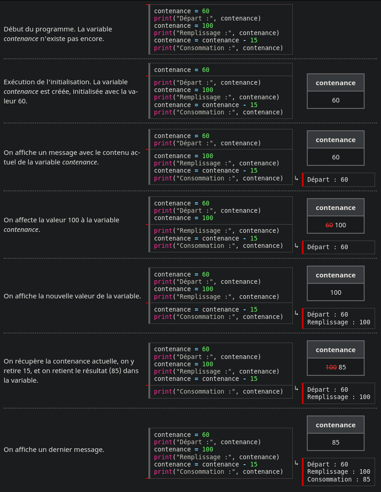

## **Nombres et mémoire à l'école**

### Histoire

Maintenant que vous connaissez un peu mieux les adultes du village et avez acquis leur confiance, vous vous interrogez sur la manière dont  ils éduquent leurs enfants. Vous décidez de passer quelques temps au  sein de l'école du village, et commencez à assister à des cours.

### Objectif

Vous allez effectuer des calculs, puis apprendre à mémoriser des  informations. Vous verrez comme ces possibilités peuvent se trouver  intéressantes, en manipulant des nombres entiers.


------


## 1 - Réponds !

⇒ afficher le nombre 42

### Sujet

Lors d'une bousculade à la sortie d'un cours, un des enfants a  malencontreusement fait tomber votre robot dans les escaliers !   Celui-ci a subi des chocs et vous craignez qu'il ne fonctionne plus.   Dans le petit manuel d'utilisation du robot, il est indiqué que le  test de base pour savoir si le robot fonctionne est de lui faire  afficher le nombre 42.


#### Ce que doit faire votre programme

Votre programme doit afficher le nombre 42.


####  Afficher un nombre

Pour afficher un nombre, en Python, on écrit :

```python
print(111)
```

```python
↳ 111
```


### Résoudre

```python
print(42)
```


### Correction

#### Histoire 

Ouf, le robot fonctionne ! Il est juste un petit peu cabossé.


#### Algorithme

Il fallait adapter l'exemple du manuel en remplaçant 111 par 42.

Bien sûr, il était également possible d'utiliser une chaîne de  caractères contenant le nombre 42, bien que ce ne soit pas le but de  l'exercice.


#### Programme

```pyth
print(42)
```


####  Un peu de culture

Vous retrouverez fréquemment le nombre 42 en informatique, mais aussi dans un certain nombre de films et jeux vidéos. Il s'agit d'une référence à un feuilleton radio de science-fiction humoristique, *The Hitchhiker's Guide to the Galaxy* ([*Le Guide du voyageur galactique*](http://fr.wikipedia.org/wiki/Le_Guide_du_voyageur_galactique)), écrit par Douglas Adams et qui a depuis fait l'objet de livres et d'un film. Dans cette fiction, le super-ordinateur *Deep Thought* (Pensées Profondes), après plus de 7 millions d'années de calculs, apporte la réponse à « [La grande question sur la Vie, l'Univers et le Reste](http://fr.wikipedia.org/wiki/La_grande_question_sur_la_vie,_l'univers_et_le_reste) ». Et cette réponse est… 42 !


------


## 2 - L'éclipse

⇒ calculer la soustraction de deux entiers


### Sujet

Lors du cours d'astronomie que le professeur donne aux élèves, il  leur explique le principe des éclipses, puis il leur indique la date de  la prochaine éclipse totale sur Algoréa. Vous connaissez donc la date de l'éclipse ainsi que la date actuelle  et vous vous demandez dans combien de jours aura donc lieu cette  éclipse. Notez que ces deux dates sont exprimées en nombre de jours du  calendrier algoréen.


#### Ce que doit faire votre programme

Vous savez que l'éclipse aura lieu le 12581<sup>e</sup> jour et que la date actuelle est le 11937<sup>e</sup> jour.   Votre programme doit calculer et afficher le nombre de jours qu'il faudra patienter avant de pouvoir admirer l'éclipse.


####  Faire des calculs

Pour additionner deux nombres, on va les joindre avec le symbole `+`, comme en maths !   Ainsi, nous pouvons afficher le résultat d'une somme :

```pyth
Afficher 2 + 3
```

Ce qui s'écrit en Python :

```python
print(2 + 3)
```

```python
↳ 5
```

Sur le même principe, on pourra multiplier, soustraire ou diviser deux nombres.   On utilise les symboles `-`, `*` et `/` pour cela :

```python
print(30 * 10)
print(10 - 100)
print(42 / 10)
```

```pyth
↳ 300
↳ -90 
↳ 4.2
```

Pour la division, observez que la virgule s'affiche sous la forme d'un point (conformément à la convention anglo-saxonne).   

Notez que les espaces autour des opérateurs arithmétiques   (`+`, `-`, `*`, `/`) ne sont pas obligatoires,   mais ils rendent le programme plus facile à lire.


#### Faire des calculs complexes 

Il est possible de faire plusieurs opérations d'un coup. Par exemple :

```python
print(1 + 2 + 3)
```

```python
↳ 6
```

En programmation, certains opérateurs ont la priorité sur d'autres, comme en mathématiques.   Pour faire certains calculs, il peut être nécessaire d'utiliser des parenthèses :

```python
print((12 - 3) * 4)
```

```python
↳ 36
```

Sans les parenthèses, on aurait ainsi obtenu un résultat différent :

```python
print(12 - 3 * 4)
```

```python
↳ 0
```


### Résoudre

```python
print(12581 - 11937)
```


### Correction

#### Histoire 

Il va vous falloir attendre 644 jours avant l'éclipse. Vous notez  cette date précieusement pour être sûr de ne pas la rater : la prochaine sera 10 ans plus tard !


#### Algorithme 

Il fallait calculer la différence entre les deux dates indiquées puis afficher le résultat obtenu.


#### Programme 

```python
print(12581 - 11937)
```


------


## 3 - Bonbons pour tout le monde !

⇒ combiner des opérations mathématiques simples

### Sujet

Les élèves ne semblent pas à l'aise avec votre robot : ce n'est pas  un être humain, ce n'est pas un animal non plus…   ils sont donc très intrigués, voire même parfois un peu inquiets.  Afin de les rassurer,   vous souhaitez que votre robot distribue 3 bonbons à chaque élève.  Pour cela, vous avez besoin de calculer le nombre de bonbons à acheter.


#### Ce que doit faire votre programme

L'école est formée de 4 classes, constituées respectivement de 25,  30, 27 et 22 élèves. Cependant, 8 élèves sont absents aujourd'hui.   Sachant que chaque élève présent doit recevoir 3 bonbons, écrivez un  programme qui calcule puis affiche le nombre total de bonbons  nécessaires.

Vous n'avez pas besoin de calculatrice : **effectuez les calculs dans votre programme**.


### Résoudre

```python
print((25 + 30 + 27 + 22 - 8) * 3)
```


### Correction

#### Histoire 

Cela en fait, des bonbons ! Heureusement, votre robot est très costaud et pourra tout porter en une seule fois.


#### Algorithme 

Pour calculer le nombre total de bonbons nécessaires, on calcule d'abord le nombre d'élèves présents,   puis on multiplie ce nombre par 3 puisque chaque élève reçoit 3 bonbons.   Pour calculer le nombre d'élèves, on additionne le nombre d'élèves de chaque classe, ce qui donne 25 + 30 + 27 + 22,   puis on enlève à ce nombre les 8 élèves absents.

Il ne faut pas oublier de bien utiliser les parenthèses pour que le résultat du calcul soit correct.


#### Programme 

```python
print((25 + 30 + 27 + 22 - 8) * 3)
```


------


## 4 - L'algoréathlon

⇒ stocker le résultat d'un calcul pour le réutiliser

### Sujet

À la fin d'une course d'endurance, les élèves d'une classe sont  épuisés. Leur enseignant leur parle de l'algoréathlon,   un exercice d'endurance connu sur toute la planète. Il s'agit  d'enchaîner 2 km de natation, 34 km de cyclisme et 6 km de course à pied en un jour,   puis de le refaire un deuxième jour, et encore un troisième jour.

Les élèves se demandent quelle distance a été parcourue après chaque  jour. Vous profitez de l'occasion pour faire intervenir votre robot.


#### Ce que doit faire votre programme

L'algoréathlon se constitue de trois étapes à effectuer chaque jour : 2 km de natation, 34 km de cyclisme et 6 km de course à pied.

Sachant qu'un sportif répète ces trois étapes pendant 3 jours de  suite, vous devez afficher la distance totale qu'il a parcourue   à la fin du 1er jour, à la fin du 2e jour, puis à la fin de l'algoréathlon complet.

Afin de rendre l'affichage convivial sur l'écran du robot, vous souhaitez mettre les trois valeurs   sur une même ligne, avec une espace entre chaque valeur et la suivante.

**Important :** pour écrire ce programme, vous devez mémoriser la distance parcourue en un jour en lui donnant un nom,   puis utiliser ce nom pour calculer les trois réponses. Appuyez-vous sur les explications ci-dessous.


####  Mémoriser des informations

Supposons que l'on souhaite écrire un programme qui affiche la  distance qui séparait la Terre et Mars le 27 août 2003 (55 758 000 km),   puis la distance à parcourir par la lumière pour faire l'aller-retour depuis la Terre (le double).   On pourrait utiliser les instructions suivantes :

```python
Afficher 55758000
Afficher 2 * 55758000
```

Cela fonctionnera parfaitement bien. Toutefois, si l'on veut afficher ces informations pour un autre jour,   alors que la distance entre les deux planètes a changé, il faudra modifier le programme à deux endroits différents,   puisque l'on y a écrit deux fois la distance 55 758 000.

Pour éviter de devoir faire des modifications en double, on va utiliser une *variable*,   appelée distance, pour représenter la valeur 55 758 000. On peut alors exprimer notre programme de cette façon :

```python
distance <- 55758000
Afficher distance
Afficher 2 * distance
```

La première ligne signifie « distance reçoit 55 758 000 ».   La flèche `<-` matérialise le mouvement du nombre 55 758 000 qui va se placer dans distance.

Ce programme est un peu plus long, mais offre deux avantages :

- si l'on veut modifier la distance, on n'aura qu'une seule valeur à modifier dans notre programme ; 
- la valeur porte un **nom**, qui permet de comprendre à quoi elle correspond. 

En Python, cela s'écrit comme suit : 

```python
distance = 55758000
print(distance)
print(2 * distance)
```

```python
↳ 55758000
↳ 111516000
```

Une variable est comme une boîte nommée qui contient quelque chose :   on peut y stocker des informations et les retrouver par la suite.   Dans notre exemple, la boîte porte le nom distance et contient la valeur 55 758 000.

| distance |
| :------: |
| 55758000 |

La boîte distance est créée par l'instruction suivante :

```python
distance = 55758000
```

qui place la valeur 55 758 000 dans la variable. 

Dans ce chapitre, nous ne nous servirons des variables que pour travailler avec des nombres entiers.   Nous manipulerons d'autres types de valeurs par la suite.

Les deux instructions d'affichage ont consulté le contenu de la boîte distance pour y lire la valeur 55 758 000 :

```python
print(distance)
print(2 * distance)
```


#### Afficher des nombres avec des espaces 

Pour afficher trois nombres sur la même ligne séparés par une espace, appuyez-vous sur le code suivant :

```python
print(1, end = " ")
print(2, end = " ")
print(3)
```

```python
↳ 1 2 3
```

On remplace donc la terminaison (qui est par défaut une fin de ligne) par une espace   avec l'option `end = " "`.


### Résoudre

```python
distance = 42
print(distance, end = " ")
print(2 * distance, end = " ")
print(3 * distance)
```


### Correction

#### Histoire 

Un algoréathlon fait 126 km. Cela ne fait pas peur aux élèves, quand  ils pensent au pèlerinage que certains effectuent au mont Kailash.


#### Algorithme

On commence par enregistrer dans une variable la distance parcourue  en un jour : 2 km de nage + 34 km de cyclisme + 6 km de course à pied.   Ensuite, on affiche cette valeur, puis son double, et enfin son  triple, sur une seule ligne avec des espaces.


#### Programme

```python
distJour = 2 + 34 + 6
print(distJour, end = " ")
print(distJour * 2, end = " ")
print(distJour * 3)
```


####  Un peu de culture

L'algoréathlon est inspiré de la pratique sportive [triathlon](http://fr.wikipedia.org/wiki/Triathlon) et de la course de [marathon](http://fr.wikipedia.org/wiki/Marathon), cette dernière faisant (à peu près) 42 km, la même distance que celle parcourue en une journée d'algoréathlon.


------


## Cours : Nom d'une variable

Dans les langages de programmation, le choix du nom d'une variable est assez libre. Voici les règles générales.

- L'identifiant se constitue de caractères collés (pas d'espace).
- Les caractères autorisés sont essentiellement :
  - les lettres majuscules et minuscules naturelles : abcdefghijklmnopqrstuvwxyzABCDEFGHIJKLMNOPQRSTUVWXYZ ;
  - les chiffres 0123456789 ;
  - le caractère « _ » (appelé « sous-tiret »).
- Le premier caractère du nom d'une variable ne peut pas être un chiffre ; le nom 1erNombre est donc invalide.
- Les mots-clés du langage ne peuvent être utilisés pour nommer des variables. En Python,      c'est par exemple le cas du mot `for`.

Dans le cas du langage Python, les accents sont acceptés dans les identifiants.

Vous devez profiter de cette flexibilité pour choisir des noms qui aideront à comprendre votre programme. Nous vous en reparlerons dans un prochain cours.


------


## 5 - Cour de récréation

⇒ utiliser une variable dans des opérations mathématiques

### Sujet

La cour de récréation de l'école a bien besoin d'être refaite : d'une  part la clôture actuelle est trop rouillée pour résister à un Borlok,   et d'autre part il faudrait couvrir le sol en terre par de belles  pierres pour éviter d'avoir de la boue dès qu'il pleut.

Le professeur de la classe fait participer ses élèves : il leur  demande de calculer l'aire et le périmètre du carré que forme leur cour  de récréation.   Les élèves n'ayant pas de règle assez longue, ils ont utilisé 4  bâtons de longueurs différentes pour mesurer le côté du carré.   Afin d'aider les élèves dans leurs calculs, vous décidez d'écrire un  programme.


#### Ce que doit faire votre programme

La cour carrée a été mesurée avec quatre bâtons de longueurs  respectives 17 m, 7 m, 5 m et 2 m.   La longueur du côté de la cour est égale à 5 fois le premier bâton  plus 2 fois le second plus 1 fois le troisième plus 2 fois le quatrième.

Votre programme doit afficher deux lignes : la première doit contenir la surface de la cour, et la seconde ligne doit contenir son périmètre.   Les résultats doivent être exprimés en mètres carrés et en mètres,  respectivement, mais vous ne devez pas afficher l'unité après la valeur  numérique.

**Important :** dans votre programme, commencez par calculer la longueur du côté de la cour et l'enregistrer dans une variable.


### Résoudre

```python
côté = (5 * 17) + (2 * 7) + 5 + (2 * 2)
print(côté * côté)
print(côté * 4)
```


### Correction

#### Histoire 

Les élèves vous remercient ; à présent, ils insistent pour que vous restiez encore un peu avec eux !


#### Algorithme 

Il était possible d'écrire un programme n'utilisant que deux instructions,   mais cela aurait donné un code pas très joli car contenant beaucoup de répétitions :

```python
Afficher (17 * 5 + 7 * 2 + 5 * 1 + 2 * 2) * (17 * 5 + 7 * 2 + 5 * 1 + 2 * 2)
Afficher (17 * 5 + 7 * 2 + 5 * 1 + 2 * 2) * 4
```

Il est préférable d'utiliser une variable pour stocker le résultat du calcul donnant la longueur du côté.   On peut ensuite utiliser cette variable pour calculer l'aire et le périmètre.


#### Programme 

```python
longueur = 17 * 5 + 7 * 2 + 5 * 1 + 2 * 2
print(longueur * longueur)
print(longueur * 4)
```


------


## 6 - Une partie de cache-cache

⇒ afficher les entiers de 1 à 100

### Sujet

À la récréation, vous croisez un groupe d'enfants qui vous proposent de participer à leur jeu.   Vous acceptez de bon cœur et voilà votre robot engagé dans une partie de cache-cache !


#### Ce que doit faire votre programme

Le robot devra compter jusqu'à 100, c'est à dire afficher les entiers de 1 à 100, un par ligne, et ensuite afficher « J'arrive ! ».   Ainsi, s'il ne devait compter que jusqu'à 3 au lieu de 100, votre  robot devrait afficher :

```python
↳ 1
↳ 2
↳ 3
↳ J'arrive !
```

**Important :** votre programme ne doit pas faire plus d'une quinzaine de lignes.


####  Modifier une variable

Comme son nom l'indique, une variable a vocation à **varier**, c'est-à-dire à représenter différentes valeurs.   En programmation, il est notamment intéressant de changer la valeur que nous mettons dans nos boîtes.   La flèche que nous employons en pseudo-code :

```python
variable <- valeur
```

signifie que valeur devient le nouveau contenu de variable.   On dit qu'on *affecte* la valeur à la variable.

Une même variable peut se voir affecter différentes valeurs au cours du programme.   C'est comme si on prenait une vraie boîte et qu'on y mettait des objets, un seul restant à chaque fois :

```python
boîte <- chaussure
boîte <- poupée
```

Ainsi, considérons un programme qui se sert d'une variable nommée contenance   pour représenter la contenance d'une bouteille d'eau d'un litre.   Cette bouteille contient initialement 60 cl, puis on la remplit en entier (jusqu'à 100 cl). Cela donne :

```python
contenance <- 60
Afficher "Départ : ", contenance
contenance <- 100
Afficher "Remplissage : ", contenance
```

Maintenant, supposons que l'on boive 15 cl d'eau. Comment calculer la nouvelle contenance ?   Il s'agit de la soustraction « *contenance* − 15 ». On l'affecte donc à la variable :

```python
contenance <- contenance - 15
Afficher "Consommation : ", contenance
```

En Python, c'est l'opérateur `=` qui symbolise l'affectation, plutôt que la flèche.   Voici donc le programme final :

```python
contenance = 60
print("Départ :", contenance)
contenance = 100
print("Remplissage :", contenance)
contenance = contenance - 15
print("Consommation :", contenance)
```

```python
↳ Départ : 60
↳ Remplissage : 100
↳ Consommation : 85
```

L'utilisation du symbole d'égalité peut vous paraître particulière. En effet, en mathématiques, l'égalité énonce un fait. Ainsi, dans un contexte donné, x = y − z signifie qu'il est vrai que x a la même valeur que y − z.   

L'affectation `contenance = contenance - 15` en revanche, décrit une action : **l'enregistrement de la valeur placée à droite du `=` dans la variable indiquée à gauche**. Le contenu de la variable contenance changera donc la prochaine fois que l'on affectera une valeur à la variable.   

Observez aussi les instructions d'affichage :   

```python
print("Départ :", contenance)
```

Avec une seule instruction `print`, on peut afficher plusieurs données sur une ligne en les séparant par des virgules. Il y a alors une espace entre chaque donnée et la suivante (on n'a donc pas mis d'espace à la fin du texte).

L'exécution du programme est détaillée ci-dessous, la ligne rouge indiquant à quel endroit on est arrivé.




### Résoudre

```python
compte = 1
print(compte)
for loop in range(99):
   compte = compte + 1
   print(compte)
print("J'arrive !")
```


### Conseils

- Il faut utiliser une variable pour effectuer le compte. On commence par lui affecter la première valeur :

  ```python
  compte <- 1
  ```

- On affiche les valeurs dans une boucle de répétition. Après chaque affichage, on augmente le compte. Cela donnerait donc :

  ```python
  Répéter ... fois
     Afficher compte
     compte <- ...
  ```

  

### Correction

#### Histoire 

Le robot a magistralement compté mais n'était pas très doué pour trouver les enfants ; vous décidez donc de prendre sa place.


#### Algorithme 

Pour effectuer le compte, on utilise une variable nommée compte, à laquelle on affecte la première valeur : 1.

On doit afficher 100 valeurs. On effectue donc 100 répétitions de l'affichage.   Après chaque affichage, il faut augmenter le compte de 1 avec l'affectation :

```python
compte <- compte + 1
```


#### Programme

```python
compte = 1
for loop in range(100):
   print(compte)
   compte = compte + 1
print("J'arrive !")
```


------


## Cours : Variables : suppléments

### Plusieurs variables

Précédemment, nous n'avons utilisé qu'une seule variable, mais les programmes en utilisent généralement plusieurs.   Le programme suivant illustre cela : il utilise deux variables nommées largeur et longueur   afin de calculer l'aire en mm² d'une feuille A4 (21 cm × 29,7 cm),   et il enregistre le résultat dans une variable nommée surface. Le contenu de cette dernière variable est ensuite affiché.

```python
largeur = 210
longueur = 297
surface = longueur * largeur
print(surface)
```

```pyth
↳ 62370
```

 À la fin du programme, nous avons donc les boîtes suivantes : 

| largeur | longueur | surface |
| :-----: | :------: | :-----: |
|   210   |   297    | 62 370  |


### Variable inexistante 

Si on fait appel à une variable qui n'existe pas (ou pas encore),   on obtient une erreur. Par exemple, le programme suivant définit une variable longueur,   et tente ensuite d'afficher le contenu d'une variable nommée largeur qui n'a jamais été définie.

```python
longueur = 297
print(largeur)
```

```python
↳ NameError: name 'largeur' is not defined
```

Il faut faire particulièrement attention au fait que les  minuscules et majuscules ne sont pas considérées comme équivalentes. Ainsi, la variable nommée *longueurFil* n'a strictement rien à voir avec la variable nommée *longueurfil*.

```python
longueurFil = 10
print(longueurfil)
```

```python
↳ NameError: name 'longueurfil' is not defined
```

Si on rencontre une erreur de la forme `NameError: name 'xxxxx' is not defined`,   on pensera donc à vérifier que l'on a bien initialisé la variable correspondante   et que l'on a correctement saisi l'identifiant aux deux endroits.

### Faute de frappe à l'affectation

Observez le programme suivant, dans lequel on a commis une faute de frappe sur la troisième ligne :   

```python
taille = 180
print(taille)
tauille = taille + 20
print(taille)
```

Au lieu d'afficher 180 puis 200 comme on voudrait, ce programme affiche deux fois de suite le nombre 180 :   

```python
↳ 180
↳ 180
```

car la valeur 200 a en fait été affectée à une autre variable, nommée *tauille*.


------


## 7 - Progresser par l'erreur

⇒ vérifier des programmes utilisant des variables

### Sujet

Orthonart, l'un des élèves de la classe, vous a demandé de lui apprendre à utiliser votre petit robot.   Après lui avoir expliqué les bases de la programmation, vous lui prêtez le robot pendant une petite heure,   le temps de planifier quelques projets avec le professeur de la classe.   Lorsque vous revenez, vous décrouvrez qu'il a eu le temps d'écrire 7 programmes.   Un bon nombre d'entre eux sont cependant invalides. Indiquez-lui lesquels afin qu'il puisse apprendre de ses erreurs.


#### Ce que doit faire votre programme

Vous devez lire attentivement les programmes donnés ci-dessous pour déterminer s'ils sont valides ou non,   et ce sans essayer de les exécuter. Pour chacun des 7 programmes, vous devez afficher sur une ligne soit la lettre « V »   pour indiquer que le programme est valide, soit la lettre « I » pour indiquer qu'il est invalide.   Par exemple, si vous pensez que les 4 premiers programmes s'exécuteront sans erreur   et que les 3 suivants entraîneront des erreurs, faites afficher à votre programme :

```python
↳ V
↳ V
↳ V
↳ V
↳ I
↳ I
↳ I
```

Voici les sept programmes. 

```python
# 1.
nbBillesRouges = 4
nbBillesBleues = 6
print(nbBillesRouges + nbBillesBleues)
```

```python
# 2.
taille = 4
taille = 6
print(taille)
```

```python
# 3.
nbBillesBleues = 3
print(nbBillesRouges)
```

```python
# 4.
2 = 2
print(2)
```

```python
# 5.
âge1 = 6
âge2 = 4
âge2 = âge1
print(âge2)
```

```python
# 6.
prix = 10
prix - 2 = prix
print(prix)
```

```python
# 7.
prix = âge - 7
âge = 12
print(prix)
```


### Résoudre

```python
print("V")
print("V")
print("I")
print("I")
print("V")
print("I")
print("I")
```


### Correction

#### Histoire 

Grâce à vous, Orthonart a compris ses erreurs. Il retourne jouer avec ses camarades qui organisent un jeu. 


#### Analyse 

Les programmes 3, 4, 6 et 7 sont invalides. 

Dans le programme 3, montré ci-dessous, la variable nbBillesRouges est utilisée alors qu'elle n'existe pas.

```python
nbBillesBleues = 3
print(nbBillesRouges)
```

Dans le programme 4, montré ci-dessous, on essaie d'affecter une valeur au nombre `2`, qui n'est pas une variable.   Le programme est donc incorrect. Notez que bien que `2 = 2` désigne un énoncé valide en mathématiques,      cette expression n'a pas de sens en tant qu'instruction de programme.

```python
2 = 2
print(2)
```

Dans le programme 6, l'expression `prix - 2 = prix`    n'est pas valide.   Ici encore, dans la partie gauche d'une affectation, on ne peut mettre que des noms de variable.

```python
prix = 10
prix - 2 = prix
print(prix)
```

Enfin, dans le programme 7, la variable âge n'existe pas encore au moment où l'on essaie de l'utiliser à la première instruction.      

```python
prix = âge - 7
âge = 12
print(prix)
```


#### Programme

```python
print("V")
print("V")
print("I")
print("I")
print("V")
print("I")
print("I")
```


------


## 8 - Décollage de fusée

⇒ compter de 100 à 0

### Sujet

Afin d'amuser un groupe d'enfants, vous décidez de leur construire une fusée.   Après leur avoir rappelé qu'il ne faut pas le faire sans un adulte, vous sortez un sachet de thé de votre poche   et annoncez que ce sera votre fusée ! Incrédules, les enfants vous voient enlever l'agrafe, l'étiquette, vider le thé, et former un cylindre.   Il ne reste plus qu'à allumer le haut du cylindre et faire le décompte avant le décollage de la fusée !


#### Ce que doit faire votre programme

Votre programme devra lancer le décompte en partant de 100 puis annoncer le décollage, c'est-à-dire afficher une séquence d'annonces de la forme :

```python
↳ 100
↳ 99
↳ ...
↳ 2
↳ 1
↳ 0
↳ Décollage ! 
```

en remplaçant les « … » par toutes les valeurs intermédiaires.

**Important :** votre programme ne doit pas faire plus d'une quinzaine de lignes.


### Résoudre

```python
décompte = 100
for loop in range(101):
   print(décompte)
   décompte = décompte - 1
print("Décollage !")
```


### Conseils

- Le programme ressemble à la solution du problème « Une partie de cache-cache ». Il s'organise comme suit :

  ```python
  Initialiser le compte
  Pour chaque nombre
     Afficher le nombre
     Passer au suivant
  Afficher "Décollage !"
  ```

  Il faut donc déterminer combien de nombres on doit afficher, pour savoir combien de répétitions effectuer.


### Correction

#### Histoire 

La fusée est un succès, et les enfants, ébahis, vous applaudissent ! 


#### Algorithme 

On utilise une variable compte qui contient la valeur  actuelle du décompte.   La valeur initiale est 100 : on l'affecte à la variable. On écrit  ensuite une boucle dans laquelle on va afficher les valeurs.   Il y en a au total 101 à afficher (de 100 à 0) : il faut donc  effectuer 101 tours.   Dans la boucle, on affiche la valeur de la variable, puis on diminue  sa valeur de 1. À la fin, on affiche le dernier message !

La variable change donc de valeur à chaque tour de boucle : 100, puis 99, puis 98, puis 97… puis 0.


#### Programme 

```python
compte = 100
for loop in range(101):
   print(compte)
   compte = compte - 1
print("Décollage !")
```


------


## 9 - Invasion de batraciens

⇒ calculer une puissance avec une boucle

### Sujet

L'automne ayant été très pluvieux, les Bufo Algo, une espèce locale de crapauds, se sont reproduits en grand nombre,   et les habitants ont constaté que leur nombre doublait chaque semaine !   Leurs prédateurs naturels, les couleuvres (un type de serpent), sont complètement dépassés !

Avoir trop de crapauds est très gênant (on ne peut plus dormir) !   Les villageois décident donc d'élever un grand nombre de couleuvres  avec lesquelles ils pourront contrôler le nombre de crapauds.   Il leur faut tout d'abord estimer le nombre de crapauds qu'il y aura  au cours des semaines qui viennent. Ils vous demandent votre aide.


#### Ce que doit faire votre programme

Sachant qu'il y a actuellement 1337 crapauds et que leur nombre double chaque semaine,   votre programme devra afficher le nombre de crapauds qu'il y aura après la 12<sup>e</sup> semaine.

**Important :** vous devez **utiliser une boucle** pour calculer le nombre de crapauds.


### Résoudre

```python
crapauds = 1337
for loop in range(12):
   crapauds = crapauds * 2
print(crapauds)
```


### Conseils

- On souhaite obtenir le nombre de crapauds au bout d'un certain nombre de semaines, sachant qu'il double chaque semaine. Il faut donc une  structure de ce type :

  ```python
  Répéter pour chaque semaine
     Doubler le nombre de crapauds
  Afficher le nombre de crapauds
  ```

  On représente le nombre de crapauds par une variable, mettons *nbCrapauds*. Pour que sa valeur double dans la boucle, il faut lui en affecter une nouvelle :

  ```python
  nbCrapauds <- ...
  ```

  de sorte que la variable contienne successivement les valeurs 1 337, 2 674, 5 348, 10 696…


### Correction

#### Histoire 

Presque 5,5 millions de crapauds, c'est énorme ! Heureusement, les couleuvres vont y remédier rapidement.


#### Algorithme 

On utilise une variable nommée nbCrapauds pour stocker le nombre actuel de crapauds. Au début, ce nombre est égal à 1337.   Pour faire doubler ce nombre à chaque semaine, on utilise une affectation pour mettre la valeur nbCrapauds × 2 dans la variable nbCrapauds.   On place cette affectation dans une boucle pour la répéter 12 fois de suite. On obtient alors le nombre total de crapauds à la fin des 12  semaines.


#### Programme 

```python
nbCrapauds = 1337
for loop in range(12):
    nbCrapauds = nbCrapauds * 2
print(nbCrapauds)
```


------


## 10 - Kermesse

⇒ calculer les sommes intermédiaires de la somme des entiers de 1 à 50

### Sujet

C'est la dernière semaine de cours et l'école organise une grande  kermesse. L'un des stands, « La foire aux bonbons », propose un jeu  permettant de gagner des bonbons.   Le jeu est simple : il faut atteindre le plus grand nombre de fois  possible une cible sans jamais la rater.   On peut gagner gros, car plus on touche la cible, et plus on gagne de bonbons à chaque fois qu'on touche la cible !   Les élèves aimeraient connaître le nombre de bonbons qu'ils peuvent  gagner en fonction du nombre de tirs consécutifs réussis.


#### Ce que doit faire votre programme

Toucher la cible au premier tir rapporte un bonbon, toucher la cible  au deuxième tir rapporte deux bonbons de plus,   la toucher au troisième tir rapporte encore trois bonbons de plus,  etc.   Écrivez un programme qui affiche sur la première ligne le nombre  total de bonbons obtenus si l'on ne réussit qu'1 tir,   puis qui affiche sur la deuxième ligne le nombre de bonbons récupérés si l'on réussit 2 tirs de suite,   puis sur la troisième ligne le nombre de bonbons récupérés si l'on  réussit 3 tirs de suite, etc. jusqu'à la valeur que l'on peut récupérer  si l'on réussit 50 tirs de suite.

Par exemple, si votre programme s'arrêtait à 5 et non à 50, il devrait afficher ceci :

```python
↳ 1
↳ 3
↳ 6
↳ 10
↳ 15
```


### Résoudre

```python
bonbon = 0
tir = 1
for loop in range(50):
   bonbon = bonbon + tir
   print(bonbon)
   tir = tir + 1 
```


### Conseils

-  Avant d'avoir réussi un tir, on n'a aucun bonbon :

  ```python
  totalBonbons <- 0
  ```

  À chaque tir réussi, on obtient 1 bonbon, puis 2, puis 3…   Il faudrait donc utiliser une autre variable pour compter cela.   Ensuite, on pourra écrire quelque chose qui ressemblera à :

  ```python
  Pour chaque tir
     totalBonbons <- ...
     Afficher totalBonbons
  ```


### Correction

#### Histoire 

Les enfants, alléchés par le grand nombre de bonbons qu'il était  possible de gagner (1 275 si on gagne 50 fois d'affilée), ont tous voulu jouer.   La kermesse a donc été un succès !


#### Algorithme 

L'idée de ce programme est d'utiliser deux variables :

- *numTir*, contient le numéro du prochain tir, qui est aussi le nombre de bonbons que l'on va gagner au prochain tour ; 
- *totalBonbons* contient le nombre de bonbons accumulés.

À chaque étape, au *totalBonbons* s'ajoute le *numTi*r actuel,   et lorsqu'on passe à l'étape suivante, le *numTir* augmente d'une unité.


#### Programme

```python
totalBonbons = 0
numTir = 1
for loop in range(50):
   totalBonbons = totalBonbons + numTir
   print(totalBonbons)
   numTir = numTir + 1
```


####  Un peu de culture

Il existe une formule permettant de donner directement la somme des entiers entre 1 et *n*. Si vous ne la connaissez pas, essayez de la chercher !   


------


## Cours : Mettre à profit les identifiants

Les identifiants comme les noms de variable sont un très bon support pour concrétiser un programme :   ils permettent de placer directement dans les instructions des mots au choix du programmeur,   avec lesquels il peut décrire ce qu'il souhaite faire. Nous présentons ci-dessous des techniques à prendre en main,   qui seront très appréciées par les membres du forum,   et qui vous aideront vous-même, à relire, analyser et corriger vos programmes.


### Choisir un bon nom

Lorsqu'on a besoin d'une nouvelle variable, on cherchera toujours à   **trouver un nom pour cette variable qui décrive le mieux possible ce qu'elle représente**.   Il ne faut pas hésiter à mettre à la suite plusieurs mots pour construire un nom précis.    Nous vous conseillons de nommer vos variables par une suite de mots ou abréviations accolés les uns aux autres,   en mettant en majuscule la première lettre de chaque mot sauf le premier. Voici quelques exemples :

```pyth
longueurFeuille
nbPiècesJaunes
maxHauteurPiquets
```

Ce style de nommage est très répandu : on l'appelle couramment [CamelCase](http://fr.wikipedia.org/wiki/CamelCase),   ou « casse ChatMot » en français, en référence aux bosses du chameau.

On évitera en particulier l'utilisation de noms réduits à une simple lettre, comme i ou a.   Les lignes suivantes montrent un exemple de très mauvais code :

```python
a = 1000
b = 50
c = a + b
```

En effet, on comprend beaucoup mieux ce qui se passe lorsque des noms plus parlants sont employés :

```pyth
prixFour = 1000
prixBatteur = 50
prixTotal = prixFour + prixBatteur
```

Le nom doit placer la variable dans son contexte afin d'être efficace.   Ci-dessus, lors d'achats culinaires, nous calculons le coût total à partir du prix de nos deux produits.


### Nommer une valeur 

Nous avons vu au départ qu'une variable permettait d'éviter de recopier une valeur.   On peut également créer une variable, simplement dans le but de décrire une valeur ;   c'est notamment pratique pour diviser un calcul compliqué en plusieurs parties identifiables.

   Imaginons par exemple un marchand de fruits et légumes, qui vend les produits suivants :

|    Nom     | Quantité (kg) | Prix (centimes/kg) |
| :--------: | :-----------: | :----------------: |
|   Pommes   |      32       |         90         |
|   Pêches   |      12       |         96         |
| Aubergines |      23       |        120         |
|  Carottes  |      17       |        102         |
|  Patates   |      22       |         85         |

On souhaite calculer la valeur totale de ses produits. On pourrait écrire le programme comme ceci :

```python
Afficher 32 * 90 + 12 * 96 + 23 * 120 + 17 * 102 + 22 * 85
```

Toutefois, si le marchand décide de changer un prix ou nous apprend qu'il s'est trompé dans une quantité,   il n'est pas forcément facile de déterminer où effectuer la correction. Mais si on introduit des variables :

```python
prixPommes <- 32 * 90
prixPêches <- 12 * 96
prixAubergines <- 23 * 120
prixCarottes <- 17 * 102
prixPatates <- 22 * 85
Afficher prixPommes + prixPêches + prixAubergines + prixCarottes + prixPatates
```

il devient bien plus aisé de se repérer dans le programme.


------


## 11 - Course avec les enfants

⇒ utiliser un compteur pour le nombre d'itérations d'une boucle interne

### Sujet

C'est l'heure du cours de sport et les enfants font une petite course à laquelle vous décidez d'inscrire votre robot.   Le principe est simple : il faut aller chercher le premier anneau,  revenir le déposer derrière la ligne, puis aller chercher le second  anneau et le ramener, et ainsi de suite…   jusqu'à ce que le dixième anneau ait été ramené derrière la ligne, le but du jeu étant d'aller le plus vite possible (sans tricher bien sûr  !).

#### Ce que doit faire votre programme


Votre robot doit partir de la case de gauche (en orange), aller  chercher les anneaux (les ronds sur fond bleu) dans l'ordre (de gauche à droite)   et les ramener un par un à la case de départ.


####  Commandes pour cet exercice

Ici encore, vous devrez faire :

```python
Aller à gauche
Aller à droite
Ramasser l'anneau
Déposer l'anneau
```

ce qui correspond aux instructions suivantes :

```python
gauche()
droite()
ramasser()
deposer()
```


### Résoudre

```python
from robot import *

nombreAnneaux = 1
for loop in range(10):
   for loop in range(nombreAnneaux):
      droite()
   ramasser()
   for loop in range(nombreAnneaux):
      gauche()
   deposer()
   nombreAnneaux = nombreAnneaux + 1
```


### Conseils

- Dans ce problème, on remarque que le nombre de déplacements pour chaque anneau correspond aux entiers entre 1 et 10.

- On peut utiliser une variable pour indiquer un nombre de répétitions :

  ```python
  quantité <- 4
  Répéter quantité fois
     Afficher "Une fois !"
  ```

  ```python
  ↳ Une fois !
  ↳ Une fois !
  ↳ Une fois !
  ↳ Une fois !
  ```

- Comment structurer notre programme à présent ? Comme cela :

  ```python
  Pour chaque anneau
     Aller chercher l'anneau
     Ramener l'anneau
  ```

  Pour aller chercher un anneau, il faut se déplacer vers la droite jusqu'à lui, puis on le ramasse :

  ```python
  Répéter selon l'anneau
     Aller à droite
  Ramasser l'anneau
  ```


### Correction

#### Histoire 

Votre robot a été très rapide et il a gagné la course ! Félicitations. 


#### Algorithme 

Le robot doit faire plusieurs allers-retours, ce qui suggère  l'utilisation d'une boucle.   Cependant, la distance à parcourir est différente à chaque fois : il  faut d'abord faire un aller-retour de longueur 1, puis un de longueur 2,   et ainsi de suite jusqu'à un aller-retour de longueur 10.

L'idée clé de cet exercice est d'utiliser une boucle de la forme « Répéter *n* fois », où *n* correspond au contenu d'une variable qui évolue au fil du programme.   Plus précisément, on va utiliser une variable nommée *anneau* qui croît de 1 à 10 au fil du programme,   et on aura une boucle répétant *anneau* fois l'action d'aller à droite, puis une autre boucle répétant *anneau* fois un déplacement vers la gauche.


#### Programme 

```python
from robot import *
anneau = 1
for loop in range(10):
   for loop in range(anneau):
      droite()
   ramasser()
   for loop in range(anneau):
      gauche()  
   deposer()
   anneau = anneau + 1
```


------


## 12 - Construction d'une pyramide

⇒ sommer les cubes des entiers impairs de 1 à 17