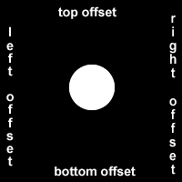

## Introduction aux défis de la conception visuelle appliquée

La  conception visuelle dans le développement Web est un vaste sujet. Il  combine la typographie, la théorie des couleurs, les graphiques,  l'animation et la mise en page pour aider à diffuser le message d'un  site. La définition d'un bon design est un sujet bien discuté, avec de  nombreux livres sur le thème.

À un niveau de base, la plupart des contenus Web fournissent des informations à un utilisateur. La  conception visuelle de la page peut influencer sa présentation et  l'expérience d'un utilisateur. Dans le développement Web, HTML donne une structure et une sémantique au contenu d'une page, et CSS contrôle la  mise en page et l'apparence de celle-ci.

Cette section couvre certains des outils de base que les développeurs utilisent pour créer leurs propres conceptions visuelles.

-----


## 1. Créer un équilibre visuel à l'aide de la propriété `text-align`

[Learn Applied Visual Design: Create Visual Balance Using the text-align Property | freeCodeCamp.org](https://www.freecodecamp.org/learn/responsive-web-design/applied-visual-design/create-visual-balance-using-the-text-align-property)

Cette section du programme se concentre sur la conception visuelle  appliquée. Le premier groupe de défis s'appuie sur la présentation de  carte donnée pour montrer un certain nombre de principes fondamentaux.
Le texte constitue souvent une grande partie du contenu Web. CSS a  plusieurs options pour l'aligner avec la propriété `text-align`.
`text-align: justify;` fait que toutes les lignes de texte à l'exception de la  dernière ligne rencontrent les bords gauche et droit de la zone de  ligne.
`text-align: center;` centre le texte.
`text-align: right;` aligne le texte à droite.
Et `text-align: left;` (valeur par défaut) aligne le texte à gauche.

-----

Alignez le texte de la balise `h4`, qui dit "Google", au centre. Ensuite,  justifiez la balise de paragraphe qui contient des informations sur la  création de Google.

> Votre code doit utiliser la propriété `text-align` sur la balise `h4` pour la définir au centre.
> Votre code doit utiliser la propriété `text-align` sur la balise `p` pour la définir pour justifier.

```html
<style>
  h4 {
    text-align: center;
  }
  p {
    text-align: justify;
  }
  .links {
    margin-right: 20px;
  }
  .fullCard {
    border: 1px solid #ccc;
    border-radius: 5px;
    margin: 10px 5px;
    padding: 4px;
  }
  .cardContent {
    padding: 10px;
  }
</style>
<div class="fullCard">
  <div class="cardContent">
    <div class="cardText">
      <h4>Google</h4>
      <p>Google was founded by Larry Page and Sergey Brin while they were Ph.D. students at Stanford University.</p>
    </div>
    <div class="cardLinks">
      <a href="https://en.wikipedia.org/wiki/Larry_Page" target="_blank" class="links">Larry Page</a>
      <a href="https://en.wikipedia.org/wiki/Sergey_Brin" target="_blank" class="links">Sergey Brin</a>
    </div>
  </div>
</div>
```

-----


## 2. Ajuster la largeur d'un élément à l'aide de la propriété `width`

[Learn Applied Visual Design: Adjust the Width of an Element Using the width Property | freeCodeCamp.org](https://www.freecodecamp.org/learn/responsive-web-design/applied-visual-design/adjust-the-width-of-an-element-using-the-width-property)

Vous pouvez spécifier la largeur d'un élément à l'aide de la propriété `width` dans CSS. Les valeurs peuvent être données en unités de longueur relatives (telles que `em`), en unités de longueur absolue (telles que `px`) ou en pourcentage de l'élément parent qui le contient. Voici un exemple qui modifie la largeur d'une image à `220px` :

```css
img {
  width: 220px;
}
```

-----

Ajoutez une propriété `width` à la carte entière et définissez-la sur une  valeur absolue de `245px`. Utilisez la classe `fullCard` pour sélectionner  l'élément.

> Votre code doit modifier la propriété `width` de la carte à 245 pixels à l'aide du sélecteur de classe `fullCard`.

```html
<style>
  h4 {
    text-align: center;
  }
  p {
    text-align: justify;
  }
  .links {
    margin-right: 20px;
    text-align: left;
  }
  .fullCard {
	width: 245px;
    border: 1px solid #ccc;
    border-radius: 5px;
    margin: 10px 5px;
    padding: 4px;
  }
  .cardContent {
    padding: 10px;
  }
</style>
<div class="fullCard">
  <div class="cardContent">
    <div class="cardText">
      <h4>Google</h4>
      <p>Google was founded by Larry Page and Sergey Brin while they were Ph.D. students at Stanford University.</p>
    </div>
    <div class="cardLinks">
      <a href="https://en.wikipedia.org/wiki/Larry_Page" target="_blank" class="links">Larry Page</a>
      <a href="https://en.wikipedia.org/wiki/Sergey_Brin" target="_blank" class="links">Sergey Brin</a>
    </div>
  </div>
</div>
```

-----


## 3. Ajuster la hauteur d'un élément à l'aide de la propriété `height`

[Learn Applied Visual Design: Adjust the Height of an Element Using the height Property | freeCodeCamp.org](https://www.freecodecamp.org/learn/responsive-web-design/applied-visual-design/adjust-the-height-of-an-element-using-the-height-property)

Vous pouvez spécifier la hauteur d'un élément à l'aide de la propriété `height` dans CSS, similaire à la propriété `width`. Voici un exemple qui  change la hauteur d'une image à 20px :

```css
img {
  height: 20px;
}
```

-----

Ajoutez une propriété `height` à la balise `h4` et définissez-la sur 25px.

**Remarque :** vous devrez peut-être être à un zoom de 100% pour réussir le test de ce défi.

> Votre code doit changer la propriété `height` de `h4` à une valeur de 25 pixels.

```html
<style>
  h4 {
    text-align: center;
    height: 25px;
  }
  p {
    text-align: justify;
  }
  .links {
    margin-right: 20px;
    text-align: left;
  }
  .fullCard {
    width: 245px;
    border: 1px solid #ccc;
    border-radius: 5px;
    margin: 10px 5px;
    padding: 4px;
  }
  .cardContent {
    padding: 10px;
  }
</style>
<div class="fullCard">
  <div class="cardContent">
    <div class="cardText">
      <h4>Google</h4>
      <p>Google was founded by Larry Page and Sergey Brin while they were Ph.D. students at Stanford University.</p>
    </div>
    <div class="cardLinks">
      <a href="https://en.wikipedia.org/wiki/Larry_Page" target="_blank" class="links">Larry Page</a>
      <a href="https://en.wikipedia.org/wiki/Sergey_Brin" target="_blank" class="links">Sergey Brin</a>
    </div>
  </div>
</div>
```

-----


## 4. Utilisez la balise `strong` pour rendre le texte gras

[Learn Applied Visual Design: Use the strong Tag to Make Text Bold | freeCodeCamp.org](https://www.freecodecamp.org/learn/responsive-web-design/applied-visual-design/use-the-strong-tag-to-make-text-bold)

Pour mettre du texte en gras, vous pouvez utiliser la balise `strong`. Ceci est souvent utilisé pour attirer l'attention sur le texte et symboliser son importance. Avec la balise `strong`, le navigateur applique le CSS de `font-weight: bold;` à l'élément.

-----

Enveloppez une balise `strong` autour de "Stanford University" à l'intérieur de la balise `p` (ne pas inclure le point).

> Votre code doit ajouter une balise `strong` au balisage.
> La balise `strong` doit être à l'intérieur de la balise `p`.
> La balise `strong` devrait entourer les mots "Université de Stanford".

```html
<style>
  h4 {
    text-align: center;
    height: 25px;
  }
  p {
    text-align: justify;
  }
  .links {
    text-align: left;
    color: black;
  }
  .fullCard {
    width: 245px;
    border: 1px solid #ccc;
    border-radius: 5px;
    margin: 10px 5px;
    padding: 4px;
  }
  .cardContent {
    padding: 10px;
  }
  .cardText {
    margin-bottom: 30px;
  }
</style>
<div class="fullCard">
  <div class="cardContent">
    <div class="cardText">
      <h4>Google</h4>
      <p>Google was founded by Larry Page and Sergey Brin while they were Ph.D. students at <strong>Stanford University</strong>.</p>
    </div>
    <div class="cardLinks">
      <a href="https://en.wikipedia.org/wiki/Larry_Page" target="_blank" class="links">Larry Page</a><br><br>
      <a href="https://en.wikipedia.org/wiki/Sergey_Brin" target="_blank" class="links">Sergey Brin</a>
    </div>
  </div>
</div>
```

-----


## 5. Utilisez la balise `u` pour souligner le texte

[Learn Applied Visual Design: Use the u Tag to Underline Text | freeCodeCamp.org](https://www.freecodecamp.org/learn/responsive-web-design/applied-visual-design/use-the-u-tag-to-underline-text)

Pour souligner du texte, vous pouvez utiliser la balise `u`. Ceci est  souvent utilisé pour signifier qu'une section de texte est importante ou quelque chose à retenir. Avec la balise `u`, le navigateur applique le  CSS de `text-decoration: underline;` à l'élément.

-----

Enveloppez la balise `u` uniquement autour du texte "Ph.D. étudiants".

**Remarque :** essayez d'éviter d'utiliser la balise `u` lorsqu'elle pourrait être confondue avec un lien. Les balises d'ancrage ont également une mise en  forme soulignée par défaut.

> Votre code doit ajouter une balise `u` au balisage.
> La balise `u` doit entourer le texte "Ph.D. étudiants".

```html
<style>
  h4 {
    text-align: center;
    height: 25px;
  }
  p {
    text-align: justify;
  }
  .links {
    text-align: left;
    color: black;
  }
  .fullCard {
    width: 245px;
    border: 1px solid #ccc;
    border-radius: 5px;
    margin: 10px 5px;
    padding: 4px;
  }
  .cardContent {
    padding: 10px;
  }
  .cardText {
    margin-bottom: 30px;
  }
</style>
<div class="fullCard">
  <div class="cardContent">
    <div class="cardText">
      <h4>Google</h4>
      <p>Google was founded by Larry Page and Sergey Brin while they were <u>Ph.D. students</u> at <strong>Stanford University</strong>.</p>
    </div>
    <div class="cardLinks">
      <a href="https://en.wikipedia.org/wiki/Larry_Page" target="_blank" class="links">Larry Page</a><br><br>
      <a href="https://en.wikipedia.org/wiki/Sergey_Brin" target="_blank" class="links">Sergey Brin</a>
    </div>
  </div>
</div>
```

-----


## 6. Utilisez la balise `em` pour mettre du texte en italique

[Learn Applied Visual Design: Use the em Tag to Italicize Text | freeCodeCamp.org](https://www.freecodecamp.org/learn/responsive-web-design/applied-visual-design/use-the-em-tag-to-italicize-text)

Pour mettre en valeur le texte, vous pouvez utiliser la balise `em`. Cela  affiche le texte en italique, car le navigateur applique le CSS `font-style: italic;` à l'élément.

-----

Enveloppez une balise `em` autour du contenu de la balise de paragraphe pour lui donner de l'emphase.

> Votre code doit ajouter une balise `em` au balisage.
> La balise `em` doit entourer le contenu de la balise `p` mais pas la balise `p` elle-même.

```html
<style>
  h4 {
    text-align: center;
    height: 25px;
  }
  p {
    text-align: justify;
  }
  .links {
    text-align: left;
    color: black;
  }
  .fullCard {
    width: 245px;
    border: 1px solid #ccc;
    border-radius: 5px;
    margin: 10px 5px;
    padding: 4px;
  }
  .cardContent {
    padding: 10px;
  }
  .cardText {
    margin-bottom: 30px;
  }
</style>
<div class="fullCard">
  <div class="cardContent">
    <div class="cardText">
      <h4>Google</h4>
      <p><em>Google was founded by Larry Page and Sergey Brin while they were <u>Ph.D. students</u> at <strong>Stanford University</strong>.</em></p>
    </div>
    <div class="cardLinks">
      <a href="https://en.wikipedia.org/wiki/Larry_Page" target="_blank" class="links">Larry Page</a><br><br>
      <a href="https://en.wikipedia.org/wiki/Sergey_Brin" target="_blank" class="links">Sergey Brin</a>
    </div>
  </div>
</div>
```

-----


## 7. Utilisez la balise `s` pour barrer le texte

[Learn Applied Visual Design: Use the s Tag to Strikethrough Text | freeCodeCamp.org](https://www.freecodecamp.org/learn/responsive-web-design/applied-visual-design/use-the-s-tag-to-strikethrough-text)

Pour barrer du texte, c'est-à-dire lorsqu'une ligne horizontale traverse les caractères, vous pouvez utiliser la balise `s`. Cela montre qu'une  section de texte n'est plus valide. Avec la balise `s`, le navigateur applique le CSS de `text-decoration: line-through;` à l'élément.

-----

Enveloppez la balise `s` autour de "Google" à l'intérieur de la balise `h4`, puis ajoutez le mot Alphabet à côté, qui ne devrait pas avoir le format  barré.

> Votre code doit ajouter une balise `s` au balisage.
> Une balise `s` doit entourer le texte Google dans la balise `h4`. Il ne doit pas contenir le mot Alphabet.
> Vous devez inclure le mot "Alphabet" dans la balise `h4`, sans mise en forme barrée.

```html
<style>
  h4 { text-align: center; height: 25px; }
  p { text-align: justify; }
  .links { text-align: left; color: black; }
  .fullCard { width: 245px; border: 1px solid #ccc; border-radius: 5px; margin: 10px 5px; padding: 4px; }
  .cardContent { padding: 10px; }
  .cardText { margin-bottom: 30px; }
</style>
<div class="fullCard">
  <div class="cardContent">
    <div class="cardText">
      <h4><s>Google</s> Alphabet</h4>
      <p><em>Google was founded by Larry Page and Sergey Brin while they were <u>Ph.D. students</u> at <strong>Stanford University</strong>.</em></p>
    </div>
    <div class="cardLinks">
      <a href="https://en.wikipedia.org/wiki/Larry_Page" target="_blank" class="links">Larry Page</a><br><br>
      <a href="https://en.wikipedia.org/wiki/Sergey_Brin" target="_blank" class="links">Sergey Brin</a>
    </div>
  </div>
</div>
```

-----


## 8. Créer une ligne horizontale à l'aide de l'élément `hr`

[Learn Applied Visual Design: Create a Horizontal Line Using the hr Element | freeCodeCamp.org](https://www.freecodecamp.org/learn/responsive-web-design/applied-visual-design/create-a-horizontal-line-using-the-hr-element)

Vous pouvez utiliser la balise `hr` pour ajouter une ligne horizontale sur la largeur de son élément conteneur. Cela peut être utilisé pour  définir un changement de sujet ou pour séparer visuellement des groupes  de contenu.

-----

Ajoutez une balise `hr` sous le `h4` qui contient le titre de la carte.

**Remarque :** en HTML, `hr` est une balise à fermeture automatique et n'a donc pas besoin d'une balise de fermeture distincte.

> Votre code doit ajouter une balise `hr` au balisage.
> La balise `hr` doit se trouver entre le titre et le paragraphe.

```html
<style>
  h4 { text-align: center; height: 25px; }
  p { text-align: justify; }
  .links { text-align: left; color: black; }
  .fullCard { width: 245px; border: 1px solid #ccc; border-radius: 5px; margin: 10px 5px; padding: 4px; }
  .cardContent { padding: 10px; }
  .cardText { margin-bottom: 30px; }
</style>
<div class="fullCard">
  <div class="cardContent">
    <div class="cardText">
      <h4><s>Google</s>Alphabet</h4>
      <hr>
      <p><em>Google was founded by Larry Page and Sergey Brin while they were <u>Ph.D. students</u> at <strong>Stanford University</strong>.</em></p>
    </div>
    <div class="cardLinks">
      <a href="https://en.wikipedia.org/wiki/Larry_Page" target="_blank" class="links">Larry Page</a><br><br>
      <a href="https://en.wikipedia.org/wiki/Sergey_Brin" target="_blank" class="links">Sergey Brin</a>
    </div>
  </div>
</div>
```

-----


## 9. Ajuster la propriété `background-color` du texte

[Learn Applied Visual Design: Adjust the background-color Property of Text | freeCodeCamp.org](https://www.freecodecamp.org/learn/responsive-web-design/applied-visual-design/adjust-the-background-color-property-of-text)

Au lieu d'ajuster votre arrière-plan général ou la couleur du texte pour rendre le premier plan facilement lisible, vous pouvez ajouter `background-color` à l'élément contenant le texte que vous souhaitez mettre en valeur. Ce défi utilise `rgba()` au lieu des codes  hexadécimaux ou `rgb()` normal.

​    rgba signifie :
​      r = rouge
​      g = vert
​      b = bleu
​      a = alpha / niveau d'opacité

Les valeurs RGB peuvent aller de 0 à 255. La valeur alpha peut aller de 1,  qui est totalement opaque ou de couleur unie, à 0, qui est totalement  transparent ou clair. `rgba()` est idéal à utiliser dans ce cas, car il  vous permet d'ajuster l'opacité. Cela signifie que vous n'avez pas à  bloquer complètement l'arrière-plan.
Vous utiliserez `background-color: rgba(45, 45, 45, 0.1)` pour ce défi. Il produit une couleur gris foncé presque transparente compte tenu de la faible valeur d'opacité de 0,1.

-----

Pour faire ressortir davantage le texte, ajustez `background-color` de l'élément `h4` à la valeur `rgba()` donnée.
Aussi pour le `h4`, supprimez la propriété `height` et ajoutez un `padding` de `10px`.

> Votre code doit ajouter une propriété `background-color` à l'élément `h4` défini sur `rgba(45, 45, 45, 0.1)`.
> Votre code doit ajouter une propriété de remplissage à l'élément `h4` et le définir sur 10 pixels.
> La propriété `height` de l'élément `h4` doit être supprimée.

```html
<style>
  h4 {
  	text-align: center;
    background-color: rgba(45, 45, 45, 0.1);
    padding: 10px;
  }
  p { text-align: justify; }
  .links { text-align: left; color: black; }
  .fullCard { width: 245px; border: 1px solid #ccc; border-radius: 5px; margin: 10px 5px; padding: 4px; }
  .cardContent { padding: 10px; }
  .cardText { margin-bottom: 30px; }
</style>
<div class="fullCard">
  <div class="cardContent">
    <div class="cardText">
      <h4><s>Google</s>Alphabet</h4>
      <hr>
      <p><em>Google was founded by Larry Page and Sergey Brin while they were <u>Ph.D. students</u> at <strong>Stanford University</strong>.</em></p>
    </div>
    <div class="cardLinks">
      <a href="https://en.wikipedia.org/wiki/Larry_Page" target="_blank" class="links">Larry Page</a><br><br>
      <a href="https://en.wikipedia.org/wiki/Sergey_Brin" target="_blank" class="links">Sergey Brin</a>
    </div>
  </div>
</div>
```

-----


## 10. Ajuster la taille d'un en-tête par rapport à une balise de paragraphe

[Learn Applied Visual Design: Adjust the Size of a Header Versus a Paragraph Tag | freeCodeCamp.org](https://www.freecodecamp.org/learn/responsive-web-design/applied-visual-design/adjust-the-size-of-a-header-versus-a-paragraph-tag)

La taille de police des balises d'en-tête (`h1` à `h6`) doit généralement  être supérieure à la taille de police des balises de paragraphe. Cela  permet à l'utilisateur de mieux comprendre visuellement la mise en page  et le niveau d'importance de tout ce qui se trouve sur la page. Vous  utilisez la propriété `font-size` pour ajuster la taille du texte dans un  élément.

-----

Pour rendre l'en-tête beaucoup plus grand que le paragraphe, modifiez `font-size` de la balise `h4` à 27 pixels.

> Votre code doit ajouter une propriété `font-size` à l'élément `h4` défini sur 27 pixels.

```html
<style>
  h4 {
  	text-align: center;
    background-color: rgba(45, 45, 45, 0.1);
    padding: 10px;
    font-size: 27px;
  }
  p { text-align: justify; }
  .links { text-align: left; color: black; }
  .fullCard { width: 245px; border: 1px solid #ccc; border-radius: 5px; margin: 10px 5px; padding: 4px; }
  .cardContent { padding: 10px; }
  .cardText { margin-bottom: 30px; }
</style>
<div class="fullCard">
  <div class="cardContent">
    <div class="cardText">
      <h4><s>Google</s>Alphabet</h4>
      <hr>
      <p><em>Google was founded by Larry Page and Sergey Brin while they were <u>Ph.D. students</u> at <strong>Stanford University</strong>.</em></p>
    </div>
    <div class="cardLinks">
      <a href="https://en.wikipedia.org/wiki/Larry_Page" target="_blank" class="links">Larry Page</a><br><br>
      <a href="https://en.wikipedia.org/wiki/Sergey_Brin" target="_blank" class="links">Sergey Brin</a>
    </div>
  </div>
</div>
```

-----


## 11. Ajouter une `box-shadow` à un élément de type carte

[Learn Applied Visual Design: Add a box-shadow to a Card-like Element | freeCodeCamp.org](https://www.freecodecamp.org/learn/responsive-web-design/applied-visual-design/add-a-box-shadow-to-a-card-like-element)

La propriété `box-shadow` applique une ou plusieurs ombres à un élément.
La propriété `box-shadow` prend des valeurs pour :

- `offset-x` (jusqu'où pousser l'ombre horizontalement de l'élément),
- `offset-y` (jusqu'où pousser l'ombre verticalement de l'élément),
- `blur-radius` (rayon de flou),
- `spread-radius` (rayon de propagation) et
- `color`, dans cet ordre.

Les valeurs de `blur-radius` et de `spread-radius` sont facultatives.
Plusieurs box-shadows peuvent être créés en utilisant des virgules pour séparer les propriétés de chaque élément `box-shadow`.
Voici un exemple du CSS pour créer plusieurs ombres avec un peu de flou, à des couleurs noires principalement transparentes :

```css
box-shadow: 0 10px 20px rgba(0,0,0,0.19), 0 6px 6px rgba(0,0,0,0.23);
```

-----

L'élément a maintenant un identifiant de `thumbnail` (miniature, vignette). Avec ce sélecteur, utilisez  les exemples de valeurs CSS ci-dessus pour placer une `box-shadow` sur la carte.

> Votre code doit ajouter une propriété `box-shadow` pour l'id de `thumbnail`.
> Vous devez utiliser le CSS donné pour la valeur `box-shadow`.

```html
<style>
  h4 { text-align: center; background-color: rgba(45, 45, 45, 0.1); padding: 10px; font-size: 27px; }
  p { text-align: justify; }
  .links { text-align: left; color: black; }
  #thumbnail {
    box-shadow: 0 10px 20px rgba(0,0,0,0.19), 0 6px 6px rgba(0,0,0,0.23);
  }
  .fullCard { width: 245px; border: 1px solid #ccc; border-radius: 5px; margin: 10px 5px; padding: 4px; }
  .cardContent { padding: 10px; }
  .cardText { margin-bottom: 30px; }
</style>
<div class="fullCard" id="thumbnail">
  <div class="cardContent">
    <div class="cardText">
      <h4>Alphabet</h4>
      <hr>
      <p><em>Google was founded by Larry Page and Sergey Brin while they were <u>Ph.D. students</u> at <strong>Stanford University</strong>.</em></p>
    </div>
    <div class="cardLinks">
      <a href="https://en.wikipedia.org/wiki/Larry_Page" target="_blank" class="links">Larry Page</a><br><br>
      <a href="https://en.wikipedia.org/wiki/Sergey_Brin" target="_blank" class="links">Sergey Brin</a>
    </div>
  </div>
</div>
```

-----


## 12. Diminuer l'opacité d'un élément

[Learn Applied Visual Design: Decrease the Opacity of an Element | freeCodeCamp.org](https://www.freecodecamp.org/learn/responsive-web-design/applied-visual-design/decrease-the-opacity-of-an-element)

La propriété `opacity` dans CSS est utilisée pour ajuster l'opacité, ou inversement, la transparence d'un élément.

- Une valeur de 1 est opaque, ce qui n'est pas du tout transparent.
- Une valeur de 0,5 correspond à la moitié de la transparence.
- Une valeur de 0 est complètement transparente.

La valeur donnée s'appliquera à l'ensemble de l'élément, qu'il s'agisse  d'une image avec une certaine transparence ou des couleurs de premier  plan et d'arrière-plan d'un bloc de texte.

-----

Définissez `opacity` des balises d'ancrage sur 0,7 à l'aide de la classe `links` pour les sélectionner.

> Votre code doit définir la propriété `opacity` sur 0,7 sur les balises d'ancrage en sélectionnant la classe `links`.

```html
<style>
  h4 { text-align: center; background-color: rgba(45, 45, 45, 0.1); padding: 10px; font-size: 27px; }
  p { text-align: justify; }
  .links {
    text-align: left;
    color: black;
    opacity: 0.7;
  }
  #thumbnail { box-shadow: 0 10px 20px rgba(0,0,0,0.19), 0 6px 6px rgba(0,0,0,0.23); }
  .fullCard { width: 245px; border: 1px solid #ccc; border-radius: 5px; margin: 10px 5px; padding: 4px; }
  .cardContent { padding: 10px; }
  .cardText { margin-bottom: 30px; }
</style>
<div class="fullCard" id="thumbnail">
  <div class="cardContent">
    <div class="cardText">
      <h4>Alphabet</h4>
      <hr>
      <p><em>Google was founded by Larry Page and Sergey Brin while they were <u>Ph.D. students</u> at <strong>Stanford University</strong>.</em></p>
    </div>
    <div class="cardLinks">
      <a href="https://en.wikipedia.org/wiki/Larry_Page" target="_blank" class="links">Larry Page</a><br><br>
      <a href="https://en.wikipedia.org/wiki/Sergey_Brin" target="_blank" class="links">Sergey Brin</a>
    </div>
  </div>
</div>
```

-----


## 13. Utilisez la propriété `text-transform` pour rendre le texte en majuscule

[Learn Applied Visual Design: Use the text-transform Property to Make Text Uppercase | freeCodeCamp.org](https://www.freecodecamp.org/learn/responsive-web-design/applied-visual-design/use-the-text-transform-property-to-make-text-uppercase)

La propriété `text-transform` en CSS est utilisée pour modifier  l'apparence du texte. C'est un moyen pratique de s'assurer que le texte  d'une page Web s'affiche de manière cohérente, sans avoir à modifier le  contenu du texte des éléments HTML réels.
Le tableau suivant  montre comment les différentes valeurs de `text-transform` modifient le texte d'exemple "Transform me".

| Valeur       | Résultat                                                |
| ------------ | ------------------------------------------------------- |
| `lowercase`  | "transform me"                                          |
| `uppercase`  | "TRANSFORM ME"                                          |
| `capitalize` | "Transform Me"                                          |
| `initial`    | Utiliser la valeur par défaut                           |
| `inherit`    | Utiliser la valeur `text-transform` de l'élément parent |
| `none`       | **Par défaut :** utiliser le texte d'origine            |

------

Transformez le texte du `h4` en majuscules à l'aide de la propriété `text-transform`.

> Le texte `h4` doit être en majuscules.
> Le texte original du `h4` ne doit pas être modifié.

```html
<style>
  h4 {
    text-align: center;
    background-color: rgba(45, 45, 45, 0.1);
    padding: 10px;
    font-size: 27px;
    text-transform: uppercase;
  }
  p { text-align: justify; }
  .links { text-align: left; color: black; opacity: 0.7; }
  #thumbnail { box-shadow: 0 10px 20px rgba(0,0,0,0.19), 0 6px 6px rgba(0,0,0,0.23); }
  .fullCard { width: 245px; border: 1px solid #ccc; border-radius: 5px; margin: 10px 5px; padding: 4px; }
  .cardContent { padding: 10px; }
  .cardText { margin-bottom: 30px; }
</style>
<div class="fullCard" id="thumbnail">
  <div class="cardContent">
    <div class="cardText">
      <h4>Alphabet</h4>
      <hr>
      <p><em>Google was founded by Larry Page and Sergey Brin while they were <u>Ph.D. students</u> at <strong>Stanford University</strong>.</em></p>
    </div>
    <div class="cardLinks">
      <a href="https://en.wikipedia.org/wiki/Larry_Page" target="_blank" class="links">Larry Page</a><br><br>
      <a href="https://en.wikipedia.org/wiki/Sergey_Brin" target="_blank" class="links">Sergey Brin</a>
    </div>
  </div>
</div>
```

-----


## 14. Définir la taille de la police pour plusieurs éléments de titre

[Learn Applied Visual Design: Set the font-size for Multiple Heading Elements | freeCodeCamp.org](https://www.freecodecamp.org/learn/responsive-web-design/applied-visual-design/set-the-font-size-for-multiple-heading-elements)

La propriété `font-size` est utilisée pour spécifier la taille du texte  dans un élément donné. Cette règle peut être utilisée pour plusieurs  éléments afin de créer une cohérence visuelle du texte sur une page.  Dans ce défi, vous définirez les valeurs de toutes les balises `h1` à `h6`  pour équilibrer les tailles de titre.

-----

Définissez `font-size` de la balise `h1` sur 68px.
Définissez `font-size` de la balise `h2` sur 52px.
Définissez `font-size` de la balise `h3` sur 40px.
Définissez `font-size` de la balise `h4` sur 32px.
Définissez `font-size` de la balise `h5` sur 21px.
Définissez `font-size` de la balise `h6` sur 14px.

> Votre code doit définir la propriété `font-size` pour la balise `h1` à 68 pixels.
> Votre code doit définir la propriété `font-size` pour la balise `h2` à 52 pixels.
> Votre code doit définir la propriété `font-size` pour la balise `h3` à 40 pixels.
> Votre code doit définir la propriété `font-size` pour la balise `h4` à 32 pixels.
> Votre code doit définir la propriété `font-size` pour la balise `h5` à 21 pixels.
> Votre code doit définir la propriété `font-size` pour la balise `h6` à 14 pixels.

```html
<style>
	h1 {font-size: 68px;}
	h2 {font-size: 52px;}
	h3 {font-size: 40px;}
	h4 {font-size: 32px;}
	h5 {font-size: 21px;}
	h6 {font-size: 14px;}
</style>
<h1>This is h1 text</h1>
<h2>This is h2 text</h2>
<h3>This is h3 text</h3>
<h4>This is h4 text</h4>
<h5>This is h5 text</h5>
<h6>This is h6 text</h6>
```

------


## 15. Définir l'épaisseur de la police pour plusieurs éléments d'en-tête

[Learn Applied Visual Design: Set the font-weight for Multiple Heading Elements | freeCodeCamp.org](https://www.freecodecamp.org/learn/responsive-web-design/applied-visual-design/set-the-font-weight-for-multiple-heading-elements)

Vous définissez `font-size` de chaque balise d'en-tête dans le dernier défi, ici vous ajusterez l'épaisseur de la police (`font-weight`).
La propriété `font-weight` définit l'épaisseur ou la finesse des caractères dans une section de texte.

- Définissez `font-weight` de la balise `h1` sur 800.
- Définissez `font-weight`  de la balise `h2` sur 600.
- Définissez `font-weight`  de la balise `h3` sur 500.
- Définissez `font-weight`  de la balise `h4` sur 400.
- Définissez `font-weight`  de la balise `h5` sur 300.
- Définissez `font-weight`  de la balise `h6` sur 200.

> Votre code doit définir la propriété `font-weight` pour la balise `h1` sur 800.
> Votre code doit définir la propriété `font-weight` pour la balise `h2` sur 600.
> Votre code doit définir la propriété `font-weight` pour la balise `h3` sur 500.
> Votre code doit définir la propriété `font-weight` pour la balise `h4` sur 400.
> Votre code doit définir la propriété `font-weight` pour la balise `h5` sur 300.
> Votre code doit définir la propriété `font-weight` pour la balise `h6` sur 200.

```html
<style>
	h1 {font-size: 68px; font-weight: 800;}
	h2 {font-size: 52px; font-weight: 600;}
	h3 {font-size: 40px; font-weight: 500;}
	h4 {font-size: 32px; font-weight: 400;}
	h5 {font-size: 21px; font-weight: 300;}
	h6 {font-size: 14px; font-weight: 200;}
</style>
<h1>This is h1 text</h1>
<h2>This is h2 text</h2>
<h3>This is h3 text</h3>
<h4>This is h4 text</h4>
<h5>This is h5 text</h5>
<h6>This is h6 text</h6>
```

------


## 16. Définir la taille de la police du texte de paragraphe

[Learn Applied Visual Design: Set the font-size of Paragraph Text | freeCodeCamp.org](https://www.freecodecamp.org/learn/responsive-web-design/applied-visual-design/set-the-font-size-of-paragraph-text)

La propriété `font-size` en CSS n'est pas limitée aux en-têtes, elle peut  être appliquée à n'importe quel élément contenant du texte.

------

Modifiez la valeur de la propriété `font-size` pour le paragraphe à 16 px pour le rendre plus visible.

> Votre balise `p` doit avoir un `font-size` de 16 pixels.

```html
<style>
  p {
    font-size: 10px;
  }
</style>
<p>
  Lorem ipsum dolor sit amet, consectetur adipiscing elit, sed do eiusmod tempor incididunt ut labore et dolore magna aliqua. Ut enim ad minim veniam, quis nostrud exercitation ullamco laboris nisi ut aliquip ex ea commodo consequat. Duis aute irure dolor in reprehenderit in voluptate velit esse cillum dolore eu fugiat nulla pariatur.
</p>
```

```html
<style>
  p { font-size: 16px; }
</style>
```

------


## 17. Définir la hauteur de ligne des paragraphes

[Learn Applied Visual Design: Set the line-height of Paragraphs | freeCodeCamp.org](https://www.freecodecamp.org/learn/responsive-web-design/applied-visual-design/set-the-line-height-of-paragraphs)

CSS propose la propriété `line-height` pour modifier la hauteur de chaque  ligne dans un bloc de texte. Comme son nom l'indique, cela change la  quantité d'espace vertical que reçoit chaque ligne de texte.

-----

Ajoutez une propriété `line-height` à la balise `p` et définissez-la sur 25px.

> Votre code doit définir `line-height` de la balise `p` sur 25 pixels.

```html
<style>
  p {
    font-size: 16px;
    line-height: 25px;
  }
</style>
<p>
  Lorem ipsum dolor sit amet, consectetur adipiscing elit, sed do eiusmod tempor incididunt ut labore et dolore magna aliqua. Ut enim ad minim veniam, quis nostrud exercitation ullamco laboris nisi ut aliquip ex ea commodo consequat. Duis aute irure dolor in reprehenderit in voluptate velit esse cillum dolore eu fugiat nulla pariatur.
</p>
```

-----


## 18. Ajuster l'état de survol d'une balise d'ancrage

[Learn Applied Visual Design: Adjust the Hover State of an Anchor Tag | freeCodeCamp.org](https://www.freecodecamp.org/learn/responsive-web-design/applied-visual-design/adjust-the-hover-state-of-an-anchor-tag)

Ce défi portera sur l'utilisation des pseudo-classes. Une pseudo-classe est un mot-clé qui peut être ajouté aux sélecteurs, afin de sélectionner un état spécifique de l'élément.
Par exemple, le style d'une  balise d'ancrage peut être modifié pour son état de survol à l'aide du  sélecteur de pseudo-classe `:hover`. Voici le CSS pour changer `color` de la balise d'ancrage en rouge pendant son état de survol :

```css
a:hover {
  color: red;
}
```

-----

L'éditeur de code a une règle CSS pour styliser toutes les balises `a` en noir.  Ajoutez une règle pour que, lorsque l'utilisateur survole la balise `a`,  `color` soit bleue.

> La balise d'ancrage `color` doit rester noire, ajoutez uniquement des règles CSS pour l'état `:hover`.
> La balise d'ancrage doit avoir `color` bleu au survol.

```html
<style>
  a {
    color: #000;
  }
  a:hover {
    color: blue;
  }
</style>
<a href="https://freecatphotoapp.com/" target="_blank">CatPhotoApp</a>
```

------


## 19. Modifier la position relative d'un élément

[Learn Applied Visual Design: Change an Element's Relative Position | freeCodeCamp.org](https://www.freecodecamp.org/learn/responsive-web-design/applied-visual-design/change-an-elements-relative-position)

CSS traite chaque élément HTML comme sa propre boîte, généralement  appelée *modèle de boîte CSS*. Les éléments de niveau bloc commencent  automatiquement sur une nouvelle ligne (pensez aux en-têtes, aux  paragraphes et aux divs) tandis que les éléments en ligne se trouvent  dans le contenu environnant (comme des images ou des spans). La mise en page par défaut des éléments de cette manière est appelée le *flux normal* d'un document, mais CSS offre la propriété de position pour la  remplacer.
Lorsque la position d'un élément est définie sur `relative`, cela vous permet de spécifier comment CSS doit le déplacer par rapport à sa position actuelle dans le flux normal de la page. Il  s'associe aux propriétés de décalage CSS `left` ou `right`, et `top` ou `bottom`. Ceux-ci indiquent le nombre de pixels, de pourcentages  ou de ems pour éloigner l'élément de son emplacement normal. L'exemple  suivant éloigne le paragraphe de 10 pixels du bas :

```css
p {
  position: relative;
  bottom: 10px;
}
```

Changer la position d'un élément en relative ne le supprime pas du flux normal - les autres éléments autour de lui se comportent toujours comme si cet  élément était dans sa position par défaut. **Remarque :** le positionnement  vous donne beaucoup de flexibilité et de pouvoir sur la mise en page  visuelle d'une page. Il est bon de se rappeler que quelle que soit la  position des éléments, le balisage HTML sous-jacent doit être organisé  et avoir un sens lorsqu'il est lu de haut en bas. C'est ainsi que les  utilisateurs malvoyants (qui comptent sur des appareils fonctionnels  comme les lecteurs d'écran) accèdent à votre contenu.

-----

Changez `position` de `h2` en `relative` et utilisez un décalage CSS pour l'éloigner de 15 pixels de `top` de l'endroit où il se trouve dans le flux normal.  Notez qu'il n'y a aucun impact sur les positions des éléments `h1` et `p` environnants.

> L'élément `h2` doit avoir une propriété `position` définie sur `relative`.
> Votre code doit utiliser un décalage CSS pour positionner relativement le `h2` à 15px de `top` de l'endroit où il se trouve normalement.

```html
<style>
  h2 {
    position: relative;
    top: 15px;
  }
</style>
<body>
  <h1>On Being Well-Positioned</h1>
  <h2>Move me!</h2>
  <p>I still think the h2 is where it normally sits.</p>
</body>
```

-----


## 20. Déplacer un élément relativement positionné avec des décalages CSS

[Learn Applied Visual Design: Move a Relatively Positioned Element with CSS Offsets | freeCodeCamp.org](https://www.freecodecamp.org/learn/responsive-web-design/applied-visual-design/move-a-relatively-positioned-element-with-css-offsets)

Les décalages CSS `top` ou `bottom`, et `left` ou `right` indiquent au navigateur dans quelle mesure décaler un élément par  rapport à l'endroit où il se trouverait dans le flux normal du document. Vous décalez un élément d'un endroit donné, ce qui éloigne l'élément du côté référencé (en fait, la direction opposée). Comme vous l'avez vu  dans le dernier défi, l'utilisation du décalage supérieur a déplacé le `h2` vers le bas. De même, l'utilisation d'un décalage à gauche déplace un élément vers la droite.



-----

Utilisez les décalages CSS pour déplacer le `h2` de 15 pixels vers la droite et de 10 pixels vers le haut.

> Votre code doit utiliser un décalage CSS pour positionner relativement le `h2` de 10px vers le haut. En d'autres termes, éloignez-le de 10 pixels de `bottom` de l'endroit où il se trouve normalement.
> Votre code doit utiliser un décalage CSS pour positionner relativement le `h2` de 15px vers la droite.  En d'autres termes, éloignez-le de 15 pixels de `left` de l'endroit  où il se trouve normalement.

```html
<head>
<style>
  h2 {
    position: relative;
    bottom: 10px;
    left: 15px;
  }
</style>
</head>
<body>
  <h1>On Being Well-Positioned</h1>
  <h2>Move me!</h2>
  <p>I still think the h2 is where it normally sits.</p>
</body>
```

------


## 21. Verrouiller un élément sur son parent avec un positionnement absolu

[Learn Applied Visual Design: Lock an Element to its Parent with Absolute Positioning | freeCodeCamp.org](https://www.freecodecamp.org/learn/responsive-web-design/applied-visual-design/lock-an-element-to-its-parent-with-absolute-positioning)

L'option suivante pour la propriété CSS `position` est `absolute`, ce qui  verrouille l'élément en place par rapport à son conteneur parent.  Contrairement à la position `relative`, cela supprime l'élément du flux normal du document, donc les éléments environnants l'ignorent. Les propriétés de décalage CSS (haut ou bas et gauche ou droite) sont utilisées pour ajuster la position.
Une nuance avec le  positionnement absolu est qu'il sera verrouillé par rapport à son ancêtre *positionné* le plus proche. Si vous oubliez d'ajouter une règle  de position à l'élément parent, (ceci est généralement fait en utilisant `position: relative;`), le navigateur continuera à rechercher la chaîne et, finalement, à la balise body.

-----

Verrouillez l'élément  `#searchbar` en haut à droite de sa `section` parent en déclarant sa `position` comme `absolute`. Donnez-lui des décalages `top` et `right` de 50  pixels chacun.

> L'élément `#searchbar` doit avoir `position` définie sur `absolute`.
> Votre code doit utiliser le décalage CSS `top` de 50 pixels sur l'élément `#searchbar`.
> Votre code doit utiliser le décalage CSS `right` de 50 pixels sur l'élément `#searchbar`.

```html
<style>
  #searchbar {
    position: absolute;
    top: 50px;
    right: 50px;
  }
  section {
    position: relative;
  }
</style>
<body>
  <h1>Welcome!</h1>
  <section>
    <form id="searchbar">
      <label for="search">Search:</label>
      <input type="search" id="search" name="search">
      <input type="submit" name="submit" value="Go!">
    </form>
  </section>
</body>
```

------


## 22. Verrouiller un élément dans la fenêtre du navigateur avec un positionnement fixe

[Learn Applied Visual Design: Lock an Element to the Browser Window with Fixed Positioning | freeCodeCamp.org](https://www.freecodecamp.org/learn/responsive-web-design/applied-visual-design/lock-an-element-to-the-browser-window-with-fixed-positioning)

Le prochain schéma de mise en page proposé par CSS est la position `fixed`, qui est un type de positionnement absolu qui verrouille un élément par  rapport à la fenêtre du navigateur. Semblable au positionnement absolu,  il est utilisé avec les propriétés de décalage CSS et supprime également l'élément du flux normal du document. Les autres éléments ne  « réalisent » plus où ils sont positionnés, ce qui peut nécessiter des  ajustements de disposition ailleurs.
Une différence clé entre les positions `fixed` et `absolute` est qu'un élément avec une position `fixed` ne  bougera pas lorsque l'utilisateur fait défiler.

-----

La barre de  navigation dans le code est étiquetée avec un identifiant `navbar`.  Changez sa `position` en `fixed` et décalez-la de 0 pixels de `top` et de 0  pixels de `left`. Après avoir ajouté le code, faites défiler la  fenêtre d'aperçu pour voir comment la navigation reste en place.

> L'élément `#navbar` doit avoir `position` définie sur `fixed`.
> Votre code doit utiliser le décalage CSS `top` de 0 pixels sur l'élément `#navbar`.
> Votre code doit utiliser le décalage CSS `left` de 0 pixels sur l'élément `#navbar`.

```html
<style>
  body { min-height: 150vh; }
  #navbar {
    position: fixed;
    top: 0px;
    left: 0px;
    width: 100%;
    background-color: #767676;
  }
  nav ul { margin: 0px; padding: 5px 0px 5px 30px; }
  nav li { display: inline; margin-right: 20px; }
  a { text-decoration: none; }
</style>
<body>
  <header>
    <h1>Welcome!</h1>
    <nav id="navbar">
      <ul>
        <li><a href="">Home</a></li>
        <li><a href="">Contact</a></li>
      </ul>
    </nav>
  </header>
  <p>I shift up when the #navbar is fixed to the browser window.</p>
</body>
```

------


## 23. Pousser les éléments vers la gauche ou la droite avec la propriété `float`

[Learn Applied Visual Design: Push Elements Left or Right with the float Property | freeCodeCamp.org](https://www.freecodecamp.org/learn/responsive-web-design/applied-visual-design/push-elements-left-or-right-with-the-float-property)

L'outil de positionnement suivant n'utilise pas réellement `position`, mais définit la propriété `float` d'un élément. Les éléments flottants  sont supprimés du flux normal d'un document et poussés `left` ou `right` de leur élément parent. Il est couramment utilisé avec la  propriété `width` pour spécifier l'espace horizontal requis par l'élément  flottant.

-----

Le balisage donné fonctionnerait bien comme une mise en page à deux colonnes, avec les éléments `section` et `aside` les uns à côté des autres. Donnez à l'élément `#left` un `float` `left` et à l'élément `#right` un `float` `right`.

> L'élément avec l'id `left` doit avoir une valeur `float`  `left`.
> L'élément avec l'id `right` doit avoir une valeur `float`  `right`.

```html
<head>
  <style>
    #left {
      float: left;
      width: 50%;
    }
    #right {
      float: right;
      width: 40%;
    }
    aside, section { padding: 2px; background-color: #ccc; }
  </style>
</head>
<body>
  <header>
    <h1>Welcome!</h1>
  </header>
  <section id="left">
    <h2>Content</h2>
    <p>Good stuff</p>
  </section>
  <aside id="right">
    <h2>Sidebar</h2>
    <p>Links</p>
  </aside>
</body>
```

------


## 24. Changer la position des éléments qui se chevauchent avec la propriété `z-index`

[Learn Applied Visual Design: Change the Position of Overlapping Elements with the z-index Property | freeCodeCamp.org](https://www.freecodecamp.org/learn/responsive-web-design/applied-visual-design/change-the-position-of-overlapping-elements-with-the-z-index-property)

Lorsque les éléments sont positionnés pour se chevaucher (c'est-à-dire en utilisant `position: absolute | relative | fixed | sticky`),  l'élément qui vient plus tard dans le balisage HTML apparaîtra, par défaut, au-dessus des autres éléments. Cependant, la propriété `z-index`  peut spécifier l'ordre dans lequel les éléments sont empilés les uns sur les autres. Ce doit être un entier (c'est-à-dire un nombre entier et  non une décimale), et des valeurs plus élevées pour la propriété `z-index` d'un élément le déplacent plus haut dans la pile que celles avec des  valeurs inférieures.

-----

Ajoutez une propriété `z-index` à l'élément  avec le nom de classe `first` (le rectangle rouge) et définissez-la sur une valeur de 2 afin qu'elle couvre l'autre élément (rectangle bleu).

> L'élément avec la classe `first` doit avoir une valeur `z-index` de 2.

```html
<style>
  div { width: 60%; height: 200px; margin-top: 20px; }
  .first { background-color: red; position: absolute; }
  .second { background-color: blue; position: absolute; left: 40px; top: 50px; z-index: 1; }
</style>
<div class="first"></div>
<div class="second"></div>
```

```html
<style>
  div { width: 60%; height: 200px; margin-top: 20px; }
  .first { background-color: red; position: absolute; z-index: 2; }
  .second { background-color: blue; position: absolute; left: 40px; top: 50px; z-index: 1; }
</style>
<div class="first"></div>
<div class="second"></div>
```

------


## 25. Centrer un élément horizontalement à l'aide de la propriété `margin`

[Learn Applied Visual Design: Center an Element Horizontally Using the margin Property | freeCodeCamp.org](https://www.freecodecamp.org/learn/responsive-web-design/applied-visual-design/center-an-element-horizontally-using-the-margin-property)

Une autre technique de positionnement consiste à centrer un élément de  bloc horizontalement. Une façon de faire est de définir son `margin` sur une valeur de auto.
Cette méthode fonctionne également pour les  images. Les images sont des éléments en ligne par défaut, mais peuvent  être remplacées par des éléments de bloc lorsque vous définissez la  propriété `display` sur `block`.

-----

Centrez la `div` sur la page en ajoutant une propriété `margin` avec une valeur `auto`.

> La `div` doit avoir `margin` définie sur `auto`.

```html
<style>
  div { background-color: blue; height: 100px; width: 100px; }
</style>
<div></div>
```

```html
<style>
  div { background-color: blue; height: 100px; width: 100px; margin: auto; }
</style>
<div></div>
```

------


## 26. En savoir plus sur les couleurs complémentaires

[Learn Applied Visual Design: Learn about Complementary Colors | freeCodeCamp.org](https://www.freecodecamp.org/learn/responsive-web-design/applied-visual-design/learn-about-complementary-colors)

La théorie des couleurs et son impact sur la conception est un sujet  profond et seules les bases sont couvertes dans les défis suivants. Sur  un site Web, la couleur peut attirer l'attention sur le contenu, évoquer des émotions ou créer une harmonie visuelle. L'utilisation de  différentes combinaisons de couleurs peut vraiment changer l'apparence  d'un site Web, et beaucoup de réflexion peut être nécessaire pour  choisir une palette de couleurs qui fonctionne avec votre contenu.
La roue chromatique est un outil utile pour visualiser comment les  couleurs sont liées les unes aux autres - c'est un cercle où des teintes similaires sont voisines et des teintes différentes sont plus  éloignées. Lorsque deux couleurs sont opposées sur la roue, elles sont  appelées couleurs complémentaires. Ils ont la particularité que s'ils  sont combinés, ils « s'annulent » et créent une couleur grise. Cependant,  lorsqu'elles sont placées côte à côte, ces couleurs semblent plus  vibrantes et produisent un fort contraste visuel.
Quelques exemples de couleurs complémentaires avec leurs codes hexadécimaux sont :

- rouge (# FF0000) et cyan (# 00FFFF)
- vert (# 00FF00) et magenta (# FF00FF)
- bleu (# 0000FF) et jaune (# FFFF00)

Ceci est différent du modèle de couleur RYB obsolète que beaucoup d'entre  nous ont appris à l'école, qui a différentes couleurs primaires et  complémentaires. La théorie moderne des couleurs utilise le modèle RVB  additif (comme sur un écran d'ordinateur) et le modèle soustractif CMJ  (K) (comme dans l'impression). Lisez [ici](https://fr.wikipedia.org/wiki/Mod%C3%A8le_colorim%C3%A9trique) pour plus d'informations sur ce sujet complexe.
Il existe de nombreux outils de sélection de  couleurs disponibles en ligne qui offrent la possibilité de trouver le  complément d'une couleur.
**Remarque :** pour tous les défis de  couleur : l'utilisation de la couleur peut être un moyen puissant  d'ajouter un intérêt visuel à une page. Cependant, la couleur seule ne  doit pas être utilisée comme seul moyen de transmettre des informations  importantes, car les utilisateurs malvoyants peuvent ne pas comprendre  ce contenu. Cette question sera traitée plus en détail dans les défis  d'accessibilité appliquée.

------

Modifiez la propriété `background-color` des classes `blue` et `yellow` en leurs couleurs respectives. Remarquez à  quel point les couleurs sont différentes les unes à côté des autres par  rapport au fond blanc.

> L'élément `div` avec la classe `blue` doit avoir `background-color` bleu.
> L'élément `div` avec la classe `yellow` doit avoir `background-color` jaune.

```html
<style>
  body { background-color: #FFFFFF; }
  .blue { background-color: #000000; }
  .yellow { background-color: #000000; }
  div { display: inline-block; height: 100px; width: 100px; }
</style>
<div class="blue"></div>
<div class="yellow"></div>
```

```html
<style>
  body { background-color: #FFFFFF; }
  .blue { background-color: #0000FF; }
  .yellow { background-color: #FFFF00; }
  div { display: inline-block; height: 100px; width: 100px; }
</style>
<div class="blue"></div>
<div class="yellow"></div>
```

------


## 27. En savoir plus sur les couleurs tertiaires

[Learn Applied Visual Design: Learn about Tertiary Colors | freeCodeCamp.org](https://www.freecodecamp.org/learn/responsive-web-design/applied-visual-design/learn-about-tertiary-colors)

Les moniteurs d'ordinateur et les écrans des appareils créent des  couleurs différentes en combinant des quantités de lumière rouge, verte  et bleue. C'est ce qu'on appelle le modèle de couleur additif RGB dans  la théorie des couleurs moderne. Le rouge (R), le vert (G) et le bleu  (B) sont appelés couleurs primaires. Le mélange de deux couleurs  primaires crée les couleurs secondaires cyan (V + B), magenta (R + B) et jaune (R + G). Vous avez vu ces couleurs dans le défi "Couleurs complémentaires". Ces couleurs secondaires se trouvent être le complément de la couleur primaire non utilisée dans leur création et sont opposées à cette couleur primaire sur la roue chromatique. Par exemple, le  magenta est composé de rouge et de bleu et est le complément du vert.
Les couleurs tertiaires sont le résultat de la combinaison d'une couleur  primaire avec l'une de ses couleurs voisines secondaires. Par exemple,  dans le modèle de couleur RGB, le rouge (primaire) et le jaune  (secondaire) deviennent orange (tertiaire). Cela ajoute six couleurs  supplémentaires à une simple roue chromatique pour un total de douze.
Il existe différentes méthodes de sélection de différentes couleurs qui  aboutissent à une combinaison harmonieuse dans le design. Un exemple qui peut utiliser des couleurs tertiaires est appelé le jeu de couleurs  complémentaire fractionné. Ce schéma commence par une couleur de base,  puis l'associe aux deux couleurs adjacentes à son complément. Les trois  couleurs offrent un fort contraste visuel dans un dessin, mais sont plus subtiles que l'utilisation de deux couleurs complémentaires.
Voici trois couleurs créées à l'aide du schéma de complément fractionné :

| Color     | Hex Code |
| --------- | -------- |
| orange    | #FF7F00  |
| cyan      | #00FFFF  |
| raspberry | #FF007F  |

-----

Modifiez la propriété `background-color` des classes `orange`, `cyan` et `raspberry` en  leurs couleurs respectives. Assurez-vous d'utiliser les codes  hexadécimaux et non les noms de couleur.

> L'élément `div` avec la classe `orange` doit avoir `background-color` `orange`.
> L'élément `div` avec la classe `cyan` doit avoir `background-color` `cyan`.
> L'élément `div` avec la classe `raspberry` doit avoir `background-color` `raspberry`.
> Toutes les valeurs de `background-color` des classes de couleurs doivent  être des codes hexadécimaux et non des noms de couleurs.

```html
<style>
  body { background-color: #FFFFFF; }
  .orange { background-color: #000000; }
  .cyan { background-color: #000000; }
  .raspberry { background-color: #000000; }
  div { height: 100px; width: 100px; margin-bottom: 5px; }
</style>
<div class="orange"></div>
<div class="cyan"></div>
<div class="raspberry"></div>
```

```html
<style>
  body { background-color: #FFFFFF; }
  .orange { background-color: #FF7F00; }
  .cyan { background-color: #00FFFF; }
  .raspberry { background-color: #FF007F; }
  div { height: 100px; width: 100px; margin-bottom: 5px; }
</style>
<div class="orange"></div>
<div class="cyan"></div>
<div class="raspberry"></div>
```

-----


## 28. Ajuster la couleur de divers éléments aux couleurs complémentaires

[Learn Applied Visual Design: Adjust the Color of Various Elements to Complementary Colors | freeCodeCamp.org](https://www.freecodecamp.org/learn/responsive-web-design/applied-visual-design/adjust-the-color-of-various-elements-to-complementary-colors)

Le défi des couleurs complémentaires a montré que des couleurs opposées  sur la roue chromatique peuvent se donner une apparence plus vibrante  lorsqu'elles sont placées côte à côte. Cependant, le fort contraste  visuel peut être discordant s'il est surutilisé sur un site Web, et peut parfois rendre le texte plus difficile à lire s'il est placé sur un  arrière-plan de couleur complémentaire. En pratique, l'une des couleurs  est généralement dominante et le complément est utilisé pour attirer  l'attention visuelle sur certains contenus de la page.

------

Cette page utilisera une nuance de turquoise (`#09A7A1`) comme couleur dominante, et son complément orange (`#FF790E`) pour mettre en évidence visuellement  les boutons d'inscription. Changez `background-color` de `header` et de `footer` du noir à la couleur turquoise. Puis  changez `color` du texte `h2` en turquoise également. Enfin, changez `background-color` de `button` en couleur orange.

> L'élément `header` doit avoir `background-color` # 09A7A1.
> L'élément `footer` doit avoir `background-color` # 09A7A1.
> L'élément `h2` doit avoir la couleur # 09A7A1.
> L'élément `button` doit avoir `background-color` # FF790E.

```html
<style>
  body { background-color: white; }
  header { background-color: black; color: white; padding: 0.25em; }
  h2 { color: black; }
  button { background-color: white; }
  footer { background-color: black; color: white; padding: 0.5em; }
</style>
<header>
  <h1>Cooking with FCC!</h1>
</header>
<main>
  <article>
    <h2>Machine Learning in the Kitchen</h2>
    <p>Join this two day workshop that walks through how to implement cutting-edge snack-getting algorithms with a command line interface. Coding usually involves writing exact instructions, but sometimes you need your computer to execute flexible commands, like <code>fetch Pringles</code>.</p>
    <button>Sign Up</button>
  </article>
  <article>
    <h2>Bisection Vegetable Chopping</h2>
    <p>This week-long retreat will level-up your coding ninja skills to actual ninja skills. No longer is the humble bisection search limited to sorted arrays or coding interview questions, applying its concepts in the kitchen will have you chopping carrots in O(log n) time before you know it.</p>
    <button>Sign Up</button>
  </article>
</main>
<br>
<footer>&copy; 2018 FCC Kitchen</footer>
```

```html
<style>
  body { background-color: white; }
  header { background-color: #09A7A1; color: white; padding: 0.25em; }
  h2 { color: #09A7A1; }
  button { background-color: #FF790E; }
  footer { background-color: #09A7A1; color: white; padding: 0.5em; }
</style>
<header>
  <h1>Cooking with FCC!</h1>
</header>
<main>
  <article>
    <h2>Machine Learning in the Kitchen</h2>
    <p>Join this two day workshop that walks through how to implement cutting-edge snack-getting algorithms with a command line interface. Coding usually involves writing exact instructions, but sometimes you need your computer to execute flexible commands, like <code>fetch Pringles</code>.</p>
    <button>Sign Up</button>
  </article>
  <article>
    <h2>Bisection Vegetable Chopping</h2>
    <p>This week-long retreat will level-up your coding ninja skills to actual ninja skills. No longer is the humble bisection search limited to sorted arrays or coding interview questions, applying its concepts in the kitchen will have you chopping carrots in O(log n) time before you know it.</p>
    <button>Sign Up</button>
  </article>
</main>
<br>
<footer>&copy; 2018 FCC Kitchen</footer>
```

------


## 29. Ajuster la teinte d'une couleur

[Learn Applied Visual Design: Adjust the Hue of a Color | freeCodeCamp.org](https://www.freecodecamp.org/learn/responsive-web-design/applied-visual-design/adjust-the-hue-of-a-color)

Les couleurs ont plusieurs caractéristiques, notamment la teinte, la saturation et la clarté. CSS3 a introduit la propriété `hsl()` comme  moyen alternatif de choisir une couleur en indiquant directement ces  caractéristiques.
**La teinte** est ce que les gens considèrent  généralement comme une « couleur ». Si vous imaginez un spectre de  couleurs commençant par le rouge à gauche, passant par le vert au milieu et le bleu à droite, la teinte correspond à la place d'une couleur le  long de cette ligne. Dans `hsl()`, la teinte utilise un concept de roue chromatique au lieu du spectre, où l'angle de la couleur sur le cercle  est donné sous la forme d'une valeur comprise entre 0 et 360.
**La  saturation** est la quantité de gris dans une couleur. Une couleur  entièrement saturée n'a pas de gris et une couleur peu saturée est  presque complètement grise. Ceci est donné en pourcentage, 100% étant  complètement saturé.
**La clarté** est la quantité de blanc ou de  noir dans une couleur. Un pourcentage est donné allant de 0% (noir) à  100% (blanc), où 50% est la couleur normale.
Voici quelques exemples d'utilisation de `hsl()` avec des couleurs de clarté normales entièrement saturées :

| Color   | HSL                 |
| ------- | ------------------- |
| red     | hsl(0, 100%, 50%)   |
| yellow  | hsl(60, 100%, 50%)  |
| green   | hsl(120, 100%, 50%) |
| cyan    | hsl(180, 100%, 50%) |
| blue    | hsl(240, 100%, 50%) |
| magenta | hsl(300, 100%, 50%) |

-----

Modifiez `background-color` de chaque élément `div` en fonction des noms de classe (`green`, `cyan`, ou `blue`) à l'aide de `hsl()`. Tous les trois  devraient avoir une saturation complète et une légèreté normale.

> Votre code doit utiliser la propriété `hsl()` pour déclarer la couleur verte.
> Votre code doit utiliser la propriété `hsl()` pour déclarer la couleur cyan.
> Votre code doit utiliser la propriété `hsl()` pour déclarer la couleur bleue.
> L'élément `div` avec la classe `green` doit avoir `background-color` verte.
> L'élément `div` avec la classe `cyan` doit avoir `background-color` cyan.
> L'élément `div` avec la classe `blue` doit avoir `background-color` bleue.

```html
<style>
  body { background-color: #FFFFFF; }
  .green { background-color: #000000; }
  .cyan { background-color: #000000; }
  .blue { background-color: #000000; }
  div { display: inline-block; height: 100px; width: 100px; }
</style>
<div class="green"></div>
<div class="cyan"></div>
<div class="blue"></div>
```

```html
<style>
  body { background-color: #FFFFFF; }
  .green { background-color: hsl(120, 100%, 50%); }
  .cyan { background-color: hsl(180, 100%, 50%); }
  .blue { background-color: hsl(240, 100%, 50%); }
  div { display: inline-block; height: 100px; width: 100px; }
</style>
<div class="green"></div>
<div class="cyan"></div>
<div class="blue"></div>
```

------


## 30. Ajuster le ton d'une couleur

[Learn Applied Visual Design: Adjust the Tone of a Color | freeCodeCamp.org](https://www.freecodecamp.org/learn/responsive-web-design/applied-visual-design/adjust-the-tone-of-a-color)

L'option `hsl()` dans CSS facilite également l'ajustement de la tonalité  d'une couleur. Le mélange de blanc avec une teinte pure crée une teinte  de cette couleur et l'ajout de noir fera une nuance. Alternativement, un ton est produit en ajoutant du gris ou en teignant et en ombrant.  Rappelez-vous que le « s » et le « l » de `hsl()` représentent respectivement la saturation et la clarté (lightness). Le pourcentage de saturation modifie la  quantité de gris et le pourcentage de clarté détermine la quantité de  blanc ou de noir dans la couleur. Ceci est utile lorsque vous avez une  teinte de base que vous aimez, mais que vous en avez besoin de  différentes variations.

------

Tous les éléments ont un `background-color` par défaut `transparent`. Notre élément `nav` semble actuellement avoir un arrière-plan `cyan`, car l'élément derrière  lui a `background-color` défini sur `cyan`. Ajoutez `background-color` à l'élément `nav` afin qu'il utilise la même  teinte `cyan`, mais présente des valeurs `80% saturation` et `25% lightness` pour modifier sa tonalité et sa nuance.

> L'élément `nav` doit avoir `background-color` de la tonalité cyan ajustée à l'aide de la propriété `hsl()`.

```html
<style>
  header { background-color: hsl(180, 90%, 35%); color: #FFFFFF; }
  nav { }
  h1 { text-indent: 10px; padding-top: 10px; }
  nav ul { margin: 0px; padding: 5px 0px 5px 30px; }
  nav li { display: inline; margin-right: 20px; }
  a { text-decoration: none; color: inherit; }
</style>
<header>
  <h1>Cooking with FCC!</h1>
  <nav>
    <ul>
      <li><a href="#">Home</a></li>
      <li><a href="#">Classes</a></li>
      <li><a href="#">Contact</a></li>
    </ul>
  </nav>
</header>
```

```html
<style>
  header { background-color: hsl(180, 90%, 35%); color: #FFFFFF; }
  nav { background-color: hsl(180, 80%, 25%); }
  h1 { text-indent: 10px; padding-top: 10px; }
  nav ul { margin: 0px; padding: 5px 0px 5px 30px; }
  nav li { display: inline; margin-right: 20px; }
  a { text-decoration: none; color: inherit; }
</style>
<header>
  <h1>Cooking with FCC!</h1>
  <nav>
    <ul>
      <li><a href="#">Home</a></li>
      <li><a href="#">Classes</a></li>
      <li><a href="#">Contact</a></li>
    </ul>
  </nav>
</header>
```

-----


## 31. Créer un dégradé linéaire CSS graduel

[Learn Applied Visual Design: Create a Gradual CSS Linear Gradient | freeCodeCamp.org](https://www.freecodecamp.org/learn/responsive-web-design/applied-visual-design/create-a-gradual-css-linear-gradient)

L'application d'une couleur sur des éléments HTML ne se limite pas à une seule teinte plate. CSS offre la possibilité d'utiliser des transitions de couleurs, également appelées dégradés, sur les éléments. Ceci est  accessible via la fonction `linear-gradient()` de la propriété `background`. Voici la syntaxe générale :

```css
background: linear-gradient(gradient_direction, color 1, color 2, color 3, ...);
```

Le premier argument spécifie la direction à partir de laquelle la  transition de couleur commence - elle peut être exprimée en degré, où 90 degrés forment un dégradé vertical et 45 degrés sont inclinés comme une barre oblique inverse. Les arguments suivants spécifient l'ordre des  couleurs utilisées dans le dégradé.
Exemple :

```css
background: linear-gradient(90deg, red, yellow, rgb(204, 204, 255));
```

------

Utilisez `linear-gradient()` pour `background` de l'élément `div` et  définissez-le dans une direction de 35 degrés pour changer la couleur de `#CCFFFF` à `#FFCCCC`.

> L'élément `div` doit avoir `background` `linear-gradient()` avec la direction et les couleurs spécifiées.

```html
<style>
  div { border-radius: 20px; width: 70%; height: 400px; margin: 50px auto; }
</style>
<div></div>
```

```html
<style>
  div {
    border-radius: 20px;
    width: 70%;
    height: 400px;
    margin: 50px auto;
    background: linear-gradient(35deg, #CCFFFF, #FFCCCC);
  }
</style>
<div></div>
```

-----


## 32. Utilisez un dégradé linéaire CSS pour créer un élément rayé

[Learn Applied Visual Design: Use a CSS Linear Gradient to Create a Striped Element | freeCodeCamp.org](https://www.freecodecamp.org/learn/responsive-web-design/applied-visual-design/use-a-css-linear-gradient-to-create-a-striped-element)

La fonction `repeating-linear-gradient()` est très similaire à `linear-gradient()` avec la différence majeure qu'elle répète le motif de dégradé spécifié. `repeating-linear-gradient()` accepte une variété de  valeurs, mais pour plus de simplicité, vous travaillerez avec une valeur d'angle et des valeurs d'arrêt de couleur dans ce défi.
La  valeur de l'angle est la direction du dégradé. Les arrêts de couleur  sont comme des valeurs de largeur qui marquent l'endroit où une  transition a lieu et sont donnés avec un pourcentage ou un nombre de  pixels.
Dans l'exemple illustré dans l'éditeur de code, le  dégradé commence par la couleur jaune à 0 pixel qui se fond dans la  deuxième couleur bleue à 40 pixels du début. Étant donné que le prochain arrêt de couleur est également à 40 pixels, le dégradé passe  immédiatement à la troisième couleur verte, qui se fond elle-même dans  la quatrième valeur de couleur rouge, à 80 pixels du début du dégradé.
Pour cet exemple, il est utile de penser aux arrêts de couleur comme des paires où toutes les deux couleurs se mélangent.

```css
0px [yellow -- blend -- blue] 40px [green -- blend -- red] 80px
```

Si toutes les deux valeurs d'arrêt de couleur sont de la même couleur, le  mélange n'est pas perceptible car il se situe entre la même couleur,  suivi d'une transition dure vers la couleur suivante, vous vous  retrouvez donc avec des rayures.

-----

Créez des rayures en modifiant `repeating-linear-gradient()` pour utiliser un angle de dégradé de `45deg`, puis définissez les deux premiers arrêts de couleur sur `yellow` et enfin les deux seconds arrêts de couleur sur `black`.

> L'angle `repeating-linear-gradient()` doit être de 45 degrés.
> L'angle `repeating-linear-gradient()` ne doit plus être de 90 degrés
> L'arrêt de couleur à 0 pixel doit être `yellow`.
> Un arrêt de couleur à 40 pixels doit être `yellow`.
> Le deuxième arrêt de couleur à 40 pixels doit être `black`.
> Le dernier arrêt de couleur à 80 pixels doit être `black`.

```html
<style>
  div{
    border-radius: 20px;
    width: 70%;
    height: 400px;
    margin:  50 auto;
    background: repeating-linear-gradient(
      90deg,
      yellow 0px,
      blue 40px,
      green 40px,
      red 80px
    );
  }
</style>
<div></div>
```

```html
<style>
  div{
    border-radius: 20px;
    width: 70%;
    height: 400px;
    margin:  50 auto;
    background: repeating-linear-gradient(
      90deg,
      yellow 0px,
      yellow 40px,
      black 40px,
      black 80px
    );
  }
</style>
<div></div>
```

-----


## 33. Créer une texture en ajoutant un motif subtil comme image d'arrière-plan

[Learn Applied Visual Design: Create Texture by Adding a Subtle Pattern as a Background Image | freeCodeCamp.org](https://www.freecodecamp.org/learn/responsive-web-design/applied-visual-design/create-texture-by-adding-a-subtle-pattern-as-a-background-image)

Une façon d'ajouter de la texture et de l'intérêt à un arrière-plan et de  le faire ressortir davantage est d'ajouter un motif subtil. La clé est  l'équilibre, car vous ne voulez pas que l'arrière-plan se détache trop  du premier plan. La propriété `background` prend en charge la fonction `url()` afin de créer un lien vers une image de la texture ou du motif  choisi. L'adresse du lien est entourée de guillemets entre parenthèses.

-----

En utilisant l'url `https://cdn-media-1.freecodecamp.org/imgr/MJAkxbh.png`, définissez `background` de la page entière avec le sélecteur `body`.

> Votre élément `body` doit avoir une propriété `background` définie sur une `url()` avec le lien donné.

```html
<style>
  body {
    background: url("https://cdn-media-1.freecodecamp.org/imgr/MJAkxbh.png")
  }
</style>
/* background: url("assets/MJAkxbh.png") */
```

-----


## 34. Utilisez la propriété d'échelle de transformation CSS pour modifier la taille d'un élément

[Learn Applied Visual Design: Use the CSS Transform scale Property to Change the Size of an Element | freeCodeCamp.org](https://www.freecodecamp.org/learn/responsive-web-design/applied-visual-design/use-the-css-transform-scale-property-to-change-the-size-of-an-element)

Pour changer l'échelle d'un élément, CSS a la propriété `transform`, ainsi que sa fonction `scale()`. L'exemple de code suivant double la taille de  tous les éléments de paragraphe de la page :

```css
p {
  transform: scale(2);
}
```

-----

Augmentez la taille de l'élément avec l'id `ball2` à 1,5 fois sa taille d'origine.

> La propriété `transform` pour `#ball2` doit être définie pour la mettre à l'échelle à 1,5 fois sa taille.

```html
<style>
  .ball { width: 40px; height: 40px; margin: 50 auto; position: fixed; background: linear-gradient(35deg, #ccffff, #ffcccc); border-radius: 50%; }
  #ball1 { left: 20%; }
  #ball2 { left: 65%; transform: scale(1.5); }
</style>
<div class="ball" id= "ball1"></div>
<div class="ball" id= "ball2"></div>
```

------


## 35. Utilisez la propriété d'échelle de transformation CSS pour mettre à l'échelle un élément au survol

[Learn Applied Visual Design: Use the CSS Transform scale Property to Scale an Element on Hover | freeCodeCamp.org](https://www.freecodecamp.org/learn/responsive-web-design/applied-visual-design/use-the-css-transform-scale-property-to-scale-an-element-on-hover)

La propriété `transform` a une variété de fonctions qui vous permettent de mettre à l'échelle, déplacer, faire pivoter, incliner, etc., vos  éléments. Lorsqu'elle est utilisée avec des pseudo-classes telles que `:hover` qui spécifient un certain état d'un élément, la propriété  `transform` peut facilement ajouter de l'interactivité à vos éléments.
Voici un exemple pour redimensionner les éléments de paragraphe à 2,1 fois  leur taille d'origine lorsqu'un utilisateur les survole :

```css
p:hover {
  transform: scale(2.1);
}
```

**Remarque :** l'application d'une transformation à un élément `div` affectera également tous les éléments enfants contenus dans le div.

-----

Ajoutez une  règle CSS pour l'état `hover` du `div` et utilisez la propriété `transform` pour mettre à l'échelle l'élément `div` à 1,1 fois sa taille  d'origine lorsqu'un utilisateur le survole.

> La taille de l'élément `div` doit être mise à l'échelle 1,1 fois lorsque l'utilisateur le survole.

```html
<style>
  div { width: 70%; height: 100px; margin:  50px auto; background: linear-gradient(53deg, #ccfffc, #ffcccf); }
  div:hover { transform: scale(1.1); }
</style>
<div></div>
```

------


## 36. Utilisez la propriété de transformation CSS `skewX` pour incliner un élément le long de l'axe X

[Learn Applied Visual Design: Use the CSS Transform Property skewX to Skew an Element Along the X-Axis | freeCodeCamp.org](https://www.freecodecamp.org/learn/responsive-web-design/applied-visual-design/use-the-css-transform-property-skewx-to-skew-an-element-along-the-x-axis)

La fonction suivante de la propriété `transform` est `skewX()`, qui incline  l'élément sélectionné le long de son axe X (horizontal) d'un degré donné.
Le code suivant incline l'élément de paragraphe de -32 degrés le long de l'axe X.

```html
p {
  transform: skewX(-32deg);
}
```

Inclinez l'élément avec l'id `bottom` de 24 degrés le long de l'axe X à l'aide de la propriété `transform`.

> L'élément avec id `bottom` doit être incliné de 24 degrés le long de son axe X.

```html
<style>
  div { width: 70%; height: 100px; margin:  50px auto; }
  #top { background-color: red; }
  #bottom { background-color: blue; }
</style>
<div id="top"></div>
<div id="bottom"></div>
```

```html
<style>
  div { width: 70%; height: 100px; margin:  50px auto; }
  #top { background-color: red; }
  #bottom { background-color: blue; transform: skewX(24deg); }
</style>
<div id="top"></div>
<div id="bottom"></div>
```

------


## 37. Utilisez la propriété CSS de transformation `skewY` pour incliner un élément le long de l'axe Y

[Learn Applied Visual Design: Use the CSS Transform Property skewY to Skew an Element Along the Y-Axis | freeCodeCamp.org](https://www.freecodecamp.org/learn/responsive-web-design/applied-visual-design/use-the-css-transform-property-skewy-to-skew-an-element-along-the-y-axis)

Étant donné que la fonction `skewX()` incline l'élément sélectionné le  long de l'axe X d'un degré donné, il n'est pas surprenant que la  propriété `skewY()` incline un élément le long de l'axe Y (vertical).

-----

Inclinez l'élément dont l'id `top` à -10 degrés le long de l'axe Y à l'aide de la propriété `transform`.

> L'élément avec id `top` doit être incliné de -10 degrés le long de son axe Y.

```html
<style>
  div { width: 70%; height: 100px; margin: 50px auto; }
  #top { background-color: red; }
  #bottom { background-color: blue; transform: skewX(24deg); }
</style>
<div id="top"></div>
<div id="bottom"></div>
```

```html
<style>
  div { width: 70%; height: 100px; margin: 50px auto; }
  #top { background-color: red; transform: skewY(-10deg); }
  #bottom { background-color: blue; transform: skewX(24deg); }
</style>
<div id="top"></div>
<div id="bottom"></div>
```

-----


## 38. Créer un graphique en utilisant CSS

[Learn Applied Visual Design: Create a Graphic Using CSS | freeCodeCamp.org](https://www.freecodecamp.org/learn/responsive-web-design/applied-visual-design/create-a-graphic-using-css)

En manipulant différents sélecteurs et propriétés, vous pouvez créer des formes intéressantes. L'une des plus faciles à essayer est une forme de croissant de lune. Pour ce défi, vous devez travailler avec la  propriété `box-shadow` qui définit l'ombre d'un élément, ainsi que la  propriété `border-radius` qui contrôle l'arrondi des coins de l'élément.
Vous allez créer un objet rond et transparent avec une ombre nette  légèrement décalée sur le côté - l'ombre sera en fait la forme de la  lune que vous voyez.
Afin de créer un objet rond, la propriété `border-radius` doit être définie sur une valeur de 50%.
Vous pouvez vous rappeler d'un défi précédent que la propriété `box-shadow`  prend des valeurs pour `offset-x`, `offset-y`, `blur-radius`, `spread-radius` et une valeur de couleur dans cet ordre. Les valeurs de `blur-radius` et  de `spread-radius` sont facultatives.

-----

Manipulez l'élément  carré dans l'éditeur pour créer la forme de la lune. Tout d'abord, changez `background-color` en transparent, puis définissez la  propriété `border-radius` sur 50% pour créer la forme circulaire. Enfin,  modifiez la propriété `box-shadow` pour définir `offset-x` sur 25px,  `offset-y` sur 10px, `blur-radius` sur 0, `spread-radius` sur 0 et `color` sur  bleu.

> La valeur de la propriété `background-color` doit être définie sur transparent.
> La valeur de la propriété `border-radius` doit être définie sur 50%.
> La valeur de la propriété `box-shadow` doit être définie sur 25px pour `offset-x`, 10px pour `offset-y`, 0 pour `blur-radius`, 0 pour `spread-radius` et enfin bleu pour la couleur.

```html
<style>
  .center {
    position: absolute;
    margin: auto;
    top: 0;
    right: 0;
    bottom: 0;
    left: 0;
    width: 100px;
    height: 100px;
    background-color: blue;
    border-radius: 0px;
    box-shadow: 25px 10px 10px 10px green;
  }
</style>
<div class="center"></div>
```

```html
<style>
  .center {
    position: absolute;
    margin: auto;
    top: 0;
    right: 0;
    bottom: 0;
    left: 0;
    width: 100px;
    height: 100px;
    background-color: transparent;
    border-radius: 50%;
    box-shadow: 25px 10px 0px 0px blue;
  }
</style>
<div class="center"></div>
```

-----


## 39. Créer une forme plus complexe en utilisant CSS et HTML

[Learn Applied Visual Design: Create a More Complex Shape Using CSS and HTML | freeCodeCamp.org](https://www.freecodecamp.org/learn/responsive-web-design/applied-visual-design/create-a-more-complex-shape-using-css-and-html)

L'une des formes les plus populaires au monde est la forme du cœur, et  dans ce défi, vous en créerez une en utilisant du CSS pur. Mais d'abord, vous devez comprendre les pseudo-éléments `::before` et `::after`. Ces  pseudo-éléments sont utilisés pour ajouter quelque chose avant ou après un élément sélectionné. Dans l'exemple suivant, un pseudo-élément `:: before` est utilisé pour ajouter un rectangle à un élément avec la classe `heart` :

```css
.heart::before {
  content: "";
  background-color: yellow;
  border-radius: 25%;
  position: absolute;
  height: 50px;
  width: 70px;
  top: -50px;
  left: 5px;
}
```

Pour que les pseudo-éléments `::before` et `::after` fonctionnent  correctement, ils doivent avoir une propriété `content` définie. Cette  propriété est généralement utilisée pour ajouter des éléments comme une  photo ou du texte à l'élément sélectionné. Lorsque les pseudo-éléments  `::before` et `::after` sont utilisés pour créer des formes, la propriété `content` est toujours requise, mais elle est définie sur une chaîne vide. Dans l'exemple ci-dessus, l'élément avec la classe `heart` a un  pseudo-élément `::before` qui produit un rectangle jaune avec `height` et `width` de 50px et 70px, respectivement. Ce rectangle a des  coins arrondis en raison de son rayon de bordure de 25% et est  positionné absolument à 5px de la gauche et 50px au-dessus du haut de  l'élément.

-----

Transformez l'élément à l'écran en cœur. Dans le sélecteur `heart::after`, changez `background-color` en rose et `border-radius` à 50%.
Ensuite, ciblez l'élément avec la classe `heart` (juste `heart`) et remplissez la propriété `transform`.  Utilisez la fonction `rotate()` avec -45 degrés.
Enfin, dans le sélecteur `heart::before`, définissez sa propriété `content` sur une chaîne vide.

> La propriété `background-color` du sélecteur `heart::after` doit être rose.
> Le `border-radius` du sélecteur `heart::after` doit être de 50%.
> La propriété `transform` pour la classe `heart` doit utiliser une fonction `rotate()` définie sur -45 degrés.
> Le `content` du sélecteur `heart::before` doit être une chaîne vide.

```html
<style>
  .heart {
    position: absolute;
    margin: auto;
    top: 0;
    right: 0;
    bottom: 0;
    left: 0;
    background-color: pink;
    height: 50px;
    width: 50px;
    transform: ;
  }
  .heart::after {
    background-color: blue;
    content: "";
    border-radius: 25%;
    position: absolute;
    width: 50px;
    height: 50px;
    top: 0px;
    left: 25px;
  }
  .heart::before {
    content: ;
    background-color: pink;
    border-radius: 50%;
    position: absolute;
    width: 50px;
    height: 50px;
    top: -25px;
    left: 0px;
  }
</style>
<div class="heart"></div>
```

```html
<style>
  .heart {
    position: absolute;
    margin: auto;
    top: 0;
    right: 0;
    bottom: 0;
    left: 0;
    background-color: pink;
    height: 50px;
    width: 50px;
    transform: rotate(-45deg);
  }
  .heart::after {
    background-color: pink;
    content: "";
    border-radius: 50%;
    position: absolute;
    width: 50px;
    height: 50px;
    top: 0px;
    left: 25px;
  }
  .heart::before {
    content: "";
    background-color: pink;
    border-radius: 50%;
    position: absolute;
    width: 50px;
    height: 50px;
    top: -25px;
    left: 0px;
  }
</style>
<div class="heart"></div>
```

-----


## 40. Découvrez le fonctionnement des @keyframes CSS et des propriétés d'animation

[Learn Applied Visual Design: Learn How the CSS @keyframes and animation Properties Work | freeCodeCamp.org](https://www.freecodecamp.org/learn/responsive-web-design/applied-visual-design/learn-how-the-css-keyframes-and-animation-properties-work)

Pour animer un élément, vous devez connaître les propriétés d'animation  et la règle `@keyframes`. Les propriétés de l'animation contrôlent le  comportement de l'animation et la règle `@keyframes` contrôle ce qui se  passe pendant cette animation. Il existe huit propriétés d'animation au  total. Ce défi restera simple et couvrira d'abord les deux plus  importants :
`animation-name` définit le nom de l'animation, qui est  ensuite utilisé par `@keyframes` pour indiquer au CSS quelles règles vont  avec quelles animations.
`animation-duration` définit la durée de l'animation.
`@keyframes` permet de spécifier exactement ce qui se passe dans l'animation sur la  durée. Cela se fait en donnant des propriétés CSS pour des « frames »  spécifiques pendant l'animation, avec des pourcentages allant de 0% à  100%. Si vous comparez cela à un film, les propriétés CSS de 0%  correspondent à l'affichage de l'élément dans la scène d'ouverture. Les  propriétés CSS pour 100% correspondent à la façon dont l'élément  apparaît à la fin, juste avant le générique. Ensuite, CSS applique la  magie pour faire la transition de l'élément sur la durée donnée pour  jouer la scène. Voici un exemple pour illustrer l'utilisation de  `@keyframes` et des propriétés d'animation :

```css
#anim {
  animation-name: colorful;
  animation-duration: 3s;
}

@keyframes colorful {
  0% {
    background-color: blue;
  }
  100% {
    background-color: yellow;
  }
}
```

Pour l'élément avec l'id `anim`, l'extrait de code ci-dessus définit `animation-name` sur `colorful` et définit `animation-duration` sur 3  secondes. Ensuite, la règle `@keyframes` renvoie aux propriétés  d'animation avec le nom `colorful`. Il définit la couleur sur le bleu au  début de l'animation (0%) qui passera au jaune à la fin de l'animation  (100%). Vous n'êtes pas limité aux seules transitions de début à fin,  vous pouvez définir les propriétés de l'élément pour tout pourcentage  compris entre 0% et 100%.

-----

Créez une animation pour l'élément avec l'id `rect`, en définissant `animation-name` par rainbow et `animation-duration` sur 4 secondes. Ensuite, déclarez une règle `@keyframes`  et définissez `background-color` au début de l'animation (`0%`) sur bleu, le milieu de l'animation (`50%`) sur vert et la fin de l'animation  (`100%`) sur Jaune.

> L'élément avec l'id de `rect` doit avoir une propriété `animation-name` avec une valeur de rainbow.
> L'élément avec l'id de `rect` doit avoir une propriété `animation-duration` avec une valeur de 4s.
> La règle `@keyframes` doit utiliser le nom d'animation rainbow.
> La règle `@keyframes` pour arc-en-ciel doit utiliser `background-color` bleue à 0%.
> La règle `@keyframes` pour arc-en-ciel doit utiliser `background-color` verte à 50%.
> La règle `@keyframes` pour arc-en-ciel doit utiliser `background-color` jaune à 100%.

```html
<style>
  div { height: 40px; width: 70%; background: black; margin: 50px auto; border-radius: 5px; }
  #rect {
  }
</style>
<div id="rect"></div>
```

```html
<style>
  div { height: 40px; width: 70%; background: black; margin: 50px auto; border-radius: 5px; }
  #rect {
    animation-name: rainbow;
    animation-duration: 4s;
  }
  @keyframes rainbow {
    0% {
      background-color: blue;
    }
    50% {
      background-color: green;
    }
    100% {
      background-color: yellow;
    }
  }
</style>
<div id="rect"></div>
```

-----


## 41. Utiliser l'animation CSS pour modifier l'état de survol d'un bouton

[Learn Applied Visual Design: Use CSS Animation to Change the Hover State of a Button | freeCodeCamp.org](https://www.freecodecamp.org/learn/responsive-web-design/applied-visual-design/use-css-animation-to-change-the-hover-state-of-a-button)

Vous pouvez utiliser CSS `@keyframes` pour changer la couleur d'un bouton dans son état de survol.
Voici un exemple de modification de la largeur d'une image en survol :

```html
<style>
  img:hover {
    animation-name: width;
    animation-duration: 500ms;
  }

  @keyframes width {
    100% {
      width: 40px;
    }
  }
</style>


```

-----

Notez que `ms` représente les millisecondes, où 1000 ms est égal à 1s.
Utilisez CSS `@keyframes` pour modifier `background-color` de l'élément `button` afin qu'il devienne `#4791d0` lorsqu'un utilisateur le survole. La règle `@keyframes` ne doit avoir qu'une entrée pour `100%`.

> La règle `@keyframes` doit utiliser `background-color` du nom de l'animation.
> Il devrait y avoir une règle sous `@keyframes` qui change la couleur d'arrière-plan en `#4791d0` à 100%.

```html
<style>
  button { border-radius: 5px; color: white; background-color: #0F5897; padding: 5px 10px 8px 10px; }
  button:hover {
    animation-name: background-color;
    animation-duration: 500ms;
  }
</style>
<button>Register</button>
```

```html
<style>
  button { border-radius: 5px; color: white; background-color: #0F5897; padding: 5px 10px 8px 10px; }
  button:hover {
    animation-name: background-color;
    animation-duration: 500ms;
  }
  @keyframes background-color {
    100% {
      background-color: #4791d0;
    }
  }
</style>
<button>Register</button>
```

-----


## 42. Modifier le mode de remplissage d'une animation

[Learn Applied Visual Design: Modify Fill Mode of an Animation | freeCodeCamp.org](https://www.freecodecamp.org/learn/responsive-web-design/applied-visual-design/modify-fill-mode-of-an-animation)

C'est génial, mais cela ne fonctionne pas encore correctement. Remarquez  comment l'animation se réinitialise après `500ms`, ce qui fait revenir le bouton à sa couleur d'origine. Vous voulez que le bouton reste en  surbrillance.
Cela peut être fait en définissant la propriété `animation-fill-mode` en `forward`. `animation-fill-mode` spécifie le style appliqué à un élément lorsque l'animation est  terminée. Vous pouvez le définir comme ceci :

```css
animation-fill-mode: forwards;
```

-----

Définissez la propriété `animation-fill-mode` de `button:hover` en `forward` afin que  le bouton reste en surbrillance lorsqu'un utilisateur le survole.

> `button:hover` doit avoir une propriété `animation-fill-mode` avec une valeur de `forward`.

```html
<style>
  button { border-radius: 5px; color: white; background-color: #0F5897; padding: 5px 10px 8px 10px; }
  button:hover { 
    animation-name: background-color;
    animation-duration: 500ms;
    /* Only change code below this line */
    /* Only change code above this line */
  }
  @keyframes background-color {
    100% { background-color: #4791d0; }
  }
</style>
<button>Register</button>
```

```html
<style>
  button { border-radius: 5px; color: white; background-color: #0F5897; padding: 5px 10px 8px 10px; }
  button:hover { 
    animation-name: background-color;
    animation-duration: 500ms;
    animation-fill-mode: forwards;
  }
  @keyframes background-color {
    100% { background-color: #4791d0; }
  }
</style>
<button>Register</button>
```

-----


## 43. Créer un mouvement à l'aide de l'animation CSS

[Learn Applied Visual Design: Create Movement Using CSS Animation | freeCodeCamp.org](https://www.freecodecamp.org/learn/responsive-web-design/applied-visual-design/create-movement-using-css-animation)

Lorsque les éléments ont une `position` spécifiée, telle que `fixed` ou `relative`, les propriétés de décalage CSS `right`, `left`, `top`, et `bottom` peuvent être utilisées dans les règles d'animation pour créer un  mouvement.
Comme indiqué dans l'exemple ci-dessous, vous pouvez  pousser l'élément vers le bas puis vers le haut en définissant la  propriété `top` de 50% de `keyframe` à 50px, mais en la définissant sur 0px pour la première (0%) et la dernière (100%) `keyframe`.

```html
@keyframes rainbow {
  0% {
    background-color: blue;
    top: 0px;
  }
  50% {
    background-color: green;
    top: 50px;
  }
  100% {
    background-color: yellow;
    top: 0px;
  }
}
```

-----

Ajoutez un mouvement horizontal à l'animation `div`. À l'aide de la propriété de décalage `left`, ajoutez à la règle `@keyframes` afin que l'arc-en-ciel  commence à 0 pixel à `0%`, passe à 25 pixels à `50%` et se termine à -25  pixels à `100%`. Ne remplacez pas la propriété `top` dans l'éditeur -  l'animation doit avoir un mouvement vertical et horizontal.

> La règle `@keyframes` pour `0%` doit utiliser le décalage `left` de 0px.
> La règle `@keyframes` pour `50%` doit utiliser le décalage `left` de 25px.
> La règle `@keyframes` pour `100%` doit utiliser le décalage `left` de -25px.

```html
<style>
  div { height: 40px; width: 70%; background: black; margin: 50px auto; border-radius: 5px; position: relative; }
  #rect {
    animation-name: rainbow;
    animation-duration: 4s;
  }
  @keyframes rainbow {
    0% {
      background-color: blue;
      top: 0px;
    }
    50% {
      background-color: green;
      top: 50px;
    }
    100% {
      background-color: yellow;
      top: 0px;
    }
  }
</style>
<div id="rect"></div>
```

```html
<style>
  div { height: 40px; width: 70%; background: black; margin: 50px auto; border-radius: 5px; position: relative; }
  #rect {
    animation-name: rainbow;
    animation-duration: 4s;
  }
  @keyframes rainbow {
    0% {
      background-color: blue;
      top: 0px;
      left: 0px;
    }
    50% {
      background-color: green;
      top: 50px;
      left: 25px;
    }
    100% {
      background-color: yellow;
      top: 0px;
      left: -25px;
    }
  }
</style>
<div id="rect"></div>
```

-----


## 44. Créer une direction visuelle en fondant un élément de gauche à droite

[Learn Applied Visual Design: Create Visual Direction by Fading an Element from Left to Right | freeCodeCamp.org](https://www.freecodecamp.org/learn/responsive-web-design/applied-visual-design/create-visual-direction-by-fading-an-element-from-left-to-right)

Pour ce défi, vous allez modifier `opacity` d'un élément animé afin  qu'il s'estompe progressivement à mesure qu'il atteint le côté droit de  l'écran.
Dans l'animation affichée, l'élément rond avec  l'arrière-plan dégradé se déplace vers la droite de la marque de 50% de  l'animation selon la règle `@keyframes`.

-----

Ciblez l'élément avec l'id `ball` et ajoutez la propriété `opacity` définie sur 0,1 à `50%`, de sorte que l'élément s'estompe lorsqu'il se déplace vers la droite.

> La règle de `keyframes` pour le fondu doit définir la propriété `opacity` sur 0,1 à `50%`.

```html
<style>
  #ball {
    width: 70px;
    height: 70px;
    margin: 50px auto;
    position: fixed;
    left: 20%;
    border-radius: 50%;
    background: linear-gradient(
      35deg,
      #ccffff,
      #ffcccc
    );
    animation-name: fade;
    animation-duration: 3s;
  }
  @keyframes fade {
    50% { left: 60%; }
  }
</style>
<div id="ball"></div>
```

```html
<style>
  #ball {
    width: 70px;
    height: 70px;
    margin: 50px auto;
    position: fixed;
    left: 20%;
    border-radius: 50%;
    background: linear-gradient(
      35deg,
      #ccffff,
      #ffcccc
    );
    animation-name: fade;
    animation-duration: 3s;
  }
  @keyframes fade {
    50% { left: 60%; opacity: 0.1; }
  }
</style>
<div id="ball"></div>
```

------


## 45. Animer des éléments en continu à l'aide d'un nombre d'animations infini

[Learn Applied Visual Design: Animate Elements Continually Using an Infinite Animation Count | freeCodeCamp.org](https://www.freecodecamp.org/learn/responsive-web-design/applied-visual-design/animate-elements-continually-using-an-infinite-animation-count)

Les défis précédents portaient sur l'utilisation de certaines propriétés d'animation et de la règle `@keyframes`. Une autre propriété d'animation  est le nombre d'itérations d'animation `animation-iteration-count`, qui vous permet de contrôler le  nombre de fois que vous souhaitez parcourir l'animation. Voici un  exemple :

```css
animation-iteration-count: 3;
```

Dans ce cas,  l'animation s'arrêtera après avoir été exécutée 3 fois, mais il est  possible de faire fonctionner l'animation en continu en définissant  cette valeur sur infini.

-----

Pour que la balle rebondisse à droite sur une boucle continue, définissez la propriété `animation-iteration-count` sur `infinite`.

> La propriété `animation-iteration-count` doit avoir une valeur infinie.

```html
<style>
  #ball {
    width: 100px;
    height: 100px;
    margin: 50px auto;
    position: relative;
    border-radius: 50%;
    background: linear-gradient(
      35deg,
      #ccffff,
      #ffcccc
    );
    animation-name: bounce;
    animation-duration: 1s;
    animation-iteration-count: 3;
  }
  @keyframes bounce {
    0% { top: 0px; }
    50% { top: 249px; width: 130px; height: 70px; }
    100% { top: 0px; }
  }
</style>
<div id="ball"></div>
```

```html
<style>
  #ball {
    width: 100px;
    height: 100px;
    margin: 50px auto;
    position: relative;
    border-radius: 50%;
    background: linear-gradient(
      35deg,
      #ccffff,
      #ffcccc
    );
    animation-name: bounce;
    animation-duration: 1s;
    animation-iteration-count: infinite;
  }
  @keyframes bounce {
    0% { top: 0px; }
    50% { top: 249px; width: 130px; height: 70px; }
    100% { top: 0px; }
  }
</style>
<div id="ball"></div>
```

-----


## 46. Créer un battement de cœur CSS en utilisant un nombre d'animations infini

[Learn Applied Visual Design: Make a CSS Heartbeat using an Infinite Animation Count | freeCodeCamp.org](https://www.freecodecamp.org/learn/responsive-web-design/applied-visual-design/make-a-css-heartbeat-using-an-infinite-animation-count)

Voici un autre exemple d'animation continue avec la propriété `animation-iteration-count` qui utilise le cœur que vous avez conçu dans  un défi précédent.
L'animation de battement de cœur d'une seconde se compose de deux pièces animées. Les éléments `heart` (y compris les  éléments `:before` et `:after`) sont animés pour changer de taille à l'aide  de la propriété `transform`, et le `div` d'arrière-plan est animé pour  changer sa couleur à l'aide de la propriété `background`.

------

Faites  battre le cœur en ajoutant la propriété `animation-iteration-count` pour  la classe `back` et la classe `heart` et en définissant la valeur sur  infini. Les sélecteurs `heart:before` et `heart:after` n'ont pas besoin de propriétés d'animation.

> La propriété `animation-iteration-count` de la classe `heart` doit avoir une valeur infinie.
> La propriété `animation-iteration-count` de la classe `back` doit avoir une valeur infinie.

```html
<style>
  .back {
    position: fixed;
    padding: 0;
    margin: 0;
    top: 0;
    left: 0;
    width: 100%;
    height: 100%;
    background: white;
    animation-name: backdiv;
    animation-duration: 1s;
  }
  .heart {
    position: absolute;
    margin: auto;
    top: 0;
    right: 0;
    bottom: 0;
    left: 0;
    background-color: pink;
    height: 50px;
    width: 50px;
    transform: rotate(-45deg);
    animation-name: beat;
    animation-duration: 1s;
  }
  .heart:after {
    background-color: pink;
    content: "";
    border-radius: 50%;
    position: absolute;
    width: 50px;
    height: 50px;
    top: 0px;
    left: 25px;
  }
  .heart:before {
    background-color: pink;
    content: "";
    border-radius: 50%;
    position: absolute;
    width: 50px;
    height: 50px;
    top: -25px;
    left: 0px;
  }
  @keyframes backdiv {
    50% { background: #ffe6f2; }
  }
  @keyframes beat {
    0% { transform: scale(1) rotate(-45deg); }
    50% { transform: scale(0.6) rotate(-45deg); }
  }
</style>
<div class="back"></div>
<div class="heart"></div>
```

```html
<style>
  .back {
    position: fixed;
    padding: 0;
    margin: 0;
    top: 0;
    left: 0;
    width: 100%;
    height: 100%;
    background: white;
    animation-name: backdiv;
    animation-duration: 1s;
    animation-iteration-count: infinite;
  }
  .heart {
    position: absolute;
    margin: auto;
    top: 0;
    right: 0;
    bottom: 0;
    left: 0;
    background-color: pink;
    height: 50px;
    width: 50px;
    transform: rotate(-45deg);
    animation-name: beat;
    animation-duration: 1s;
    animation-iteration-count: infinite;
  }
  .heart:after {
    background-color: pink;
    content: "";
    border-radius: 50%;
    position: absolute;
    width: 50px;
    height: 50px;
    top: 0px;
    left: 25px;
  }
  .heart:before {
    background-color: pink;
    content: "";
    border-radius: 50%;
    position: absolute;
    width: 50px;
    height: 50px;
    top: -25px;
    left: 0px;
  }
  @keyframes backdiv {
    50% { background: #ffe6f2; }
  }
  @keyframes beat {
    0% { transform: scale(1) rotate(-45deg); }
    50% { transform: scale(0.6) rotate(-45deg); }
  }
</style>
<div class="back"></div>
<div class="heart"></div>
```

-----


## 47. Animer des éléments à des taux variables

[Learn Applied Visual Design: Animate Elements at Variable Rates | freeCodeCamp.org](https://www.freecodecamp.org/learn/responsive-web-design/applied-visual-design/animate-elements-at-variable-rates)

Il existe différentes manières de modifier les taux d'animation d'éléments animés de manière similaire. Jusqu'à présent, cela a été  réalisé en appliquant une propriété `animation-iteration-count` et en  définissant des règles `@keyframes`.
Pour illustrer, l'animation de droite se compose de deux "étoiles" dont la taille et l'opacité diminuent chacune à 20% dans la règle `@keyframes`, ce qui crée  l'animation scintillante. Vous pouvez modifier la règle `@keyframes` pour  l'un des éléments afin que les étoiles scintillent à des rythmes  différents.

-----

Modifiez le taux d'animation de l'élément avec le nom de classe `star-1` en modifiant sa règle `@keyframes` à 50%.

> La règle `@keyframes` pour la classe `star-1` doit être de 50%.

```html
<style>
  .stars {
    background-color: white;
    height: 30px;
    width: 30px;
    border-radius: 50%;
    animation-iteration-count: infinite;
  }
  .star-1 {
    margin-top: 15%;
    margin-left: 60%;
    animation-name: twinkle-1;
    animation-duration: 1s;
  }
  .star-2 {
    margin-top: 25%;
    margin-left: 25%;
    animation-name: twinkle-2;
    animation-duration: 1s;
  }
  @keyframes twinkle-1 {
    20% { transform: scale(0.5); opacity: 0.5; }
  }
  @keyframes twinkle-2 {
    20% { transform: scale(0.5); opacity: 0.5; }
  }
  #back {
    position: fixed;
    padding: 0;
    margin: 0;
    top: 0;
    left: 0;
    width: 100%;
    height: 100%;
    background: linear-gradient(black, #000099, #66c2ff, #ffcccc, #ffeee6);
  }
</style>
<div id="back"></div>
<div class="star-1 stars"></div>
<div class="star-2 stars"></div>
```

```html
<style>
  .stars {
    background-color: white;
    height: 30px;
    width: 30px;
    border-radius: 50%;
    animation-iteration-count: infinite;
  }
  .star-1 {
    margin-top: 15%;
    margin-left: 60%;
    animation-name: twinkle-1;
    animation-duration: 1s;
  }
  .star-2 {
    margin-top: 25%;
    margin-left: 25%;
    animation-name: twinkle-2;
    animation-duration: 1s;
  }
  @keyframes twinkle-1 {
    50% { transform: scale(0.5); opacity: 0.5; }
  }
  @keyframes twinkle-2 {
    20% { transform: scale(0.5); opacity: 0.5; }
  }
  #back {
    position: fixed;
    padding: 0;
    margin: 0;
    top: 0;
    left: 0;
    width: 100%;
    height: 100%;
    background: linear-gradient(black, #000099, #66c2ff, #ffcccc, #ffeee6);
  }
</style>
<div id="back"></div>
<div class="star-1 stars"></div>
<div class="star-2 stars"></div>
```

------


## 48. Animer plusieurs éléments à des taux variables

[Learn Applied Visual Design: Animate Multiple Elements at Variable Rates | freeCodeCamp.org](https://www.freecodecamp.org/learn/responsive-web-design/applied-visual-design/animate-multiple-elements-at-variable-rates)

Dans le défi précédent, vous avez modifié les taux d'animation de deux  éléments animés de la même manière en modifiant leurs règles `@keyframes`. Vous pouvez atteindre le même objectif en manipulant `animation-duration` de plusieurs éléments.
Dans l'animation exécutée dans l'éditeur de code, il y a trois « étoiles » dans le ciel qui scintillent  au même rythme sur une boucle continue. Pour les faire scintiller à des  taux différents, vous pouvez définir la propriété `animation-duration` sur des valeurs différentes pour chaque élément.

-----

Définissez `animation-duration` des éléments avec les classes `star-1`, `star-2` et `star-3` sur 1s, 0.9s et 1.1s, respectivement.

> La propriété `animation-duration` de l'étoile avec la classe `star-1` doit rester à 1s.
> La propriété `animation-duration` pour l'étoile avec la classe `star-2` doit être de 0,9 s.
> La propriété `animation-duration` pour l'étoile de classe `star-3` doit être de 1,1 s.

```html
<style>
  .stars {
    background-color: white;
    height: 30px;
    width: 30px;
    border-radius: 50%;
    animation-iteration-count: infinite;
  }
  .star-1 {
    margin-top: 15%;
    margin-left: 60%;
    animation-duration: 1s;
    animation-name: twinkle;
  }
  .star-2 {
    margin-top: 25%;
    margin-left: 25%;
    animation-duration: 1s;
    animation-name: twinkle;
  }
  .star-3 {
    margin-top: 10%;
    margin-left: 50%;
    animation-duration: 1s;
    animation-name: twinkle;
  }
  @keyframes twinkle {
    20% {
      transform: scale(0.5);
      opacity: 0.5;
    }
  }
  #back {
    position: fixed;
    padding: 0;
    margin: 0;
    top: 0;
    left: 0;
    width: 100%;
    height: 100%;
    background: linear-gradient(black, #000099, #66c2ff, #ffcccc, #ffeee6);
  }
</style>
<div id="back"></div>
<div class="star-1 stars"></div>
<div class="star-2 stars"></div>
<div class="star-3 stars"></div>
```

```html
<style>
  .stars {
    background-color: white;
    height: 30px;
    width: 30px;
    border-radius: 50%;
    animation-iteration-count: infinite;
  }
  .star-1 {
    margin-top: 15%;
    margin-left: 60%;
    animation-duration: 1s;
    animation-name: twinkle;
  }
  .star-2 {
    margin-top: 25%;
    margin-left: 25%;
    animation-duration: 0.9s;
    animation-name: twinkle;
  }
  .star-3 {
    margin-top: 10%;
    margin-left: 50%;
    animation-duration: 1.1s;
    animation-name: twinkle;
  }
  @keyframes twinkle {
    20% {
      transform: scale(0.5);
      opacity: 0.5;
    }
  }
  #back {
    position: fixed;
    padding: 0;
    margin: 0;
    top: 0;
    left: 0;
    width: 100%;
    height: 100%;
    background: linear-gradient(black, #000099, #66c2ff, #ffcccc, #ffeee6);
  }
</style>
<div id="back"></div>
<div class="star-1 stars"></div>
<div class="star-2 stars"></div>
<div class="star-3 stars"></div>
```

-----


## 49. Modifier la synchronisation de l'animation avec des mots-clés

[Learn Applied Visual Design: Change Animation Timing with Keywords | freeCodeCamp.org](https://www.freecodecamp.org/learn/responsive-web-design/applied-visual-design/change-animation-timing-with-keywords)

Dans les animations CSS, la propriété `animation-timing-function` contrôle la rapidité avec laquelle un élément animé change au cours de la durée  de l'animation. Si l'animation est une voiture se déplaçant du point A  au point B dans un temps donné (votre `animation-duration`), `animation-timing-function` indique comment la voiture accélère et décélère au  cours du trajet.
Il existe un certain nombre de mots-clés  prédéfinis disponibles pour les options populaires. Par exemple, la  valeur par défaut est `ease`, qui commence lentement, accélère au  milieu, puis ralentit à nouveau à la fin. Les autres options incluent `ease-out`, qui est rapide au début puis ralentit, `ease-in`, qui est lente au début, puis accélère à la fin, ou `linear`,  qui applique une vitesse d'animation constante tout au long.

-----

Pour les éléments avec les id de `ball1` et `ball2`, ajoutez une propriété  `animation-timing-function` à chacun, et définissez `#ball1` sur `linear` et `#ball2` sur `easy-out`. Notez la différence entre la façon dont les  éléments se déplacent pendant l'animation mais se terminent ensemble,  puisqu'ils partagent la même `animation-duration` de 2 secondes.

> La valeur de la propriété `animation-timing-function` pour l'élément avec l'id `ball1` doit être `linear`.
> La valeur de la propriété `animation-timing-function` pour l'élément avec l'id `ball2` doit être `easy-out`.

```html
<style>
  .balls {
    border-radius: 50%;
    background: linear-gradient(
      35deg,
      #ccffff,
      #ffcccc
    );
    position: fixed;
    width: 50px;
    height: 50px;
    margin-top: 50px;
    animation-name: bounce;
    animation-duration: 2s;
    animation-iteration-count: infinite;
  }
  #ball1 { left: 27%; }
  #ball2 { left: 56%; }
  @keyframes bounce {
    0% { top: 0px; }
    100% { top: 249px; }
  }
</style>
<div class="balls" id="ball1"></div>
<div class="balls" id="ball2"></div>
```

```html
<style>
  .balls {
    border-radius: 50%;
    background: linear-gradient(
      35deg,
      #ccffff,
      #ffcccc
    );
    position: fixed;
    width: 50px;
    height: 50px;
    margin-top: 50px;
    animation-name: bounce;
    animation-duration: 2s;
    animation-iteration-count: infinite;
  }
  #ball1 { left: 27%; animation-timing-function: linear; }
  #ball2 { left: 56%; animation-timing-function: ease-out; }
  @keyframes bounce {
    0% { top: 0px; }
    100% { top: 249px; }
  }
</style>
<div class="balls" id="ball1"></div>
<div class="balls" id="ball2"></div>
```

-----


## 50. Apprenez comment fonctionnent les courbes de Bézier

[Learn Applied Visual Design: Learn How Bezier Curves Work | freeCodeCamp.org](https://www.freecodecamp.org/learn/responsive-web-design/applied-visual-design/learn-how-bezier-curves-work)

Le dernier défi a introduit la propriété `animation-timing-function` et  quelques mots-clés qui modifient la vitesse d'une animation sur sa  durée. CSS offre une option autre que les mots-clés qui offre un  contrôle encore plus fin sur la façon dont l'animation se déroule, grâce à l'utilisation de courbes de Bézier.
Dans les animations CSS,  les courbes de Bézier sont utilisées avec la fonction `cubic-bezier`. La  forme de la courbe représente le déroulement de l'animation. La courbe  vit sur un système de coordonnées 1 par 1. L'axe X de ce système de  coordonnées est la durée de l'animation (pensez-y comme une échelle de  temps), et l'axe Y est le changement dans l'animation.
La  fonction `cubic-bezier` se compose de quatre points principaux qui se  trouvent sur cette grille 1 par 1: `p0`, `p1`, `p2` et `p3`.  `p0` et `p3` sont  définis pour vous - ce sont les points de début et de fin qui sont  toujours situés respectivement à l'origine (0, 0) et (1, 1). Vous  définissez les valeurs x et y pour les deux autres points, et l'endroit  où vous les placez dans la grille dicte la forme de la courbe que  l'animation doit suivre. Cela se fait en CSS en déclarant les valeurs x  et y des points « d'ancrage » `p1` et `p2` sous la forme : `(x1, y1, x2, y2)`. En rassemblant le tout, voici un exemple de courbe de Bézier en code CSS :

```css
animation-timing-function: cubic-bezier(0.25, 0.25, 0.75, 0.75);
```

Dans l'exemple ci-dessus, les valeurs x et y sont équivalentes pour chaque  point (x1 = 0,25 = y1 et x2 = 0,75 = y2), ce qui, si vous vous souvenez  de la classe de géométrie, donne une ligne qui s'étend de l'origine au  point (1 , 1). Cette animation est un changement linéaire d'un élément  pendant la durée d'une animation et équivaut à l'utilisation du mot-clé `linear`. En d'autres termes, il change à vitesse constante.

-----

Pour  l'élément avec l'id de `ball1`, modifiez la valeur de la propriété `animation-timing-function` de `linear` à sa valeur de fonction `cubic-bezier` équivalente. Utilisez les valeurs de points données dans l'exemple  ci-dessus.

> La valeur de la propriété `animation-timing-function` pour  l'élément avec l'id `ball1` doit être la fonction `cubic-bezier` équivalente linéaire.
> La valeur de la propriété `animation-timing-function` pour l'élément avec l'id `ball2` ne doit pas changer.

```html
<style>
  .balls{
    border-radius: 50%;
    background: linear-gradient(
      35deg,
      #ccffff,
      #ffcccc
    );
    position: fixed;
    width: 50px;
    height: 50px;
    margin-top: 50px;
    animation-name: bounce;
    animation-duration: 2s;
    animation-iteration-count: infinite;
  }
  #ball1 { left: 27%; animation-timing-function: linear; }
  #ball2 { left: 56%; animation-timing-function: ease-out; }
  @keyframes bounce {
    0% { top: 0px; }
    100% { top: 249px; }
  }
</style>
<div class="balls" id="ball1"></div>
<div class="balls" id="ball2"></div>
```

```html
<style>
  .balls{
    border-radius: 50%;
    background: linear-gradient(
      35deg,
      #ccffff,
      #ffcccc
    );
    position: fixed;
    width: 50px;
    height: 50px;
    margin-top: 50px;
    animation-name: bounce;
    animation-duration: 2s;
    animation-iteration-count: infinite;
  }
  #ball1 { left: 27%; animation-timing-function: cubic-bezier(0.25, 0.25, 0.75, 0.75); }
  #ball2 { left: 56%; animation-timing-function: ease-out; }
  @keyframes bounce {
    0% { top: 0px; }
    100% { top: 249px; }
  }
</style>
<div class="balls" id="ball1"></div>
<div class="balls" id="ball2"></div>
```

-----


## 51. Utiliser une courbe de Bézier pour déplacer un graphique

[Learn Applied Visual Design: Use a Bezier Curve to Move a Graphic | freeCodeCamp.org](https://www.freecodecamp.org/learn/responsive-web-design/applied-visual-design/use-a-bezier-curve-to-move-a-graphic)

Un défi précédent portait sur le mot-clé `easy-out` qui décrit un  changement d'animation qui accélère d'abord, puis ralentit à la fin de  l'animation. Sur la droite, la différence entre le mot-clé `easy-out`  (pour l'élément bleu) et le mot-clé `linear` (pour l'élément rouge) est  démontrée. Des progressions d'animation similaires au mot-clé `easy-out`  peuvent être obtenues en utilisant une fonction de courbe de Bézier  cubique personnalisée.
En général, la modification des points  d'ancrage `p1` et `p2` entraîne la création de différentes courbes de  Bézier, qui contrôlent la progression de l'animation dans le temps.  Voici un exemple de courbe de Bézier utilisant des valeurs pour imiter  le style d'accélération :

```css
animation-timing-function: cubic-bezier(0, 0, 0.58, 1);
```

N'oubliez pas que toutes les fonctions `cubic-bezier` commencent par `p0` à (0, 0) et se terminent par `p3` à (1, 1). Dans cet exemple, la courbe se déplace plus rapidement sur l'axe Y (commence à 0, passe à la valeur `p1` y de 0, puis passe à la valeur `p2` y de 1) qu'elle se déplace sur l'axe X (0  pour commencer, puis 0 pour `p1`, jusqu'à 0,58 pour `p2`). Par conséquent,  la modification de l'élément animé progresse plus rapidement que le  temps de l'animation pour ce segment. Vers la fin de la courbe, la  relation entre le changement des valeurs x et y s'inverse - la valeur y  passe de 1 à 1 (pas de changement) et les valeurs x passent de 0,58 à 1, ce qui ralentit la progression des changements d'animation par rapport à la durée de l'animation.

-----

Pour voir l'effet de cette courbe de  Bézier en action, changez la fonction `animation-timing-function` de  l'élément avec id `red` en une fonction `cubic-bezier` avec des valeurs  x1, y1, x2, y2 respectivement définies sur 0, 0, 0.58, 1 Cela fera  progresser les deux éléments dans l'animation de la même manière.

> La  valeur de la propriété `animation-timing-function` de l'élément avec l'id `red` doit être une fonction `cubic-bezier` avec les valeurs x1, y1, x2, y2  définies respectivement à 0, 0, 0.58, 1.
> L'élément avec l'id `red` ne doit plus avoir la propriété `animation-timing-function` de `linear`.
> La valeur de la propriété `animation-timing-function` pour l'élément avec l'id `blue` ne doit pas changer.

```html
<style>
  .balls{
    border-radius: 50%;
    position: fixed;
    width: 50px;
    height: 50px;
    margin-top: 50px;
    animation-name: bounce;
    animation-duration: 2s;
    animation-iteration-count: infinite;
  }
  #red {
    background: red;
    left: 27%;
    animation-timing-function: linear;
  }
  #blue {
    background: blue;
    left: 56%;
    animation-timing-function: ease-out;
  }
  @keyframes bounce {
    0% { top: 0px; }
    100% { top: 249px; }
  }
</style>
<div class="balls" id= "red"></div>
<div class="balls" id= "blue"></div>
```

```html
<style>
  .balls{
    border-radius: 50%;
    position: fixed;
    width: 50px;
    height: 50px;
    margin-top: 50px;
    animation-name: bounce;
    animation-duration: 2s;
    animation-iteration-count: infinite;
  }
  #red {
    background: red;
    left: 27%;
    animation-timing-function: cubic-bezier(0, 0, 0.58, 1);
  }
  #blue {
    background: blue;
    left: 56%;
    animation-timing-function: ease-out;
  }
  @keyframes bounce {
    0% { top: 0px; }
    100% { top: 249px; }
  }
</style>
<div class="balls" id= "red"></div>
<div class="balls" id= "blue"></div>
```

-----


## 52. Rendre le mouvement plus naturel à l'aide d'une courbe de Bézier

[Learn Applied Visual Design: Make Motion More Natural Using a Bezier Curve | freeCodeCamp.org](https://www.freecodecamp.org/learn/responsive-web-design/applied-visual-design/make-motion-more-natural-using-a-bezier-curve)

Ce défi anime un élément pour reproduire le mouvement d'une balle  jonglée. Les défis précédents couvraient les courbes de Bézier cubiques `linear` et `ease-out`, mais aucun ne représente le mouvement de  jonglerie avec précision. Vous devez personnaliser une courbe de Bézier  pour cela.
La fonction `animation-timing-function` boucle automatiquement à chaque keyframe lorsque `animation-iteration-count` est défini sur infini. Puisqu'il existe une règle de keyframe définie au milieu de la durée de l'animation (à `50%`), il en résulte  deux progressions d'animation identiques au mouvement ascendant et  descendant de la balle.
La courbe de Bézier cubique suivante simule un mouvement de jonglage :

```css
cubic-bezier(0.3, 0.4, 0.5, 1.6);
```

Notez que la valeur de y2 est supérieure à 1. Bien que la courbe de Bézier  cubique soit mappée sur un système de coordonnées 1 par 1 et qu'elle ne  puisse accepter que les valeurs x de 0 à 1, la valeur y peut être  définie sur des nombres supérieurs à un. Il en résulte un mouvement de  rebond idéal pour simuler la balle de jonglage.

-----

Changez la valeur de la fonction `animation-timing-function` de l'élément avec l'id de `green` en une fonction `cubic-bezier` avec les valeurs x1, y1, x2, y2  définies respectivement à 0.311, 0.441, 0.444, 1.649.

> La valeur de la propriété `animation-timing-function` pour l'élément avec l'id `green` doit être une fonction `cubic-bezier` avec les valeurs x1, y1, x2, y2 comme  spécifié.

```html
<style>
  .balls {
    border-radius: 50%;
    position: fixed;
    width: 50px;
    height: 50px;
    top: 60%;
    animation-name: jump;
    animation-duration: 2s;
    animation-iteration-count: infinite;
  }
  #red {
    background: red;
    left: 25%;
    animation-timing-function: linear;
  }
  #blue {
    background: blue;
    left: 50%;
    animation-timing-function: ease-out;
  }
  #green {
    background: green;
    left: 75%;
    animation-timing-function: cubic-bezier(0.69, 0.1, 1, 0.1);
  }
  @keyframes jump {
    50% {
      top: 10%;
    }
  }
</style>
<div class="balls" id="red"></div>
<div class="balls" id="blue"></div>
<div class="balls" id="green"></div>
```

```html
<style>
  .balls {
    border-radius: 50%;
    position: fixed;
    width: 50px;
    height: 50px;
    top: 60%;
    animation-name: jump;
    animation-duration: 2s;
    animation-iteration-count: infinite;
  }
  #red {
    background: red;
    left: 25%;
    animation-timing-function: linear;
  }
  #blue {
    background: blue;
    left: 50%;
    animation-timing-function: ease-out;
  }
  #green {
    background: green;
    left: 75%;
    animation-timing-function: cubic-bezier(0.311, 0.441, 0.444, 1.649);
  }
  @keyframes jump {
    50% {
      top: 10%;
    }
  }
</style>
<div class="balls" id="red"></div>
<div class="balls" id="blue"></div>
<div class="balls" id="green"></div>
```

