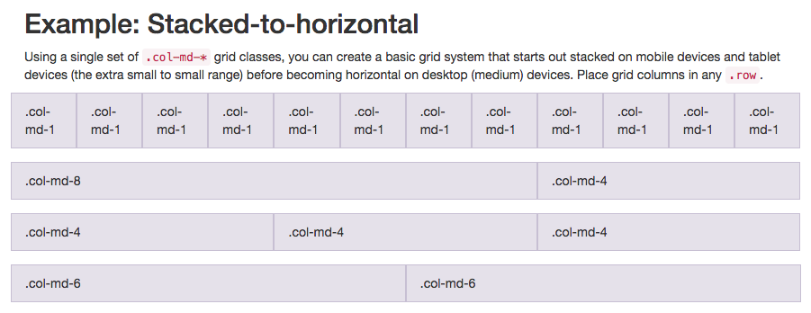

import Tabs from '@theme/Tabs';
import TabItem from '@theme/TabItem';


## Introduction aux défis Bootstrap

[Bootstrap | freeCodeCamp.org](https://www.freecodecamp.org/learn/front-end-libraries/bootstrap/)

Bootstrap est un framework frontal utilisé pour concevoir des pages Web réactives et des applications Web. Il faut une approche mobile d'abord pour le développement Web. Bootstrap comprend des styles et des classes CSS prédéfinis, ainsi que des fonctionnalités JavaScript. Bootstrap utilise une disposition de grille réactive à 12 colonnes et propose des modèles de conception pour :
- boutons
- images
- tables
- formes
- navigation

Pour en savoir plus et comment inclure Bootstrap dans vos projets, visitez [Bootstrap](https://getbootstrap.com/docs/4.1/getting-started/introduction/).<br />
Cette section présente certaines des façons d'utiliser Bootstrap dans vos projets Web.

-----


## 1. Utilisez la conception réactive avec les conteneurs fluides Bootstrap `container-fluid`

[Learn Bootstrap: Use Responsive Design with Bootstrap Fluid Containers | freeCodeCamp.org](https://www.freecodecamp.org/learn/front-end-libraries/bootstrap/use-responsive-design-with-bootstrap-fluid-containers)

:::info instructions
Dans la section HTML5 et CSS de freeCodeCamp, nous avons créé une application Cat Photo. Revenons-y maintenant. Cette fois, nous le styliserons en utilisant le populaire framework CSS réactif Bootstrap.<br />
Bootstrap déterminera la largeur de votre écran et répondra en redimensionnant vos éléments HTML - d'où le nom de *conception sensible* (*responsive design*).<br />
Avec une conception réactive, il n'est pas nécessaire de concevoir une version mobile de votre site Web. Il aura fière allure sur les appareils dotés d'écrans de n'importe quelle largeur.<br />
Vous pouvez ajouter Bootstrap à n'importe quelle application en ajoutant le code suivant en haut de votre HTML :

```html
<link rel="stylesheet" href="https://maxcdn.bootstrapcdn.com/bootstrap/3.3.7/css/bootstrap.min.css" integrity="sha384-BVYiiSIFeK1dGmJRAkycuHAHRg32OmUcww7on3RYdg4Va+PmSTsz/K68vbdEjh4u" crossorigin="anonymous"/>
```

Dans ce cas, nous l'avons déjà ajouté pour vous sur cette page dans les coulisses. Notez que l'utilisation de `>` ou `/>` pour fermer la balise `link` est acceptable.<br />
Pour commencer, nous devons imbriquer tout notre HTML (à l'exception de la balise `link` et de l'élément `style`) dans un élément `div` avec la classe `container-fluid`.
:::

:::tip missions
- Votre élément `div` doit avoir la classe `container-fluid`.
- Votre élément `div` doit avoir une balise de fermeture.
- Tous les éléments HTML après la balise de fermeture de `style` doivent être imbriqués dans `.container-fluid`.

<nav class="code-col">
<div class="code-col__item63">

```html title="html"
<link href="https://fonts.googleapis.com/css?family=Lobster" rel="stylesheet" type="text/css">
<style>
  .red-text {
    color: red;
  }
  h2 {
    font-family: Lobster, Monospace;
  }
  p {
    font-size: 16px;
    font-family: Monospace;
  }
  .thick-green-border {
    border-color: green;
    border-width: 10px;
    border-style: solid;
    border-radius: 50%;
  }
  .smaller-image {
    width: 100px;
  }
</style>
<h2 class="red-text">CatPhotoApp</h2>
<p>Click here for <a href="#">cat photos</a>.</p>
<a href="#"></a>
<p>Things cats love:</p>
<ul>
  <li>cat nip</li>
  <li>laser pointers</li>
  <li>lasagna</li>
</ul>
<p>Top 3 things cats hate:</p>
<ol>
  <li>flea treatment</li>
  <li>thunder</li>
  <li>other cats</li>
</ol>
<form action="https://freecatphotoapp.com/submit-cat-photo">
  <label><input type="radio" name="indoor-outdoor"> Indoor</label>
  <label><input type="radio" name="indoor-outdoor"> Outdoor</label>
  <label><input type="checkbox" name="personality"> Loving</label>
  <label><input type="checkbox" name="personality"> Lazy</label>
  <label><input type="checkbox" name="personality"> Crazy</label>
  <input type="text" placeholder="cat photo URL" required>
  <button type="submit">Submit</button>
</form>
```

</div>
<div class="code-col__item35-html">

<iframe width="100%" height="100%" src="HTML-Demo_embed/freeCodeCamp-Bootstrap-01a.html"></iframe>

</div></nav>

:::

<nav class="code-col">
<div class="code-col__item63">

```html title="html"
<link href="https://fonts.googleapis.com/css?family=Lobster" rel="stylesheet" type="text/css">
<style>
  .red-text {
    color: red;
  }
  h2 {
    font-family: Lobster, Monospace;
  }
  p {
    font-size: 16px;
    font-family: Monospace;
  }
  .thick-green-border {
    border-color: green;
    border-width: 10px;
    border-style: solid;
    border-radius: 50%;
  }
  .smaller-image {
    width: 100px;
  }
</style>
<div class="container-fluid">
<h2 class="red-text">CatPhotoApp</h2>
<p>Click here for <a href="#">cat photos</a>.</p>
<a href="#"></a>
<p>Things cats love:</p>
<ul>
  <li>cat nip</li>
  <li>laser pointers</li>
  <li>lasagna</li>
</ul>
<p>Top 3 things cats hate:</p>
<ol>
  <li>flea treatment</li>
  <li>thunder</li>
  <li>other cats</li>
</ol>
<form action="https://freecatphotoapp.com/submit-cat-photo">
  <label><input type="radio" name="indoor-outdoor"> Indoor</label>
  <label><input type="radio" name="indoor-outdoor"> Outdoor</label>
  <label><input type="checkbox" name="personality"> Loving</label>
  <label><input type="checkbox" name="personality"> Lazy</label>
  <label><input type="checkbox" name="personality"> Crazy</label>
  <input type="text" placeholder="cat photo URL" required>
  <button type="submit">Submit</button>
</form>
</div>
```

</div>
<div class="code-col__item35-html">

<iframe width="100%" height="100%" src="HTML-Demo_embed/freeCodeCamp-Bootstrap-01b.html"></iframe>

</div></nav>

[solutions](https://forum.freecodecamp.org/t/freecodecamp-challenge-guide-use-responsive-design-with-bootstrap-fluid-containers/18362)

-----


## 2. Rendre les images mobiles réactives `img-responsive`

[Learn Bootstrap: Make Images Mobile Responsive | freeCodeCamp.org](https://www.freecodecamp.org/learn/front-end-libraries/bootstrap/make-images-mobile-responsive)

:::info instructions
Tout d'abord, ajoutez une nouvelle image sous celle existante. Définissez son attribut `src` sur `https://bit.ly/fcc-running-cats`.<br />
Ce serait formidable si cette image pouvait être exactement la largeur de l'écran de notre téléphone.<br />
Heureusement, avec Bootstrap, tout ce que nous avons à faire est d'ajouter la classe `img-responsive` à votre image. Faites cela, et l'image doit parfaitement s'adapter à la largeur de votre page.
:::

:::tip missions
- Vous devriez avoir un total de deux images.
- Votre nouvelle image doit être en dessous de votre ancienne et avoir la classe `img-responsive`.
- Votre nouvelle image ne doit pas avoir la classe `smaller-image`.
- Votre nouvelle image doit avoir un `src` de `https://bit.ly/fcc-running-cats`.
- Votre nouvel élément `img` doit avoir un crochet d'angle de fermeture.

<nav class="code-col">
<div class="code-col__item63">

```html title="html"
<link href="https://fonts.googleapis.com/css?family=Lobster" rel="stylesheet" type="text/css">
<style>
  .red-text {
    color: red;
  }
  h2 {
    font-family: Lobster, Monospace;
  }
  p {
    font-size: 16px;
    font-family: Monospace;
  }
  .thick-green-border {
    border-color: green;
    border-width: 10px;
    border-style: solid;
    border-radius: 50%;
  }
  .smaller-image {
    width: 100px;
  }
</style>
<div class="container-fluid">
  <h2 class="red-text">CatPhotoApp</h2>
  <p>Click here for <a href="#">cat photos</a>.</p>
  <a href="#"></a>
  <p>Things cats love:</p>
  <ul>
    <li>cat nip</li>
    <li>laser pointers</li>
    <li>lasagna</li>
  </ul>
  <p>Top 3 things cats hate:</p>
  <ol>
    <li>flea treatment</li>
    <li>thunder</li>
    <li>other cats</li>
  </ol>
  <form action="https://freecatphotoapp.com/submit-cat-photo">
    <label><input type="radio" name="indoor-outdoor"> Indoor</label>
    <label><input type="radio" name="indoor-outdoor"> Outdoor</label>
    <label><input type="checkbox" name="personality"> Loving</label>
    <label><input type="checkbox" name="personality"> Lazy</label>
    <label><input type="checkbox" name="personality"> Crazy</label>
    <input type="text" placeholder="cat photo URL" required>
    <button type="submit">Submit</button>
  </form>
</div>
```

</div>
<div class="code-col__item35-html">

<iframe width="100%" height="100%" src="HTML-Demo_embed/freeCodeCamp-Bootstrap-02a.html"></iframe>

</div></nav>

:::

<nav class="code-col">
<div class="code-col__item63">

```html title="html"
<link href="https://fonts.googleapis.com/css?family=Lobster" rel="stylesheet" type="text/css">
<style>
  .red-text {
    color: red;
  }
  h2 {
    font-family: Lobster, Monospace;
  }
  p {
    font-size: 16px;
    font-family: Monospace;
  }
  .thick-green-border {
    border-color: green;
    border-width: 10px;
    border-style: solid;
    border-radius: 50%;
  }
  .smaller-image {
    width: 100px;
  }
</style>
<div class="container-fluid">
  <h2 class="red-text">CatPhotoApp</h2>
  <p>Click here for <a href="#">cat photos</a>.</p>
  <a href="#"></a><br />
    
  <p>Things cats love:</p>
  <ul>
    <li>cat nip</li>
    <li>laser pointers</li>
    <li>lasagna</li>
  </ul>
  <p>Top 3 things cats hate:</p>
  <ol>
    <li>flea treatment</li>
    <li>thunder</li>
    <li>other cats</li>
  </ol>
  <form action="https://freecatphotoapp.com/submit-cat-photo">
    <label><input type="radio" name="indoor-outdoor"> Indoor</label>
    <label><input type="radio" name="indoor-outdoor"> Outdoor</label>
    <label><input type="checkbox" name="personality"> Loving</label>
    <label><input type="checkbox" name="personality"> Lazy</label>
    <label><input type="checkbox" name="personality"> Crazy</label>
    <input type="text" placeholder="cat photo URL" required>
    <button type="submit">Submit</button>
  </form>
</div>
```

</div>
<div class="code-col__item35-html">

<iframe width="100%" height="100%" src="HTML-Demo_embed/freeCodeCamp-Bootstrap-02b.html"></iframe>

</div></nav>

[solutions](https://forum.freecodecamp.org/t/freecodecamp-challenge-guide-make-images-mobile-responsive/18232)

-----


## 3. Centrer le texte avec Bootstrap `text-center`

[Learn Bootstrap: Center Text with Bootstrap | freeCodeCamp.org](https://www.freecodecamp.org/learn/front-end-libraries/bootstrap/center-text-with-bootstrap)

:::info instructions
Maintenant que nous utilisons Bootstrap, nous pouvons centrer notre élément d'en-tête pour le rendre meilleur. Tout ce que nous avons à faire est d'ajouter la classe `text-center` à notre élément `h2`.<br />
N'oubliez pas que vous pouvez ajouter plusieurs classes au même élément en séparant chacune d'elles par un espace, comme ceci :

```html
<h2 class="red-text text-center">your text</h2>
```
:::

:::tip missions
- Votre élément `h2` doit être centré en appliquant la classe `text-center`.
- Votre élément `h2` doit toujours avoir la classe `red-text`.

<nav class="code-col">
<div class="code-col__item63">

```html title="html"
<link href="https://fonts.googleapis.com/css?family=Lobster" rel="stylesheet" type="text/css">
<style>
  .red-text {
    color: red;
  }

  h2 {
    font-family: Lobster, Monospace;
  }

  p {
    font-size: 16px;
    font-family: Monospace;
  }

  .thick-green-border {
    border-color: green;
    border-width: 10px;
    border-style: solid;
    border-radius: 50%;
  }

  .smaller-image {
    width: 100px;
  }
</style>

<div class="container-fluid">
  <h2 class="red-text">CatPhotoApp</h2>

  <p>Click here for <a href="#">cat photos</a>.</p>

  <a href="#"></a>

  
  <p>Things cats love:</p>
  <ul>
    <li>cat nip</li>
    <li>laser pointers</li>
    <li>lasagna</li>
  </ul>
  <p>Top 3 things cats hate:</p>
  <ol>
    <li>flea treatment</li>
    <li>thunder</li>
    <li>other cats</li>
  </ol>
  <form action="https://freecatphotoapp.com/submit-cat-photo">
    <label><input type="radio" name="indoor-outdoor"> Indoor</label>
    <label><input type="radio" name="indoor-outdoor"> Outdoor</label>
    <label><input type="checkbox" name="personality"> Loving</label>
    <label><input type="checkbox" name="personality"> Lazy</label>
    <label><input type="checkbox" name="personality"> Crazy</label>
    <input type="text" placeholder="cat photo URL" required>
    <button type="submit">Submit</button>
  </form>
</div>
```

</div>
<div class="code-col__item35-html">

<iframe width="100%" height="100%" src="HTML-Demo_embed/freeCodeCamp-Bootstrap-03a.html"></iframe>

</div></nav>

:::

<nav class="code-col">
<div class="code-col__item63">

```html title="html"
<link href="https://fonts.googleapis.com/css?family=Lobster" rel="stylesheet" type="text/css">
<style>
  .red-text {
    color: red;
  }

  h2 {
    font-family: Lobster, Monospace;
  }

  p {
    font-size: 16px;
    font-family: Monospace;
  }

  .thick-green-border {
    border-color: green;
    border-width: 10px;
    border-style: solid;
    border-radius: 50%;
  }

  .smaller-image {
    width: 100px;
  }
</style>

<div class="container-fluid">
  <h2 class="red-text text-center">CatPhotoApp</h2>

  <p>Click here for <a href="#">cat photos</a>.</p>

  <a href="#"></a>

  
  <p>Things cats love:</p>
  <ul>
    <li>cat nip</li>
    <li>laser pointers</li>
    <li>lasagna</li>
  </ul>
  <p>Top 3 things cats hate:</p>
  <ol>
    <li>flea treatment</li>
    <li>thunder</li>
    <li>other cats</li>
  </ol>
  <form action="https://freecatphotoapp.com/submit-cat-photo">
    <label><input type="radio" name="indoor-outdoor"> Indoor</label>
    <label><input type="radio" name="indoor-outdoor"> Outdoor</label>
    <label><input type="checkbox" name="personality"> Loving</label>
    <label><input type="checkbox" name="personality"> Lazy</label>
    <label><input type="checkbox" name="personality"> Crazy</label>
    <input type="text" placeholder="cat photo URL" required>
    <button type="submit">Submit</button>
  </form>
</div>
```

</div>
<div class="code-col__item35-html">

<iframe width="100%" height="100%" src="HTML-Demo_embed/freeCodeCamp-Bootstrap-03b.html"></iframe>

</div></nav>

[solutions](https://forum.freecodecamp.org/t/freecodecamp-challenge-guide-center-text-with-bootstrap/16771)

-----


## 4. Créer un bouton Bootstrap `btn` et `btn-default`

[Learn Bootstrap: Create a Bootstrap Button | freeCodeCamp.org](https://www.freecodecamp.org/learn/front-end-libraries/bootstrap/create-a-bootstrap-button)

:::info instructions
Bootstrap a ses propres styles pour les éléments `button`, qui sont bien meilleurs que les simples HTML.<br />
Créez un nouvel élément `button` sous votre grande photo de chaton. Donnez-lui les classes `btn` et `btn-default`, ainsi que le texte de `"Like"`.
:::

:::tip missions
- Vous devez créer un nouvel élément `button` avec le texte "Like".
- Votre nouveau bouton doit avoir deux classes : `btn` et `btn-default`.
- Tous vos éléments de bouton doivent avoir des balises de fermeture.

<nav class="code-col">
<div class="code-col__item63">

```html title="html"
<link href="https://fonts.googleapis.com/css?family=Lobster" rel="stylesheet" type="text/css">
<style>
  .red-text {
    color: red;
  }

  h2 {
    font-family: Lobster, Monospace;
  }

  p {
    font-size: 16px;
    font-family: Monospace;
  }

  .thick-green-border {
    border-color: green;
    border-width: 10px;
    border-style: solid;
    border-radius: 50%;
  }

  .smaller-image {
    width: 100px;
  }
</style>

<div class="container-fluid">
  <h2 class="red-text text-center">CatPhotoApp</h2>

  <p>Click here for <a href="#">cat photos</a>.</p>

  <a href="#"></a>

  

  <p>Things cats love:</p>
  <ul>
    <li>cat nip</li>
    <li>laser pointers</li>
    <li>lasagna</li>
  </ul>
  <p>Top 3 things cats hate:</p>
  <ol>
    <li>flea treatment</li>
    <li>thunder</li>
    <li>other cats</li>
  </ol>
  <form action="https://freecatphotoapp.com/submit-cat-photo">
    <label><input type="radio" name="indoor-outdoor"> Indoor</label>
    <label><input type="radio" name="indoor-outdoor"> Outdoor</label>
    <label><input type="checkbox" name="personality"> Loving</label>
    <label><input type="checkbox" name="personality"> Lazy</label>
    <label><input type="checkbox" name="personality"> Crazy</label>
    <input type="text" placeholder="cat photo URL" required>
    <button type="submit">Submit</button>
  </form>
</div>
```

</div>
<div class="code-col__item35-html">

<iframe width="100%" height="100%" src="HTML-Demo_embed/freeCodeCamp-Bootstrap-04a.html"></iframe>

</div></nav>

:::

<nav class="code-col">
<div class="code-col__item63">

```html title="html"
<link href="https://fonts.googleapis.com/css?family=Lobster" rel="stylesheet" type="text/css">
<style>
  .red-text {
    color: red;
  }

  h2 {
    font-family: Lobster, Monospace;
  }

  p {
    font-size: 16px;
    font-family: Monospace;
  }

  .thick-green-border {
    border-color: green;
    border-width: 10px;
    border-style: solid;
    border-radius: 50%;
  }

  .smaller-image {
    width: 100px;
  }
</style>

<div class="container-fluid">
  <h2 class="red-text text-center">CatPhotoApp</h2>

  <p>Click here for <a href="#">cat photos</a>.</p>

  <a href="#"></a>

  

  <button class="btn btn-default">Like</button>
  
  <p>Things cats love:</p>
  <ul>
    <li>cat nip</li>
    <li>laser pointers</li>
    <li>lasagna</li>
  </ul>
  <p>Top 3 things cats hate:</p>
  <ol>
    <li>flea treatment</li>
    <li>thunder</li>
    <li>other cats</li>
  </ol>
  <form action="https://freecatphotoapp.com/submit-cat-photo">
    <label><input type="radio" name="indoor-outdoor"> Indoor</label>
    <label><input type="radio" name="indoor-outdoor"> Outdoor</label>
    <label><input type="checkbox" name="personality"> Loving</label>
    <label><input type="checkbox" name="personality"> Lazy</label>
    <label><input type="checkbox" name="personality"> Crazy</label>
    <input type="text" placeholder="cat photo URL" required>
    <button type="submit">Submit</button>
  </form>
</div>
```

</div>
<div class="code-col__item35-html">

<iframe width="100%" height="100%" src="HTML-Demo_embed/freeCodeCamp-Bootstrap-04b.html"></iframe>

</div></nav>

[solutions](https://forum.freecodecamp.org/t/freecodecamp-challenge-guide-create-a-bootstrap-button/16811)

-----


## 5. Créer un élément bloc du bouton Bootstrap `btn-block`

[Learn Bootstrap: Create a Block Element Bootstrap Button | freeCodeCamp.org](https://www.freecodecamp.org/learn/front-end-libraries/bootstrap/create-a-block-element-bootstrap-button)

:::info instructions 
Normalement, vos éléments `button` avec les classes `btn` et `btn-default` sont seulement aussi larges que le texte qu'ils contiennent. Par exemple :

`<button class="btn btn-default">Submit</button>`

Ce bouton serait aussi large que le mot "Submit".

<button class="btn btn-default">Submit</button>

<br />

En leur faisant des éléments de bloc avec la classe supplémentaire de `btn-block`, votre bouton s'étendra pour remplir tout l'espace horizontal de votre page et tous les éléments qui le suivront couleront sur une "nouvelle ligne" sous le bloc.

`<button class="btn btn-default btn-block">Submit</button>`

Ce bouton occuperait 100% de la largeur disponible.

<button class="btn btn-default btn-block">Submit</button>

<br />

Notez que ces boutons nécessitent toujours la classe `btn`.<br />
Ajoutez la classe `btn-block` de Bootstrap à votre bouton Bootstrap.
:::

:::tip missions
- Votre bouton doit toujours avoir les classes `btn` et `btn-default`.
- Votre bouton doit avoir la classe `btn-block`.
- Tous vos éléments de bouton doivent avoir des balises de fermeture.

<nav class="code-col">
<div class="code-col__item63">

```html title="html"
<link href="https://fonts.googleapis.com/css?family=Lobster" rel="stylesheet" type="text/css">
<style>
	.red-text {
		color: red;
	}

	h2 {
		font-family: Lobster, Monospace;
	}

	p {
		font-size: 16px;
		font-family: Monospace;
	}

	.thick-green-border {
		border-color: green;
		border-width: 10px;
		border-style: solid;
		border-radius: 50%;
	}

	.smaller-image {
		width: 100px;
	}
</style>

<div class="container-fluid">
	<h2 class="red-text text-center">CatPhotoApp</h2>

	<p>Click here for <a href="#">cat photos</a>.</p>

	<a href="#"></a>

		
		<button class="btn btn-default">Like</button>
		<p>Things cats love:</p>
		<ul>
			<li>cat nip</li>
			<li>laser pointers</li>
			<li>lasagna</li>
		</ul>
		<p>Top 3 things cats hate:</p>
		<ol>
			<li>flea treatment</li>
			<li>thunder</li>
			<li>other cats</li>
		</ol>
		<form action="https://freecatphotoapp.com/submit-cat-photo">
			<label><input type="radio" name="indoor-outdoor"> Indoor</label>
			<label><input type="radio" name="indoor-outdoor"> Outdoor</label>
			<label><input type="checkbox" name="personality"> Loving</label>
			<label><input type="checkbox" name="personality"> Lazy</label>
			<label><input type="checkbox" name="personality"> Crazy</label>
			<input type="text" placeholder="cat photo URL" required>
			<button type="submit">Submit</button>
		</form>
</div>
```

</div>
<div class="code-col__item35-html">

<iframe width="100%" height="100%" src="HTML-Demo_embed/freeCodeCamp-Bootstrap-05a.html"></iframe>

</div></nav>

:::

<nav class="code-col">
<div class="code-col__item63">

```html title="html"
<link href="https://fonts.googleapis.com/css?family=Lobster" rel="stylesheet" type="text/css">
<style>
	.red-text {
		color: red;
	}

	h2 {
		font-family: Lobster, Monospace;
	}

	p {
		font-size: 16px;
		font-family: Monospace;
	}

	.thick-green-border {
		border-color: green;
		border-width: 10px;
		border-style: solid;
		border-radius: 50%;
	}

	.smaller-image {
		width: 100px;
	}
</style>

<div class="container-fluid">
	<h2 class="red-text text-center">CatPhotoApp</h2>

	<p>Click here for <a href="#">cat photos</a>.</p>

	<a href="#"></a>

		
		<button class="btn btn-default btn-block">Like</button>
		<p>Things cats love:</p>
		<ul>
			<li>cat nip</li>
			<li>laser pointers</li>
			<li>lasagna</li>
		</ul>
		<p>Top 3 things cats hate:</p>
		<ol>
			<li>flea treatment</li>
			<li>thunder</li>
			<li>other cats</li>
		</ol>
		<form action="https://freecatphotoapp.com/submit-cat-photo">
			<label><input type="radio" name="indoor-outdoor"> Indoor</label>
			<label><input type="radio" name="indoor-outdoor"> Outdoor</label>
			<label><input type="checkbox" name="personality"> Loving</label>
			<label><input type="checkbox" name="personality"> Lazy</label>
			<label><input type="checkbox" name="personality"> Crazy</label>
			<input type="text" placeholder="cat photo URL" required>
			<button type="submit">Submit</button>
		</form>
</div>
```

</div>
<div class="code-col__item35-html">

<iframe width="100%" height="100%" src="HTML-Demo_embed/freeCodeCamp-Bootstrap-05b.html"></iframe>

</div></nav>

[solutions](https://forum.freecodecamp.org/t/freecodecamp-challenge-guide-create-a-block-element-bootstrap-button/16810)

-----


## 6. Testez le bouton Bootstrap aux couleurs arc-en-ciel `btn-primary`

[Learn Bootstrap: Taste the Bootstrap Button Color Rainbow | freeCodeCamp.org](https://www.freecodecamp.org/learn/front-end-libraries/bootstrap/taste-the-bootstrap-button-color-rainbow)

:::info instructions
La classe `btn-primary` est la couleur principale que vous utiliserez dans votre application. Il est utile pour mettre en évidence les actions que vous souhaitez que votre utilisateur effectue.<br />
Remplacez la classe `btn-default` de Bootstrap par `btn-primary` dans votre bouton.<br />
Notez que ce bouton aura toujours besoin des classes `btn` et `btn-block`.
:::

:::tip missions
- Votre bouton doit avoir la classe `btn-primary`.
- Votre bouton doit toujours avoir les classes `btn` et `btn-block`.
- Tous vos éléments de bouton doivent avoir des balises de fermeture.

<nav class="code-col">
<div class="code-col__item63">

```html title="html"
<link href="https://fonts.googleapis.com/css?family=Lobster" rel="stylesheet" type="text/css">
<style>
  .red-text {
    color: red;
  }

  h2 {
    font-family: Lobster, Monospace;
  }

  p {
    font-size: 16px;
    font-family: Monospace;
  }

  .thick-green-border {
    border-color: green;
    border-width: 10px;
    border-style: solid;
    border-radius: 50%;
  }

  .smaller-image {
    width: 100px;
  }
</style>

<div class="container-fluid">
  <h2 class="red-text text-center">CatPhotoApp</h2>

  <p>Click here for <a href="#">cat photos</a>.</p>

  <a href="#"></a>

  
  <button class="btn btn-default btn-block">Like</button>
  <p>Things cats love:</p>
  <ul>
    <li>cat nip</li>
    <li>laser pointers</li>
    <li>lasagna</li>
  </ul>
  <p>Top 3 things cats hate:</p>
  <ol>
    <li>flea treatment</li>
    <li>thunder</li>
    <li>other cats</li>
  </ol>
  <form action="https://freecatphotoapp.com/submit-cat-photo">
    <label><input type="radio" name="indoor-outdoor"> Indoor</label>
    <label><input type="radio" name="indoor-outdoor"> Outdoor</label>
    <label><input type="checkbox" name="personality"> Loving</label>
    <label><input type="checkbox" name="personality"> Lazy</label>
    <label><input type="checkbox" name="personality"> Crazy</label>
    <input type="text" placeholder="cat photo URL" required>
    <button type="submit">Submit</button>
  </form>
</div>
```

</div>
<div class="code-col__item35-html">

<iframe width="100%" height="100%" src="HTML-Demo_embed/freeCodeCamp-Bootstrap-06a.html"></iframe>

</div></nav>

:::

<nav class="code-col">
<div class="code-col__item63">

```html title="html"
<link href="https://fonts.googleapis.com/css?family=Lobster" rel="stylesheet" type="text/css">
<style>
  .red-text {
    color: red;
  }

  h2 {
    font-family: Lobster, Monospace;
  }

  p {
    font-size: 16px;
    font-family: Monospace;
  }

  .thick-green-border {
    border-color: green;
    border-width: 10px;
    border-style: solid;
    border-radius: 50%;
  }

  .smaller-image {
    width: 100px;
  }
</style>

<div class="container-fluid">
  <h2 class="red-text text-center">CatPhotoApp</h2>

  <p>Click here for <a href="#">cat photos</a>.</p>

  <a href="#"></a>

  
  <button class="btn btn-primary btn-block">Like</button>
  <p>Things cats love:</p>
  <ul>
    <li>cat nip</li>
    <li>laser pointers</li>
    <li>lasagna</li>
  </ul>
  <p>Top 3 things cats hate:</p>
  <ol>
    <li>flea treatment</li>
    <li>thunder</li>
    <li>other cats</li>
  </ol>
  <form action="https://freecatphotoapp.com/submit-cat-photo">
    <label><input type="radio" name="indoor-outdoor"> Indoor</label>
    <label><input type="radio" name="indoor-outdoor"> Outdoor</label>
    <label><input type="checkbox" name="personality"> Loving</label>
    <label><input type="checkbox" name="personality"> Lazy</label>
    <label><input type="checkbox" name="personality"> Crazy</label>
    <input type="text" placeholder="cat photo URL" required>
    <button type="submit">Submit</button>
  </form>
</div>
```

</div>
<div class="code-col__item35-html">

<iframe width="100%" height="100%" src="HTML-Demo_embed/freeCodeCamp-Bootstrap-06b.html"></iframe>

</div></nav>

[solutions](https://forum.freecodecamp.org/t/freecodecamp-challenge-guide-taste-the-bootstrap-button-color-rainbow/18323)

-----


## 7. Appelez les actions optionnelles avec `btn-info`

[Learn Bootstrap: Call out Optional Actions with btn-info | freeCodeCamp.org](https://www.freecodecamp.org/learn/front-end-libraries/bootstrap/call-out-optional-actions-with-btn-info)

:::info instructions
Bootstrap est livré avec plusieurs couleurs prédéfinies pour les boutons. La classe `btn-info` est utilisée pour attirer l'attention sur les actions facultatives que l'utilisateur peut entreprendre.<br />
Créez un nouveau bouton Bootstrap au niveau du bloc sous votre bouton "Like" avec le texte "Info" et ajoutez-y les classes `btn-info` et `btn-block` de Bootstrap.<br />
Notez que ces boutons ont toujours besoin des classes `btn` et `btn-block`.
:::

:::tip missions
- Vous devez créer un nouvel élément de bouton avec le texte "Info".
- Vos deux boutons Bootstrap doivent avoir les classes `btn` et `btn-block`.
- Votre nouveau bouton doit avoir la classe `btn-info`.
- Tous vos éléments de bouton doivent avoir des balises de fermeture.

<nav class="code-col">
<div class="code-col__item63">

```html title="html"
<link href="https://fonts.googleapis.com/css?family=Lobster" rel="stylesheet" type="text/css">
<style>
  .red-text {
    color: red;
  }

  h2 {
    font-family: Lobster, Monospace;
  }

  p {
    font-size: 16px;
    font-family: Monospace;
  }

  .thick-green-border {
    border-color: green;
    border-width: 10px;
    border-style: solid;
    border-radius: 50%;
  }

  .smaller-image {
    width: 100px;
  }
</style>

<div class="container-fluid">
  <h2 class="red-text text-center">CatPhotoApp</h2>

  <p>Click here for <a href="#">cat photos</a>.</p>

  <a href="#"></a>

  
  <button class="btn btn-block btn-primary">Like</button>
  <p>Things cats love:</p>
  <ul>
    <li>cat nip</li>
    <li>laser pointers</li>
    <li>lasagna</li>
  </ul>
  <p>Top 3 things cats hate:</p>
  <ol>
    <li>flea treatment</li>
    <li>thunder</li>
    <li>other cats</li>
  </ol>
  <form action="https://freecatphotoapp.com/submit-cat-photo">
    <label><input type="radio" name="indoor-outdoor"> Indoor</label>
    <label><input type="radio" name="indoor-outdoor"> Outdoor</label>
    <label><input type="checkbox" name="personality"> Loving</label>
    <label><input type="checkbox" name="personality"> Lazy</label>
    <label><input type="checkbox" name="personality"> Crazy</label>
    <input type="text" placeholder="cat photo URL" required>
    <button type="submit">Submit</button>
  </form>
</div>
```

</div>
<div class="code-col__item35-html">

<iframe width="100%" height="100%" src="HTML-Demo_embed/freeCodeCamp-Bootstrap-07a.html"></iframe>

</div></nav>

:::

<nav class="code-col">
<div class="code-col__item63">

```html title="html"
<link href="https://fonts.googleapis.com/css?family=Lobster" rel="stylesheet" type="text/css">
<style>
  .red-text {
    color: red;
  }

  h2 {
    font-family: Lobster, Monospace;
  }

  p {
    font-size: 16px;
    font-family: Monospace;
  }

  .thick-green-border {
    border-color: green;
    border-width: 10px;
    border-style: solid;
    border-radius: 50%;
  }

  .smaller-image {
    width: 100px;
  }
</style>

<div class="container-fluid">
  <h2 class="red-text text-center">CatPhotoApp</h2>

  <p>Click here for <a href="#">cat photos</a>.</p>

  <a href="#"></a>

  
  <button class="btn btn-block btn-primary">Like</button>
  <button class="btn btn-block btn-info">Info</button>
  <p>Things cats love:</p>
  <ul>
    <li>cat nip</li>
    <li>laser pointers</li>
    <li>lasagna</li>
  </ul>
  <p>Top 3 things cats hate:</p>
  <ol>
    <li>flea treatment</li>
    <li>thunder</li>
    <li>other cats</li>
  </ol>
  <form action="https://freecatphotoapp.com/submit-cat-photo">
    <label><input type="radio" name="indoor-outdoor"> Indoor</label>
    <label><input type="radio" name="indoor-outdoor"> Outdoor</label>
    <label><input type="checkbox" name="personality"> Loving</label>
    <label><input type="checkbox" name="personality"> Lazy</label>
    <label><input type="checkbox" name="personality"> Crazy</label>
    <input type="text" placeholder="cat photo URL" required>
    <button type="submit">Submit</button>
  </form>
</div>
```

</div>
<div class="code-col__item35-html">

<iframe width="100%" height="100%" src="HTML-Demo_embed/freeCodeCamp-Bootstrap-07b.html"></iframe>

</div></nav>

[solutions](https://forum.freecodecamp.org/t/freecodecamp-challenge-guide-call-out-optional-actions-with-btn-info/16770)

-----


## 8. Avertissez vos utilisateurs d'une action dangereuse avec `btn-danger`

[Learn Bootstrap: Warn Your Users of a Dangerous Action with btn-danger | freeCodeCamp.org](https://www.freecodecamp.org/learn/front-end-libraries/bootstrap/warn-your-users-of-a-dangerous-action-with-btn-danger)

:::info instructions
Bootstrap est livré avec plusieurs couleurs prédéfinies pour les boutons. La classe `btn-danger` est la couleur du bouton que vous utiliserez pour informer les utilisateurs que le bouton effectue une action destructrice, telle que la suppression d'une photo de chat.<br />
Créez un bouton avec le texte "Delete" et attribuez-lui la classe `btn-danger`.<br />
Notez que ces boutons ont toujours besoin des classes `btn` et `btn-block`.
:::

:::tip missions
- Vous devez créer un nouvel élément de bouton avec le texte "Delete".
- Tous vos boutons Bootstrap doivent avoir les classes `btn` et `btn-block`.
- Votre nouveau bouton doit avoir la classe `btn-danger`.
- Tous vos éléments de bouton doivent avoir des balises de fermeture.

<nav class="code-col">
<div class="code-col__item63">

```html title="html"
<link href="https://fonts.googleapis.com/css?family=Lobster" rel="stylesheet" type="text/css">
<style>
  .red-text {
    color: red;
  }

  h2 {
    font-family: Lobster, Monospace;
  }

  p {
    font-size: 16px;
    font-family: Monospace;
  }

  .thick-green-border {
    border-color: green;
    border-width: 10px;
    border-style: solid;
    border-radius: 50%;
  }

  .smaller-image {
    width: 100px;
  }
</style>

<div class="container-fluid">
  <h2 class="red-text text-center">CatPhotoApp</h2>

  <p>Click here for <a href="#">cat photos</a>.</p>

  <a href="#"></a>

  
  <button class="btn btn-block btn-primary">Like</button>
  <button class="btn btn-block btn-info">Info</button>
  <p>Things cats love:</p>
  <ul>
    <li>cat nip</li>
    <li>laser pointers</li>
    <li>lasagna</li>
  </ul>
  <p>Top 3 things cats hate:</p>
  <ol>
    <li>flea treatment</li>
    <li>thunder</li>
    <li>other cats</li>
  </ol>
  <form action="https://freecatphotoapp.com/submit-cat-photo">
    <label><input type="radio" name="indoor-outdoor"> Indoor</label>
    <label><input type="radio" name="indoor-outdoor"> Outdoor</label>
    <label><input type="checkbox" name="personality"> Loving</label>
    <label><input type="checkbox" name="personality"> Lazy</label>
    <label><input type="checkbox" name="personality"> Crazy</label>
    <input type="text" placeholder="cat photo URL" required>
    <button type="submit">Submit</button>
  </form>
</div>
```

</div>
<div class="code-col__item35-html">

<iframe width="100%" height="100%" src="HTML-Demo_embed/freeCodeCamp-Bootstrap-08a.html"></iframe>

</div></nav>

:::

<nav class="code-col">
<div class="code-col__item63">

```html title="html"
<link href="https://fonts.googleapis.com/css?family=Lobster" rel="stylesheet" type="text/css">
<style>
  .red-text {
    color: red;
  }

  h2 {
    font-family: Lobster, Monospace;
  }

  p {
    font-size: 16px;
    font-family: Monospace;
  }

  .thick-green-border {
    border-color: green;
    border-width: 10px;
    border-style: solid;
    border-radius: 50%;
  }

  .smaller-image {
    width: 100px;
  }
</style>

<div class="container-fluid">
  <h2 class="red-text text-center">CatPhotoApp</h2>

  <p>Click here for <a href="#">cat photos</a>.</p>

  <a href="#"></a>

  
  <button class="btn btn-block btn-primary">Like</button>
  <button class="btn btn-block btn-info">Info</button>
  <button class="btn btn-block btn-danger">Delete</button>
  <p>Things cats love:</p>
  <ul>
    <li>cat nip</li>
    <li>laser pointers</li>
    <li>lasagna</li>
  </ul>
  <p>Top 3 things cats hate:</p>
  <ol>
    <li>flea treatment</li>
    <li>thunder</li>
    <li>other cats</li>
  </ol>
  <form action="https://freecatphotoapp.com/submit-cat-photo">
    <label><input type="radio" name="indoor-outdoor"> Indoor</label>
    <label><input type="radio" name="indoor-outdoor"> Outdoor</label>
    <label><input type="checkbox" name="personality"> Loving</label>
    <label><input type="checkbox" name="personality"> Lazy</label>
    <label><input type="checkbox" name="personality"> Crazy</label>
    <input type="text" placeholder="cat photo URL" required>
    <button type="submit">Submit</button>
  </form>
</div>
```

</div>
<div class="code-col__item35-html">

<iframe width="100%" height="100%" src="HTML-Demo_embed/freeCodeCamp-Bootstrap-08b.html"></iframe>

</div></nav>

[solutions](https://forum.freecodecamp.org/t/freecodecamp-challenge-guide-warn-your-users-of-a-dangerous-action-with-btn-danger/18375)

-----


## 9. Utilisez `grid` de Bootstrap pour mettre les éléments côte à côte

[Learn Bootstrap: Use the Bootstrap Grid to Put Elements Side By Side | freeCodeCamp.org](https://www.freecodecamp.org/learn/front-end-libraries/bootstrap/use-the-bootstrap-grid-to-put-elements-side-by-side)

Bootstrap utilise un système de grille réactif à 12 colonnes, ce qui facilite la mise en ligne des éléments et la spécification de la largeur relative de chaque élément. La plupart des classes de Bootstrap peuvent être appliquées à un élément `div`.<br />
Bootstrap a différents attributs de largeur de colonne qu'il utilise en fonction de la largeur de l'écran de l'utilisateur. Par exemple, les téléphones ont des écrans étroits et les ordinateurs portables ont des écrans plus larges.<br />
Prenons par exemple la classe `col-md-*` de Bootstrap. Ici, `md` signifie moyen, et `*` est un nombre spécifiant le nombre de colonnes de largeur de l'élément. Dans ce cas, la largeur de colonne d'un élément sur un écran de taille moyenne, tel qu'un ordinateur portable, est spécifiée.

:::info instructions
Dans l'application Cat Photo que nous construisons, nous utiliserons `col-xs-*`, où `xs` signifie très petit (comme un très petit écran de téléphone portable), et `*` est le nombre de colonnes spécifiant le nombre de colonnes de large élément devrait être.<br />
Placez les boutons `Like`, `Info` et `Delete` côte à côte en les imbriquant tous les trois dans un élément `<div class="row">`, puis chacun d'eux dans un élément `<div class="col-xs-4">`.<br />
La classe `row` est appliquée à un `div` et les boutons eux-mêmes peuvent y être imbriqués.
:::

:::tip missions
- Vos boutons doivent tous être imbriqués dans le même élément `div` avec la classe `row`.
- Chacun de vos boutons Bootstrap doit être imbriqué dans son propre élément `div` avec la classe `col-xs-4`.
- Chacun de vos éléments de bouton doit avoir une balise de fermeture.
- Chacun de vos éléments `div` doit avoir une balise de fermeture.

<nav class="code-col">
<div class="code-col__item63">

```html title="html"
<link href="https://fonts.googleapis.com/css?family=Lobster" rel="stylesheet" type="text/css">
<style>
  .red-text {
    color: red;
  }

  h2 {
    font-family: Lobster, Monospace;
  }

  p {
    font-size: 16px;
    font-family: Monospace;
  }

  .thick-green-border {
    border-color: green;
    border-width: 10px;
    border-style: solid;
    border-radius: 50%;
  }

  .smaller-image {
    width: 100px;
  }
</style>

<div class="container-fluid">
  <h2 class="red-text text-center">CatPhotoApp</h2>

  <p>Click here for <a href="#">cat photos</a>.</p>

  <a href="#"></a>

  
  <button class="btn btn-block btn-primary">Like</button>
  <button class="btn btn-block btn-info">Info</button>
  <button class="btn btn-block btn-danger">Delete</button>
  <p>Things cats love:</p>
  <ul>
    <li>cat nip</li>
    <li>laser pointers</li>
    <li>lasagna</li>
  </ul>
  <p>Top 3 things cats hate:</p>
  <ol>
    <li>flea treatment</li>
    <li>thunder</li>
    <li>other cats</li>
  </ol>
  <form action="https://freecatphotoapp.com/submit-cat-photo">
    <label><input type="radio" name="indoor-outdoor"> Indoor</label>
    <label><input type="radio" name="indoor-outdoor"> Outdoor</label>
    <label><input type="checkbox" name="personality"> Loving</label>
    <label><input type="checkbox" name="personality"> Lazy</label>
    <label><input type="checkbox" name="personality"> Crazy</label>
    <input type="text" placeholder="cat photo URL" required>
    <button type="submit">Submit</button>
  </form>
</div>
```

</div>
<div class="code-col__item35-html">

<iframe width="100%" height="100%" src="HTML-Demo_embed/freeCodeCamp-Bootstrap-09a.html"></iframe>

</div></nav>

:::

<nav class="code-col">
<div class="code-col__item63">

```html title="html"
<link href="https://fonts.googleapis.com/css?family=Lobster" rel="stylesheet" type="text/css">
<style>
  .red-text {
    color: red;
  }

  h2 {
    font-family: Lobster, Monospace;
  }

  p {
    font-size: 16px;
    font-family: Monospace;
  }

  .thick-green-border {
    border-color: green;
    border-width: 10px;
    border-style: solid;
    border-radius: 50%;
  }

  .smaller-image {
    width: 100px;
  }
</style>

<div class="container-fluid">
  <h2 class="red-text text-center">CatPhotoApp</h2>

  <p>Click here for <a href="#">cat photos</a>.</p>

  <a href="#"></a>

  
  <div class="row">
    <div class="col-xs-4">
      <button class="btn btn-block btn-primary">Like</button>
    </div>
    <div class="col-xs-4">
      <button class="btn btn-block btn-info">Info</button>
    </div>
    <div class="col-xs-4">
      <button class="btn btn-block btn-danger">Delete</button>
    </div>
  </div>
  <p>Things cats love:</p>
  <ul>
    <li>cat nip</li>
    <li>laser pointers</li>
    <li>lasagna</li>
  </ul>
  <p>Top 3 things cats hate:</p>
  <ol>
    <li>flea treatment</li>
    <li>thunder</li>
    <li>other cats</li>
  </ol>
  <form action="https://freecatphotoapp.com/submit-cat-photo">
    <label><input type="radio" name="indoor-outdoor"> Indoor</label>
    <label><input type="radio" name="indoor-outdoor"> Outdoor</label>
    <label><input type="checkbox" name="personality"> Loving</label>
    <label><input type="checkbox" name="personality"> Lazy</label>
    <label><input type="checkbox" name="personality"> Crazy</label>
    <input type="text" placeholder="cat photo URL" required>
    <button type="submit">Submit</button>
  </form>
</div>
```

</div>
<div class="code-col__item35-html">

<iframe width="100%" height="100%" src="HTML-Demo_embed/freeCodeCamp-Bootstrap-09b.html"></iframe>

</div></nav>

[solutions](https://forum.freecodecamp.org/t/freecodecamp-challenge-guide-use-the-bootstrap-grid-to-put-elements-side-by-side/18371)

:::note guide : Utilisez `grid` de Bootstrap pour mettre les éléments côte à côte
### Explication du problème
Bootstrap utilise un système de grille réactif qui facilite la mise en ligne des éléments et indique la largeur relative de chaque élément.



Notez que dans cette illustration, la classe `col-md-_` est utilisée. Ici, `md` signifie moyen, et `_` est un nombre spécifiant le nombre de colonnes de largeur de l'élément. Dans ce cas, la largeur de colonne d'un élément sur un écran de taille moyenne, tel qu'un ordinateur portable, est spécifiée.
:::
-----


## 10. Se débarrasser du CSS personnalisé pour Bootstrap

[Learn Bootstrap: Ditch Custom CSS for Bootstrap | freeCodeCamp.org](https://www.freecodecamp.org/learn/front-end-libraries/bootstrap/ditch-custom-css-for-bootstrap)

Nous pouvons nettoyer notre code et rendre notre application Cat Photo plus conventionnelle en utilisant les styles intégrés de Bootstrap au lieu des styles personnalisés que nous avons créés précédemment.<br />
Ne vous inquiétez pas, nous aurons beaucoup de temps pour personnaliser notre CSS plus tard.

:::info instructions
Supprimez les déclarations CSS `.red-text`, `p` et `.smaller-image` de votre élément de style afin que les seules déclarations restantes dans votre élément de style soient `h2` et `thick-green-border`.<br />
Supprimez ensuite l'élément `p` qui contient un lien mort. Supprimez ensuite la classe `red-text` de votre élément `h2` et remplacez-la par la classe Bootstrap `text-primary`.<br />
Enfin, supprimez la classe "smaller-image" de votre premier élément `img` et remplacez-la par la classe `img-responsive`.
:::

:::tip missions
- Votre élément `h2` ne devrait plus avoir la classe `red-text`.
- Votre élément `h2` devrait maintenant avoir la classe `text-primary`.
- Vos éléments de paragraphe ne doivent plus utiliser la police `Monospace`.
- La classe `smaller-image` doit être supprimée de votre image du haut.
- Vous devez ajouter la classe `img-responsive` à votre image du haut.

<nav class="code-col">
<div class="code-col__item63">

```html title="html"
<link href="https://fonts.googleapis.com/css?family=Lobster" rel="stylesheet" type="text/css">
<style>
  .red-text {
    color: red;
  }

  h2 {
    font-family: Lobster, Monospace;
  }

  p {
    font-size: 16px;
    font-family: Monospace;
  }

  .thick-green-border {
    border-color: green;
    border-width: 10px;
    border-style: solid;
    border-radius: 50%;
  }

  .smaller-image {
    width: 100px;
  }
</style>

<div class="container-fluid">
  <h2 class="red-text text-center">CatPhotoApp</h2>

  <p>Click here for <a href="#">cat photos</a>.</p>

  <a href="#"></a>

  
  <div class="row">
    <div class="col-xs-4">
      <button class="btn btn-block btn-primary">Like</button>
    </div>
    <div class="col-xs-4">
      <button class="btn btn-block btn-info">Info</button>
    </div>
    <div class="col-xs-4">
      <button class="btn btn-block btn-danger">Delete</button>
    </div>
  </div>
  <p>Things cats love:</p>
  <ul>
    <li>cat nip</li>
    <li>laser pointers</li>
    <li>lasagna</li>
  </ul>
  <p>Top 3 things cats hate:</p>
  <ol>
    <li>flea treatment</li>
    <li>thunder</li>
    <li>other cats</li>
  </ol>
  <form action="https://freecatphotoapp.com/submit-cat-photo">
    <label><input type="radio" name="indoor-outdoor"> Indoor</label>
    <label><input type="radio" name="indoor-outdoor"> Outdoor</label>
    <label><input type="checkbox" name="personality"> Loving</label>
    <label><input type="checkbox" name="personality"> Lazy</label>
    <label><input type="checkbox" name="personality"> Crazy</label>
    <input type="text" placeholder="cat photo URL" required>
    <button type="submit">Submit</button>
  </form>
</div>
```

</div>
<div class="code-col__item35-html">

<iframe width="100%" height="100%" src="HTML-Demo_embed/freeCodeCamp-Bootstrap-10a.html"></iframe>

</div></nav>

:::

<nav class="code-col">
<div class="code-col__item63">

```html title="html"
<link href="https://fonts.googleapis.com/css?family=Lobster" rel="stylesheet" type="text/css">
<style>
  h2 {
    font-family: Lobster, Monospace;
  }

  .thick-green-border {
    border-color: green;
    border-width: 10px;
    border-style: solid;
    border-radius: 50%;
  }
</style>

<div class="container-fluid">
  <h2 class="text-center text-primary">CatPhotoApp</h2>
  <a href="#"></a>

  
  <div class="row">
    <div class="col-xs-4">
      <button class="btn btn-block btn-primary">Like</button>
    </div>
    <div class="col-xs-4">
      <button class="btn btn-block btn-info">Info</button>
    </div>
    <div class="col-xs-4">
      <button class="btn btn-block btn-danger">Delete</button>
    </div>
  </div>
  <p>Things cats love:</p>
  <ul>
    <li>cat nip</li>
    <li>laser pointers</li>
    <li>lasagna</li>
  </ul>
  <p>Top 3 things cats hate:</p>
  <ol>
    <li>flea treatment</li>
    <li>thunder</li>
    <li>other cats</li>
  </ol>
  <form action="https://freecatphotoapp.com/submit-cat-photo">
    <label><input type="radio" name="indoor-outdoor"> Indoor</label>
    <label><input type="radio" name="indoor-outdoor"> Outdoor</label>
    <label><input type="checkbox" name="personality"> Loving</label>
    <label><input type="checkbox" name="personality"> Lazy</label>
    <label><input type="checkbox" name="personality"> Crazy</label>
    <input type="text" placeholder="cat photo URL" required>
    <button type="submit">Submit</button>
  </form>
</div>
```

</div>
<div class="code-col__item35-html">

<iframe width="100%" height="100%" src="HTML-Demo_embed/freeCodeCamp-Bootstrap-10b.html"></iframe>

</div></nav>

[solutions](https://forum.freecodecamp.org/t/freecodecamp-challenge-guide-ditch-custom-css-for-bootstrap/17565)

-----


## 11. Utiliser `span` pour cibler les éléments en ligne

[Learn Bootstrap: Use a span to Target Inline Elements | freeCodeCamp.org](https://www.freecodecamp.org/learn/front-end-libraries/bootstrap/use-a-span-to-target-inline-elements)

:::info instructions
Vous pouvez utiliser `span` pour créer des éléments en ligne. Vous vous souvenez quand nous avons utilisé la classe `btn-block` pour que le bouton remplisse toute la ligne ?<br />

<button class="btn btn-11">normal button</button><br />

<br />

<button class="btn btn-block btn-11">btn-block button</button><br />
Cela illustre la différence entre un élément "inline" et un élément "block".<br />
En utilisant l'élément `span` en ligne, vous pouvez placer plusieurs éléments sur la même ligne et même styliser différemment différentes parties de la même ligne.
:::

:::tip missions
- Imbriquez le mot "love" dans votre élément "Things cats love" ci-dessous dans un élément `span`. Donnez ensuite `span` la classe `text-danger` pour rendre le texte rouge.
- Voici comment procéder avec l'élément "Top 3 things cats hate" :

```html
<p>Top 3 things cats <span class="text-danger">hate:</span></p>
```

<nav class="code-col">
<div class="code-col__item63">

```html title="html"
<link href="https://fonts.googleapis.com/css?family=Lobster" rel="stylesheet" type="text/css">
<style>

  h2 {
    font-family: Lobster, Monospace;
  }

  .thick-green-border {
    border-color: green;
    border-width: 10px;
    border-style: solid;
    border-radius: 50%;
  }

</style>

<div class="container-fluid">
  <h2 class="text-primary text-center">CatPhotoApp</h2>

  <a href="#"></a>

  
  <div class="row">
    <div class="col-xs-4">
      <button class="btn btn-block btn-primary">Like</button>
    </div>
    <div class="col-xs-4">
      <button class="btn btn-block btn-info">Info</button>
    </div>
    <div class="col-xs-4">
      <button class="btn btn-block btn-danger">Delete</button>
    </div>
  </div>
  <p>Things cats love:</p>
  <ul>
    <li>cat nip</li>
    <li>laser pointers</li>
    <li>lasagna</li>
  </ul>
  <p>Top 3 things cats hate:</p>
  <ol>
    <li>flea treatment</li>
    <li>thunder</li>
    <li>other cats</li>
  </ol>
  <form action="https://freecatphotoapp.com/submit-cat-photo">
    <label><input type="radio" name="indoor-outdoor"> Indoor</label>
    <label><input type="radio" name="indoor-outdoor"> Outdoor</label>
    <label><input type="checkbox" name="personality"> Loving</label>
    <label><input type="checkbox" name="personality"> Lazy</label>
    <label><input type="checkbox" name="personality"> Crazy</label>
    <input type="text" placeholder="cat photo URL" required>
    <button type="submit">Submit</button>
  </form>
</div>
```

</div>
<div class="code-col__item35-html">

<iframe width="100%" height="100%" src="HTML-Demo_embed/freeCodeCamp-Bootstrap-11a.html"></iframe>

</div></nav>

:::

<nav class="code-col">
<div class="code-col__item63">

```html title="html"
<link href="https://fonts.googleapis.com/css?family=Lobster" rel="stylesheet" type="text/css">
<style>

  h2 {
    font-family: Lobster, Monospace;
  }

  .thick-green-border {
    border-color: green;
    border-width: 10px;
    border-style: solid;
    border-radius: 50%;
  }

</style>

<div class="container-fluid">
  <h2 class="text-primary text-center">CatPhotoApp</h2>

  <a href="#"></a>

  
  <div class="row">
    <div class="col-xs-4">
      <button class="btn btn-block btn-primary">Like</button>
    </div>
    <div class="col-xs-4">
      <button class="btn btn-block btn-info">Info</button>
    </div>
    <div class="col-xs-4">
      <button class="btn btn-block btn-danger">Delete</button>
    </div>
  </div>
  <p>Things cats <span class="text-danger">love</span>:</p>
  <ul>
    <li>cat nip</li>
    <li>laser pointers</li>
    <li>lasagna</li>
  </ul>
  <p>Top 3 things cats hate:</p>
  <ol>
    <li>flea treatment</li>
    <li>thunder</li>
    <li>other cats</li>
  </ol>
  <form action="https://freecatphotoapp.com/submit-cat-photo">
    <label><input type="radio" name="indoor-outdoor"> Indoor</label>
    <label><input type="radio" name="indoor-outdoor"> Outdoor</label>
    <label><input type="checkbox" name="personality"> Loving</label>
    <label><input type="checkbox" name="personality"> Lazy</label>
    <label><input type="checkbox" name="personality"> Crazy</label>
    <input type="text" placeholder="cat photo URL" required>
    <button type="submit">Submit</button>
  </form>
</div>
```

</div>
<div class="code-col__item35-html">

<iframe width="100%" height="100%" src="HTML-Demo_embed/freeCodeCamp-Bootstrap-11b.html"></iframe>

</div></nav>

[solutions](https://forum.freecodecamp.org/t/freecodecamp-challenge-guide-use-a-span-to-target-inline-elements/18370)

-----


## 12. Créer un en-tête personnalisé

[Learn Bootstrap: Create a Custom Heading | freeCodeCamp.org](https://www.freecodecamp.org/learn/front-end-libraries/bootstrap/create-a-custom-heading)


Nous créerons un en-tête simple pour notre application de photo de chat en mettant le titre et l'image de chat relaxante dans la même rangée.<br />
N'oubliez pas que Bootstrap utilise un système de grille réactif, ce qui facilite la mise en ligne des éléments et la spécification de la largeur relative de chaque élément. La plupart des classes de Bootstrap peuvent être appliquées à un élément `div`.

:::info instructions
Imbriquez votre première image et votre élément `h2` dans un seul élément `<div class="row">`. Imbriquez votre élément `h2` dans une classe `<div class="col-xs-8">` et votre image dans une classe `<div class="col-xs-4">` afin qu'ils soient sur la même ligne.<br />
Remarquez comment l'image a maintenant juste la bonne taille pour s'adapter au texte ?
:::

:::tip missions
- Votre élément `h2` et l'élément `img` supérieur doivent tous deux être imbriqués ensemble dans un élément `div` avec la classe `row`.
- Votre élément `img` supérieur doit être imbriqué dans un `div` avec la classe `col-xs-4`.
- Votre élément `h2` doit être imbriqué dans un `div` avec la classe `col-xs-8`.
- Tous vos éléments `div` doivent avoir des balises de fermeture.

<nav class="code-col">
<div class="code-col__item63">

```html title="html"
<link href="https://fonts.googleapis.com/css?family=Lobster" rel="stylesheet" type="text/css">

<style>
  h2 {
    font-family: Lobster, Monospace;
  }

  .thick-green-border {
    border-color: green;
    border-width: 10px;
    border-style: solid;
    border-radius: 50%;
  }
</style>

<div class="container-fluid">
  <h2 class="text-primary text-center">CatPhotoApp</h2>

  <a href="#"></a>

  
  <div class="row">
    <div class="col-xs-4">
      <button class="btn btn-block btn-primary">Like</button>
    </div>
    <div class="col-xs-4">
      <button class="btn btn-block btn-info">Info</button>
    </div>
    <div class="col-xs-4">
      <button class="btn btn-block btn-danger">Delete</button>
    </div>
  </div>
  <p>Things cats <span class="text-danger">love:</span></p>
  <ul>
    <li>cat nip</li>
    <li>laser pointers</li>
    <li>lasagna</li>
  </ul>
  <p>Top 3 things cats hate:</p>
  <ol>
    <li>flea treatment</li>
    <li>thunder</li>
    <li>other cats</li>
  </ol>
  <form action="https://freecatphotoapp.com/submit-cat-photo">
    <label><input type="radio" name="indoor-outdoor"> Indoor</label>
    <label><input type="radio" name="indoor-outdoor"> Outdoor</label>
    <label><input type="checkbox" name="personality"> Loving</label>
    <label><input type="checkbox" name="personality"> Lazy</label>
    <label><input type="checkbox" name="personality"> Crazy</label>
    <input type="text" placeholder="cat photo URL" required>
    <button type="submit">Submit</button>
  </form>
</div>
```

</div>
<div class="code-col__item35-html">

<iframe width="100%" height="100%" src="HTML-Demo_embed/freeCodeCamp-Bootstrap-12a.html"></iframe>

</div></nav>

:::

<nav class="code-col">
<div class="code-col__item63">

```html title="html"
<link href="https://fonts.googleapis.com/css?family=Lobster" rel="stylesheet" type="text/css">

<style>
  h2 {
    font-family: Lobster, Monospace;
  }

  .thick-green-border {
    border-color: green;
    border-width: 10px;
    border-style: solid;
    border-radius: 50%;
  }
</style>

<div class="container-fluid">
  <div class="row">
    <div class="col-xs-8">
      <h2 class="text-primary text-center">CatPhotoApp</h2>
    </div>
    <div class="col-xs-4">
      <a href="#"></a>
    </div>
  </div>

  
  <div class="row">
    <div class="col-xs-4">
      <button class="btn btn-block btn-primary">Like</button>
    </div>
    <div class="col-xs-4">
      <button class="btn btn-block btn-info">Info</button>
    </div>
    <div class="col-xs-4">
      <button class="btn btn-block btn-danger">Delete</button>
    </div>
  </div>
  <p>Things cats <span class="text-danger">love:</span></p>
  <ul>
    <li>cat nip</li>
    <li>laser pointers</li>
    <li>lasagna</li>
  </ul>
  <p>Top 3 things cats hate:</p>
  <ol>
    <li>flea treatment</li>
    <li>thunder</li>
    <li>other cats</li>
  </ol>
  <form action="https://freecatphotoapp.com/submit-cat-photo">
    <label><input type="radio" name="indoor-outdoor"> Indoor</label>
    <label><input type="radio" name="indoor-outdoor"> Outdoor</label>
    <label><input type="checkbox" name="personality"> Loving</label>
    <label><input type="checkbox" name="personality"> Lazy</label>
    <label><input type="checkbox" name="personality"> Crazy</label>
    <input type="text" placeholder="cat photo URL" required>
    <button type="submit">Submit</button>
  </form>
</div>
```

</div>
<div class="code-col__item35-html">

<iframe width="100%" height="100%" src="HTML-Demo_embed/freeCodeCamp-Bootstrap-12b.html"></iframe>

</div></nav>

[solutions](https://forum.freecodecamp.org/t/freecodecamp-challenge-guide-create-a-custom-heading/16816)


-----


## 13. Ajouter des icônes de polices géniales à nos boutons

[Learn Bootstrap: Add Font Awesome Icons to our Buttons | freeCodeCamp.org](https://www.freecodecamp.org/learn/front-end-libraries/bootstrap/add-font-awesome-icons-to-our-buttons)

Font Awesome est une bibliothèque pratique d'icônes. Ces icônes peuvent être des polices Web ou des graphiques vectoriels. Ces icônes sont traitées comme des polices. Vous pouvez spécifier leur taille en utilisant des pixels, et ils prendront la taille de police de leurs éléments HTML parents.<br />
Vous pouvez inclure Font Awesome dans n'importe quelle application en ajoutant le code suivant en haut de votre code HTML :

```html
<link rel="stylesheet" href="https://use.fontawesome.com/releases/v5.8.1/css/all.css" integrity="sha384-50oBUHEmvpQ+1lW4y57PTFmhCaXp0ML5d60M1M7uH2+nqUivzIebhndOJK28anvf" crossorigin="anonymous">
```
Dans ce cas, nous l'avons déjà ajouté pour vous sur cette page dans les coulisses.<br />
L'élément `i` était à l'origine utilisé pour rendre d'autres éléments en italique, mais il est maintenant couramment utilisé pour les icônes. Vous pouvez ajouter les classes Font Awesome à l'élément `i` pour le transformer en icône, par exemple :

```html
`<i class="fas fa-info-circle"></i>`
```
Notez que l'élément `span` est également acceptable pour une utilisation avec des icônes.

:::info instructions
Utilisez Font Awesome pour ajouter une icône `thumbs-up` (pouce levé) à votre bouton `like` en lui donnant un élément `i` avec les classes `fas` et `fa-thumbs-up`. Assurez-vous de conserver le texte "like" à côté de l'icône.
:::

:::tip missions
- Vous devez ajouter un élément `i` avec les classes `fas` et `fa-thumbs-up`.
- Votre icône `fa-thumbs-up` doit être située dans le bouton "Like".
- Votre élément `i` doit être imbriqué dans votre élément `button`.
- Votre élément d'icône doit avoir une balise de fermeture.

<nav class="code-col">
<div class="code-col__item63">

```html title="html"
<link href="https://fonts.googleapis.com/css?family=Lobster" rel="stylesheet" type="text/css">
<style>
  h2 {
    font-family: Lobster, Monospace;
  }

  .thick-green-border {
    border-color: green;
    border-width: 10px;
    border-style: solid;
    border-radius: 50%;
  }
</style>

<div class="container-fluid">
  <div class="row">
    <div class="col-xs-8">
      <h2 class="text-primary text-center">CatPhotoApp</h2>
    </div>
    <div class="col-xs-4">
      <a href="#"></a>
    </div>
  </div>
  
  <div class="row">
    <div class="col-xs-4">
      <button class="btn btn-block btn-primary">Like</button>
    </div>
    <div class="col-xs-4">
      <button class="btn btn-block btn-info">Info</button>
    </div>
    <div class="col-xs-4">
      <button class="btn btn-block btn-danger">Delete</button>
    </div>
  </div>
  <p>Things cats <span class="text-danger">love:</span></p>
  <ul>
    <li>cat nip</li>
    <li>laser pointers</li>
    <li>lasagna</li>
  </ul>
  <p>Top 3 things cats hate:</p>
  <ol>
    <li>flea treatment</li>
    <li>thunder</li>
    <li>other cats</li>
  </ol>
  <form action="https://freecatphotoapp.com/submit-cat-photo">
    <label><input type="radio" name="indoor-outdoor"> Indoor</label>
    <label><input type="radio" name="indoor-outdoor"> Outdoor</label>
    <label><input type="checkbox" name="personality"> Loving</label>
    <label><input type="checkbox" name="personality"> Lazy</label>
    <label><input type="checkbox" name="personality"> Crazy</label>
    <input type="text" placeholder="cat photo URL" required>
    <button type="submit">Submit</button>
  </form>
</div>
```

</div>
<div class="code-col__item35-html">

<iframe width="100%" height="100%" src="HTML-Demo_embed/freeCodeCamp-Bootstrap-13a.html"></iframe>

</div></nav>

:::

<nav class="code-col">
<div class="code-col__item63">

```html title="html"
<link href="https://fonts.googleapis.com/css?family=Lobster" rel="stylesheet" type="text/css">
<style>
  h2 {
    font-family: Lobster, Monospace;
  }

  .thick-green-border {
    border-color: green;
    border-width: 10px;
    border-style: solid;
    border-radius: 50%;
  }
</style>

<div class="container-fluid">
  <div class="row">
    <div class="col-xs-8">
      <h2 class="text-primary text-center">CatPhotoApp</h2>
    </div>
    <div class="col-xs-4">
      <a href="#"></a>
    </div>
  </div>
  
  <div class="row">
    <div class="col-xs-4">
      <button class="btn btn-block btn-primary"><i class="fas fa-thumbs-up"></i> Like</button>
    </div>
    <div class="col-xs-4">
      <button class="btn btn-block btn-info">Info</button>
    </div>
    <div class="col-xs-4">
      <button class="btn btn-block btn-danger">Delete</button>
    </div>
  </div>
  <p>Things cats <span class="text-danger">love:</span></p>
  <ul>
    <li>cat nip</li>
    <li>laser pointers</li>
    <li>lasagna</li>
  </ul>
  <p>Top 3 things cats hate:</p>
  <ol>
    <li>flea treatment</li>
    <li>thunder</li>
    <li>other cats</li>
  </ol>
  <form action="https://freecatphotoapp.com/submit-cat-photo">
    <label><input type="radio" name="indoor-outdoor"> Indoor</label>
    <label><input type="radio" name="indoor-outdoor"> Outdoor</label>
    <label><input type="checkbox" name="personality"> Loving</label>
    <label><input type="checkbox" name="personality"> Lazy</label>
    <label><input type="checkbox" name="personality"> Crazy</label>
    <input type="text" placeholder="cat photo URL" required>
    <button type="submit">Submit</button>
  </form>
</div>
```

</div>
<div class="code-col__item35-html">

<iframe width="100%" height="100%" src="HTML-Demo_embed/freeCodeCamp-Bootstrap-13b.html"></iframe>

</div></nav>

[solutions](https://forum.freecodecamp.org/t/freecodecamp-challenge-guide-add-font-awesome-icons-to-our-buttons/16638)

-----


## 14. Ajoutez des icônes de polices géniales à tous nos boutons

[Learn Bootstrap: Add Font Awesome Icons to all of our Buttons | freeCodeCamp.org](https://www.freecodecamp.org/learn/front-end-libraries/bootstrap/add-font-awesome-icons-to-all-of-our-buttons)

Font Awesome est une bibliothèque d'icônes pratique. Ces icônes peuvent être des polices Web ou des graphiques vectoriels. Ces icônes sont traitées comme des polices. Vous pouvez spécifier leur taille en utilisant des pixels, et ils prendront la taille de police de leurs éléments HTML parents.

:::info instructions
Utilisez Font Awesome pour ajouter une icône `info-circle` à votre bouton d'informations et une icône `trash` à votre bouton de suppression.<br />
**Remarque :** L'élément `span` est une alternative acceptable à l'élément `i` pour les directions ci-dessous.
:::

:::tip missions
- Vous devez ajouter `<i class="fas fa-info-circle"></i>` dans votre élément de bouton d'information.
- Vous devez ajouter `<i class="fas fa-trash"></i>` dans votre élément de bouton de suppression.
- Chacun de vos éléments `i` doit avoir une balise de fermeture et `<i class="fas fa-thumbs-up"></i>` est dans votre élément de bouton like.

<nav class="code-col">
<div class="code-col__item63">

```html title="html"
<link href="https://fonts.googleapis.com/css?family=Lobster" rel="stylesheet" type="text/css">
<style>
  h2 {
    font-family: Lobster, Monospace;
  }

  .thick-green-border {
    border-color: green;
    border-width: 10px;
    border-style: solid;
    border-radius: 50%;
  }
</style>

<div class="container-fluid">
  <div class="row">
    <div class="col-xs-8">
      <h2 class="text-primary text-center">CatPhotoApp</h2>
    </div>
    <div class="col-xs-4">
      <a href="#"></a>
    </div>
  </div>
  
  <div class="row">
    <div class="col-xs-4">
      <button class="btn btn-block btn-primary"><i class="fas fa-thumbs-up"></i> Like</button>
    </div>
    <div class="col-xs-4">
      <button class="btn btn-block btn-info">Info</button>
    </div>
    <div class="col-xs-4">
      <button class="btn btn-block btn-danger">Delete</button>
    </div>
  </div>
  <p>Things cats <span class="text-danger">love:</span></p>
  <ul>
    <li>cat nip</li>
    <li>laser pointers</li>
    <li>lasagna</li>
  </ul>
  <p>Top 3 things cats hate:</p>
  <ol>
    <li>flea treatment</li>
    <li>thunder</li>
    <li>other cats</li>
  </ol>
  <form action="https://freecatphotoapp.com/submit-cat-photo">
    <label><input type="radio" name="indoor-outdoor"> Indoor</label>
    <label><input type="radio" name="indoor-outdoor"> Outdoor</label>
    <label><input type="checkbox" name="personality"> Loving</label>
    <label><input type="checkbox" name="personality"> Lazy</label>
    <label><input type="checkbox" name="personality"> Crazy</label>
    <input type="text" placeholder="cat photo URL" required>
    <button type="submit">Submit</button>
  </form>
</div>
```

</div>
<div class="code-col__item35-html">

<iframe width="100%" height="100%" src="HTML-Demo_embed/freeCodeCamp-Bootstrap-14a.html"></iframe>

</div></nav>

:::

<nav class="code-col">
<div class="code-col__item63">

```html title="html"
<link href="https://fonts.googleapis.com/css?family=Lobster" rel="stylesheet" type="text/css">
<style>
  h2 {
    font-family: Lobster, Monospace;
  }

  .thick-green-border {
    border-color: green;
    border-width: 10px;
    border-style: solid;
    border-radius: 50%;
  }
</style>

<div class="container-fluid">
  <div class="row">
    <div class="col-xs-8">
      <h2 class="text-primary text-center">CatPhotoApp</h2>
    </div>
    <div class="col-xs-4">
      <a href="#"></a>
    </div>
  </div>
  
  <div class="row">
    <div class="col-xs-4">
      <button class="btn btn-block btn-primary"><i class="fas fa-thumbs-up"></i> Like</button>
    </div>
    <div class="col-xs-4">
      <button class="btn btn-block btn-info"><i class="fas fa-info-circle"></i> Info</button>
    </div>
    <div class="col-xs-4">
      <button class="btn btn-block btn-danger"><i class="fas fa-trash"></i> Delete</button>
    </div>
  </div>
  <p>Things cats <span class="text-danger">love:</span></p>
  <ul>
    <li>cat nip</li>
    <li>laser pointers</li>
    <li>lasagna</li>
  </ul>
  <p>Top 3 things cats hate:</p>
  <ol>
    <li>flea treatment</li>
    <li>thunder</li>
    <li>other cats</li>
  </ol>
  <form action="https://freecatphotoapp.com/submit-cat-photo">
    <label><input type="radio" name="indoor-outdoor"> Indoor</label>
    <label><input type="radio" name="indoor-outdoor"> Outdoor</label>
    <label><input type="checkbox" name="personality"> Loving</label>
    <label><input type="checkbox" name="personality"> Lazy</label>
    <label><input type="checkbox" name="personality"> Crazy</label>
    <input type="text" placeholder="cat photo URL" required>
    <button type="submit">Submit</button>
  </form>
</div>
```

</div>
<div class="code-col__item35-html">

<iframe width="100%" height="100%" src="HTML-Demo_embed/freeCodeCamp-Bootstrap-14b.html"></iframe>

</div></nav>

[solutions](https://forum.freecodecamp.org/t/freecodecamp-challenge-guide-add-font-awesome-icons-to-all-of-our-buttons/16637)

:::note guide : Ajoutez des icônes de polices géniales à tous nos boutons
### Explication du problème

Utilisez Font Awesome pour ajouter une icône `info-circle` à votre bouton d'informations et une icône `trash` à votre bouton de suppression.

#### Liens pertinents

- [Font Awesome](https://fontawesome.com/)
- [Different between Font Awesome v4 and v5](https://fontawesome.com/how-to-use/on-the-web/setup/upgrading-from-version-4)
- [Logos and the relevant CSS classes for the logos](https://fontawesome.com/icons?d=gallery)
:::

-----


## 15. Boutons radio de style réactif

[Learn Bootstrap: Responsively Style Radio Buttons | freeCodeCamp.org](https://www.freecodecamp.org/learn/front-end-libraries/bootstrap/responsively-style-radio-buttons)

Vous pouvez également utiliser les classes `col-xs-*` de Bootstrap sur les éléments `form` ! De cette façon, nos boutons radio seront répartis uniformément sur la page, quelle que soit la largeur de la résolution de l'écran.

:::info instructions
Imbriquez vos deux boutons radio dans un élément `<div class="row">`. Ensuite, imbriquez chacun d'eux dans un élément `<div class="col-xs-6">`.<br />
**Remarque :** Pour rappel, les boutons radio sont des éléments `input` de type `radio`.
:::

:::tip missions
- Tous vos boutons radio doivent être imbriqués dans un `div` avec la classe `row`.
- Chacun de vos boutons radio doit être imbriqué dans son propre `div` avec la classe `col-xs-6`.
- Tous vos éléments `div` doivent avoir des balises de fermeture.

<nav class="code-col">
<div class="code-col__item63">

```html title="html"
<link href="https://fonts.googleapis.com/css?family=Lobster" rel="stylesheet" type="text/css">
<style>
  h2 {
    font-family: Lobster, Monospace;
  }

  .thick-green-border {
    border-color: green;
    border-width: 10px;
    border-style: solid;
    border-radius: 50%;
  }
</style>

<div class="container-fluid">
  <div class="row">
    <div class="col-xs-8">
      <h2 class="text-primary text-center">CatPhotoApp</h2>
    </div>
    <div class="col-xs-4">
      <a href="#"></a>
    </div>
  </div>
  
  <div class="row">
    <div class="col-xs-4">
      <button class="btn btn-block btn-primary"><i class="fa fa-thumbs-up"></i> Like</button>
    </div>
    <div class="col-xs-4">
      <button class="btn btn-block btn-info"><i class="fa fa-info-circle"></i> Info</button>
    </div>
    <div class="col-xs-4">
      <button class="btn btn-block btn-danger"><i class="fa fa-trash"></i> Delete</button>
    </div>
  </div>
  <p>Things cats <span class="text-danger">love:</span></p>
  <ul>
    <li>cat nip</li>
    <li>laser pointers</li>
    <li>lasagna</li>
  </ul>
  <p>Top 3 things cats hate:</p>
  <ol>
    <li>flea treatment</li>
    <li>thunder</li>
    <li>other cats</li>
  </ol>
  <form action="https://freecatphotoapp.com/submit-cat-photo">
    <label><input type="radio" name="indoor-outdoor"> Indoor</label>
    <label><input type="radio" name="indoor-outdoor"> Outdoor</label>
    <label><input type="checkbox" name="personality"> Loving</label>
    <label><input type="checkbox" name="personality"> Lazy</label>
    <label><input type="checkbox" name="personality"> Crazy</label>
    <input type="text" placeholder="cat photo URL" required>
    <button type="submit">Submit</button>
  </form>
</div>
```

</div>
<div class="code-col__item35-html">

<iframe width="100%" height="100%" src="HTML-Demo_embed/freeCodeCamp-Bootstrap-15a.html"></iframe>

</div></nav>

:::

<nav class="code-col">
<div class="code-col__item63">

```html title="html"
<link href="https://fonts.googleapis.com/css?family=Lobster" rel="stylesheet" type="text/css">
<style>
  h2 {
    font-family: Lobster, Monospace;
  }

  .thick-green-border {
    border-color: green;
    border-width: 10px;
    border-style: solid;
    border-radius: 50%;
  }
</style>

<div class="container-fluid">
  <div class="row">
    <div class="col-xs-8">
      <h2 class="text-primary text-center">CatPhotoApp</h2>
    </div>
    <div class="col-xs-4">
      <a href="#"></a>
    </div>
  </div>
  
  <div class="row">
    <div class="col-xs-4">
      <button class="btn btn-block btn-primary"><i class="fa fa-thumbs-up"></i> Like</button>
    </div>
    <div class="col-xs-4">
      <button class="btn btn-block btn-info"><i class="fa fa-info-circle"></i> Info</button>
    </div>
    <div class="col-xs-4">
      <button class="btn btn-block btn-danger"><i class="fa fa-trash"></i> Delete</button>
    </div>
  </div>
  <p>Things cats <span class="text-danger">love:</span></p>
  <ul>
    <li>cat nip</li>
    <li>laser pointers</li>
    <li>lasagna</li>
  </ul>
  <p>Top 3 things cats hate:</p>
  <ol>
    <li>flea treatment</li>
    <li>thunder</li>
    <li>other cats</li>
  </ol>
  <form action="https://freecatphotoapp.com/submit-cat-photo">
    <div class="row">
      <div class="col-xs-6">
        <label><input type="radio" name="indoor-outdoor"> Indoor</label>
      </div>
      <div class="col-xs-6">
        <label><input type="radio" name="indoor-outdoor"> Outdoor</label>
      </div>
    </div>
    <label><input type="checkbox" name="personality"> Loving</label>
    <label><input type="checkbox" name="personality"> Lazy</label>
    <label><input type="checkbox" name="personality"> Crazy</label>
    <input type="text" placeholder="cat photo URL" required>
    <button type="submit">Submit</button>
  </form>
</div>
```

</div>
<div class="code-col__item35-html">

<iframe width="100%" height="100%" src="HTML-Demo_embed/freeCodeCamp-Bootstrap-15b.html"></iframe>

</div></nav>

[solutions](https://forum.freecodecamp.org/t/freecodecamp-challenge-guide-responsively-style-radio-buttons/18270)

-----


## 16. Cases à cocher de style réactif

[Learn Bootstrap: Responsively Style Checkboxes | freeCodeCamp.org](https://www.freecodecamp.org/learn/front-end-libraries/bootstrap/responsively-style-checkboxes)

Puisque les classes `col-xs-*` de Bootstrap sont applicables à tous les éléments `form`, vous pouvez également les utiliser sur vos cases à cocher ! De cette façon, les cases à cocher seront réparties uniformément sur la page, quelle que soit la largeur de la résolution de l'écran.

:::info instructions
Imbriquez vos trois cases à cocher dans un élément `<div class="row">`. Ensuite, imbriquez chacun d'eux dans un élément `<div class="col-xs-4">`.
:::

:::tip missions
- Toutes vos cases à cocher doivent être imbriquées dans un `div` avec la classe `row`.
- Chacune de vos cases à cocher doit être imbriquée dans son propre `div` avec la classe `col-xs-4`.
- Tous vos éléments `div` doivent avoir des balises de fermeture.

<nav class="code-col">
<div class="code-col__item63">

```html title="html"
<link href="https://fonts.googleapis.com/css?family=Lobster" rel="stylesheet" type="text/css">
<style>
  h2 {
    font-family: Lobster, Monospace;
  }

  .thick-green-border {
    border-color: green;
    border-width: 10px;
    border-style: solid;
    border-radius: 50%;
  }

</style>

<div class="container-fluid">
  <div class="row">
    <div class="col-xs-8">
      <h2 class="text-primary text-center">CatPhotoApp</h2>
    </div>
    <div class="col-xs-4">
      <a href="#"></a>
    </div>
  </div>
  
  <div class="row">
    <div class="col-xs-4">
      <button class="btn btn-block btn-primary"><i class="fa fa-thumbs-up"></i> Like</button>
    </div>
    <div class="col-xs-4">
      <button class="btn btn-block btn-info"><i class="fa fa-info-circle"></i> Info</button>
    </div>
    <div class="col-xs-4">
      <button class="btn btn-block btn-danger"><i class="fa fa-trash"></i> Delete</button>
    </div>
  </div>
  <p>Things cats <span class="text-danger">love:</span></p>
  <ul>
    <li>cat nip</li>
    <li>laser pointers</li>
    <li>lasagna</li>
  </ul>
  <p>Top 3 things cats hate:</p>
  <ol>
    <li>flea treatment</li>
    <li>thunder</li>
    <li>other cats</li>
  </ol>
  <form action="https://freecatphotoapp.com/submit-cat-photo">
    <div class="row">
      <div class="col-xs-6">
        <label><input type="radio" name="indoor-outdoor"> Indoor</label>
      </div>
      <div class="col-xs-6">
        <label><input type="radio" name="indoor-outdoor"> Outdoor</label>
      </div>
    </div>
    <label><input type="checkbox" name="personality"> Loving</label>
    <label><input type="checkbox" name="personality"> Lazy</label>
    <label><input type="checkbox" name="personality"> Crazy</label>
    <input type="text" placeholder="cat photo URL" required>
    <button type="submit">Submit</button>
  </form>
</div>
```

</div>
<div class="code-col__item35-html">

<iframe width="100%" height="100%" src="HTML-Demo_embed/freeCodeCamp-Bootstrap-16a.html"></iframe>

</div></nav>

:::

<nav class="code-col">
<div class="code-col__item63">

```html title="html"
<link href="https://fonts.googleapis.com/css?family=Lobster" rel="stylesheet" type="text/css">
<style>
  h2 {
    font-family: Lobster, Monospace;
  }

  .thick-green-border {
    border-color: green;
    border-width: 10px;
    border-style: solid;
    border-radius: 50%;
  }

</style>

<div class="container-fluid">
  <div class="row">
    <div class="col-xs-8">
      <h2 class="text-primary text-center">CatPhotoApp</h2>
    </div>
    <div class="col-xs-4">
      <a href="#"></a>
    </div>
  </div>
  
  <div class="row">
    <div class="col-xs-4">
      <button class="btn btn-block btn-primary"><i class="fa fa-thumbs-up"></i> Like</button>
    </div>
    <div class="col-xs-4">
      <button class="btn btn-block btn-info"><i class="fa fa-info-circle"></i> Info</button>
    </div>
    <div class="col-xs-4">
      <button class="btn btn-block btn-danger"><i class="fa fa-trash"></i> Delete</button>
    </div>
  </div>
  <p>Things cats <span class="text-danger">love:</span></p>
  <ul>
    <li>cat nip</li>
    <li>laser pointers</li>
    <li>lasagna</li>
  </ul>
  <p>Top 3 things cats hate:</p>
  <ol>
    <li>flea treatment</li>
    <li>thunder</li>
    <li>other cats</li>
  </ol>
  <form action="https://freecatphotoapp.com/submit-cat-photo">
    <div class="row">
      <div class="col-xs-6">
        <label><input type="radio" name="indoor-outdoor"> Indoor</label>
      </div>
      <div class="col-xs-6">
        <label><input type="radio" name="indoor-outdoor"> Outdoor</label>
      </div>
    </div>
    <div class="row">
      <div class="col-xs-4">
        <label><input type="checkbox" name="personality"> Loving</label>
      </div>
      <div class="col-xs-4">
        <label><input type="checkbox" name="personality"> Lazy</label>
      </div>
      <div class="col-xs-4">
        <label><input type="checkbox" name="personality"> Crazy</label>
      </div>
    </div>

    <input type="text" placeholder="cat photo URL" required>
    <button type="submit">Submit</button>
  </form>
</div>
```

</div>
<div class="code-col__item35-html">

<iframe width="100%" height="100%" src="HTML-Demo_embed/freeCodeCamp-Bootstrap-16b.html"></iframe>

</div></nav>

[solutions](https://forum.freecodecamp.org/t/freecodecamp-challenge-guide-responsively-style-checkboxes/18269)

-----


## 17. Style des entrées texte comme contrôles de formulaire

[Learn Bootstrap: Style Text Inputs as Form Controls | freeCodeCamp.org](https://www.freecodecamp.org/learn/front-end-libraries/bootstrap/style-text-inputs-as-form-controls)

Vous pouvez ajouter l'icône Font Awesome `fa-paper-plane` en ajoutant `<i class="fa fa-paper-plane"></i>` dans votre élément `button` d'envoi.

:::info instructions
Donnez au champ de saisie de texte de votre formulaire une classe `form-control`. Donnez au bouton d'envoi de votre formulaire les classes `btn btn-primary`. Donnez également à ce bouton l'icône Font Awesome de `fa-paper-plane`.<br />
Tous les éléments texte `<input>`, `<textarea>`, and `<select>` avec la classe `.form-control` ont une largeur de 100%.
:::

:::tip missions
- Le bouton d'envoi de votre formulaire doit avoir les classes `btn btn-primary`.
- Vous devez ajouter un `<i class="fa fa-paper-plane"></i>` dans votre élément `button` d'envoi.
- Le texte `input` dans votre formulaire doit avoir la classe `form-control`.
- Chacun de vos éléments `i` doit avoir une balise de fermeture.

<nav class="code-col">
<div class="code-col__item63">

```html title="html"
<link href="https://fonts.googleapis.com/css?family=Lobster" rel="stylesheet" type="text/css">
<style>
  h2 {
    font-family: Lobster, Monospace;
  }

  .thick-green-border {
    border-color: green;
    border-width: 10px;
    border-style: solid;
    border-radius: 50%;
  }

</style>

<div class="container-fluid">
  <div class="row">
    <div class="col-xs-8">
      <h2 class="text-primary text-center">CatPhotoApp</h2>
    </div>
    <div class="col-xs-4">
      <a href="#"></a>
    </div>
  </div>
  
  <div class="row">
    <div class="col-xs-4">
      <button class="btn btn-block btn-primary"><i class="fa fa-thumbs-up"></i> Like</button>
    </div>
    <div class="col-xs-4">
      <button class="btn btn-block btn-info"><i class="fa fa-info-circle"></i> Info</button>
    </div>
    <div class="col-xs-4">
      <button class="btn btn-block btn-danger"><i class="fa fa-trash"></i> Delete</button>
    </div>
  </div>
  <p>Things cats <span class="text-danger">love:</span></p>
  <ul>
    <li>cat nip</li>
    <li>laser pointers</li>
    <li>lasagna</li>
  </ul>
  <p>Top 3 things cats hate:</p>
  <ol>
    <li>flea treatment</li>
    <li>thunder</li>
    <li>other cats</li>
  </ol>
  <form action="https://freecatphotoapp.com/submit-cat-photo">
    <div class="row">
      <div class="col-xs-6">
        <label><input type="radio" name="indoor-outdoor"> Indoor</label>
      </div>
      <div class="col-xs-6">
        <label><input type="radio" name="indoor-outdoor"> Outdoor</label>
      </div>
    </div>
    <div class="row">
      <div class="col-xs-4">
        <label><input type="checkbox" name="personality"> Loving</label>
      </div>
      <div class="col-xs-4">
        <label><input type="checkbox" name="personality"> Lazy</label>
      </div>
      <div class="col-xs-4">
        <label><input type="checkbox" name="personality"> Crazy</label>
      </div>
    </div>
    <input type="text" placeholder="cat photo URL" required>
    <button type="submit">Submit</button>
  </form>
</div>
```

</div>
<div class="code-col__item35-html">

<iframe width="100%" height="100%" src="HTML-Demo_embed/freeCodeCamp-Bootstrap-17a.html"></iframe>

</div></nav>

:::

<nav class="code-col">
<div class="code-col__item63">

```html title="html"
<link href="https://fonts.googleapis.com/css?family=Lobster" rel="stylesheet" type="text/css">
<style>
  h2 {
    font-family: Lobster, Monospace;
  }

  .thick-green-border {
    border-color: green;
    border-width: 10px;
    border-style: solid;
    border-radius: 50%;
  }

</style>

<div class="container-fluid">
  <div class="row">
    <div class="col-xs-8">
      <h2 class="text-primary text-center">CatPhotoApp</h2>
    </div>
    <div class="col-xs-4">
      <a href="#"></a>
    </div>
  </div>
  
  <div class="row">
    <div class="col-xs-4">
      <button class="btn btn-block btn-primary"><i class="fa fa-thumbs-up"></i> Like</button>
    </div>
    <div class="col-xs-4">
      <button class="btn btn-block btn-info"><i class="fa fa-info-circle"></i> Info</button>
    </div>
    <div class="col-xs-4">
      <button class="btn btn-block btn-danger"><i class="fa fa-trash"></i> Delete</button>
    </div>
  </div>
  <p>Things cats <span class="text-danger">love:</span></p>
  <ul>
    <li>cat nip</li>
    <li>laser pointers</li>
    <li>lasagna</li>
  </ul>
  <p>Top 3 things cats hate:</p>
  <ol>
    <li>flea treatment</li>
    <li>thunder</li>
    <li>other cats</li>
  </ol>
  <form action="https://freecatphotoapp.com/submit-cat-photo">
    <div class="row">
      <div class="col-xs-6">
        <label><input type="radio" name="indoor-outdoor"> Indoor</label>
      </div>
      <div class="col-xs-6">
        <label><input type="radio" name="indoor-outdoor"> Outdoor</label>
      </div>
    </div>
    <div class="row">
      <div class="col-xs-4">
        <label><input type="checkbox" name="personality"> Loving</label>
      </div>
      <div class="col-xs-4">
        <label><input type="checkbox" name="personality"> Lazy</label>
      </div>
      <div class="col-xs-4">
        <label><input type="checkbox" name="personality"> Crazy</label>
      </div>
    </div>
    <input class="form-control" type="text" placeholder="cat photo URL" required>

    <button class="btn btn-primary" type="submit"><i class="fa fa-paper-plane"></i> Submit</button>
  </form>
</div>
```

</div>
<div class="code-col__item35-html">

<iframe width="100%" height="100%" src="HTML-Demo_embed/freeCodeCamp-Bootstrap-17b.html"></iframe>

</div></nav>

[solutions](https://forum.freecodecamp.org/t/freecodecamp-challenge-guide-style-text-inputs-as-form-controls/18312)

-----


-----


## 18. Alignez les éléments de formulaire de manière réactive avec Bootstrap

[Learn Bootstrap: Line up Form Elements Responsively with Bootstrap | freeCodeCamp.org](https://www.freecodecamp.org/learn/front-end-libraries/bootstrap/line-up-form-elements-responsively-with-bootstrap)

:::info instructions
Maintenant, mettons votre `input` de formulaire et votre `button` de soumission sur la même ligne. Nous ferons cela de la même manière que nous l'avons fait précédemment : en utilisant un élément `div` avec la classe `row`, et d'autres éléments `div` à l'intérieur en utilisant la classe `col-xs-*`.<br />
Imbriquez le texte de `input` et le `button` d'envoi de votre formulaire dans un `div` avec la classe `row`. Imbriquez le texte de `input` de votre formulaire dans un `div` avec la classe `col-xs-7`. Imbriquez le `button` d'envoi de votre formulaire dans un `div` avec la classe `col-xs-5`.<br />
C'est le dernier défi que nous ferons pour notre application Cat Photo pour l'instant. Nous espérons que vous avez aimé apprendre Font Awesome, Bootstrap et la conception réactive !
:::

:::tip missions
- Votre bouton de soumission de formulaire et votre saisie de texte doivent être imbriqués dans un `div` avec une classe `row`.
- Votre saisie de texte de formulaire doit être imbriquée dans un `div` avec la classe `col-xs-7`.
- Votre bouton de soumission de formulaire doit être imbriqué dans un `div` avec la classe `col-xs-5`.
- Tous vos éléments `div` doivent avoir des balises de fermeture.

<nav class="code-col">
<div class="code-col__item63">

```html title="html"
<link href="https://fonts.googleapis.com/css?family=Lobster" rel="stylesheet" type="text/css">
<style>
  h2 {
    font-family: Lobster, Monospace;
  }

  .thick-green-border {
    border-color: green;
    border-width: 10px;
    border-style: solid;
    border-radius: 50%;
  }

</style>

<div class="container-fluid">
  <div class="row">
    <div class="col-xs-8">
      <h2 class="text-primary text-center">CatPhotoApp</h2>
    </div>
    <div class="col-xs-4">
      <a href="#"></a>
    </div>
  </div>
  
  <div class="row">
    <div class="col-xs-4">
      <button class="btn btn-block btn-primary"><i class="fa fa-thumbs-up"></i> Like</button>
    </div>
    <div class="col-xs-4">
      <button class="btn btn-block btn-info"><i class="fa fa-info-circle"></i> Info</button>
    </div>
    <div class="col-xs-4">
      <button class="btn btn-block btn-danger"><i class="fa fa-trash"></i> Delete</button>
    </div>
  </div>
  <p>Things cats <span class="text-danger">love:</span></p>
  <ul>
    <li>cat nip</li>
    <li>laser pointers</li>
    <li>lasagna</li>
  </ul>
  <p>Top 3 things cats hate:</p>
  <ol>
    <li>flea treatment</li>
    <li>thunder</li>
    <li>other cats</li>
  </ol>
  <form action="https://freecatphotoapp.com/submit-cat-photo">
    <div class="row">
      <div class="col-xs-6">
        <label><input type="radio" name="indoor-outdoor"> Indoor</label>
      </div>
      <div class="col-xs-6">
        <label><input type="radio" name="indoor-outdoor"> Outdoor</label>
      </div>
    </div>
    <div class="row">
      <div class="col-xs-4">
        <label><input type="checkbox" name="personality"> Loving</label>
      </div>
      <div class="col-xs-4">
        <label><input type="checkbox" name="personality"> Lazy</label>
      </div>
      <div class="col-xs-4">
        <label><input type="checkbox" name="personality"> Crazy</label>
      </div>
    </div>
    <input type="text" class="form-control" placeholder="cat photo URL" required>
    <button type="submit" class="btn btn-primary"><i class="fa fa-paper-plane"></i> Submit</button>
  </form>
</div>
```

</div>
<div class="code-col__item35-html">

<iframe width="100%" height="100%" src="HTML-Demo_embed/freeCodeCamp-Bootstrap-18a.html"></iframe>

</div></nav>

:::

<nav class="code-col">
<div class="code-col__item63">

```html title="html"
<link href="https://fonts.googleapis.com/css?family=Lobster" rel="stylesheet" type="text/css">
<style>
  h2 {
    font-family: Lobster, Monospace;
  }

  .thick-green-border {
    border-color: green;
    border-width: 10px;
    border-style: solid;
    border-radius: 50%;
  }

</style>

<div class="container-fluid">
  <div class="row">
    <div class="col-xs-8">
      <h2 class="text-primary text-center">CatPhotoApp</h2>
    </div>
    <div class="col-xs-4">
      <a href="#"></a>
    </div>
  </div>
  
  <div class="row">
    <div class="col-xs-4">
      <button class="btn btn-block btn-primary"><i class="fa fa-thumbs-up"></i> Like</button>
    </div>
    <div class="col-xs-4">
      <button class="btn btn-block btn-info"><i class="fa fa-info-circle"></i> Info</button>
    </div>
    <div class="col-xs-4">
      <button class="btn btn-block btn-danger"><i class="fa fa-trash"></i> Delete</button>
    </div>
  </div>
  <p>Things cats <span class="text-danger">love:</span></p>
  <ul>
    <li>cat nip</li>
    <li>laser pointers</li>
    <li>lasagna</li>
  </ul>
  <p>Top 3 things cats hate:</p>
  <ol>
    <li>flea treatment</li>
    <li>thunder</li>
    <li>other cats</li>
  </ol>
  <form action="https://freecatphotoapp.com/submit-cat-photo">
    <div class="row">
      <div class="col-xs-6">
        <label><input type="radio" name="indoor-outdoor"> Indoor</label>
      </div>
      <div class="col-xs-6">
        <label><input type="radio" name="indoor-outdoor"> Outdoor</label>
      </div>
    </div>
    <div class="row">
      <div class="col-xs-4">
        <label><input type="checkbox" name="personality"> Loving</label>
      </div>
      <div class="col-xs-4">
        <label><input type="checkbox" name="personality"> Lazy</label>
      </div>
      <div class="col-xs-4">
        <label><input type="checkbox" name="personality"> Crazy</label>
      </div>
    </div>
    <div class="row">
      <div class="col-xs-7">
        <input type="text" class="form-control" placeholder="cat photo URL" required>
      </div>
      <div class="col-xs-5">
        <button type="submit" class="btn btn-primary"><i class="fa fa-paper-plane"></i> Submit</button>
      </div>
    </div>
  </form>
</div>
```

</div>
<div class="code-col__item35-html">

<iframe width="100%" height="100%" src="HTML-Demo_embed/freeCodeCamp-Bootstrap-18b.html"></iframe>

</div></nav>

[solutions](https://forum.freecodecamp.org/t/freecodecamp-challenge-guide-line-up-form-elements-responsively-with-bootstrap/18225)

-----


## 19. Créer un titre Bootstrap

[Learn Bootstrap: Create a Bootstrap Headline | freeCodeCamp.org](https://www.freecodecamp.org/learn/front-end-libraries/bootstrap/create-a-bootstrap-headline)

Construisons maintenant quelque chose à partir de zéro pour mettre en pratique nos compétences en HTML, CSS et Bootstrap.<br />
Nous allons créer un terrain de jeu jQuery, que nous allons bientôt utiliser dans nos défis jQuery.

:::info instructions
Pour commencer, créez un élément `h3`, avec le texte `jQuery Playground`.<br />
Colorez votre élément `h3` avec la classe Bootstrap `text-primary` et centrez-le avec la classe Bootstrap `text-center`.
:::

:::tip missions
- Vous devez ajouter un élément `h3` à votre page.
- Votre élément `h3` doit avoir une balise de fermeture.
- Votre élément `h3` doit être coloré en appliquant la classe `text-primary`.
- Votre élément `h3` doit être centré en appliquant la classe `text-center`.
- Votre élément `h3` doit avoir le texte `jQuery Playground`.
:::

<nav class="code-col">
<div class="code-col__item63">

```html title="html"
<h3 class="text-primary text-center">jQuery Playground</h3>
```

</div>
<div class="code-col__item35-html">

<iframe width="100%" height="100%" src="HTML-Demo_embed/freeCodeCamp-Bootstrap-19a.html"></iframe>

</div></nav>

[solutions](https://forum.freecodecamp.org/t/freecodecamp-challenge-guide-create-a-bootstrap-headline/16812)

-----


## 20. Logez notre page dans un `div` `container-fluid` Bootstrap

[Learn Bootstrap: House our page within a Bootstrap container-fluid div | freeCodeCamp.org](https://www.freecodecamp.org/learn/front-end-libraries/bootstrap/house-our-page-within-a-bootstrap-container-fluid-div)

Assurez-vous maintenant que tout le contenu de votre page est adapté aux mobiles.

:::info instructions
Nous allons imbriquer votre élément `h3` dans un élément `div` avec la classe `container-fluid`.
:::

:::tip missions
- Votre élément `div` doit avoir la classe `container-fluid`.
- Chacun de vos éléments `div` doit avoir des balises de fermeture.
- Votre élément `h3` doit être imbriqué dans un élément `div`.
:::

<nav class="code-col">
<div class="code-col__item63">

```html title="html"
<div class="container-fluid">
    <h3 class="text-primary text-center">jQuery Playground</h3>
</div>
```

</div>
<div class="code-col__item35-html">

<iframe width="100%" height="100%" src="HTML-Demo_embed/freeCodeCamp-Bootstrap-20a.html"></iframe>

</div></nav>

[solutions](https://forum.freecodecamp.org/t/freecodecamp-challenge-guide-house-our-page-within-a-bootstrap-container-fluid-div/18198)

-----


## 21. Créer une ligne Bootstrap

[Learn Bootstrap: Create a Bootstrap Row | freeCodeCamp.org](https://www.freecodecamp.org/learn/front-end-libraries/bootstrap/create-a-bootstrap-row)

Nous allons maintenant créer une ligne Bootstrap pour nos éléments en ligne.

:::info instructions
Créez un élément `div` sous la balise `h3`, avec une classe `row`.
:::

:::tip missions
- Vous devez ajouter un élément `div` sous votre élément `h3`.
- Votre élément `div` doit avoir la classe `row`.
- Votre `div` `row` doit être imbriquée dans la `div` `conteneur-fluide`.
- Votre élément `div` doit avoir une balise de fermeture.
:::

<nav class="code-col">
<div class="code-col__item63">

```html title="html"
<div class="container-fluid">
  <h3 class="text-primary text-center">jQuery Playground</h3>
  <div class="row"></div>
</div>
```

</div>
<div class="code-col__item35-html">

<iframe width="100%" height="100%" src="HTML-Demo_embed/freeCodeCamp-Bootstrap-21a.html"></iframe>

</div></nav>

[solutions](https://forum.freecodecamp.org/t/freecodecamp-challenge-guide-create-a-bootstrap-row/16813)

-----


## 22. Divisez votre ligne Bootstrap

[Learn Bootstrap: Split Your Bootstrap Row | freeCodeCamp.org](https://www.freecodecamp.org/learn/front-end-libraries/bootstrap/split-your-bootstrap-row)

Maintenant que nous avons une ligne Bootstrap, divisons-la en deux colonnes pour héberger nos éléments.

:::info instructions
Créez deux éléments `div` dans votre ligne, tous deux avec la classe `col-xs-6`.
:::

:::tip missions
- Deux éléments `div class="col-xs-6"` doivent être imbriqués dans votre élément `div class="row"`.
- Tous vos éléments `div` doivent avoir des balises de fermeture.
:::

<nav class="code-col">
<div class="code-col__item63">

```html title="html"
<div class="container-fluid">
  <h3 class="text-primary text-center">jQuery Playground</h3>
  <div class="row">
    <div class="col-xs-6"></div>
    <div class="col-xs-6"></div>
  </div>
</div>
```

</div>
<div class="code-col__item35-html">

<iframe width="100%" height="100%" src="HTML-Demo_embed/freeCodeCamp-Bootstrap-22a.html"></iframe>

</div></nav>

[solutions](https://forum.freecodecamp.org/t/freecodecamp-challenge-guide-split-your-bootstrap-row/18306)

-----


## 23. Créer des puits Bootstrap

[Learn Bootstrap: Create Bootstrap Wells | freeCodeCamp.org](https://www.freecodecamp.org/learn/front-end-libraries/bootstrap/create-bootstrap-wells)

Bootstrap a une classe appelée `well` qui peut créer une impression visuelle de profondeur pour vos colonnes.

:::info instructions
Imbriquez un élément `div` avec la classe `well` dans chacun de vos éléments `div` `col-xs-6`.
:::

:::tip missions
- Vous devriez ajouter un élément `div` avec la classe `well` à l'intérieur de chacun de vos éléments `div` avec la classe `"col-xs-6"`.
- Vos deux éléments `div` avec la classe `"col-xs-6"` doivent être imbriqués dans votre élément `div` avec la classe `"row"`.
- Tous vos éléments `div` doivent avoir des balises de fermeture.
:::

<nav class="code-col">
<div class="code-col__item63">

```html title="html"
<div class="container-fluid">
  <h3 class="text-primary text-center">jQuery Playground</h3>
  <div class="row">
    <div class="col-xs-6">
      <div class="well"></div>
    </div>
    <div class="col-xs-6">
      <div class="well"></div>
    </div>
  </div>
</div>
```

</div>
<div class="code-col__item35-html">

<iframe width="100%" height="100%" src="HTML-Demo_embed/freeCodeCamp-Bootstrap-23a.html"></iframe>

</div></nav>

[solutions](https://forum.freecodecamp.org/t/freecodecamp-challenge-guide-create-bootstrap-wells/16825)

-----


## 24. Ajouter des éléments dans vos puits Bootstrap

[Learn Bootstrap: Add Elements within Your Bootstrap Wells | freeCodeCamp.org](https://www.freecodecamp.org/learn/front-end-libraries/bootstrap/add-elements-within-your-bootstrap-wells)

Maintenant, nous avons plusieurs éléments `div` en profondeur sur chaque colonne de notre ligne. C'est aussi profond que nous devons aller. Nous pouvons maintenant ajouter nos éléments `button`.

:::info instructions
Imbriquez trois éléments `button` dans chacun de vos éléments `div` `well`.
:::

:::tip missions
- Trois éléments `button` doivent être imbriqués dans chacun de vos éléments `div` avec la classe `well`.
- Vous devriez avoir un total de 6 éléments `button`.
- Tous vos éléments de bouton doivent avoir des balises de fermeture.
:::

<nav class="code-col">
<div class="code-col__item63">

```html title="html"
<div class="container-fluid">
  <h3 class="text-primary text-center">jQuery Playground</h3>
  <div class="row">
    <div class="col-xs-6">
      <div class="well">
        <button></button>
        <button></button>
        <button></button>
      </div>
    </div>
    <div class="col-xs-6">
      <div class="well">
        <button></button>
        <button></button>
        <button></button>
      </div>
    </div>
  </div>
</div>
```

</div>
<div class="code-col__item35-html">

<iframe width="100%" height="100%" src="HTML-Demo_embed/freeCodeCamp-Bootstrap-24a.html"></iframe>

</div></nav>

[solutions](https://forum.freecodecamp.org/t/freecodecamp-challenge-guide-add-elements-within-your-bootstrap-wells/16636)

-----


## 25. Appliquer le style de bouton Bootstrap par défaut

[Learn Bootstrap: Apply the Default Bootstrap Button Style | freeCodeCamp.org](https://www.freecodecamp.org/learn/front-end-libraries/bootstrap/apply-the-default-bootstrap-button-style)

Bootstrap a une autre classe de boutons appelée `btn-default`.

:::info instructions
Appliquez les classes `btn` et `btn-default` à chacun de vos éléments `button`.
:::

:::tip missions
- Vous devez appliquer la classe `btn` à chacun de vos éléments `button`.
- Vous devez appliquer la classe `btn-default` à chacun de vos éléments `button`.
:::

<nav class="code-col">
<div class="code-col__item63">

```html title="html"
<div class="container-fluid">
  <h3 class="text-primary text-center">jQuery Playground</h3>
  <div class="row">
    <div class="col-xs-6">
      <div class="well">
        <button class="btn btn-default"></button>
        <button class="btn btn-default"></button>
        <button class="btn btn-default"></button>
      </div>
    </div>
    <div class="col-xs-6">
      <div class="well">
        <button class="btn btn-default"></button>
        <button class="btn btn-default"></button>
        <button class="btn btn-default"></button>
      </div>
    </div>
  </div>
</div>
```

</div>
<div class="code-col__item35-html">

<iframe width="100%" height="100%" src="HTML-Demo_embed/freeCodeCamp-Bootstrap-25a.html"></iframe>

</div></nav>

[solutions](https://forum.freecodecamp.org/t/freecodecamp-challenge-guide-apply-the-default-bootstrap-button-style/16657)

-----


## 26. Créer une classe à cibler avec les sélecteurs jQuery

[Learn Bootstrap: Create a Class to Target with jQuery Selectors | freeCodeCamp.org](https://www.freecodecamp.org/learn/front-end-libraries/bootstrap/create-a-class-to-target-with-jquery-selectors)

Toutes les classes n'ont pas besoin d'avoir le CSS correspondant. Parfois, nous créons des classes uniquement dans le but de sélectionner ces éléments plus facilement en utilisant jQuery.

:::info instructions
Donnez à chacun de vos éléments `button` la classe `target`.
:::

:::tip missions
- Vous devez appliquer la classe `target` à chacun de vos éléments `button`.
:::

<nav class="code-col">
<div class="code-col__item63">

```html title="html"
<div class="container-fluid">
  <h3 class="text-primary text-center">jQuery Playground</h3>
  <div class="row">
    <div class="col-xs-6">
      <div class="well">
        <button class="btn btn-default target"></button>
        <button class="btn btn-default target"></button>
        <button class="btn btn-default target"></button>
      </div>
    </div>
    <div class="col-xs-6">
      <div class="well">
        <button class="btn btn-default target"></button>
        <button class="btn btn-default target"></button>
        <button class="btn btn-default target"></button>
      </div>
    </div>
  </div>
</div>
```

</div>
<div class="code-col__item35-html">

<iframe width="100%" height="100%" src="HTML-Demo_embed/freeCodeCamp-Bootstrap-26a.html"></iframe>

</div></nav>

[solutions](https://forum.freecodecamp.org/t/freecodecamp-challenge-guide-create-a-class-to-target-with-jquery-selectors/16815)

-----


## 27. Ajouter des attributs `id` aux éléments Bootstrap

[Learn Bootstrap: Add id Attributes to Bootstrap Elements | freeCodeCamp.org](https://www.freecodecamp.org/learn/front-end-libraries/bootstrap/add-id-attributes-to-bootstrap-elements)

Rappelez-vous qu'en plus des attributs de classe, vous pouvez attribuer à chacun de vos éléments un attribut `id`.<br />
Chaque identifiant `id` doit être unique pour un élément spécifique et utilisé une seule fois par page.<br />
Donnons un identifiant unique à chacun de nos éléments `div` de la classe `well`.<br />
N'oubliez pas que vous pouvez donner à un élément un identifiant comme celui-ci :
`<div class="well" id="center-well">`

:::info instructions
- Donnez au puit de gauche l'identifiant `left-well`. Donnez au puit de droite l'identifiant `right-well`.
:::

:::tip missions
- Votre puit de gauche devrait avoir l'identifiant `left-well`.
- Votre puit de droite doit avoir l'identifiant `right-well`.
:::

<nav class="code-col">
<div class="code-col__item63">

```html title="html"
<div class="container-fluid">
  <h3 class="text-primary text-center">jQuery Playground</h3>
  <div class="row">
    <div class="col-xs-6">
      <div class="well" id="left-well">
        <button class="btn btn-default target"></button>
        <button class="btn btn-default target"></button>
        <button class="btn btn-default target"></button>
      </div>
    </div>
    <div class="col-xs-6">
      <div class="well" id="right-well">
        <button class="btn btn-default target"></button>
        <button class="btn btn-default target"></button>
        <button class="btn btn-default target"></button>
      </div>
    </div>
  </div>
</div>
```

</div>
<div class="code-col__item35-html">

<iframe width="100%" height="100%" src="HTML-Demo_embed/freeCodeCamp-Bootstrap-27a.html"></iframe>

</div></nav>

[solutions](https://forum.freecodecamp.org/t/freecodecamp-challenge-guide-add-id-attributes-to-bootstrap-elements/16639)

-----


## 28. Étiqueter les puits Bootstrap

[Learn Bootstrap: Label Bootstrap Wells | freeCodeCamp.org](https://www.freecodecamp.org/learn/front-end-libraries/bootstrap/label-bootstrap-wells)

Par souci de clarté, étiquetons nos deux puits avec leurs identifiants.

:::info instructions
Au-dessus de votre puits gauche, à l'intérieur de son élément `div` `col-xs-6`, ajoutez un élément `h4` avec le texte `#left-well`.<br />
Au-dessus de votre puits droit, à l'intérieur de son élément `div` `col-xs-6`, ajoutez un élément `h4` avec le texte `#right-well`.
:::

:::tip missions
- Vous devez ajouter un élément `h4` à chacun de vos éléments `<div class="col-xs-6">`.
- Un élément `h4` doit avoir le texte `#left-well`.
- Un élément `h4` doit avoir le texte `#right-well`.
- Tous vos éléments `h4` doivent avoir des balises de fermeture.
:::

<nav class="code-col">
<div class="code-col__item63">

```html title="html"
<div class="container-fluid">
  <h3 class="text-primary text-center">jQuery Playground</h3>
  <div class="row">
    <div class="col-xs-6">
      <h4>#left-well</h4>
      <div class="well" id="left-well">
        <button class="btn btn-default target"></button>
        <button class="btn btn-default target"></button>
        <button class="btn btn-default target"></button>
      </div>
    </div>
    <div class="col-xs-6">
      <h4>#right-well</h4>
      <div class="well" id="right-well">
        <button class="btn btn-default target"></button>
        <button class="btn btn-default target"></button>
        <button class="btn btn-default target"></button>
      </div>
    </div>
  </div>
</div>
```

</div>
<div class="code-col__item35-html">

<iframe width="100%" height="100%" src="HTML-Demo_embed/freeCodeCamp-Bootstrap-28a.html"></iframe>

</div></nav>

[solutions](https://forum.freecodecamp.org/t/freecodecamp-challenge-guide-label-bootstrap-wells/18223)

-----


## 29. Donnez à chaque élément un identifiant unique

[Learn Bootstrap: Give Each Element a Unique id | freeCodeCamp.org](https://www.freecodecamp.org/learn/front-end-libraries/bootstrap/give-each-element-a-unique-id)

Nous voudrons également pouvoir utiliser jQuery pour cibler chaque bouton par son identifiant unique.

:::info instructions
Donnez à chacun de vos boutons un identifiant unique, commençant par `target1` et se terminant par `target6`.<br />
Assurez-vous que `target1` à `target3` sont dans `#left-well` et `target4` à `target6` sont dans `#right-well`.
:::

:::tip missions
- Un élément `button` doit avoir l'id `target1`.
- Un élément `button` doit avoir l'id `target2`.
- Un élément `button` doit avoir l'id `target3`.
- Un élément `button` doit avoir l'id `target4`.
- Un élément `button` doit avoir l'id `target5`.
- Un élément `button` doit avoir l'id `target6`.
:::

<nav class="code-col">
<div class="code-col__item63">

```html title="html"
<div class="container-fluid">
  <h3 class="text-primary text-center">jQuery Playground</h3>
  <div class="row">
    <div class="col-xs-6">
      <h4>#left-well</h4>
      <div class="well" id="left-well">
        <button class="btn btn-default target" id="target1"></button>
        <button class="btn btn-default target" id="target2"></button>
        <button class="btn btn-default target" id="target3"></button>
      </div>
    </div>
    <div class="col-xs-6">
      <h4>#right-well</h4>
      <div class="well" id="right-well">
        <button class="btn btn-default target" id="target4"></button>
        <button class="btn btn-default target" id="target5"></button>
        <button class="btn btn-default target" id="target6"></button>
      </div>
    </div>
  </div>
</div>
```

</div>
<div class="code-col__item35-html">

<iframe width="100%" height="100%" src="HTML-Demo_embed/freeCodeCamp-Bootstrap-29a.html"></iframe>

</div></nav>

[solutions](https://forum.freecodecamp.org/t/freecodecamp-challenge-guide-give-each-element-a-unique-id/18191)

-----


## 30. Étiquetter les Boutons Bootstrap

[Learn Bootstrap: Label Bootstrap Buttons | freeCodeCamp.org](https://www.freecodecamp.org/learn/front-end-libraries/bootstrap/label-bootstrap-buttons)

Tout comme nous avons étiqueté nos puits, nous voulons étiqueter nos boutons.

:::info instructions
Donnez à chacun de vos éléments `button` le texte qui correspond à son sélecteur `id`.
:::

:::tip missions
- Votre élément `button` avec l'id `target1` doit avoir le texte `#target1`.
- Votre élément `button` avec l'id `target2` doit avoir le texte `#target2`.
- Votre élément `button` avec l'id `target3` doit avoir le texte `#target3`.
- Votre élément `button` avec l'id `target4` doit avoir le texte `#target4`.
- Votre élément `button` avec l'id `target5` doit avoir le texte `#target5`.
- Votre élément `button` avec l'id `target6` doit avoir le texte `#target6`.
:::

<nav class="code-col">
<div class="code-col__item63">

```html title="html"
<div class="container-fluid">
  <h3 class="text-primary text-center">jQuery Playground</h3>
  <div class="row">
    <div class="col-xs-6">
      <h4>#left-well</h4>
      <div class="well" id="left-well">
        <button class="btn btn-default target" id="target1">#target1</button>
        <button class="btn btn-default target" id="target2">#target2</button>
        <button class="btn btn-default target" id="target3">#target3</button>
      </div>
    </div>
    <div class="col-xs-6">
      <h4>#right-well</h4>
      <div class="well" id="right-well">
        <button class="btn btn-default target" id="target4">#target4</button>
        <button class="btn btn-default target" id="target5">#target5</button>
        <button class="btn btn-default target" id="target6">#target6</button>
      </div>
    </div>
  </div>
</div>
```

</div>
<div class="code-col__item35-html">

<iframe width="100%" height="100%" src="HTML-Demo_embed/freeCodeCamp-Bootstrap-30a.html"></iframe>

</div></nav>

[solutions](https://forum.freecodecamp.org/t/freecodecamp-challenge-guide-label-bootstrap-buttons/18222)

-----


## 31. Utilisez des commentaires pour clarifier le code

[Learn Bootstrap: Use Comments to Clarify Code | freeCodeCamp.org](https://www.freecodecamp.org/learn/front-end-libraries/bootstrap/use-comments-to-clarify-code)

Lorsque nous commençons à utiliser jQuery, nous modifions les éléments HTML sans avoir besoin de les changer réellement en HTML.<br />
Faisons en sorte que tout le monde sache qu'il ne devrait en fait modifier aucun de ces codes directement.<br />
N'oubliez pas que vous pouvez commencer un commentaire avec `<!--` et terminer un commentaire avec `-->`.

:::info instructions
Ajoutez un commentaire en haut de votre code HTML indiquant `Code below this line should not be changed`.
:::

:::tip missions
- Vous devriez commencer un commentaire avec `<!--` en haut de votre HTML.
- Votre commentaire doit avoir le texte `Code below this line should not be changed`.
- Vous devriez fermer votre commentaire avec `-->`.
- Vous devriez avoir le même nombre d'ouvrants et de fermetures de commentaires.
:::

<nav class="code-col">
<div class="code-col__item63">

```html title="html"
<!-- Code below this line should not be changed. -->
<div class="container-fluid">
  <h3 class="text-primary text-center">jQuery Playground</h3>
  <div class="row">
    <div class="col-xs-6">
      <h4>#left-well</h4>
      <div class="well" id="left-well">
        <button class="btn btn-default target" id="target1">#target1</button>
        <button class="btn btn-default target" id="target2">#target2</button>
        <button class="btn btn-default target" id="target3">#target3</button>
      </div>
    </div>
    <div class="col-xs-6">
      <h4>#right-well</h4>
      <div class="well" id="right-well">
        <button class="btn btn-default target" id="target4">#target4</button>
        <button class="btn btn-default target" id="target5">#target5</button>
        <button class="btn btn-default target" id="target6">#target6</button>
      </div>
    </div>
  </div>
</div>
```

</div>
<div class="code-col__item35-html">

<iframe width="100%" height="100%" src="HTML-Demo_embed/freeCodeCamp-Bootstrap-31a.html"></iframe>

</div></nav>

[solutions](https://forum.freecodecamp.org/t/freecodecamp-challenge-guide-use-comments-to-clarify-code/18347)

-----

