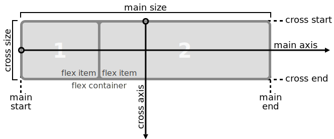

import useBaseUrl from '@docusaurus/useBaseUrl';


## Introduction aux défis CSS Flexbox

[CSS Flexbox | freeCodeCamp.org](https://www.freecodecamp.org/learn/responsive-web-design/css-flexbox/)

L'interface utilisateur d'un  site Web (« UI ») comporte deux composants. Tout d'abord, il y a les  éléments visuels, tels que les couleurs, les polices et les images.  Deuxièmement, il y a le placement ou le positionnement de ces éléments.  Dans Responsive Web Design, une disposition d'interface utilisateur doit accueillir de nombreux navigateurs et appareils différents accédant au  contenu.

CSS3 a introduit les boîtes flexibles, ou flexbox, pour  créer des mises en page pour une interface utilisateur dynamique. Il  s'agit d'un mode de mise en page qui organise les éléments de manière  prévisible pour différentes tailles d'écran et navigateurs. Bien que  quelque peu nouveaux, tous les navigateurs modernes populaires prennent  en charge flexbox. Cette section explique comment utiliser flexbox et  les différentes options de mise en page qu'elle propose.

-----


## 1. Utiliser `display: flex` pour positionner deux boîtes

[Learn CSS Flexbox: Use display: flex to Position Two Boxes | freeCodeCamp.org](https://www.freecodecamp.org/learn/responsive-web-design/css-flexbox/use-display-flex-to-position-two-boxes)

Cette section utilise des styles de défis alternés pour montrer comment  utiliser CSS pour positionner des éléments de manière flexible. Tout  d'abord, un défi expliquera la théorie, puis un défi pratique utilisant  un simple composant tweet appliquera le concept de la flexbox.
Le placement de la propriété CSS `display: flex;` sur un élément vous permet  d'utiliser d'autres propriétés flex pour créer une page responsive.

-----

Ajoutez la propriété CSS `display` à `#box-container` et définissez sa valeur sur `flex`.

> `#box-container` doit avoir la propriété `display` définie sur une valeur de `flex`.

```html
<style>
  #box-container {
    height: 500px;
  }
  #box-1 {
    background-color: dodgerblue;
    width: 50%;
    height: 50%;
  }
  #box-2 {
    background-color: orangered;
    width: 50%;
    height: 50%;
  }
</style>
<div id="box-container">
  <div id="box-1"></div>
  <div id="box-2"></div>
</div>
```


<iframe height="520" style={{width: '100%'}} scrolling="no" title="freeCodeCamp-CSS_Flexbox-01a.html" src="/data/freeCodeCamp/HTML-Demo_embed/freeCodeCamp-CSS_Flexbox-01a.html">
</iframe>

```html
<style>
  #box-container {
    height: 500px;
    display: flex;
  }
  #box-1 {
    background-color: dodgerblue;
    width: 50%;
    height: 50%;
  }
  #box-2 {
    background-color: orangered;
    width: 50%;
    height: 50%;
  }
</style>
<div id="box-container">
  <div id="box-1"></div>
  <div id="box-2"></div>
</div>
```

<iframe height="520" style={{width: '100%'}} scrolling="no" title="freeCodeCamp-CSS_Flexbox-01b.html" src="HTML-Demo_embed/freeCodeCamp-CSS_Flexbox-01b.html" >
</iframe>

------


## 2. Ajouter des superpouvoirs flex au tweet embarqué

[Learn CSS Flexbox: Add Flex Superpowers to the Tweet Embed | freeCodeCamp.org](https://www.freecodecamp.org/learn/responsive-web-design/css-flexbox/add-flex-superpowers-to-the-tweet-embed)

À droite se trouve le tweet embarqué qui sera utilisé comme exemple  pratique. Certains éléments auraient une meilleure apparence avec une  disposition différente. Le dernier défi a démontré `display: flex`.  Ici, vous l'ajouterez à plusieurs composants du tweet  embarqué  pour commencer à ajuster leur positionnement.

------

Ajoutez la propriété CSS `display: flex` à tous les éléments suivants - notez que les sélecteurs sont déjà configurés dans le CSS :
`header`, le `.profile-name` de l'en-tête, le `.follow-btn` de l'en-tête, les `h3` et  `h4` de l'en-tête, le `footer` et les `.stats` du pied de page.

> Votre `header` doit avoir une propriété `display` définie sur `flex`.
> Votre `footer` doit avoir une propriété `display` définie sur `flex`.
> Votre `h3` doit avoir une propriété `display` définie sur `flex`.
> Votre `h4` doit avoir une propriété `display` définie sur `flex`.
> Votre `.profile-name` doit avoir une propriété `display` définie sur `flex`.
> Votre `.follow-btn` doit avoir une propriété `display` définie sur `flex`.
> Votre `.stats` doit avoir une propriété `display` définie sur `flex`.

```html
<style>
  body { font-family: Arial, sans-serif; }
  header {      
  }
  header .profile-thumbnail { width: 50px; height: 50px; border-radius: 4px; }
  header .profile-name { margin-left: 10px; }
  header .follow-btn { margin: 0 0 0 auto; }
  header .follow-btn button { border: 0; border-radius: 3px; padding: 5px; }
  header h3, header h4 { margin: 0; }
  #inner p { margin-bottom: 10px; font-size: 20px; }
  #inner hr { margin: 20px 0; border-style: solid; opacity: 0.1; }
  footer {      
  }
  footer .stats { font-size: 15px; }
  footer .stats strong { font-size: 18px; }
  footer .stats .likes { margin-left: 10px; }
  footer .cta { margin-left: auto; }
  footer .cta button { border: 0; background: transparent; }
</style>
<header>
  
  <div class="profile-name">
    <h3>Quincy Larson</h3>
    <h4>@ossia</h4>
  </div>
  <div class="follow-btn">
    <button>Follow</button>
  </div>
</header>
<div id="inner">
  <p>I meet so many people who are in search of that one trick that will help them work smart. Even if you work smart, you still have to work hard.</p>
  <span class="date">1:32 PM - 12 Jan 2018</span>
  <hr>
</div>
<footer>
  <div class="stats">
    <div class="Retweets">
      <strong>107</strong> Retweets
    </div>
    <div class="likes">
      <strong>431</strong> Likes
    </div>
  </div>
  <div class="cta">
    <button class="share-btn">Share</button>
    <button class="retweet-btn">Retweet</button>
    <button class="like-btn">Like</button>
  </div>
</footer>
```
<iframe height="350" style={{width: '100%'}} scrolling="no" title="freeCodeCamp-CSS_Flexbox-02a.html" src="HTML-Demo_embed/freeCodeCamp-CSS_Flexbox-02a.html" >
</iframe>


```html
<style>
  body { font-family: Arial, sans-serif; }
  header { display: flex; }
  header .profile-thumbnail { width: 50px; height: 50px; border-radius: 4px; }
  header .profile-name { display: flex; margin-left: 10px; }
  header .follow-btn { display: flex; margin: 0 0 0 auto; }
  header .follow-btn button { border: 0; border-radius: 3px; padding: 5px; }
  header h3, header h4 { display: flex; margin: 0; }
  #inner p { margin-bottom: 10px; font-size: 20px; }
  #inner hr { margin: 20px 0; border-style: solid; opacity: 0.1; }
  footer { display: flex; }
  footer .stats { display: flex; font-size: 15px; }
  footer .stats strong { font-size: 18px; }
  footer .stats .likes { margin-left: 10px; }
  footer .cta { margin-left: auto; }
  footer .cta button { border: 0; background: transparent; }
</style>
<header>
  
  <div class="profile-name">
    <h3>Quincy Larson</h3>
    <h4>@ossia</h4>
  </div>
  <div class="follow-btn">
    <button>Follow</button>
  </div>
</header>
<div id="inner">
  <p>I meet so many people who are in search of that one trick that will help them work smart. Even if you work smart, you still have to work hard.</p>
  <span class="date">1:32 PM - 12 Jan 2018</span>
  <hr>
</div>
<footer>
  <div class="stats">
    <div class="Retweets">
      <strong>107</strong> Retweets
    </div>
    <div class="likes">
      <strong>431</strong> Likes
    </div>
  </div>
  <div class="cta">
    <button class="share-btn">Share</button>
    <button class="retweet-btn">Retweet</button>
    <button class="like-btn">Like</button>
  </div>
</footer>
```

<iframe height="300" style={{width: '100%'}} scrolling="no" title="freeCodeCamp-CSS_Flexbox-02b.html" src="HTML-Demo_embed/freeCodeCamp-CSS_Flexbox-02b.html" >
</iframe>


-----


## 3. Utilisez la propriété `flex-direction` pour créer une ligne

[Learn CSS Flexbox: Use the flex-direction Property to Make a Row | freeCodeCamp.org](https://www.freecodecamp.org/learn/responsive-web-design/css-flexbox/use-the-flex-direction-property-to-make-a-row)

Ajouter `display: flex` à un élément le transforme en conteneur flex.  Cela permet d'aligner tous les enfants de cet élément en lignes ou en colonnes. Pour ce faire, ajoutez la propriété `flex-direction` à l'élément parent et définissez-la sur ligne ou colonne. La création d'une ligne  alignera les enfants horizontalement et la création d'une colonne  alignera les enfants verticalement.
Les autres options de `flex-direction` sont `row-reverse` et `column-reverse`.
**Remarque :** la valeur par défaut de la propriété `flex-direction` est `row`.

-----

Ajoutez la propriété CSS `flex-direction` à l'élément `#box-container` et donnez-lui la valeur `row-reverse`.

> L'élément `#box-container` doit avoir une propriété `flex-direction` définie sur `row-reverse`.

```html
<style>
  #box-container {
    display: flex;
    height: 500px;
  }
  #box-1 {
    background-color: dodgerblue;
    width: 50%;
    height: 50%;
  }
  #box-2 {
    background-color: orangered;
    width: 50%;
    height: 50%;
  }
</style>
<div id="box-container">
  <div id="box-1"></div>
  <div id="box-2"></div>
</div>
```

<iframe height="520" style={{width: '100%'}} scrolling="no" title="freeCodeCamp-CSS_Flexbox-03a.html" src="HTML-Demo_embed/freeCodeCamp-CSS_Flexbox-03a.html" >
</iframe>

```html
<style>
  #box-container {
    display: flex;
    height: 500px;
    flex-direction: row-reverse;
  }
  #box-1 {
    background-color: dodgerblue;
    width: 50%;
    height: 50%;
  }
  #box-2 {
    background-color: orangered;
    width: 50%;
    height: 50%;
  }
</style>
<div id="box-container">
  <div id="box-1"></div>
  <div id="box-2"></div>
</div>
```

<iframe height="520" style={{width: '100%'}} scrolling="no" title="freeCodeCamp-CSS_Flexbox-03b.html" src="HTML-Demo_embed/freeCodeCamp-CSS_Flexbox-03b.html" >
</iframe>
------


## 4. Appliquer la propriété `flex-direction` pour créer des lignes dans le tweet embarqué

[Learn CSS Flexbox: Apply the flex-direction Property to Create Rows in the Tweet Embed | freeCodeCamp.org](https://www.freecodecamp.org/learn/responsive-web-design/css-flexbox/apply-the-flex-direction-property-to-create-rows-in-the-tweet-embed)

Le `header` et le `footer` de l'exemple de tweet embarqué ont des éléments enfants qui peuvent être organisés sous forme de lignes à  l'aide de la propriété `flex-direction`. Cela indique au CSS d'aligner les enfants horizontalement.

-----

Ajoutez la propriété CSS `flex-direction` au `header` et au `footer` et définissez la valeur sur `row`.

> `header` doit avoir une propriété `flex-direction` définie sur `row`.
> `footer` doit avoir une propriété `flex-direction` définie sur `row`.

```html
<style>
  body {
    font-family: Arial, sans-serif;
  }
  header {
    display: flex;

  }
  header .profile-thumbnail {
    width: 50px;
    height: 50px;
    border-radius: 4px;
  }
  header .profile-name {
    display: flex;
    margin-left: 10px;
  }
  header .follow-btn {
    display: flex;
    margin: 0 0 0 auto;
  }
  header .follow-btn button {
    border: 0;
    border-radius: 3px;
    padding: 5px;
  }
  header h3, header h4 {
    display: flex;
    margin: 0;
  }
  #inner p {
    margin-bottom: 10px;
    font-size: 20px;
  }
  #inner hr {
    margin: 20px 0;
    border-style: solid;
    opacity: 0.1;
  }
  footer {
    display: flex;

  }
  footer .stats {
    display: flex;
    font-size: 15px;
  }
  footer .stats strong {
    font-size: 18px;
  }
  footer .stats .likes {
    margin-left: 10px;
  }
  footer .cta {
    margin-left: auto;
  }
  footer .cta button {
    border: 0;
    background: transparent;
  }
</style>
<header>
  
  <div class="profile-name">
    <h3>Quincy Larson</h3>
    <h4>@ossia</h4>
  </div>
  <div class="follow-btn">
    <button>Follow</button>
  </div>
</header>
<div id="inner">
  <p>I meet so many people who are in search of that one trick that will help them work smart. Even if you work smart, you still have to work hard.</p>
  <span class="date">1:32 PM - 12 Jan 2018</span>
  <hr>
</div>
<footer>
  <div class="stats">
    <div class="Retweets">
      <strong>107</strong> Retweets
    </div>
    <div class="likes">
      <strong>431</strong> Likes
    </div>
  </div>
  <div class="cta">
    <button class="share-btn">Share</button>
    <button class="retweet-btn">Retweet</button>
    <button class="like-btn">Like</button>
  </div>
</footer>
```

<iframe height="520" style={{width: '100%'}} scrolling="no" title="freeCodeCamp-CSS_Flexbox-04a.html" src="HTML-Demo_embed/freeCodeCamp-CSS_Flexbox-04a.html" >
</iframe>

```html
<style>
    body {
      font-family: Arial, sans-serif;
    }
    header {
      display: flex;
      flex-direction: row;
    }
    header .profile-thumbnail {
      width: 50px;
      height: 50px;
      border-radius: 4px;
    }
    header .profile-name {
      display: flex;
      margin-left: 10px;
    }
    header .follow-btn {
      display: flex;
      margin: 0 0 0 auto;
    }
    header .follow-btn button {
      border: 0;
      border-radius: 3px;
      padding: 5px;
    }
    header h3, header h4 {
      display: flex;
      margin: 0;
    }
    #inner p {
      margin-bottom: 10px;
      font-size: 20px;
    }
    #inner hr {
      margin: 20px 0;
      border-style: solid;
      opacity: 0.1;
    }
    footer {
      display: flex;
      flex-direction: row;
    }
    footer .stats {
      display: flex;
      font-size: 15px;
    }
    footer .stats strong {
      font-size: 18px;
    }
    footer .stats .likes {
      margin-left: 10px;
    }
    footer .cta {
      margin-left: auto;
    }
    footer .cta button {
      border: 0;
      background: transparent;
    }
  </style>
  <header>
    
    <div class="profile-name">
      <h3>Quincy Larson</h3>
      <h4>@ossia</h4>
    </div>
    <div class="follow-btn">
      <button>Follow</button>
    </div>
  </header>
  <div id="inner">
    <p>I meet so many people who are in search of that one trick that will help them work smart. Even if you work smart, you still have to work hard.</p>
    <span class="date">1:32 PM - 12 Jan 2018</span>
    <hr>
  </div>
  <footer>
    <div class="stats">
      <div class="Retweets">
        <strong>107</strong> Retweets
      </div>
      <div class="likes">
        <strong>431</strong> Likes
      </div>
    </div>
    <div class="cta">
      <button class="share-btn">Share</button>
      <button class="retweet-btn">Retweet</button>
      <button class="like-btn">Like</button>
    </div>
  </footer>
```

<iframe height="520" style={{width: '100%'}} scrolling="no" title="freeCodeCamp-CSS_Flexbox-04b.html" src="HTML-Demo_embed/freeCodeCamp-CSS_Flexbox-04b.html" >
</iframe>
-----


## 5. Utilisez la propriété `flex-direction` pour créer une colonne

[Learn CSS Flexbox: Use the flex-direction Property to Make a Column | freeCodeCamp.org](https://www.freecodecamp.org/learn/responsive-web-design/css-flexbox/use-the-flex-direction-property-to-make-a-column)

Les deux derniers défis utilisaient la propriété `flex-direction` définie sur `row`. Cette propriété peut également créer une colonne en empilant  verticalement les enfants d'un conteneur flex.

-----

Ajoutez la propriété CSS `flex-direction` à l'élément `#box-container` et donnez-lui la valeur `column`.

> L'élément `#box-container` doit avoir une propriété `flex-direction` définie sur `column`.

```html
<style>
  #box-container {
    display: flex;
    height: 500px;
  }
  #box-1 {
    background-color: dodgerblue;
    width: 50%;
    height: 50%;
  }
  #box-2 {
    background-color: orangered;
    width: 50%;
    height: 50%;
  }
</style>
<div id="box-container">
  <div id="box-1"></div>
  <div id="box-2"></div>
</div>
```

<iframe height="520" style={{width: '100%'}} scrolling="no" title="freeCodeCamp-CSS_Flexbox-05a.html" src="HTML-Demo_embed/freeCodeCamp-CSS_Flexbox-05a.html" >
</iframe>

```html
<style>
  #box-container {
    display: flex;
    height: 500px;
    flex-direction: column;
  }
  #box-1 {
    background-color: dodgerblue;
    width: 50%;
    height: 50%;
  }
  #box-2 {
    background-color: orangered;
    width: 50%;
    height: 50%;
  }
</style>
<div id="box-container">
  <div id="box-1"></div>
  <div id="box-2"></div>
</div>
```

<iframe height="520" style={{width: '100%'}} scrolling="no" title="freeCodeCamp-CSS_Flexbox-05b.html" src="HTML-Demo_embed/freeCodeCamp-CSS_Flexbox-05b.html" >
</iframe>
-----


## 6.Appliquez la propriété `flex-direction` pour créer une colonne dans le tweet embarqué

[Learn CSS Flexbox: Apply the flex-direction Property to Create a Column in the Tweet Embed | freeCodeCamp.org](https://www.freecodecamp.org/learn/responsive-web-design/css-flexbox/apply-the-flex-direction-property-to-create-a-column-in-the-tweet-embed)

Le `header` et le `footer` incorporés du tweet utilisaient auparavant  la propriété `flex-direction` avec une valeur `row`. De même, les  éléments à l'intérieur de l'élément `.profile-name` fonctionneraient bien  empilés comme une colonne.

-----

Ajoutez la propriété CSS `flex-direction` à l'élément `.profile-name` de l'en-tête et définissez la valeur sur `column`.

> L'élément `.profile-name` doit avoir une propriété `flex-direction` définie sur `column`.

```html
<style>
  body {
    font-family: Arial, sans-serif;
  }
  header, footer {
    display: flex;
    flex-direction: row;
  }
  header .profile-thumbnail {
    width: 50px;
    height: 50px;
    border-radius: 4px;
  }
  header .profile-name {
    display: flex;

    margin-left: 10px;
  }
  header .follow-btn {
    display: flex;
    margin: 0 0 0 auto;
  }
  header .follow-btn button {
    border: 0;
    border-radius: 3px;
    padding: 5px;
  }
  header h3, header h4 {
    display: flex;
    margin: 0;
  }
  #inner p {
    margin-bottom: 10px;
    font-size: 20px;
  }
  #inner hr {
    margin: 20px 0;
    border-style: solid;
    opacity: 0.1;
  }
  footer .stats {
    display: flex;
    font-size: 15px;
  }
  footer .stats strong {
    font-size: 18px;
  }
  footer .stats .likes {
    margin-left: 10px;
  }
  footer .cta {
    margin-left: auto;
  }
  footer .cta button {
    border: 0;
    background: transparent;
  }
</style>
<header>
  
  <div class="profile-name">
    <h3>Quincy Larson</h3>
    <h4>@ossia</h4>
  </div>
  <div class="follow-btn">
    <button>Follow</button>
  </div>
</header>
<div id="inner">
  <p>I meet so many people who are in search of that one trick that will help them work smart. Even if you work smart, you still have to work hard.</p>
  <span class="date">1:32 PM - 12 Jan 2018</span>
  <hr>
</div>
<footer>
  <div class="stats">
    <div class="Retweets">
      <strong>107</strong> Retweets
    </div>
    <div class="likes">
      <strong>431</strong> Likes
    </div>
  </div>
  <div class="cta">
    <button class="share-btn">Share</button>
    <button class="retweet-btn">Retweet</button>
    <button class="like-btn">Like</button>
  </div>
</footer>
```

<iframe height="520" style={{width: '100%'}} scrolling="no" title="freeCodeCamp-CSS_Flexbox-06a.html" src="HTML-Demo_embed/freeCodeCamp-CSS_Flexbox-06a.html" >
</iframe>

```html
<style>
  body {
    font-family: Arial, sans-serif;
  }
  header, footer {
    display: flex;
    flex-direction: row;
  }
  header .profile-thumbnail {
    width: 50px;
    height: 50px;
    border-radius: 4px;
  }
  header .profile-name {
    display: flex;
	flex-direction: column;
    margin-left: 10px;
  }
  header .follow-btn {
    display: flex;
    margin: 0 0 0 auto;
  }
  header .follow-btn button {
    border: 0;
    border-radius: 3px;
    padding: 5px;
  }
  header h3, header h4 {
    display: flex;
    margin: 0;
  }
  #inner p {
    margin-bottom: 10px;
    font-size: 20px;
  }
  #inner hr {
    margin: 20px 0;
    border-style: solid;
    opacity: 0.1;
  }
  footer .stats {
    display: flex;
    font-size: 15px;
  }
  footer .stats strong {
    font-size: 18px;
  }
  footer .stats .likes {
    margin-left: 10px;
  }
  footer .cta {
    margin-left: auto;
  }
  footer .cta button {
    border: 0;
    background: transparent;
  }
</style>
<header>
  
  <div class="profile-name">
    <h3>Quincy Larson</h3>
    <h4>@ossia</h4>
  </div>
  <div class="follow-btn">
    <button>Follow</button>
  </div>
</header>
<div id="inner">
  <p>I meet so many people who are in search of that one trick that will help them work smart. Even if you work smart, you still have to work hard.</p>
  <span class="date">1:32 PM - 12 Jan 2018</span>
  <hr>
</div>
<footer>
  <div class="stats">
    <div class="Retweets">
      <strong>107</strong> Retweets
    </div>
    <div class="likes">
      <strong>431</strong> Likes
    </div>
  </div>
  <div class="cta">
    <button class="share-btn">Share</button>
    <button class="retweet-btn">Retweet</button>
    <button class="like-btn">Like</button>
  </div>
</footer>
```

<iframe height="520" style={{width: '100%'}} scrolling="no" title="freeCodeCamp-CSS_Flexbox-06b.html" src="HTML-Demo_embed/freeCodeCamp-CSS_Flexbox-06b.html" >
</iframe>
-----


## 7. Aligner des éléments à l'aide de la propriété `justify-content`

[Learn CSS Flexbox: Align Elements Using the justify-content Property | freeCodeCamp.org](https://www.freecodecamp.org/learn/responsive-web-design/css-flexbox/align-elements-using-the-justify-content-property)

Parfois, les éléments flexibles dans un conteneur flexible ne  remplissent pas tout l'espace du conteneur. Il est courant de vouloir  dire à CSS comment aligner et espacer les éléments flexibles d'une  certaine manière. Heureusement, la propriété `justify-content` a plusieurs options pour ce faire. Mais d'abord, il y a une terminologie importante à comprendre avant d'examiner ces options.



Rappelez-vous que la définition d'un conteneur flexible en tant que ligne place les éléments flex côte à côte de gauche à droite. Un conteneur flexible  défini comme une colonne place les éléments flexibles dans une pile verticale de haut en bas. Pour chacun, la direction dans laquelle les  éléments flexibles sont disposés est appelée l'**axe principal** (main axis). Pour une  ligne, il s'agit d'une ligne horizontale qui traverse chaque élément. Et pour une colonne, l'axe principal est une ligne verticale passant par  les éléments.
Il existe plusieurs options pour espacer les  éléments flexibles le long de la ligne qui est l'axe principal. L'un des plus couramment utilisés est `justify-content: center;`, qui aligne tous les éléments flex au centre à l'intérieur du conteneur flex. D'autres  options incluent :

- `flex-start` : aligne les éléments sur le  début du conteneur flex. Pour une ligne, cela pousse les éléments à  gauche du conteneur. Pour une colonne, cela pousse les éléments vers le  haut du conteneur. Il s'agit de l'alignement par défaut si aucun `justify-content` n'est spécifié.
- `flex-end` : aligne les éléments à la fin  du conteneur flex. Pour une ligne, cela pousse les éléments à droite du  conteneur. Pour une colonne, cela pousse les éléments vers le bas du  conteneur.
- `space-between` : aligne les éléments au centre de l'axe  principal, avec un espace supplémentaire placé entre les éléments. Les  premier et dernier éléments sont poussés jusqu'au bord même du conteneur flexible. Par exemple, dans une rangée, le premier élément est contre  le côté gauche du conteneur, le dernier élément est contre le côté droit du conteneur, puis l'espace restant est réparti uniformément entre les  autres éléments.
- `space-around` : similaire à `space-between` mais les premier et dernier éléments ne sont pas verrouillés sur les bords du  conteneur, l'espace est réparti autour de tous les éléments avec un  demi-espace à chaque extrémité du conteneur flexible.
- `space-evenly` : répartit l'espace uniformément entre les éléments  flexibles avec un espace complet à chaque extrémité du conteneur  flexible.

-----

Un exemple permet de montrer cette propriété en action.  Ajoutez la propriété CSS `justify-content` à l'élément `#box-container` et  donnez-lui la valeur `center`.
**Bonus :** Essayez les autres options  de la propriété `justify-content` dans l'éditeur de code pour voir leurs  différences. Mais notez qu'une valeur `center` est la seule qui  réussira ce défi.

> L'élément `#box-container` doit avoir une propriété `justify-content` définie sur une valeur de `center`.

```html
<style>
  #box-container {
    background: gray;
    display: flex;
    height: 500px;
  }
  #box-1 {
    background-color: dodgerblue;
    width: 25%;
    height: 100%;
  }
  #box-2 {
    background-color: orangered;
    width: 25%;
    height: 100%;
  }
</style>
<div id="box-container">
  <div id="box-1"></div>
  <div id="box-2"></div>
</div>
```

<iframe height="520" style={{width: '100%'}} scrolling="no" title="freeCodeCamp-CSS_Flexbox-07a.html" src="HTML-Demo_embed/freeCodeCamp-CSS_Flexbox-07a.html" >
</iframe>

```html
<style>
  #box-container {
    background: gray;
    display: flex;
    height: 500px;
    justify-content: center;
  }
  #box-1 {
    background-color: dodgerblue;
    width: 25%;
    height: 100%;
  }
  #box-2 {
    background-color: orangered;
    width: 25%;
    height: 100%;
  }
</style>
<div id="box-container">
  <div id="box-1"></div>
  <div id="box-2"></div>
</div>
```

<iframe height="520" style={{width: '100%'}} scrolling="no" title="freeCodeCamp-CSS_Flexbox-07b.html" src="HTML-Demo_embed/freeCodeCamp-CSS_Flexbox-07b.html" >
</iframe>
------


## 8. Utilisez la propriété `justify-content` dans le tweet embarqué

[Learn CSS Flexbox: Use the justify-content Property in the Tweet Embed | freeCodeCamp.org](https://www.freecodecamp.org/learn/responsive-web-design/css-flexbox/use-the-justify-content-property-in-the-tweet-embed)

Le dernier défi a montré un exemple de la propriété `justify-content`.  Pour l'intégration du tweet, cette propriété peut être appliquée pour  aligner les éléments dans l'élément `.profile-name`.

-----

Ajoutez la  propriété CSS `justify-content` à l'élément `.profile-name` de l'en-tête et  définissez la valeur sur l'une des options du dernier défi.

> L'élément `.profile-name` doit avoir la propriété `justify-content` définie sur l'une de ces valeurs : `center`, `flex-start`, `flex-end`, `space-between`, `space-around`, ou `space-evenly`.

```html
<style>
  body { font-family: Arial, sans-serif; }
  header, footer { display: flex; flex-direction: row; }
  header .profile-thumbnail { width: 50px; height: 50px; border-radius: 4px; }
  header .profile-name {
      display: flex;
      flex-direction: column;
      margin-left: 10px;
  }
  header .follow-btn { display: flex; margin: 0 0 0 auto; }
  header .follow-btn button { border: 0; border-radius: 3px; padding: 5px; }
  header h3, header h4 { display: flex; margin: 0; }
  #inner p { margin-bottom: 10px; font-size: 20px; }
  #inner hr { margin: 20px 0; border-style: solid; opacity: 0.1; }
  footer .stats { display: flex; font-size: 15px; }
  footer .stats strong { font-size: 18px; }
  footer .stats .likes { margin-left: 10px; }
  footer .cta { margin-left: auto; }
  footer .cta button { border: 0; background: transparent; }
</style>
<header>
  
  <div class="profile-name">
    <h3>Quincy Larson</h3>
    <h4>@ossia</h4>
  </div>
  <div class="follow-btn">
    <button>Follow</button>
  </div>
</header>
<div id="inner">
  <p>I meet so many people who are in search of that one trick that will help them work smart. Even if you work smart, you still have to work hard.</p>
  <span class="date">1:32 PM - 12 Jan 2018</span>
  <hr>
</div>
<footer>
  <div class="stats">
    <div class="Retweets">
      <strong>107</strong> Retweets
    </div>
    <div class="likes">
      <strong>431</strong> Likes
    </div>
  </div>
  <div class="cta">
    <button class="share-btn">Share</button>
    <button class="retweet-btn">Retweet</button>
    <button class="like-btn">Like</button>
  </div>
</footer>
```

<iframe height="520" style={{width: '100%'}} scrolling="no" title="freeCodeCamp-CSS_Flexbox-08a.html" src="HTML-Demo_embed/freeCodeCamp-CSS_Flexbox-08a.html" >
</iframe>

```html
<style>
  body { font-family: Arial, sans-serif; }
  header, footer { display: flex; flex-direction: row; }
  header .profile-thumbnail { width: 50px; height: 50px; border-radius: 4px; }
  header .profile-name {
      display: flex;
      flex-direction: column;
      justify-content: space-between;
      margin-left: 10px;
  }
  header .follow-btn { display: flex; margin: 0 0 0 auto; }
  header .follow-btn button { border: 0; border-radius: 3px; padding: 5px; }
  header h3, header h4 { display: flex; margin: 0; }
  #inner p { margin-bottom: 10px; font-size: 20px; }
  #inner hr { margin: 20px 0; border-style: solid; opacity: 0.1; }
  footer .stats { display: flex; font-size: 15px; }
  footer .stats strong { font-size: 18px; }
  footer .stats .likes { margin-left: 10px; }
  footer .cta { margin-left: auto; }
  footer .cta button { border: 0; background: transparent; }
</style>
<header>
  
  <div class="profile-name">
    <h3>Quincy Larson</h3>
    <h4>@ossia</h4>
  </div>
  <div class="follow-btn">
    <button>Follow</button>
  </div>
</header>
<div id="inner">
  <p>I meet so many people who are in search of that one trick that will help them work smart. Even if you work smart, you still have to work hard.</p>
  <span class="date">1:32 PM - 12 Jan 2018</span>
  <hr>
</div>
<footer>
  <div class="stats">
    <div class="Retweets">
      <strong>107</strong> Retweets
    </div>
    <div class="likes">
      <strong>431</strong> Likes
    </div>
  </div>
  <div class="cta">
    <button class="share-btn">Share</button>
    <button class="retweet-btn">Retweet</button>
    <button class="like-btn">Like</button>
  </div>
</footer>
```

<iframe height="520" style={{width: '100%'}} scrolling="no" title="freeCodeCamp-CSS_Flexbox-08b.html" src="HTML-Demo_embed/freeCodeCamp-CSS_Flexbox-08b.html" >
</iframe>
-----


## 9. Aligner des éléments à l'aide de la propriété `align-items`

[Learn CSS Flexbox: Align Elements Using the align-items Property | freeCodeCamp.org](https://www.freecodecamp.org/learn/responsive-web-design/css-flexbox/align-elements-using-the-align-items-property)

La propriété `align-items` est similaire à `justify-content`. Rappelez-vous  que la propriété `justify-content` alignait les éléments flexibles le long de l'axe principal. Pour les lignes, l'axe principal est une ligne  horizontale et pour les colonnes, une ligne verticale.
Les  conteneurs flexibles ont également un **axe transversal** qui est l'opposé  de l'axe principal. Pour les lignes, l'axe transversal est vertical et  pour les colonnes, l'axe transversal est horizontal.
CSS propose  la propriété `align-items` pour aligner les éléments flexibles le long de  l'axe transversal. Pour une ligne, il indique à CSS comment pousser les  éléments de la ligne entière vers le haut ou vers le bas dans le  conteneur. Et pour une colonne, comment pousser tous les éléments à  gauche ou à droite dans le conteneur.
Les différentes valeurs disponibles pour `align-items` incluent :

- `flex-start` : aligne les éléments sur le début du conteneur flex. Pour les lignes, cela aligne les éléments sur le haut du conteneur. Pour les colonnes, cela aligne les éléments à gauche du conteneur.
- `flex-end` : aligne les éléments à la fin du conteneur flex. Pour les  lignes, cela aligne les éléments sur le bas du conteneur. Pour les  colonnes, cela aligne les éléments à droite du conteneur.
- `center` : alignez les éléments au centre. Pour les lignes, cela aligne  verticalement les éléments (espace égal au-dessus et au-dessous des  éléments). Pour les colonnes, cela les aligne horizontalement (espace  égal à gauche et à droite des éléments).
- `stretch` : étirez les  éléments pour remplir le conteneur flexible. Par exemple, les éléments  de lignes sont étirés pour remplir le conteneur flexible de haut en bas. Il s'agit de la valeur par défaut si aucune valeur `align-items` n'est  spécifiée.
- `baseline` : alignez les éléments sur leurs lignes  de base. La ligne de base est un concept de texte, pensez-y comme la  ligne sur laquelle reposent les lettres.

-----

Un exemple permet de  montrer cette propriété en action. Ajoutez la propriété CSS `align-items` à l'élément `#box-container` et donnez-lui la valeur `center`.
**Bonus :** Essayez les autres options de la propriété `align-items` dans l'éditeur de code  pour voir leurs différences. Mais notez qu'une valeur `center` est la  seule qui réussira ce défi.

> L'élément `#box-container` doit avoir une propriété `align-items` définie sur une valeur de center.

```html
<style>
  #box-container {
    background: gray;
    display: flex;
    height: 500px;
  }
  #box-1 {
    background-color: dodgerblue;
    width: 200px;
    font-size: 24px;
  }
  #box-2 {
    background-color: orangered;
    width: 200px;
    font-size: 18px;
  }
</style>
<div id="box-container">
  <div id="box-1"><p>Hello</p></div>
  <div id="box-2"><p>Goodbye</p></div>
</div>
```

<iframe height="520" style={{width: '100%'}} scrolling="no" title="freeCodeCamp-CSS_Flexbox-09a.html" src="HTML-Demo_embed/freeCodeCamp-CSS_Flexbox-09a.html" >
</iframe>

```html
<style>
  #box-container {
    background: gray;
    display: flex;
    height: 500px;
    align-items: center;
  }
  #box-1 {
    background-color: dodgerblue;
    width: 200px;
    font-size: 24px;
  }
  #box-2 {
    background-color: orangered;
    width: 200px;
    font-size: 18px;
  }
</style>
<div id="box-container">
  <div id="box-1"><p>Hello</p></div>
  <div id="box-2"><p>Goodbye</p></div>
</div>
```

<iframe height="520" style={{width: '100%'}} scrolling="no" title="freeCodeCamp-CSS_Flexbox-09b.html" src="HTML-Demo_embed/freeCodeCamp-CSS_Flexbox-09b.html" >
</iframe>

------


## 10. Utilisez la propriété `align-items` dans le tweet embarqué

[Learn CSS Flexbox: Use the align-items Property in the Tweet Embed | freeCodeCamp.org](https://www.freecodecamp.org/learn/responsive-web-design/css-flexbox/use-the-align-items-property-in-the-tweet-embed)

Le dernier défi a introduit la propriété `align-items` et a donné un  exemple. Cette propriété peut être appliquée à quelques éléments embarqués de tweet pour aligner les éléments flex à l'intérieur.

-----

Ajoutez la propriété CSS `align-items` à l'élément `.follow-btn` de l'en-tête. Définissez la valeur `center`.

> L'élément `.follow-btn` doit avoir la propriété `align-items` définie sur une valeur `center`.

```html
<style>
  body { font-family: Arial, sans-serif; }
  header, footer { display: flex; flex-direction: row; }
  header .profile-thumbnail { width: 50px; height: 50px; border-radius: 4px; }
  header .profile-name { display: flex; flex-direction: column; justify-content: center; margin-left: 10px; }
  header .follow-btn {
    display: flex;

    margin: 0 0 0 auto;
  }
  header .follow-btn button { border: 0; border-radius: 3px; padding: 5px; }
  header h3, header h4 { display: flex; margin: 0; }
  #inner p { margin-bottom: 10px; font-size: 20px; }
  #inner hr { margin: 20px 0; border-style: solid; opacity: 0.1; }
  footer .stats { display: flex; font-size: 15px; }
  footer .stats strong { font-size: 18px; }
  footer .stats .likes { margin-left: 10px; }
  footer .cta { margin-left: auto; }
  footer .cta button { border: 0; background: transparent; }
</style>
<header>
  
  <div class="profile-name">
    <h3>Quincy Larson</h3>
    <h4>@ossia</h4>
  </div>
  <div class="follow-btn">
    <button>Follow</button>
  </div>
</header>
<div id="inner">
  <p>I meet so many people who are in search of that one trick that will help them work smart. Even if you work smart, you still have to work hard.</p>
  <span class="date">1:32 PM - 12 Jan 2018</span>
  <hr>
</div>
<footer>
  <div class="stats">
    <div class="Retweets">
      <strong>107</strong> Retweets
    </div>
    <div class="likes">
      <strong>431</strong> Likes
    </div>
  </div>
  <div class="cta">
    <button class="share-btn">Share</button>
    <button class="retweet-btn">Retweet</button>
    <button class="like-btn">Like</button>
  </div>
</footer>
```

<iframe height="520" style={{width: '100%'}} scrolling="no" title="freeCodeCamp-CSS_Flexbox-10a.html" src="HTML-Demo_embed/freeCodeCamp-CSS_Flexbox-10a.html" >
</iframe>

```html
<style>
  body { font-family: Arial, sans-serif; }
  header, footer { display: flex; flex-direction: row; }
  header .profile-thumbnail { width: 50px; height: 50px; border-radius: 4px; }
  header .profile-name { display: flex; flex-direction: column; justify-content: center; margin-left: 10px; }
  header .follow-btn {
    display: flex;
    align-items: center;
    margin: 0 0 0 auto;
  }
  header .follow-btn button { border: 0; border-radius: 3px; padding: 5px; }
  header h3, header h4 { display: flex; margin: 0; }
  #inner p { margin-bottom: 10px; font-size: 20px; }
  #inner hr { margin: 20px 0; border-style: solid; opacity: 0.1; }
  footer .stats { display: flex; font-size: 15px; }
  footer .stats strong { font-size: 18px; }
  footer .stats .likes { margin-left: 10px; }
  footer .cta { margin-left: auto; }
  footer .cta button { border: 0; background: transparent; }
</style>
<header>
  
  <div class="profile-name">
    <h3>Quincy Larson</h3>
    <h4>@ossia</h4>
  </div>
  <div class="follow-btn">
    <button>Follow</button>
  </div>
</header>
<div id="inner">
  <p>I meet so many people who are in search of that one trick that will help them work smart. Even if you work smart, you still have to work hard.</p>
  <span class="date">1:32 PM - 12 Jan 2018</span>
  <hr>
</div>
<footer>
  <div class="stats">
    <div class="Retweets">
      <strong>107</strong> Retweets
    </div>
    <div class="likes">
      <strong>431</strong> Likes
    </div>
  </div>
  <div class="cta">
    <button class="share-btn">Share</button>
    <button class="retweet-btn">Retweet</button>
    <button class="like-btn">Like</button>
  </div>
</footer>
```

<iframe height="520" style={{width: '100%'}} scrolling="no" title="freeCodeCamp-CSS_Flexbox-10b.html" src="HTML-Demo_embed/freeCodeCamp-CSS_Flexbox-10b.html" >
</iframe>

-----


## 11. Utilisez la propriété `flex-wrap` pour envelopper une ligne ou une colonne

[Learn CSS Flexbox: Use the flex-wrap Property to Wrap a Row or Column | freeCodeCamp.org](https://www.freecodecamp.org/learn/responsive-web-design/css-flexbox/use-the-flex-wrap-property-to-wrap-a-row-or-column)

CSS flexbox a une fonctionnalité pour diviser un élément flex en  plusieurs lignes (ou colonnes). Par défaut, un conteneur flexible  adaptera tous les éléments flex ensemble. Par exemple, une ligne sera  sur une seule ligne.
Cependant, l'utilisation de la propriété `flex-wrap` indique à CSS d'encapsuler les éléments. Cela signifie que les éléments supplémentaires sont déplacés dans une nouvelle ligne ou  colonne. Le point de rupture de l’emballage dépend de la taille des  articles et de la taille du conteneur.
CSS a également des options pour la direction de l'enroulement :

- `nowrap` : il s'agit du paramètre par défaut et n'enveloppe pas les éléments.
- `wrap` : enveloppe les éléments de gauche à droite s'ils sont dans une ligne, ou de haut en bas s'ils sont dans une colonne.
- `wrap-reverse`: enveloppe les éléments de droite à gauche s'ils sont  dans une ligne, ou de bas en haut s'ils sont dans une colonne.

-----

La mise en page actuelle comporte trop de cases pour une ligne. Ajoutez la propriété CSS `flex-wrap` à l'élément `#box-container` et donnez-lui la  valeur `wrap`.

> L'élément `#box-container` doit avoir la propriété `flex-wrap` définie sur une valeur de `wrap`.

```html
<style>
  #box-container {
    background: gray;
    display: flex;
    height: 100%;

  }
  #box-1 { background-color: dodgerblue; width: 25%; height: 50%; }
  #box-2 { background-color: orangered; width: 25%; height: 50%; }
  #box-3 { background-color: violet; width: 25%; height: 50%; }
  #box-4 { background-color: yellow; width: 25%; height: 50%; }
  #box-5 { background-color: green; width: 25%; height: 50%; }
  #box-6 { background-color: black; width: 25%; height: 50%; }
</style>
<div id="box-container">
  <div id="box-1"></div>
  <div id="box-2"></div>
  <div id="box-3"></div>
  <div id="box-4"></div>
  <div id="box-5"></div>
  <div id="box-6"></div>
</div>
```

<iframe height="520" style={{width: '100%'}} scrolling="no" title="freeCodeCamp-CSS_Flexbox-11a.html" src="HTML-Demo_embed/freeCodeCamp-CSS_Flexbox-11a.html" >
</iframe>

```html
<style>
  #box-container {
    background: gray;
    display: flex;
    height: 100%;
    flex-wrap: wrap;
  }
  #box-1 { background-color: dodgerblue; width: 25%; height: 50%; }
  #box-2 { background-color: orangered; width: 25%; height: 50%; }
  #box-3 { background-color: violet; width: 25%; height: 50%; }
  #box-4 { background-color: yellow; width: 25%; height: 50%; }
  #box-5 { background-color: green; width: 25%; height: 50%; }
  #box-6 { background-color: black; width: 25%; height: 50%; }
</style>
<div id="box-container">
  <div id="box-1"></div>
  <div id="box-2"></div>
  <div id="box-3"></div>
  <div id="box-4"></div>
  <div id="box-5"></div>
  <div id="box-6"></div>
</div>
```

<iframe height="520" style={{width: '100%'}} scrolling="no" title="freeCodeCamp-CSS_Flexbox-11b.html" src="HTML-Demo_embed/freeCodeCamp-CSS_Flexbox-11b.html" >
</iframe>

------


## 12. Utilisez la propriété `flex-shrink` pour réduire les éléments

[Learn CSS Flexbox: Use the flex-shrink Property to Shrink Items | freeCodeCamp.org](https://www.freecodecamp.org/learn/responsive-web-design/css-flexbox/use-the-flex-shrink-property-to-shrink-items)

Jusqu'à présent, toutes les propriétés des défis s'appliquent au  conteneur flex (le parent des éléments flex). Cependant, il existe  plusieurs propriétés utiles pour les éléments flex.
Le premier  est la propriété `flex-shrink`. Lorsqu'il est utilisé, il permet à un  élément de rétrécir si le conteneur flexible est trop petit. Les  éléments rétrécissent lorsque la largeur du conteneur parent est  inférieure aux largeurs combinées de tous les éléments flexibles qu'il  contient.
La propriété `flex-shrink` prend des nombres comme  valeurs. Plus le nombre est élevé, plus il rétrécira par rapport aux  autres éléments du conteneur. Par exemple, si un élément a une valeur `flex-shrink` de `1` et l'autre a une valeur `flex-shrink` de `3`, celui avec la valeur `3` rétrécira trois fois plus que l'autre.

-----

Ajoutez la propriété CSS `flex-shrink` à `#box-1` et `#box-2`. Donnez à `#box-1` une valeur de `1` et `#box-2` une valeur de `2`.

> L'élément `#box-1` doit avoir la propriété `flex-shrink` définie sur la valeur `1`.
> L'élément `#box-2` doit avoir la propriété `flex-shrink` définie sur une valeur de `2`.

```html
<style>
  #box-container { display: flex; height: 500px; }
  #box-1 {
    background-color: dodgerblue;
    width: 100%;
    height: 200px;
  }
  #box-2 {
    background-color: orangered;
    width: 100%;
    height: 200px;
  }
</style>
<div id="box-container">
  <div id="box-1"></div>
  <div id="box-2"></div>
</div>
```

<iframe height="520" style={{width: '100%'}} scrolling="no" title="freeCodeCamp-CSS_Flexbox-12a.html" src="HTML-Demo_embed/freeCodeCamp-CSS_Flexbox-12a.html" >
</iframe>

```html
<style>
  #box-container { display: flex; height: 500px; }
  #box-1 {
    background-color: dodgerblue;
    width: 100%;
    height: 200px;
    flex-shrink: 1;
  }
  #box-2 {
    background-color: orangered;
    width: 100%;
    height: 200px;
    flex-shrink: 2;
  }
</style>
<div id="box-container">
  <div id="box-1"></div>
  <div id="box-2"></div>
</div>
```

<iframe height="520" style={{width: '100%'}} scrolling="no" title="freeCodeCamp-CSS_Flexbox-12b.html" src="HTML-Demo_embed/freeCodeCamp-CSS_Flexbox-12b.html" >
</iframe>

-----


## 13. Utilisez la propriété `flex-grow` pour développer les éléments

[Learn CSS Flexbox: Use the flex-grow Property to Expand Items | freeCodeCamp.org](https://www.freecodecamp.org/learn/responsive-web-design/css-flexbox/use-the-flex-grow-property-to-expand-items)

Le contraire de `flex-shrink` est la propriété `flex-grow`. Rappelez-vous que `flex-shrink` contrôle la taille des éléments lorsque le conteneur se  rétrécit. La propriété `flex-grow` contrôle la taille des éléments lorsque le conteneur parent s’agrandit.
En utilisant un exemple  similaire du dernier défi, si un élément a une valeur `flex-grow` de `1` et  l'autre une valeur `flex-grow` de `3`, celui avec la valeur `3` augmentera  trois fois plus que l'autre.

-----

Ajoutez la propriété CSS `flex-grow` à `#box-1` et `#box-2`. Donnez à `#box-1` une valeur de `1` et `#box-2` une valeur de `2`.

> L'élément `#box-1` doit avoir la propriété `flex-grow` définie sur une valeur de `1`.
> L'élément `#box-2` doit avoir la propriété `flex-grow` définie sur une valeur de `2`.

```html
<style>
  #box-container { display: flex; height: 500px; }
  #box-1 {
    background-color: dodgerblue;
    height: 200px;
  }
  #box-2 {
    background-color: orangered;
    height: 200px;
  }
</style>
<div id="box-container">
  <div id="box-1"></div>
  <div id="box-2"></div>
</div>
```

<iframe height="520" style={{width: '100%'}} scrolling="no" title="freeCodeCamp-CSS_Flexbox-13a.html" src="HTML-Demo_embed/freeCodeCamp-CSS_Flexbox-13a.html" >
</iframe>

```html
<style>
  #box-container { display: flex; height: 500px; }
  #box-1 {
    background-color: dodgerblue;
    height: 200px;
    flex-grow: 1;
  }
  #box-2 {
    background-color: orangered;
    height: 200px;
    flex-grow: 2;
  }
</style>
<div id="box-container">
  <div id="box-1"></div>
  <div id="box-2"></div>
</div>
```

<iframe height="520" style={{width: '100%'}} scrolling="no" title="freeCodeCamp-CSS_Flexbox-13b.html" src="HTML-Demo_embed/freeCodeCamp-CSS_Flexbox-13b.html" >
</iframe>

-----


## 14. Utilisez la propriété `flex-basis` pour définir la taille initiale d'un élément

[Learn CSS Flexbox: Use the flex-basis Property to Set the Initial Size of an Item | freeCodeCamp.org](https://www.freecodecamp.org/learn/responsive-web-design/css-flexbox/use-the-flex-basis-property-to-set-the-initial-size-of-an-item)

La propriété `flex-basis` spécifie la taille initiale de l'élément avant  que CSS ne fasse des ajustements avec `flex-shrink` ou `flex-grow`.
Les unités utilisées par la propriété `flex-basis` sont les mêmes que les  autres propriétés de taille (`px`, `em`, `%`, etc.). La valeur  `auto` ajuste les éléments en fonction du contenu.

-----

Définissez  la taille initiale des boîtes à l'aide de `flex-basis`. Ajoutez la  propriété CSS `flex-basis` à `#box-1` et `#box-2`. Donnez à `#box-1` une  valeur de `10em` et à `#box-2` une valeur de `20em`.

> L'élément `#box-1` doit avoir une propriété `flex-basis`.
> L'élément `#box-1` doit avoir une valeur `flex-basis` de `10em`.
> L'élément `#box-2` doit avoir la propriété `flex-basis`.
> L'élément `#box-2` doit avoir une valeur `flex-basis` de `20em`.

```html
<style>
  #box-container { display: flex; height: 500px; }
  #box-1 {
    background-color: dodgerblue;
    height: 200px;
  }
  #box-2 {
    background-color: orangered;
    height: 200px;
  }
</style>
<div id="box-container">
  <div id="box-1"></div>
  <div id="box-2"></div>
</div>
```

<iframe height="520" style={{width: '100%'}} scrolling="no" title="freeCodeCamp-CSS_Flexbox-14a.html" src="HTML-Demo_embed/freeCodeCamp-CSS_Flexbox-14a.html" >
</iframe>

```html
<style>
  #box-container { display: flex; height: 500px; }
  #box-1 {
    background-color: dodgerblue;
    height: 200px;
    flex-basis: 10em;
  }
  #box-2 {
    background-color: orangered;
    height: 200px;
    flex-basis: 20em;
  }
</style>
<div id="box-container">
  <div id="box-1"></div>
  <div id="box-2"></div>
</div>
```

<iframe height="520" style={{width: '100%'}} scrolling="no" title="freeCodeCamp-CSS_Flexbox-14b.html" src="HTML-Demo_embed/freeCodeCamp-CSS_Flexbox-14b.html" >
</iframe>

-----


## 15. Utilisez la propriété de raccourci `flex`

[Learn CSS Flexbox: Use the flex Shorthand Property | freeCodeCamp.org](https://www.freecodecamp.org/learn/responsive-web-design/css-flexbox/use-the-flex-shorthand-property)

Un raccourci est disponible pour définir plusieurs propriétés `flex` à la  fois. Les propriétés `flex-grow`, `flex-shrink` et `flex-basis` peuvent toutes  être définies ensemble à l'aide de la propriété `flex`.
Par exemple, `flex: 1 0 10px;` définira l'élément sur `flex-grow: 1 ;`, `flex-shrink: 0 ;`, et `flex-basis: 10px ;`.
Les paramètres de propriété par défaut sont `flex: 0 1 auto ;`.

-----

Ajoutez la propriété CSS `flex` à `#box-1` et `#box-2`. Donnez à `#box-1` les  valeurs pour que son `flex-grow` soit `2`, son `flex-shrink` soit `2` et sa  `flex-basis` soit `150px`. Donnez à `#box-2` les valeurs pour que son `flex-grow` soit `1`, son `flex-shrink` soit `1`, et sa `flex-basis` soit `150px`.
Ces valeurs entraîneront une croissance de `#box-1` pour remplir l'espace  supplémentaire à deux fois le taux de `#box-2` lorsque le conteneur  est supérieur à `300px` et une réduction deux fois le taux de `#box-2` lorsque le conteneur est inférieur à `300px`. `300px` est la taille combinée des valeurs de `flex-basis` des deux boîtes.

> L'élément `#box-1` doit avoir la propriété `flex` définie sur une valeur de `2 2 150px`.
> L'élément `#box-2` doit avoir la propriété `flex` définie sur une valeur de `1 1 150px`.
> Votre code doit utiliser la propriété `flex` pour `#box-1` et `#box-2`.

```html
<style>
  #box-container { display: flex; height: 500px; }
  #box-1 {
    background-color: dodgerblue;
    height: 200px;
  }
  #box-2 {
    background-color: orangered;
    height: 200px;
  }
</style>
<div id="box-container">
  <div id="box-1"></div>
  <div id="box-2"></div>
</div>
```

<iframe height="520" style={{width: '100%'}} scrolling="no" title="freeCodeCamp-CSS_Flexbox-15a.html" src="HTML-Demo_embed/freeCodeCamp-CSS_Flexbox-15a.html" >
</iframe>

```html
<style>
  #box-container { display: flex; height: 500px; }
  #box-1 {
    background-color: dodgerblue;
    flex: 2 2 150px;
    height: 200px;
  }
  #box-2 {
    background-color: orangered;
    flex: 1 1 150px;
    height: 200px;
  }
</style>
<div id="box-container">
  <div id="box-1"></div>
  <div id="box-2"></div>
</div>
```

<iframe height="520" style={{width: '100%'}} scrolling="no" title="freeCodeCamp-CSS_Flexbox-15b.html" src="HTML-Demo_embed/freeCodeCamp-CSS_Flexbox-15b.html" >
</iframe>

-----


## 16. Utilisez la propriété `order` pour réorganiser les éléments

[Learn CSS Flexbox: Use the order Property to Rearrange Items | freeCodeCamp.org](https://www.freecodecamp.org/learn/responsive-web-design/css-flexbox/use-the-order-property-to-rearrange-items)

La propriété `order` est utilisée pour indiquer à CSS l'ordre d'apparition des éléments `flex` dans le conteneur `flex`. Par défaut, les éléments  apparaîtront dans le même ordre qu'ils viennent dans le code HTML  source. La propriété prend des nombres comme valeurs et des nombres  négatifs peuvent être utilisés.

-----

Ajoutez la propriétés CSS `order` à `#box-1` et `#box-2`. Donnez à `#box-1` une valeur de `2` et donnez à `#box-2` une valeur de `1`.

> L'élément `#box-1` doit avoir la propriété `order` définie sur une valeur de `2`.
> L'élément `#box-2` doit avoir la propriété `order` définie sur la valeur `1`.

```html
<style>
  #box-container { display: flex; height: 500px; }
  #box-1 {
    background-color: dodgerblue;
    height: 200px;
    width: 200px;
  }
  #box-2 {
    background-color: orangered;
    height: 200px;
    width: 200px;
  }
</style>
<div id="box-container">
  <div id="box-1"></div>
  <div id="box-2"></div>
</div>
```

<iframe height="520" style={{width: '100%'}} scrolling="no" title="freeCodeCamp-CSS_Flexbox-16a.html" src="HTML-Demo_embed/freeCodeCamp-CSS_Flexbox-16a.html" >
</iframe>

```html
<style>
  #box-container { display: flex; height: 500px; }
  #box-1 {
    background-color: dodgerblue;
    order: 2;
    height: 200px;
    width: 200px;
  }
  #box-2 {
    background-color: orangered;
    order: 1;
    height: 200px;
    width: 200px;
  }
</style>
<div id="box-container">
  <div id="box-1"></div>
  <div id="box-2"></div>
</div>
```

<iframe height="520" style={{width: '100%'}} scrolling="no" title="freeCodeCamp-CSS_Flexbox-16b.html" src="HTML-Demo_embed/freeCodeCamp-CSS_Flexbox-16b.html" >
</iframe>

-----


## 17. Utilisez la propriété `align-self`

[Learn CSS Flexbox: Use the align-self Property | freeCodeCamp.org](https://www.freecodecamp.org/learn/responsive-web-design/css-flexbox/use-the-align-self-property)

La propriété finale des éléments flexibles est `align-self`. Cette  propriété vous permet d'ajuster l'alignement de chaque élément  individuellement, au lieu de les définir tous en même temps. Ceci est  utile car d'autres techniques d'ajustement courantes utilisant les  propriétés CSS `float`, `clear` et `vertical-align` ne fonctionnent pas sur  les éléments `flex`.
`align-self` accepte les mêmes valeurs que `align-items` et remplacera toute valeur définie par la propriété `align-items`.

------

Ajoutez la propriété CSS `align-self` à `#box-1` et `#box-2`. Donnez à `#box-1` une  valeur `center` et donnez à `#box-2` une valeur `flex-end`.

> L'élément `#box-1` doit avoir la propriété `align-self` définie sur une valeur `center`.
> L'élément `#box-2` doit avoir la propriété `align-self` définie sur une valeur `flex-end`.

```html
<style>
  #box-container { display: flex; height: 500px; }
  #box-1 {
    background-color: dodgerblue;
    height: 200px;
    width: 200px;
  }
  #box-2 {
    background-color: orangered;
    height: 200px;
    width: 200px;
  }
</style>
<div id="box-container">
  <div id="box-1"></div>
  <div id="box-2"></div>
</div>
```

<iframe height="520" style={{width: '100%'}} scrolling="no" title="freeCodeCamp-CSS_Flexbox-17a.html" src="HTML-Demo_embed/freeCodeCamp-CSS_Flexbox-17a.html" >
</iframe>

```html
<style>
  #box-container { display: flex; height: 500px; }
  #box-1 {
    background-color: dodgerblue;
    align-self: center;
    height: 200px;
    width: 200px;
  }
  #box-2 {
    background-color: orangered;
    align-self: flex-end;
    height: 200px;
    width: 200px;
  }
</style>
<div id="box-container">
  <div id="box-1"></div>
  <div id="box-2"></div>
</div>
```

<iframe height="520" style={{width: '100%'}} scrolling="no" title="freeCodeCamp-CSS_Flexbox-17b.html" src="HTML-Demo_embed/freeCodeCamp-CSS_Flexbox-17b.html" >
</iframe>

