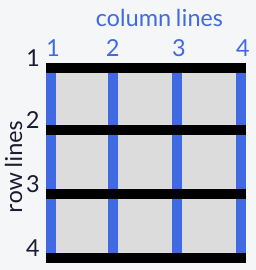

## Introduction aux défis CSS Grid

[CSS Grid | freeCodeCamp.org](https://www.freecodecamp.org/learn/responsive-web-design/css-grid/)

CSS Grid vous aide à  créer facilement des conceptions Web complexes. Cela fonctionne en  transformant un élément HTML en un conteneur de grille avec des lignes et des colonnes pour que vous puissiez placer les éléments enfants où  vous le souhaitez dans la grille.

-----


## 1. Créez votre première grille CSS

[Learn CSS Grid: Create Your First CSS Grid | freeCodeCamp.org](https://www.freecodecamp.org/learn/responsive-web-design/css-grid/create-your-first-css-grid)

Transformez n'importe quel élément HTML en conteneur de grille en  définissant sa propriété `display` sur `grid`. Cela vous donne la  possibilité d'utiliser toutes les autres propriétés associées à CSS Grid.
**Remarque :** Dans CSS Grid, l'élément parent est appelé le *conteneur* ('container') et ses enfants sont appelés *éléments* ('items').

-----

Modifiez l'affichage du `div` avec la classe `container` en `grid`.

> La classe `container` doit avoir une propriété `display` avec une valeur `grid`.

```html
<style>
  .d1{background:LightSkyBlue;}
  .d2{background:LightSalmon;}
  .d3{background:PaleTurquoise;}
  .d4{background:LightPink;}
  .d5{background:PaleGreen;}
  .container {
    font-size: 40px;
    width: 100%;
    background: LightGray;
    /* Changer uniquement le code en dessous de cette ligne */    
    /* Ne changez le code qu'au-dessus de cette ligne */
  }
</style>
<div class="container">
  <div class="d1">1</div>
  <div class="d2">2</div>
  <div class="d3">3</div>
  <div class="d4">4</div>
  <div class="d5">5</div>
</div>
```

<iframe height="300" style="width: 100%;" scrolling="no" title="freeCodeCamp-CSS_Grid-01a.html" src="HTML-Demo_embed/freeCodeCamp-CSS_Grid-01a.html" >
</iframe>

```html
<style>
  .d1{background:LightSkyBlue;}
  .d2{background:LightSalmon;}
  .d3{background:PaleTurquoise;}
  .d4{background:LightPink;}
  .d5{background:PaleGreen;}
  .container {
    font-size: 40px;
    width: 100%;
    background: LightGray;
    display: grid;
  }
</style>
<div class="container">
  <div class="d1">1</div>
  <div class="d2">2</div>
  <div class="d3">3</div>
  <div class="d4">4</div>
  <div class="d5">5</div>
</div>
```

<iframe height="300" style="width: 100%;" scrolling="no" title="freeCodeCamp-CSS_Grid-01b.html" src="HTML-Demo_embed/freeCodeCamp-CSS_Grid-01b.html" >
</iframe>

-----


## 2. Ajouter des colonnes avec `grid-template-columns`

[Learn CSS Grid: Add Columns with grid-template-columns | freeCodeCamp.org](https://www.freecodecamp.org/learn/responsive-web-design/css-grid/add-columns-with-grid-template-columns)

Créer simplement un élément de grille ne vous mène pas très loin. Vous  devez également définir la structure de la grille. Pour ajouter des  colonnes à la grille, utilisez la propriété `grid-template-columns` sur un conteneur de grille comme illustré ci-dessous :

```css
.container {
  display: grid;
  grid-template-columns: 50px 50px;
}
```

Cela donnera à votre grille deux colonnes de 50 pixels de large chacune. Le  nombre de paramètres donnés à la propriété `grid-template-columns` indique le nombre de colonnes dans la grille et la valeur de chaque paramètre  indique la largeur de chaque colonne.

-----

Donnez au conteneur de grille trois colonnes d'une largeur de `100px` chacune.

> La classe `container` doit avoir une propriété `grid-template-columns` avec trois unités de `100px`.

```html
<style>
  .d1{background:LightSkyBlue;}
  .d2{background:LightSalmon;}
  .d3{background:PaleTurquoise;}
  .d4{background:LightPink;}
  .d5{background:PaleGreen;}
  .container {
    font-size: 40px;
    width: 100%;
    background: LightGray;
    display: grid;
    /* Changer uniquement le code en dessous de cette ligne */    
    /* Ne changez le code qu'au-dessus de cette ligne */
  }
</style>
<div class="container">
  <div class="d1">1</div>
  <div class="d2">2</div>
  <div class="d3">3</div>
  <div class="d4">4</div>
  <div class="d5">5</div>
</div>
```

<iframe height="300" style="width: 100%;" scrolling="no" title="freeCodeCamp-CSS_Grid-02a.html" src="HTML-Demo_embed/freeCodeCamp-CSS_Grid-02a.html" >
</iframe>

```html
<style>
  .d1{background:LightSkyBlue;}
  .d2{background:LightSalmon;}
  .d3{background:PaleTurquoise;}
  .d4{background:LightPink;}
  .d5{background:PaleGreen;}
  .container {
    font-size: 40px;
    width: 100%;
    background: LightGray;
    display: grid;
    grid-template-columns: 100px 100px 100px;
  }
</style>
<div class="container">
  <div class="d1">1</div>
  <div class="d2">2</div>
  <div class="d3">3</div>
  <div class="d4">4</div>
  <div class="d5">5</div>
</div>
```

<iframe height="200" style="width: 100%;" scrolling="no" title="freeCodeCamp-CSS_Grid-02b.html" src="HTML-Demo_embed/freeCodeCamp-CSS_Grid-02b.html" >
</iframe>

------


## 3. Ajouter des lignes avec `grid-template-rows`

[Learn CSS Grid: Add Rows with grid-template-rows | freeCodeCamp.org](https://www.freecodecamp.org/learn/responsive-web-design/css-grid/add-rows-with-grid-template-rows)

La grille que vous avez créée lors du dernier défi définira automatiquement le nombre de lignes. Pour ajuster les lignes  manuellement, utilisez la propriété `grid-template-rows` de la même  manière que vous avez utilisé `grid-template-columns` dans le défi  précédent.

-----

Ajoutez deux lignes à la grille de `50px` chacune.

> La classe `container` doit avoir une propriété `grid-template-rows` avec deux unités de `50px`.

```html
<style>
  .d1{background:LightSkyBlue;}
  .d2{background:LightSalmon;}
  .d3{background:PaleTurquoise;}
  .d4{background:LightPink;}
  .d5{background:PaleGreen;}
  .container {
    font-size: 40px;
    width: 100%;
    background: LightGray;
    display: grid;
    grid-template-columns: 100px 100px 100px;
    /* Changer uniquement le code en dessous de cette ligne */    
    /* Ne changez le code qu'au-dessus de cette ligne */
  }
</style>
<div class="container">
  <div class="d1">1</div>
  <div class="d2">2</div>
  <div class="d3">3</div>
  <div class="d4">4</div>
  <div class="d5">5</div>
</div>
```

<iframe height="200" style="width: 100%;" scrolling="no" title="freeCodeCamp-CSS_Grid-03a.html" src="HTML-Demo_embed/freeCodeCamp-CSS_Grid-03a.html" >
</iframe>

```html
<style>
  .d1{background:LightSkyBlue;}
  .d2{background:LightSalmon;}
  .d3{background:PaleTurquoise;}
  .d4{background:LightPink;}
  .d5{background:PaleGreen;}
  .container {
    font-size: 40px;
    width: 100%;
    background: LightGray;
    display: grid;
    grid-template-columns: 100px 100px 100px;
    grid-template-rows: 50px 50px;
  }
</style>
<div class="container">
  <div class="d1">1</div>
  <div class="d2">2</div>
  <div class="d3">3</div>
  <div class="d4">4</div>
  <div class="d5">5</div>
</div>
```

<iframe height="200" style="width: 100%;" scrolling="no" title="freeCodeCamp-CSS_Grid-03b.html" src="HTML-Demo_embed/freeCodeCamp-CSS_Grid-03b.html" >
</iframe>

-----


## 4. Utiliser les unités de CSS Grid pour modifier la taille des colonnes et des lignes

[Learn CSS Grid: Use CSS Grid units to Change the Size of Columns and Rows | freeCodeCamp.org](https://www.freecodecamp.org/learn/responsive-web-design/css-grid/use-css-grid-units-to-change-the-size-of-columns-and-rows)

Vous pouvez utiliser des unités absolues et relatives comme `px` et `em` dans CSS Grid pour définir la taille des lignes et des colonnes. Vous  pouvez également les utiliser :

- `fr` : définit la colonne ou la ligne sur une fraction de l'espace disponible,
- `auto` : règle automatiquement la colonne ou la ligne sur la largeur ou la hauteur de son contenu,
- `%` : ajuste la colonne ou la ligne au pourcentage de largeur de son conteneur.

Voici le code qui génère la sortie dans l'aperçu :

```css
grid-template-columns: auto 50px 10% 2fr 1fr;
```

Cet extrait crée cinq colonnes. La première colonne est aussi large que son contenu, la deuxième colonne est de 50 pixels, la troisième colonne est de 10% de son conteneur, et pour les deux dernières colonnes : l'espace  restant est divisé en trois sections, deux sont allouées pour la  quatrième colonne et une pour la cinquième.

-----

Créez une grille avec trois colonnes dont les largeurs sont les suivantes : 1fr, 100px et 2fr.

> La classe `container` doit avoir une propriété `grid-template-columns` qui a trois colonnes avec les largeurs suivantes : `1fr`, `100px` et `2fr`.

```html
<style>
  .d1{background:LightSkyBlue;}
  .d2{background:LightSalmon;}
  .d3{background:PaleTurquoise;}
  .d4{background:LightPink;}
  .d5{background:PaleGreen;}
  .container {
    font-size: 40px;
    width: 100%;
    background: LightGray;
    display: grid;
    /* Changer uniquement le code en dessous de cette ligne */ 
    grid-template-columns: auto 50px 10% 2fr 1fr;   
    /* Ne changez le code qu'au-dessus de cette ligne */
    grid-template-rows: 50px 50px;
  }
</style>
<div class="container">
  <div class="d1">1</div>
  <div class="d2">2</div>
  <div class="d3">3</div>
  <div class="d4">4</div>
  <div class="d5">5</div>
</div>
```

<iframe height="200" style="width: 100%;" scrolling="no" title="freeCodeCamp-CSS_Grid-04a.html" src="HTML-Demo_embed/freeCodeCamp-CSS_Grid-04a.html" >
</iframe>

```html
<style>
  .d1{background:LightSkyBlue;}
  .d2{background:LightSalmon;}
  .d3{background:PaleTurquoise;}
  .d4{background:LightPink;}
  .d5{background:PaleGreen;}
  .container {
    font-size: 40px;
    width: 100%;
    background: LightGray;
    display: grid;
    grid-template-columns: 1fr 100px 2fr;
    grid-template-rows: 50px 50px;
  }
</style>
<div class="container">
  <div class="d1">1</div>
  <div class="d2">2</div>
  <div class="d3">3</div>
  <div class="d4">4</div>
  <div class="d5">5</div>
</div>
```

<iframe height="200" style="width: 100%;" scrolling="no" title="freeCodeCamp-CSS_Grid-04b.html" src="HTML-Demo_embed/freeCodeCamp-CSS_Grid-04b.html" >
</iframe>

-----


## 5. Créer un espacement de colonne à l'aide de `grid-column-gap`

[Learn CSS Grid: Create a Column Gap Using grid-column-gap | freeCodeCamp.org](https://www.freecodecamp.org/learn/responsive-web-design/css-grid/create-a-column-gap-using-grid-column-gap)

Jusqu'à présent, dans les grilles que vous avez créées, les colonnes ont toutes été serrées les unes contre les autres. Parfois, vous voulez un  espace entre les colonnes. Pour ajouter un espace entre les colonnes,  utilisez la propriété `grid-column-gap` comme ceci :

```css
grid-column-gap: 10px;
```

Cela crée 10px d'espace vide entre toutes nos colonnes.

-----

Donnez aux colonnes de la grille un espace de `20px`.

> La classe `container` doit avoir une propriété `grid-column-gap` qui a la valeur `20px`.

```html
<style>
  .d1{background:LightSkyBlue;}
  .d2{background:LightSalmon;}
  .d3{background:PaleTurquoise;}
  .d4{background:LightPink;}
  .d5{background:PaleGreen;}
  .container {
    font-size: 40px;
    min-height: 300px;
    width: 100%;
    background: LightGray;
    display: grid;
    grid-template-columns: 1fr 1fr 1fr;
    grid-template-rows: 1fr 1fr 1fr;
    /* Changer uniquement le code en dessous de cette ligne */    
    /* Ne changez le code qu'au-dessus de cette ligne */
  }
</style>
<div class="container">
  <div class="d1">1</div>
  <div class="d2">2</div>
  <div class="d3">3</div>
  <div class="d4">4</div>
  <div class="d5">5</div>
</div>
```

<iframe height="350" style="width: 100%;" scrolling="no" title="freeCodeCamp-CSS_Grid-05a.html" src="HTML-Demo_embed/freeCodeCamp-CSS_Grid-05a.html" >
</iframe>

```html
<style>
  .d1{background:LightSkyBlue;}
  .d2{background:LightSalmon;}
  .d3{background:PaleTurquoise;}
  .d4{background:LightPink;}
  .d5{background:PaleGreen;}
  .container {
    font-size: 40px;
    min-height: 300px;
    width: 100%;
    background: LightGray;
    display: grid;
    grid-template-columns: 1fr 1fr 1fr;
    grid-template-rows: 1fr 1fr 1fr;
    grid-column-gap: 20px;
  }
</style>
<div class="container">
  <div class="d1">1</div>
  <div class="d2">2</div>
  <div class="d3">3</div>
  <div class="d4">4</div>
  <div class="d5">5</div>
</div>
```

<iframe height="350" style="width: 100%;" scrolling="no" title="freeCodeCamp-CSS_Grid-05b.html" src="HTML-Demo_embed/freeCodeCamp-CSS_Grid-05b.html" >
</iframe>

-----


## 6. Créer un espacement de ligne à l'aide de `grid-row-gap`

[Learn CSS Grid: Create a Row Gap using grid-row-gap | freeCodeCamp.org](https://www.freecodecamp.org/learn/responsive-web-design/css-grid/create-a-row-gap-using-grid-row-gap)

Vous pouvez ajouter un espace entre les lignes d'une grille en utilisant `grid-row-gap` de la même manière que vous avez ajouté un espace entre les colonnes dans le défi précédent.

-----

Créez un espace pour les lignes de `5px` de haut.

> La classe `container` doit avoir une propriété `grid-row-gap` qui a la valeur `5px`.

```html
<style>
  .d1{background:LightSkyBlue;}
  .d2{background:LightSalmon;}
  .d3{background:PaleTurquoise;}
  .d4{background:LightPink;}
  .d5{background:PaleGreen;}
  .container {
    font-size: 40px;
    min-height: 300px;
    width: 100%;
    background: LightGray;
    display: grid;
    grid-template-columns: 1fr 1fr 1fr;
    grid-template-rows: 1fr 1fr 1fr;
    /* Changer uniquement le code en dessous de cette ligne */    
    /* Ne changez le code qu'au-dessus de cette ligne */
  }
</style>
<div class="container">
  <div class="d1">1</div>
  <div class="d2">2</div>
  <div class="d3">3</div>
  <div class="d4">4</div>
  <div class="d5">5</div>
</div>
```

<iframe height="350" style="width: 100%;" scrolling="no" title="freeCodeCamp-CSS_Grid-06a.html" src="HTML-Demo_embed/freeCodeCamp-CSS_Grid-06a.html" >
</iframe>

```html
<style>
  .d1{background:LightSkyBlue;}
  .d2{background:LightSalmon;}
  .d3{background:PaleTurquoise;}
  .d4{background:LightPink;}
  .d5{background:PaleGreen;}
  .container {
    font-size: 40px;
    min-height: 300px;
    width: 100%;
    background: LightGray;
    display: grid;
    grid-template-columns: 1fr 1fr 1fr;
    grid-template-rows: 1fr 1fr 1fr;
    grid-row-gap: 5px;
  }
</style>
<div class="container">
  <div class="d1">1</div>
  <div class="d2">2</div>
  <div class="d3">3</div>
  <div class="d4">4</div>
  <div class="d5">5</div>
</div>
```

<iframe height="350" style="width: 100%;" scrolling="no" title="freeCodeCamp-CSS_Grid-06b.html" src="HTML-Demo_embed/freeCodeCamp-CSS_Grid-06b.html" >
</iframe>

-----


## 7. Ajoutez des espaces plus rapidement avec `grid-gap`

[Learn CSS Grid: Add Gaps Faster with grid-gap | freeCodeCamp.org](https://www.freecodecamp.org/learn/responsive-web-design/css-grid/add-gaps-faster-with-grid-gap)

`grid-gap` est une propriété raccourcie pour `grid-row-gap` et `grid-column-gap` des deux défis précédents qui est plus pratique à  utiliser. Si `grid-gap` a une valeur, cela créera un espace entre toutes  les lignes et colonnes. Cependant, s'il y a deux valeurs, il utilisera  la première pour définir l'écart entre les lignes et la seconde valeur  pour les colonnes.

-----

Utilisez `grid-gap` pour introduire un espace de `10px` entre les lignes et de `20px` entre les colonnes.

> La classe `container` doit avoir une propriété `grid-gap` qui introduit un espace de `10px` entre les lignes et un espace de `20px` entre les  colonnes.

```html
<style>
  .d1{background:LightSkyBlue;}
  .d2{background:LightSalmon;}
  .d3{background:PaleTurquoise;}
  .d4{background:LightPink;}
  .d5{background:PaleGreen;}
  .container {
    font-size: 40px;
    min-height: 300px;
    width: 100%;
    background: LightGray;
    display: grid;
    grid-template-columns: 1fr 1fr 1fr;
    grid-template-rows: 1fr 1fr 1fr;
    /* Changer uniquement le code en dessous de cette ligne */    
    /* Ne changez le code qu'au-dessus de cette ligne */
  }
</style>
<div class="container">
  <div class="d1">1</div>
  <div class="d2">2</div>
  <div class="d3">3</div>
  <div class="d4">4</div>
  <div class="d5">5</div>
</div>
```

<iframe height="350" style="width: 100%;" scrolling="no" title="freeCodeCamp-CSS_Grid-07a.html" src="HTML-Demo_embed/freeCodeCamp-CSS_Grid-07a.html" >
</iframe>

```html
<style>
  .d1{background:LightSkyBlue;}
  .d2{background:LightSalmon;}
  .d3{background:PaleTurquoise;}
  .d4{background:LightPink;}
  .d5{background:PaleGreen;}
  .container {
    font-size: 40px;
    min-height: 300px;
    width: 100%;
    background: LightGray;
    display: grid;
    grid-template-columns: 1fr 1fr 1fr;
    grid-template-rows: 1fr 1fr 1fr;
    grid-gap: 10px 20px;
  }
</style>
<div class="container">
  <div class="d1">1</div>
  <div class="d2">2</div>
  <div class="d3">3</div>
  <div class="d4">4</div>
  <div class="d5">5</div>
</div>
```

<iframe height="350" style="width: 100%;" scrolling="no" title="freeCodeCamp-CSS_Grid-07b.html" src="HTML-Demo_embed/freeCodeCamp-CSS_Grid-07b.html" >
</iframe>

-----


## 8. Utiliser `grid-column` pour contrôler l'espacement

[Learn CSS Grid: Use grid-column to Control Spacing | freeCodeCamp.org](https://www.freecodecamp.org/learn/responsive-web-design/css-grid/use-grid-column-to-control-spacing)

Jusqu'à présent, toutes les propriétés qui ont été discutées concernent  les conteneurs de grille. La propriété `grid-column` est la première à  être utilisée sur les éléments de la grille eux-mêmes.
Les lignes horizontales et verticales hypothétiques qui créent la grille sont appelées *lines*. Ces lignes sont numérotées en commençant par 1 dans le  coin supérieur gauche de la grille et se déplacent vers la droite pour  les colonnes et vers le bas pour les lignes, en comptant vers le haut.
Voici à quoi ressemblent les lignes pour une grille 3x3 :



Pour contrôler la quantité de colonnes consommée par un élément, vous pouvez utiliser la propriété `grid-column` en conjonction avec les numéros de  ligne auxquels vous souhaitez que l'élément commence et s'arrête.
Voici un exemple :

```css
grid-column: 1 / 3;
```

Cela fera que l'élément commence à la première ligne verticale de la grille  sur la gauche et s'étendra jusqu'à la 3<sup>ème</sup> ligne de la grille,  consommant deux colonnes.

-----

Faites en sorte que l'élément avec la classe `item5` consomme les deux dernières colonnes de la grille.

> La classe `item5` doit avoir une propriété `grid-column`.
> La classe `item5` doit avoir une propriété `grid-column` qui entraîne la consommation des deux dernières colonnes de la grille.

```html
<style>
  .item1{background:LightSkyBlue;}
  .item2{background:LightSalmon;}
  .item3{background:PaleTurquoise;}
  .item4{background:LightPink;}
  .item5 {
    background: PaleGreen;
    /* Changer uniquement le code en dessous de cette ligne */    
    /* Ne changez le code qu'au-dessus de cette ligne */
  }
  .container {
    font-size: 40px;
    min-height: 300px;
    width: 100%;
    background: LightGray;
    display: grid;
    grid-template-columns: 1fr 1fr 1fr;
    grid-template-rows: 1fr 1fr 1fr;
    grid-gap: 10px;
  }
</style>
<div class="container">
  <div class="item1">1</div>
  <div class="item2">2</div>
  <div class="item3">3</div>
  <div class="item4">4</div>
  <div class="item5">5</div>
</div>
```

<iframe height="350" style="width: 100%;" scrolling="no" title="freeCodeCamp-CSS_Grid-08a.html" src="HTML-Demo_embed/freeCodeCamp-CSS_Grid-08a.html" >
</iframe>

```html
<style>
  .item1{background:LightSkyBlue;}
  .item2{background:LightSalmon;}
  .item3{background:PaleTurquoise;}
  .item4{background:LightPink;}
  .item5 {
    background: PaleGreen;
    grid-column: 2 / 4;
  }
  .container {
    font-size: 40px;
    min-height: 300px;
    width: 100%;
    background: LightGray;
    display: grid;
    grid-template-columns: 1fr 1fr 1fr;
    grid-template-rows: 1fr 1fr 1fr;
    grid-gap: 10px;
  }
</style>
<div class="container">
  <div class="item1">1</div>
  <div class="item2">2</div>
  <div class="item3">3</div>
  <div class="item4">4</div>
  <div class="item5">5</div>
</div>
```

<iframe height="350" style="width: 100%;" scrolling="no" title="freeCodeCamp-CSS_Grid-08b.html" src="HTML-Demo_embed/freeCodeCamp-CSS_Grid-08b.html" >
</iframe>

-----


## 9. Utiliser `grid-row` pour contrôler l'espacement

[Learn CSS Grid: Use grid-row to Control Spacing | freeCodeCamp.org](https://www.freecodecamp.org/learn/responsive-web-design/css-grid/use-grid-row-to-control-spacing)

Bien sûr, vous pouvez faire en sorte que les éléments consomment  plusieurs lignes comme vous le pouvez avec des colonnes. Vous définissez les lignes horizontales auxquelles vous souhaitez qu'un élément  commence et s'arrête à l'aide de la propriété `grid-row` sur un élément de grille.

-----

Faites en sorte que l'élément avec la classe `item5` consomme les deux dernières lignes.

> La classe `item5` doit avoir une propriété `grid-row`.
> La classe `item5` doit avoir une propriété `grid-row` qui entraîne la consommation des deux dernières lignes de la grille.

```html
<style>
  .item1{background:LightSkyBlue;}
  .item2{background:LightSalmon;}
  .item3{background:PaleTurquoise;}
  .item4{background:LightPink;}
  .item5 {
    background: PaleGreen;
    grid-column: 2 / 4;
    /* Changer uniquement le code en dessous de cette ligne */    
    /* Ne changez le code qu'au-dessus de cette ligne */
  }
  .container {
    font-size: 40px;
    min-height: 300px;
    width: 100%;
    background: LightGray;
    display: grid;
    grid-template-columns: 1fr 1fr 1fr;
    grid-template-rows: 1fr 1fr 1fr;
    grid-gap: 10px;
  }
</style>
<div class="container">
  <div class="item1">1</div>
  <div class="item2">2</div>
  <div class="item3">3</div>
  <div class="item4">4</div>
  <div class="item5">5</div>
</div>
```

<iframe height="350" style="width: 100%;" scrolling="no" title="freeCodeCamp-CSS_Grid-09a.html" src="HTML-Demo_embed/freeCodeCamp-CSS_Grid-09a.html" >
</iframe>

```html
<style>
  .item1{background:LightSkyBlue;}
  .item2{background:LightSalmon;}
  .item3{background:PaleTurquoise;}
  .item4{background:LightPink;}
  .item5 {
    background: PaleGreen;
    grid-column: 2 / 4;
    grid-row: 2 / 4;
  }
  .container {
    font-size: 40px;
    min-height: 300px;
    width: 100%;
    background: LightGray;
    display: grid;
    grid-template-columns: 1fr 1fr 1fr;
    grid-template-rows: 1fr 1fr 1fr;
    grid-gap: 10px;
  }
</style>
<div class="container">
  <div class="item1">1</div>
  <div class="item2">2</div>
  <div class="item3">3</div>
  <div class="item4">4</div>
  <div class="item5">5</div>
</div>
```

<iframe height="350" style="width: 100%;" scrolling="no" title="freeCodeCamp-CSS_Grid-09b.html" src="HTML-Demo_embed/freeCodeCamp-CSS_Grid-09b.html" >
</iframe>

-----


## 10. Aligner un élément horizontalement à l'aide de `justify-self`

[Learn CSS Grid: Align an Item Horizontally using justify-self | freeCodeCamp.org](https://www.freecodecamp.org/learn/responsive-web-design/css-grid/align-an-item-horizontally-using-justify-self)

Dans CSS Grid, le contenu de chaque élément est situé dans une boîte qui est appelée *cellule* (*cell*). Vous pouvez aligner la position du contenu dans sa cellule horizontalement à l'aide de la propriété `justify-self` sur un  élément de la grille. Par défaut, cette propriété a une valeur `stretch`, ce qui fera que le contenu remplira toute la largeur de la  cellule. Cette propriété CSS Grid accepte également d'autres valeurs :

- `start` : aligne le contenu à gauche de la cellule,
- `center` : aligne le contenu au centre de la cellule,
- `end` : aligne le contenu à droite de la cellule.

-----

Utilisez la propriété `justify-self` pour centrer l'élément avec la classe `item2`.

> La classe `item2` doit avoir une propriété `justify-self` qui a la valeur center.

```html
<style>
  .item1{background: LightSkyBlue;}
  .item2 {
    background: LightSalmon;
    /* Changer uniquement le code en dessous de cette ligne */    
    /* Ne changez le code qu'au-dessus de cette ligne */
  }
  .item3{background:PaleTurquoise;}
  .item4{background:LightPink;}
  .item5{background:PaleGreen;}
  .container {
    font-size: 40px;
    min-height: 300px;
    width: 100%;
    background: LightGray;
    display: grid;
    grid-template-columns: 1fr 1fr 1fr;
    grid-template-rows: 1fr 1fr 1fr;
    grid-gap: 10px;
  }
</style>
<div class="container">
  <div class="item1">1</div>
  <div class="item2">2</div>
  <div class="item3">3</div>
  <div class="item4">4</div>
  <div class="item5">5</div>
</div>
```

<iframe height="350" style="width: 100%;" scrolling="no" title="freeCodeCamp-CSS_Grid-10a.html" src="HTML-Demo_embed/freeCodeCamp-CSS_Grid-10a.html" >
</iframe>

```html
<style>
  .item1{background: LightSkyBlue;}
  .item2 {
    background: LightSalmon;
    justify-self: center;
  }
  .item3{background:PaleTurquoise;}
  .item4{background:LightPink;}
  .item5{background:PaleGreen;}
  .container {
    font-size: 40px;
    min-height: 300px;
    width: 100%;
    background: LightGray;
    display: grid;
    grid-template-columns: 1fr 1fr 1fr;
    grid-template-rows: 1fr 1fr 1fr;
    grid-gap: 10px;
  }
</style>
<div class="container">
  <div class="item1">1</div>
  <div class="item2">2</div>
  <div class="item3">3</div>
  <div class="item4">4</div>
  <div class="item5">5</div>
</div>
```

<iframe height="350" style="width: 100%;" scrolling="no" title="freeCodeCamp-CSS_Grid-10b.html" src="HTML-Demo_embed/freeCodeCamp-CSS_Grid-10b.html" >
</iframe>

-----


## 11. Aligner un élément verticalement en utilisant `align-self`

[Learn CSS Grid: Align an Item Vertically using align-self | freeCodeCamp.org](https://www.freecodecamp.org/learn/responsive-web-design/css-grid/align-an-item-vertically-using-align-self)

Tout comme vous pouvez aligner un élément horizontalement, il existe  également un moyen d'aligner un élément verticalement. Pour ce faire,  vous utilisez la propriété `align-self` sur un élément. Cette propriété  accepte toutes les mêmes valeurs que `justify-self` du dernier défi.

-----

Alignez verticalement l'élément avec `item3` à `end`.

> La classe `item3` doit avoir une propriété `align-self` qui a la valeur `end`.

```html
<style>
  .item1{background:LightSkyBlue;}
  .item2{background:LightSalmon;}
  .item3 {
    background: PaleTurquoise;
    /* Changer uniquement le code en dessous de cette ligne */    
    /* Ne changez le code qu'au-dessus de cette ligne */
  }
  .item4{background:LightPink;}
  .item5{background:PaleGreen;}
  .container {
    font-size: 40px;
    min-height: 300px;
    width: 100%;
    background: LightGray;
    display: grid;
    grid-template-columns: 1fr 1fr 1fr;
    grid-template-rows: 1fr 1fr 1fr;
    grid-gap: 10px;
  }
</style>
<div class="container">
  <div class="item1">1</div>
  <div class="item2">2</div>
  <div class="item3">3</div>
  <div class="item4">4</div>
  <div class="item5">5</div>
</div>
```

<iframe height="350" style="width: 100%;" scrolling="no" title="freeCodeCamp-CSS_Grid-11a.html" src="HTML-Demo_embed/freeCodeCamp-CSS_Grid-11a.html" >
</iframe>

```html
<style>
  .item1{background:LightSkyBlue;}
  .item2{background:LightSalmon;}
  .item3 {
    background: PaleTurquoise;
    align-self: end;
  }
  .item4{background:LightPink;}
  .item5{background:PaleGreen;}
  .container {
    font-size: 40px;
    min-height: 300px;
    width: 100%;
    background: LightGray;
    display: grid;
    grid-template-columns: 1fr 1fr 1fr;
    grid-template-rows: 1fr 1fr 1fr;
    grid-gap: 10px;
  }
</style>
<div class="container">
  <div class="item1">1</div>
  <div class="item2">2</div>
  <div class="item3">3</div>
  <div class="item4">4</div>
  <div class="item5">5</div>
</div>
```

<iframe height="350" style="width: 100%;" scrolling="no" title="freeCodeCamp-CSS_Grid-11b.html" src="HTML-Demo_embed/freeCodeCamp-CSS_Grid-11b.html" >
</iframe>

-----


## 12. Aligner tous les éléments horizontalement à l'aide de `justify-items`

[Learn CSS Grid: Align All Items Horizontally using justify-items | freeCodeCamp.org](https://www.freecodecamp.org/learn/responsive-web-design/css-grid/align-all-items-horizontally-using-justify-items)

Parfois, vous souhaitez que tous les éléments de votre grille CSS  partagent le même alignement. Vous pouvez utiliser les propriétés  précédemment apprises et les aligner individuellement, ou vous pouvez  les aligner toutes à la fois horizontalement en utilisant `justify-items` sur votre conteneur de grille. Cette propriété peut accepter toutes les  mêmes valeurs que vous avez apprises dans les deux défis précédents, la  différence étant qu'elle déplacera tous les éléments de notre grille  vers l'alignement souhaité.

-----

Utilisez cette propriété pour centrer tous nos articles horizontalement.

> La classe `container` doit avoir une propriété `justify-items` qui a la valeur `center`.

```html
<style>
  .item1{background:LightSkyBlue;}
  .item2{background:LightSalmon;}
  .item3{background:PaleTurquoise;}
  .item4{background:LightPink;}
  .item5{background:PaleGreen;}
  .container {
    font-size: 40px;
    min-height: 300px;
    width: 100%;
    background: LightGray;
    display: grid;
    grid-template-columns: 1fr 1fr 1fr;
    grid-template-rows: 1fr 1fr 1fr;
    grid-gap: 10px;
    /* Changer uniquement le code en dessous de cette ligne */    
    /* Ne changez le code qu'au-dessus de cette ligne */
  }
</style>
<div class="container">
  <div class="item1">1</div>
  <div class="item2">2</div>
  <div class="item3">3</div>
  <div class="item4">4</div>
  <div class="item5">5</div>
</div>
```

<iframe height="350" style="width: 100%;" scrolling="no" title="freeCodeCamp-CSS_Grid-12a.html" src="HTML-Demo_embed/freeCodeCamp-CSS_Grid-12a.html" >
</iframe>

```html
<style>
  .item1{background:LightSkyBlue;}
  .item2{background:LightSalmon;}
  .item3{background:PaleTurquoise;}
  .item4{background:LightPink;}
  .item5{background:PaleGreen;}
  .container {
    font-size: 40px;
    min-height: 300px;
    width: 100%;
    background: LightGray;
    display: grid;
    grid-template-columns: 1fr 1fr 1fr;
    grid-template-rows: 1fr 1fr 1fr;
    grid-gap: 10px;
    justify-items: center;
  }
</style>
<div class="container">
  <div class="item1">1</div>
  <div class="item2">2</div>
  <div class="item3">3</div>
  <div class="item4">4</div>
  <div class="item5">5</div>
</div>
```

<iframe height="350" style="width: 100%;" scrolling="no" title="freeCodeCamp-CSS_Grid-12b.html" src="HTML-Demo_embed/freeCodeCamp-CSS_Grid-12b.html" >
</iframe>

-----


## 13. Aligner tous les éléments verticalement à l'aide de `align-items`

[Learn CSS Grid: Align All Items Vertically using align-items | freeCodeCamp.org](https://www.freecodecamp.org/learn/responsive-web-design/css-grid/align-all-items-vertically-using-align-items)

L'utilisation de la propriété `align-items` sur un conteneur de grille  définira l'alignement vertical de tous les éléments de notre grille.

Utilisez-le maintenant pour déplacer tous les éléments à la fin de chaque cellule.

> La classe `container` doit avoir une propriété `align-items` qui a la valeur `end`.

```html
<style>
  .item1{background:LightSkyBlue;}
  .item2{background:LightSalmon;}
  .item3{background:PaleTurquoise;}
  .item4{background:LightPink;}
  .item5{background:PaleGreen;}
  .container {
    font-size: 40px;
    min-height: 300px;
    width: 100%;
    background: LightGray;
    display: grid;
    grid-template-columns: 1fr 1fr 1fr;
    grid-template-rows: 1fr 1fr 1fr;
    grid-gap: 10px;
    /* Changer uniquement le code en dessous de cette ligne */    
    /* Ne changez le code qu'au-dessus de cette ligne */
  }
</style>
<div class="container">
  <div class="item1">1</div>
  <div class="item2">2</div>
  <div class="item3">3</div>
  <div class="item4">4</div>
  <div class="item5">5</div>
</div>
```

<iframe height="350" style="width: 100%;" scrolling="no" title="freeCodeCamp-CSS_Grid-13a.html" src="HTML-Demo_embed/freeCodeCamp-CSS_Grid-13a.html" >
</iframe>

```html
<style>
  .item1{background:LightSkyBlue;}
  .item2{background:LightSalmon;}
  .item3{background:PaleTurquoise;}
  .item4{background:LightPink;}
  .item5{background:PaleGreen;}
  .container {
    font-size: 40px;
    min-height: 300px;
    width: 100%;
    background: LightGray;
    display: grid;
    grid-template-columns: 1fr 1fr 1fr;
    grid-template-rows: 1fr 1fr 1fr;
    grid-gap: 10px;
    align-items: end;
  }
</style>
<div class="container">
  <div class="item1">1</div>
  <div class="item2">2</div>
  <div class="item3">3</div>
  <div class="item4">4</div>
  <div class="item5">5</div>
</div>
```

<iframe height="350" style="width: 100%;" scrolling="no" title="freeCodeCamp-CSS_Grid-13b.html" src="HTML-Demo_embed/freeCodeCamp-CSS_Grid-13b.html" >
</iframe>

-----


## 14. Diviser la grille en un modèle de zone

[Learn CSS Grid: Divide the Grid Into an Area Template | freeCodeCamp.org](https://www.freecodecamp.org/learn/responsive-web-design/css-grid/divide-the-grid-into-an-area-template)

Vous pouvez regrouper les cellules de votre grille dans une *zone* (*area*) et lui  donner un nom personnalisé. Pour ce faire, utilisez `grid-template-areas`  sur le conteneur comme ceci :

```css
grid-template-areas:
  "header header header"
  "advert content content"
  "footer footer footer";
```

Le code ci-dessus fusionne les trois cellules du haut ensemble dans une  zone nommée `header`, les trois cellules du bas dans une zone `footer` et crée deux zones dans la ligne du milieu : `advert` et `content`.  **Remarque :** chaque mot du code représente une cellule et chaque paire de  guillemets représente une ligne. En plus des étiquettes personnalisées,  vous pouvez utiliser un point (`.`) pour désigner une cellule vide dans la grille.

-----

Placez le modèle de zone de sorte que la cellule étiquetée `advert` devienne une cellule vide.

> La classe `container` doit avoir une propriété `grid-template-areas`  similaire à l'aperçu, mais a `.` au lieu de `advert`.

```html
<style>
  .item1{background:LightSkyBlue;}
  .item2{background:LightSalmon;}
  .item3{background:PaleTurquoise;}
  .item4{background:LightPink;}
  .item5{background:PaleGreen;}
  .container {
    font-size: 40px;
    min-height: 300px;
    width: 100%;
    background: LightGray;
    display: grid;
    grid-template-columns: 1fr 1fr 1fr;
    grid-template-rows: 1fr 1fr 1fr;
    grid-gap: 10px;
    grid-template-areas:
    /* Changer uniquement le code en dessous de cette ligne */
      "header header header"
      "advert content content"
      "footer footer footer";
    /* Ne changez le code qu'au-dessus de cette ligne */
  }
</style>
<div class="container">
  <div class="item1">1</div>
  <div class="item2">2</div>
  <div class="item3">3</div>
  <div class="item4">4</div>
  <div class="item5">5</div>
</div>
```

<iframe height="350" style="width: 100%;" scrolling="no" title="freeCodeCamp-CSS_Grid-14a.html" src="HTML-Demo_embed/freeCodeCamp-CSS_Grid-14a.html" >
</iframe>

```html
<style>
  .item1{background:LightSkyBlue;}
  .item2{background:LightSalmon;}
  .item3{background:PaleTurquoise;}
  .item4{background:LightPink;}
  .item5{background:PaleGreen;}
  .container {
    font-size: 40px;
    min-height: 300px;
    width: 100%;
    background: LightGray;
    display: grid;
    grid-template-columns: 1fr 1fr 1fr;
    grid-template-rows: 1fr 1fr 1fr;
    grid-gap: 10px;
    grid-template-areas:
      "header header header"
      ". content content"
      "footer footer footer";
    }
</style>
<div class="container">
  <div class="item1">1</div>
  <div class="item2">2</div>
  <div class="item3">3</div>
  <div class="item4">4</div>
  <div class="item5">5</div>
</div>
```

<iframe height="350" style="width: 100%;" scrolling="no" title="freeCodeCamp-CSS_Grid-14b.html" src="HTML-Demo_embed/freeCodeCamp-CSS_Grid-14b.html" >
</iframe>

-----


## 15. Placer des éléments dans des zones de grille à l'aide de la propriété `grid-area`

[Learn CSS Grid: Place Items in Grid Areas Using the grid-area Property | freeCodeCamp.org](https://www.freecodecamp.org/learn/responsive-web-design/css-grid/place-items-in-grid-areas-using-the-grid-area-property)

Après avoir créé un modèle de zone pour votre conteneur de grille, comme indiqué dans le défi précédent, vous pouvez placer un élément dans  votre zone personnalisée en référençant le nom que vous lui avez donné.  Pour ce faire, vous utilisez la propriété `grid-area` sur un élément comme celui-ci :

```css
.item1 {
  grid-area: header;
}
```

Cela permet à la grille de savoir que vous voulez que la classe `item1` aille  dans la zone nommée `header`. Dans ce cas, l'élément utilisera la ligne du haut entière car cette ligne entière est nommée comme zone d'en-tête.

-----

Placez un élément avec la classe `item5` dans la zone `footer` à l'aide de la propriété `grid-area`.

> La classe `item5` doit avoir une propriété `grid-area` qui a la valeur `footer`.

```html
<style>
  .item1{background:LightSkyBlue;}
  .item2{background:LightSalmon;}
  .item3{background:PaleTurquoise;}
  .item4{background:LightPink;}
  .item5 {
    background: PaleGreen;
    /* Changer uniquement le code en dessous de cette ligne */    
    /* Ne changez le code qu'au-dessus de cette ligne */
  }
  .container {
    font-size: 40px;
    min-height: 300px;
    width: 100%;
    background: LightGray;
    display: grid;
    grid-template-columns: 1fr 1fr 1fr;
    grid-template-rows: 1fr 1fr 1fr;
    grid-gap: 10px;
    grid-template-areas:
      "header header header"
      "advert content content"
      "footer footer footer";
  }
</style>
<div class="container">
  <div class="item1">1</div>
  <div class="item2">2</div>
  <div class="item3">3</div>
  <div class="item4">4</div>
  <div class="item5">5</div>
</div>
```

<iframe height="350" style="width: 100%;" scrolling="no" title="freeCodeCamp-CSS_Grid-15a.html" src="HTML-Demo_embed/freeCodeCamp-CSS_Grid-15a.html" >
</iframe>

```html
<style>
  .item1{background:LightSkyBlue;}
  .item2{background:LightSalmon;}
  .item3{background:PaleTurquoise;}
  .item4{background:LightPink;}
  .item5 {
    background: PaleGreen;
	grid-area: footer;
  }
  .container {
    font-size: 40px;
    min-height: 300px;
    width: 100%;
    background: LightGray;
    display: grid;
    grid-template-columns: 1fr 1fr 1fr;
    grid-template-rows: 1fr 1fr 1fr;
    grid-gap: 10px;
    grid-template-areas:
      "header header header"
      "advert content content"
      "footer footer footer";
  }
</style>
<div class="container">
  <div class="item1">1</div>
  <div class="item2">2</div>
  <div class="item3">3</div>
  <div class="item4">4</div>
  <div class="item5">5</div>
</div>
```

<iframe height="350" style="width: 100%;" scrolling="no" title="freeCodeCamp-CSS_Grid-15b.html" src="HTML-Demo_embed/freeCodeCamp-CSS_Grid-15b.html" >
</iframe>

-----


## 16. Utiliser `grid-area` sans créer de modèle de zones

[Learn CSS Grid: Use grid-area Without Creating an Areas Template | freeCodeCamp.org](https://www.freecodecamp.org/learn/responsive-web-design/css-grid/use-grid-area-without-creating-an-areas-template)

La propriété `grid-area` que vous avez apprise lors du dernier  défi peut être utilisée d'une autre manière. Si votre grille n'a pas de  modèle de zones à référencer, vous pouvez créer une zone à la volée pour qu'un élément soit placé comme ceci :

```css
item1 { grid-area: 1/1/2/4; }
```

Cela utilise les numéros de ligne que vous avez appris plus tôt pour définir la zone de cet élément. Les nombres dans l'exemple ci-dessus  représentent ces valeurs :

```css
grid-area: ligne horizontale pour commencer à / ligne verticale pour commencer à / ligne horizontale pour  terminer à / ligne verticale pour terminer à;
```

Ainsi, l'élément de l'exemple consommera les lignes entre les lignes 1 et 2 et les colonnes entre les lignes 1 et 4.

-----

À l'aide de la propriété `grid-area`, placez l'élément avec la classe `item5` entre les troisième et quatrième lignes horizontales et entre les  première et quatrième lignes verticales.

> La classe `item5` doit avoir  une propriété `grid-area` pour qu'elle remplisse toute la zone  entre les troisième et quatrième lignes horizontales et les première et  quatrième lignes verticales.

```html
<style>
  .item1{background:LightSkyBlue;}
  .item2{background:LightSalmon;}
  .item3{background:PaleTurquoise;}
  .item4{background:LightPink;}
  .item5 {
    background: PaleGreen;
    /* Changer uniquement le code en dessous de cette ligne */    
    /* Ne changez le code qu'au-dessus de cette ligne */
  }
  .container {
    font-size: 40px;
    min-height: 300px;
    width: 100%;
    background: LightGray;
    display: grid;
    grid-template-columns: 1fr 1fr 1fr;
    grid-template-rows: 1fr 1fr 1fr;
    grid-gap: 10px;
  }
</style>
<div class="container">
  <div class="item1">1</div>
  <div class="item2">2</div>
  <div class="item3">3</div>
  <div class="item4">4</div>
  <div class="item5">5</div>
</div>
```

<iframe height="350" style="width: 100%;" scrolling="no" title="freeCodeCamp-CSS_Grid-16a.html" src="HTML-Demo_embed/freeCodeCamp-CSS_Grid-16a.html" >
</iframe>

```html
<style>
  .item1{background:LightSkyBlue;}
  .item2{background:LightSalmon;}
  .item3{background:PaleTurquoise;}
  .item4{background:LightPink;}
  .item5 {
    background: PaleGreen;
    grid-area: 3/1/4/4;
  }
  .container {
    font-size: 40px;
    min-height: 300px;
    width: 100%;
    background: LightGray;
    display: grid;
    grid-template-columns: 1fr 1fr 1fr;
    grid-template-rows: 1fr 1fr 1fr;
    grid-gap: 10px;
  }
</style>
<div class="container">
  <div class="item1">1</div>
  <div class="item2">2</div>
  <div class="item3">3</div>
  <div class="item4">4</div>
  <div class="item5">5</div>
</div>
```

<iframe height="350" style="width: 100%;" scrolling="no" title="freeCodeCamp-CSS_Grid-16b.html" src="HTML-Demo_embed/freeCodeCamp-CSS_Grid-16b.html" >
</iframe>

-----


## 17. Réduire la répétition à l'aide de la fonction `repeat`

[Learn CSS Grid: Reduce Repetition Using the repeat Function | freeCodeCamp.org](https://www.freecodecamp.org/learn/responsive-web-design/css-grid/reduce-repetition-using-the-repeat-function)

Lorsque vous avez utilisé `grid-template-columns` et `grid-template-rows` pour définir la structure d'une grille, vous avez  entré une valeur pour chaque ligne ou colonne que vous avez créée.
Disons que vous voulez une grille avec 100 lignes de la même hauteur. Il n'est pas très pratique d'insérer 100 valeurs individuellement. Heureusement, il existe un meilleur moyen - en utilisant la fonction `repeat` pour spécifier le nombre de fois que vous voulez que votre colonne ou  ligne soit répétée, suivi d'une virgule et de la valeur que vous voulez  répéter.
Voici un exemple qui créerait la grille de 100 lignes, chaque ligne mesurant 50 px de haut.

```css
grid-template-rows: repeat(100, 50px);
```

Vous pouvez également répéter plusieurs valeurs avec la fonction de  répétition et insérer la fonction parmi d'autres valeurs lors de la  définition d'une structure de grille. Voici à quoi cela ressemble :

```css
grid-template-columns: repeat(2, 1fr 50px) 20px;
```

Cela se traduit par :

```css
grid-template-columns: 1fr 50px 1fr 50px 20px;
```

**Remarque :** le `1fr 50px` est répété deux fois suivi de 20px.

-----

Utilisez `repeat` pour supprimer la répétition de la propriété `grid-template-columns`.

> La classe `container` doit avoir une propriété `grid-template-columns` qui  est définie pour répéter 3 colonnes avec une largeur de `1fr`.

```html
<style>
  .item1{background:LightSkyBlue;}
  .item2{background:LightSalmon;}
  .item3{background:PaleTurquoise;}
  .item4{background:LightPink;}
  .item5{background:PaleGreen;}
  .container {
    font-size: 40px;
    min-height: 300px;
    width: 100%;
    background: LightGray;
    display: grid;
    /* Changer uniquement le code en dessous de cette ligne */
    grid-template-columns: 1fr 1fr 1fr;
    /* Ne changez le code qu'au-dessus de cette ligne */
    grid-template-rows: 1fr 1fr 1fr;
    grid-gap: 10px;
  }
</style>
<div class="container">
  <div class="item1">1</div>
  <div class="item2">2</div>
  <div class="item3">3</div>
  <div class="item4">4</div>
  <div class="item5">5</div>
</div>
```

<iframe height="350" style="width: 100%;" scrolling="no" title="freeCodeCamp-CSS_Grid-17a.html" src="HTML-Demo_embed/freeCodeCamp-CSS_Grid-17a.html" >
</iframe>

```html
<style>
  .item1{background:LightSkyBlue;}
  .item2{background:LightSalmon;}
  .item3{background:PaleTurquoise;}
  .item4{background:LightPink;}
  .item5{background:PaleGreen;}
  .container {
    font-size: 40px;
    min-height: 300px;
    width: 100%;
    background: LightGray;
    display: grid;
    grid-template-columns: repeat(3, 1fr);
    grid-template-rows: 1fr 1fr 1fr;
    grid-gap: 10px;
  }
</style>
<div class="container">
  <div class="item1">1</div>
  <div class="item2">2</div>
  <div class="item3">3</div>
  <div class="item4">4</div>
  <div class="item5">5</div>
</div>
```

<iframe height="350" style="width: 100%;" scrolling="no" title="freeCodeCamp-CSS_Grid-17b.html" src="HTML-Demo_embed/freeCodeCamp-CSS_Grid-17b.html" >
</iframe>

-----


## 18. Limiter la taille de l'élément à l'aide de la fonction `minmax`

[Learn CSS Grid: Limit Item Size Using the minmax Function | freeCodeCamp.org](https://www.freecodecamp.org/learn/responsive-web-design/css-grid/limit-item-size-using-the-minmax-function)

Il existe une autre fonction intégrée à utiliser avec les colonnes `grid-template-columns` et `grid-template-rows` appelée `minmax`. Il est  utilisé pour limiter la taille des éléments lorsque le conteneur de  grille change de taille. Pour ce faire, vous devez spécifier la plage de taille acceptable pour votre article. Voici un exemple :

```css
grid-template-columns: 100px minmax(50px, 200px);
```

Dans le code ci-dessus, `grid-template-columns` est configuré pour créer deux  colonnes : le premier a une largeur de 100 pixels et le second a une  largeur minimale de 50 pixels et une largeur maximale de 200 pixels.

-----

À l'aide de la fonction `minmax`, remplacez le `1fr` dans la fonction `repeat` par une taille de colonne qui a la largeur minimale de `90px`  et la largeur maximale de `1fr`, et redimensionnez le panneau d'aperçu  pour voir l'effet.

> La classe `container` doit avoir une propriété  `grid-template-columns` qui est définie pour répéter 3 colonnes avec une  largeur minimale de `90px` et une largeur maximale de `1fr`.

```html
<style>
  .item1{background:LightSkyBlue;}
  .item2{background:LightSalmon;}
  .item3{background:PaleTurquoise;}
  .item4{background:LightPink;}
  .item5{background:PaleGreen;}
  .container {
    font-size: 40px;
    min-height: 300px;
    width: 100%;
    background: LightGray;
    display: grid;
    /* Changer uniquement le code en dessous de cette ligne */
    grid-template-columns: repeat(3, 1fr);
    /* Ne changez le code qu'au-dessus de cette ligne */
    grid-template-rows: 1fr 1fr 1fr;
    grid-gap: 10px;
  }
</style>
<div class="container">
  <div class="item1">1</div>
  <div class="item2">2</div>
  <div class="item3">3</div>
  <div class="item4">4</div>
  <div class="item5">5</div>
</div>
```

<iframe height="350" style="width: 100%;" scrolling="no" title="freeCodeCamp-CSS_Grid-18a.html" src="HTML-Demo_embed/freeCodeCamp-CSS_Grid-18a.html" >
</iframe>

```html
<style>
  .item1{background:LightSkyBlue;}
  .item2{background:LightSalmon;}
  .item3{background:PaleTurquoise;}
  .item4{background:LightPink;}
  .item5{background:PaleGreen;}
  .container {
    font-size: 40px;
    min-height: 300px;
    width: 100%;
    background: LightGray;
    display: grid;
    grid-template-columns: repeat(3, minmax(90px, 1fr));
    grid-template-rows: 1fr 1fr 1fr;
    grid-gap: 10px;
  }
</style>
<div class="container">
  <div class="item1">1</div>
  <div class="item2">2</div>
  <div class="item3">3</div>
  <div class="item4">4</div>
  <div class="item5">5</div>
</div>
```

<iframe height="350" style="width: 100%;" scrolling="no" title="freeCodeCamp-CSS_Grid-18b.html" src="HTML-Demo_embed/freeCodeCamp-CSS_Grid-18b.html" >
</iframe>

-----


## 19. Créer des mises en page flexibles à l'aide de `auto-fill`

[Learn CSS Grid: Create Flexible Layouts Using auto-fill | freeCodeCamp.org](https://www.freecodecamp.org/learn/responsive-web-design/css-grid/create-flexible-layouts-using-auto-fill)

La fonction de répétition est fournie avec une option appelée *remplissage automatique* (*auto-fill*) . Cela vous permet d'insérer automatiquement  autant de lignes ou de colonnes de la taille souhaitée que possible en  fonction de la taille du conteneur. Vous pouvez créer des mises en page  flexibles lorsque vous combinez `auto-fill` avec `minmax`,  comme ceci :

```css
repeat(auto-fill, minmax(60px, 1fr));
```

Lorsque le conteneur change de taille, cette configuration continue d'insérer  des colonnes de 60 pixels et de les étirer jusqu'à ce qu'elle puisse en  insérer une autre. **Remarque :** si votre conteneur ne peut pas contenir  tous vos articles sur une seule ligne, il les déplacera vers une  nouvelle.

-----

Dans la première grille, utilisez `auto-fill` avec `repeat` pour remplir la grille avec des colonnes  d'une largeur minimale de `60px` et maximale de `1fr`. Redimensionnez  ensuite l'aperçu pour voir l'action de remplissage automatique.

> La  classe `container` doit avoir une propriété `grid-template-columns` avec `repeat` et `auto-fill` qui remplira la grille avec des  colonnes d'une largeur minimale de `60px` et maximale de `1fr`.

```html
<style>
  .item1{background:LightSkyBlue;}
  .item2{background:LightSalmon;}
  .item3{background:PaleTurquoise;}
  .item4{background:LightPink;}
  .item5{background:PaleGreen;}
  .container {
    font-size: 40px;
    min-height: 100px;
    width: 100%;
    background: LightGray;
    display: grid;
    /* Changer uniquement le code en dessous de cette ligne */
    grid-template-columns: repeat(3, minmax(60px, 1fr));
    /* Ne changez le code qu'au-dessus de cette ligne */
    grid-template-rows: 1fr 1fr 1fr;
    grid-gap: 10px;
  }
  .container2 {
    font-size: 40px;
    min-height: 100px;
    width: 100%;
    background: Silver;
    display: grid;
    grid-template-columns: repeat(3, minmax(60px, 1fr));
    grid-template-rows: 1fr 1fr 1fr;
    grid-gap: 10px;
  }
</style>
<div class="container">
  <div class="item1">1</div>
  <div class="item2">2</div>
  <div class="item3">3</div>
  <div class="item4">4</div>
  <div class="item5">5</div>
</div>
<div class="container2">
  <div class="item1">1</div>
  <div class="item2">2</div>
  <div class="item3">3</div>
  <div class="item4">4</div>
  <div class="item5">5</div>
</div>
```

<iframe height="350" style="width: 100%;" scrolling="no" title="freeCodeCamp-CSS_Grid-19a.html" src="HTML-Demo_embed/freeCodeCamp-CSS_Grid-19a.html" >
</iframe>

```html
<style>
  .item1{background:LightSkyBlue;}
  .item2{background:LightSalmon;}
  .item3{background:PaleTurquoise;}
  .item4{background:LightPink;}
  .item5{background:PaleGreen;}
  .container {
    font-size: 40px;
    min-height: 100px;
    width: 100%;
    background: LightGray;
    display: grid;
    grid-template-columns: repeat(auto-fill, minmax(60px, 1fr));
    grid-template-rows: 1fr 1fr 1fr;
    grid-gap: 10px;
  }
  .container2 {
    font-size: 40px;
    min-height: 100px;
    width: 100%;
    background: Silver;
    display: grid;
    grid-template-columns: repeat(3, minmax(60px, 1fr));
    grid-template-rows: 1fr 1fr 1fr;
    grid-gap: 10px;
  }
</style>
<div class="container">
  <div class="item1">1</div>
  <div class="item2">2</div>
  <div class="item3">3</div>
  <div class="item4">4</div>
  <div class="item5">5</div>
</div>
<div class="container2">
  <div class="item1">1</div>
  <div class="item2">2</div>
  <div class="item3">3</div>
  <div class="item4">4</div>
  <div class="item5">5</div>
</div>
```

<iframe height="350" style="width: 100%;" scrolling="no" title="freeCodeCamp-CSS_Grid-19b.html" src="HTML-Demo_embed/freeCodeCamp-CSS_Grid-19b.html" >
</iframe>

-----


## 20. Créer des mises en page flexibles à l'aide de `auto-fit`

[Learn CSS Grid: Create Flexible Layouts Using auto-fit | freeCodeCamp.org](https://www.freecodecamp.org/learn/responsive-web-design/css-grid/create-flexible-layouts-using-auto-fit)

`auto-fit` fonctionne presque de la même manière que `auto-fill`. La seule différence est que lorsque la taille  du conteneur dépasse la taille de tous les éléments combinés, `auto-fill` continue d'insérer des lignes ou des colonnes  vides et pousse vos éléments sur le côté, tandis que `auto-fit` réduit ces lignes ou colonnes vides et étend vos éléments à  s'adapter à la taille du conteneur.
**Remarque :** si votre conteneur ne peut pas contenir tous vos articles sur une seule ligne, il les déplacera vers une nouvelle.

-----

Dans la deuxième grille, utilisez `auto-fit` avec `repeat` pour remplir la grille avec des colonnes d'une largeur minimale de `60px` et maximale de `1fr`. Redimensionnez ensuite l'aperçu pour voir la  différence.

> La classe `container2` doit avoir une propriété `grid-template-columns` avec `repeat` et `auto-fit` qui  remplira la grille avec des colonnes d'une largeur minimale de `60px` et  maximale de `1fr`.

```html
<style>
  .item1{background:LightSkyBlue;}
  .item2{background:LightSalmon;}
  .item3{background:PaleTurquoise;}
  .item4{background:LightPink;}
  .item5{background:PaleGreen;}
  .container {
    font-size: 40px;
    min-height: 100px;
    width: 100%;
    background: LightGray;
    display: grid;
    grid-template-columns: repeat(auto-fill, minmax(60px, 1fr));
    grid-template-rows: 1fr 1fr 1fr;
    grid-gap: 10px;
  }
  .container2 {
    font-size: 40px;
    min-height: 100px;
    width: 100%;
    background: Silver;
    display: grid;
    /* Changer uniquement le code en dessous de cette ligne */
    grid-template-columns: repeat(3, minmax(60px, 1fr));
    /* Ne changez le code qu'au-dessus de cette ligne */
    grid-template-rows: 1fr 1fr 1fr;
    grid-gap: 10px;
  }
</style>
<div class="container">
  <div class="item1">1</div>
  <div class="item2">2</div>
  <div class="item3">3</div>
  <div class="item4">4</div>
  <div class="item5">5</div>
</div>
<div class="container2">
  <div class="item1">1</div>
  <div class="item2">2</div>
  <div class="item3">3</div>
  <div class="item4">4</div>
  <div class="item5">5</div>
</div>
```

<iframe height="350" style="width: 100%;" scrolling="no" title="freeCodeCamp-CSS_Grid-20a.html" src="HTML-Demo_embed/freeCodeCamp-CSS_Grid-20a.html" >
</iframe>

```html
<style>
  .item1{background:LightSkyBlue;}
  .item2{background:LightSalmon;}
  .item3{background:PaleTurquoise;}
  .item4{background:LightPink;}
  .item5{background:PaleGreen;}
  .container {
    font-size: 40px;
    min-height: 100px;
    width: 100%;
    background: LightGray;
    display: grid;
    grid-template-columns: repeat(auto-fill, minmax(60px, 1fr));
    grid-template-rows: 1fr 1fr 1fr;
    grid-gap: 10px;
  }
  .container2 {
    font-size: 40px;
    min-height: 100px;
    width: 100%;
    background: Silver;
    display: grid;
    grid-template-columns: repeat(auto-fit, minmax(60px, 1fr));
    grid-template-rows: 1fr 1fr 1fr;
    grid-gap: 10px;
  }
</style>
<div class="container">
  <div class="item1">1</div>
  <div class="item2">2</div>
  <div class="item3">3</div>
  <div class="item4">4</div>
  <div class="item5">5</div>
</div>
<div class="container2">
  <div class="item1">1</div>
  <div class="item2">2</div>
  <div class="item3">3</div>
  <div class="item4">4</div>
  <div class="item5">5</div>
</div>
```

<iframe height="350" style="width: 100%;" scrolling="no" title="freeCodeCamp-CSS_Grid-20b.html" src="HTML-Demo_embed/freeCodeCamp-CSS_Grid-20b.html" >
</iframe>

-----


## 21. Utiliser les requêtes multimédias pour créer des mises en page réactives

[Learn CSS Grid: Use Media Queries to Create Responsive Layouts | freeCodeCamp.org](https://www.freecodecamp.org/learn/responsive-web-design/css-grid/use-media-queries-to-create-responsive-layouts)

CSS Grid peut être un moyen simple de rendre votre site plus réactif en utilisant des requêtes multimédias pour réorganiser les zones de la  grille, modifier les dimensions d'une grille et réorganiser le placement des éléments.
Dans l'aperçu, lorsque la largeur de la fenêtre  est de 300 px ou plus, le nombre de colonnes passe de 1 à 2. La zone de  publicité occupe alors complètement la colonne de gauche.

-----

Lorsque la largeur de la fenêtre est de `400px` ou plus, faites en sorte que la zone d'en-tête occupe complètement la ligne supérieure et que la zone de pied de page occupe complètement la ligne inférieure.

> Lorsque la  fenêtre est de `400px` ou plus, la classe `container` doit avoir une propriété `grid-template-areas` dans laquelle les zones d'en-tête et de  pied de page occupent respectivement les lignes supérieure et inférieure et la publicité et le contenu occupent les colonnes gauche et droite de la ligne du milieu.

```html
<style>
  .item1 { background: LightSkyBlue; grid-area: header; }
  .item2 { background: LightSalmon; grid-area: advert; }
  .item3 { background: PaleTurquoise; grid-area: content; }
  .item4 { background: lightpink; grid-area: footer; }
  .container {
    font-size: 1.5em;
    min-height: 300px;
    width: 100%;
    background: LightGray;
    display: grid;
    grid-template-columns: 1fr;
    grid-template-rows: 50px auto 1fr auto;
    grid-gap: 10px;
    grid-template-areas:
      "header"
      "advert"
      "content"
      "footer";
  }
  @media (min-width: 300px){
    .container{
      grid-template-columns: auto 1fr;
      grid-template-rows: auto 1fr auto;
      grid-template-areas:
        "advert header"
        "advert content"
        "advert footer";
    }
  }
  @media (min-width: 400px){
    .container{
      grid-template-areas:
    /* Changer uniquement le code en dessous de cette ligne */
        "advert header"
        "advert content"
        "advert footer";
    /* Ne changez le code qu'au-dessus de cette ligne */
    }
  }
</style>
<div class="container">
  <div class="item1">header</div>
  <div class="item2">advert</div>
  <div class="item3">content</div>
  <div class="item4">footer</div>
</div>
```

<iframe height="350" style="width: 100%;" scrolling="no" title="freeCodeCamp-CSS_Grid-21a.html" src="HTML-Demo_embed/freeCodeCamp-CSS_Grid-21a.html" >
</iframe>

```html
<style>
  .item1 { background: LightSkyBlue; grid-area: header; }
  .item2 { background: LightSalmon; grid-area: advert; }
  .item3 { background: PaleTurquoise; grid-area: content; }
  .item4 { background: lightpink; grid-area: footer; }
  .container {
    font-size: 1.5em;
    min-height: 300px;
    width: 100%;
    background: LightGray;
    display: grid;
    grid-template-columns: 1fr;
    grid-template-rows: 50px auto 1fr auto;
    grid-gap: 10px;
    grid-template-areas:
      "header"
      "advert"
      "content"
      "footer";
  }
  @media (min-width: 300px){
    .container{
      grid-template-columns: auto 1fr;
      grid-template-rows: auto 1fr auto;
      grid-template-areas:
        "advert header"
        "advert content"
        "advert footer";
    }
  }
  @media (min-width: 400px){
    .container{
      grid-template-areas:
        "header header"
        "advert content"
        "footer footer";
    }
  }
</style>
<div class="container">
  <div class="item1">header</div>
  <div class="item2">advert</div>
  <div class="item3">content</div>
  <div class="item4">footer</div>
</div>
```

<iframe height="350" style="width: 100%;" scrolling="no" title="freeCodeCamp-CSS_Grid-21b.html" src="HTML-Demo_embed/freeCodeCamp-CSS_Grid-21b.html" >
</iframe>

------


## 22. Créer des grilles dans des grilles

[Learn CSS Grid: Create Grids within Grids | freeCodeCamp.org](https://www.freecodecamp.org/learn/responsive-web-design/css-grid/create-grids-within-grids)

La transformation d'un élément en grille affecte uniquement le  comportement de ses descendants directs. Ainsi, en transformant un  descendant direct en grille, vous avez une grille dans une grille.
Par exemple, en définissant les propriétés `display` et `grid-template-columns` de l'élément avec la classe `item3`, vous créez une grille dans votre grille.

-----

Transformez l'élément avec la classe `item3` en une grille avec deux colonnes avec une largeur `auto` et `1fr` en utilisant `display` et `grid-template-columns`.

> La classe `item3` doit avoir une propriété `grid-template-columns` avec `auto` et `1fr` comme valeurs.
> La classe `item3` doit avoir une propriété `display` avec la valeur `grid`.

> 

```html
<style>
  .container {
    font-size: 1.5em;
    min-height: 300px;
    width: 100%;
    background: LightGray;
    display: grid;
    grid-template-columns: auto 1fr;
    grid-template-rows: auto 1fr auto;
    grid-gap: 10px;
    grid-template-areas:
      "advert header"
      "advert content"
      "advert footer";
  }
  .item1 { background: LightSkyBlue; grid-area: header; }
  .item2 { background: LightSalmon; grid-area: advert; }
  .item3 {
    background: PaleTurquoise;
    grid-area: content;
    /* Changer uniquement le code en dessous de cette ligne */
    /* Ne changez le code qu'au-dessus de cette ligne */
  }
  .item4 { background: lightpink; grid-area: footer; }
  .itemOne { background: PaleGreen; }
  .itemTwo { background: BlanchedAlmond; }
</style>
<div class="container">
  <div class="item1">header</div>
  <div class="item2">advert</div>
  <div class="item3">
    <div class="itemOne">paragraph1</div>
    <div class="itemTwo">paragraph2</div>
  </div>
  <div class="item4">footer</div>
</div>
```

<iframe height="350" style="width: 100%;" scrolling="no" title="freeCodeCamp-CSS_Grid-22a.html" src="HTML-Demo_embed/freeCodeCamp-CSS_Grid-22a.html" >
</iframe>

```html
<style>
  .container {
    font-size: 1.5em;
    min-height: 300px;
    width: 100%;
    background: LightGray;
    display: grid;
    grid-template-columns: auto 1fr;
    grid-template-rows: auto 1fr auto;
    grid-gap: 10px;
    grid-template-areas:
      "advert header"
      "advert content"
      "advert footer";
  }
  .item1 { background: LightSkyBlue; grid-area: header; }
  .item2 { background: LightSalmon; grid-area: advert; }
  .item3 {
    background: PaleTurquoise;
    grid-area: content;
    display: grid;
    grid-template-columns: auto 1fr;
  }
  .item4 { background: lightpink; grid-area: footer; }
  .itemOne { background: PaleGreen; }
  .itemTwo { background: BlanchedAlmond; }
</style>
<div class="container">
  <div class="item1">header</div>
  <div class="item2">advert</div>
  <div class="item3">
    <div class="itemOne">paragraph1</div>
    <div class="itemTwo">paragraph2</div>
  </div>
  <div class="item4">footer</div>
</div>
```

<iframe height="350" style="width: 100%;" scrolling="no" title="freeCodeCamp-CSS_Grid-22b.html" src="HTML-Demo_embed/freeCodeCamp-CSS_Grid-22b.html" >
</iframe>


