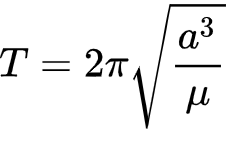

## Introduction aux défis de la création de scripts d'algorithmes intermédiaires

Les défis suivants font partie des défis de scripting d'algorithme intermédiaire de FCC. Celles-ci devraient vous préparer à relever les  derniers défis de la certification des algorithmes JavaScript et des structures de données.

Ces défis vous permettront de tester tout  ce que vous avez appris et les parties que vous devrez peut-être revoir  avant de commencer les projets.

Cela étant dit - amusez-vous et n'oubliez pas d'utiliser la méthode Lire-Rechercher-Demander ([Read-Search-Ask](https://forum.freecodecamp.org/t/how-to-get-help-when-you-are-stuck-coding/19514)) si vous êtes bloqué.

Bonne chance !

-----


## 1. Somme de tous les nombres dans une plage

[Learn Intermediate Algorithm Scripting: Sum All Numbers in a Range | freeCodeCamp.org](https://www.freecodecamp.org/learn/javascript-algorithms-and-data-structures/intermediate-algorithm-scripting/sum-all-numbers-in-a-range)

:::info Instructions
Nous allons vous passer un tableau de deux nombres. Renvoyez la somme de ces deux nombres plus la somme de tous les nombres entre eux. Le nombre  le plus bas ne vient pas toujours en premier.<br />
Par exemple, `sumAll([4,1])` doit renvoyer `10` car la somme de tous les nombres entre 1 et 4 (tous deux inclus) est `10`.
:::

:::tip missions
`sumAll([1, 4])` doit renvoyer un nombre.<br />
`sumAll([1, 4])` doit renvoyer 10.<br />
`sumAll([4, 1])` doit renvoyer 10.<br />
`sumAll([5, 10])` doit renvoyer 45.<br />
`sumAll([10, 5])` doit renvoyer 45.
:::

```js
function sumAll(arr) {
  let max = Math.max(arr[0], arr[1]);
  let min = Math.min(arr[0], arr[1]);
  let temp = 0;
  for (let i = min; i <= max; i++) {
    temp += i;
  }
  return temp;
}

sumAll([1, 4])
console.log(sumAll([1, 4]));
console.log(sumAll([4, 1]));
console.log(sumAll([5, 10]));
console.log(sumAll([10, 5]));
```
```shell title="console"
10
10
45
45
```

[solutions](https://forum.freecodecamp.org/t/freecodecamp-challenge-guide-sum-all-numbers-in-a-range/16083)

------


## 2. Différencier deux tableaux

[Learn Intermediate Algorithm Scripting: Diff Two Arrays | freeCodeCamp.org](https://www.freecodecamp.org/learn/javascript-algorithms-and-data-structures/intermediate-algorithm-scripting/diff-two-arrays)

:::info Instructions
Comparez deux tableaux et retournez un nouveau tableau avec tous les éléments trouvés uniquement dans l'un des deux tableaux donnés, mais pas les deux. En d'autres termes, renvoyez la différence symétrique des deux tableaux.<br />
**Remarque :** Vous pouvez renvoyer le tableau avec ses éléments dans n'importe quel ordre.
:::

:::tip missions
`diffArray([1, 2, 3, 5], [1, 2, 3, 4, 5])` doit renvoyer un tableau.<br />
`["diorite", "andesite", "grass", "dirt", "pink wool", "dead shrub"], ["diorite", "andesite", "grass", "dirt", "dead shrub"]` devrait retourner `["pink wool"]`.<br />
`["diorite", "andesite", "grass", "dirt", "pink wool", "dead shrub"], ["diorite", "andesite", "grass", "dirt", "dead shrub"]` devrait retourner un tableau avec un élément.<br />
`["andesite", "grass", "dirt", "pink wool", "dead shrub"], ["diorite", "andesite", "grass", "dirt", "dead shrub"]` devrait retourner `["diorite", "pink wool"]`.<br />
`["andesite", "grass", "dirt", "pink wool", "dead shrub"], ["diorite", "andesite", "grass", "dirt", "dead shrub"]` devrait retourner un tableau avec deux articles.<br />
`["andesite", "grass", "dirt", "dead shrub"], ["andesite", "grass", "dirt", "dead shrub"]` devrait retourner `[]`.<br />
`["andesite", "grass", "dirt", "dead shrub"], ["andesite", "grass", "dirt", "dead shrub"]` devrait retourner un tableau vide.<br />
`[1, 2, 3, 5], [1, 2, 3, 4, 5]` devrait retourner `[4]`.<br />
`[1, 2, 3, 5], [1, 2, 3, 4, 5]` devrait retourner un tableau avec un élément.<br />
`[1, "calf", 3, "piglet"], [1, "calf", 3, 4]` devrait retourner `["piglet", 4]`.<br />
`[1, "calf", 3, "piglet"], [1, "calf", 3, 4]` devrait retourner un tableau avec deux éléments.<br />
`[], ["snuffleupagus", "cookie monster", "elmo"]` devrait retourner `["snuffleupagus", "cookie monster", "elmo"]`.<br />
`[], ["snuffleupagus", "cookie monster", "elmo"]` devrait retourner un tableau avec trois éléments.<br />
`[1, "calf", 3, "piglet"], [7, "filly"]` devrait retourner `[1, "calf", 3, "piglet", 7, "filly"]`.<br />
`[1, "calf", 3, "piglet"], [7, "filly"]` devrait retourner un tableau avec six éléments.
:::

```js
function diffArray(arr1, arr2) {
  let newArr = [];

  function onlyInFirst(first, second) {
    // Faire une boucle dans un tableau pour trouver des éléments qui n'existent pas dans un autre tableau
    for (let i = 0; i < first.length; i++) {
      if (second.indexOf(first[i]) === -1) {
        // Pousser les éléments uniques du premier vers newArr
        newArr.push(first[i]);
      }
    }
  }

  onlyInFirst(arr1, arr2);
  onlyInFirst(arr2, arr1);

  return newArr;
}

console.log(diffArray([1, 2, 3, 5], [1, 2, 3, 4, 5]));
console.log(diffArray(["diorite", "andesite", "grass", "dirt", "pink wool", "dead shrub"], ["diorite", "andesite", "grass", "dirt", "dead shrub"]));
console.log(diffArray(["andesite", "grass", "dirt", "pink wool", "dead shrub"], ["diorite", "andesite", "grass", "dirt", "dead shrub"]));
console.log(diffArray(["andesite", "grass", "dirt", "dead shrub"], ["andesite", "grass", "dirt", "dead shrub"]));
console.log(diffArray([1, "calf", 3, "piglet"], [1, "calf", 3, 4]));
console.log(diffArray([], ["snuffleupagus", "cookie monster", "elmo"]));
console.log(diffArray([1, "calf", 3, "piglet"], [7, "filly"]));
```

```shell title="console"
[ 4 ]
[ 'pink wool' ]
[ 'pink wool', 'diorite' ]
[]
[ 'piglet', 4 ]
[ 'snuffleupagus', 'cookie monster', 'elmo' ]
[ 1, 'calf', 3, 'piglet', 7, 'filly' ]
```

[solutions](https://forum.freecodecamp.org/t/freecodecamp-challenge-guide-diff-two-arrays/16008)

------


## 3. Rechercher et détruire

[Learn Intermediate Algorithm Scripting: Seek and Destroy | freeCodeCamp.org](https://www.freecodecamp.org/learn/javascript-algorithms-and-data-structures/intermediate-algorithm-scripting/seek-and-destroy)

:::info instructions
Vous recevrez un tableau initial (le premier argument de la fonction `destroyer`), suivi d'un ou plusieurs arguments. Supprimez tous les éléments du tableau initial qui ont la même valeur que ces arguments.<br />
**Remarque :** Vous devez utiliser l'objet `arguments`.
:::

:::tip missions
`destroyer([1, 2, 3, 1, 2, 3], 2, 3)` devrait renvoyer `[1, 1]`.<br />
`destroyer([1, 2, 3, 5, 1, 2, 3], 2, 3)` devrait renvoyer `[1, 5, 1]`.<br />
`destroyer([3, 5, 1, 2, 2], 2, 3, 5)` devrait renvoyer `[1]`.<br />
`destroyer([2, 3, 2, 3], 2, 3)` devrait renvoyer `[]`.<br />
`destroyer(["tree", "hamburger", 53], "tree", 53)` devrait renvoyer `["hamburger"]`.<br />
`destroyer(["possum", "trollo", 12, "safari", "hotdog", 92, 65, "grandma", "bugati", "trojan", "yacht"], "yacht", "possum", "trollo", "safari", "hotdog", "grandma", "bugati", "trojan")` devrait renvoyer `[12,92,65]`.
:::

```js
function destroyer(arr) {
  let args = Array.prototype.slice.call(arguments);

  for (let i = 0; i < arr.length; i++) {
    for (let j = 0; j < args.length; j++) {
      if (arr[i] === args[j]) {
        delete arr[i];
      }
    }
  }
  return arr.filter(Boolean);
}

console.log(destroyer([1, 2, 3, 1, 2, 3], 2, 3));
console.log(destroyer([1, 2, 3, 5, 1, 2, 3], 2, 3));
console.log(destroyer([3, 5, 1, 2, 2], 2, 3, 5));
console.log(destroyer([2, 3, 2, 3], 2, 3));
console.log(destroyer(["tree", "hamburger", 53], "tree", 53));
console.log(destroyer(["possum", "trollo", 12, "safari", "hotdog", 92, 65, "grandma", "bugati", "trojan", "yacht"], "yacht", "possum", "trollo", "safari", "hotdog", "grandma", "bugati", "trojan"));
```

```shell title="console"
[1, 1]
[1, 5, 1]
[1]
[]
['hamburger']
[12, 92, 65]
```

[solutions](https://forum.freecodecamp.org/t/freecodecamp-challenge-guide-seek-and-destroy/16046)

:::note Guide : rechercher et détruire

### Explication du problème

Ce problème est un peu délicat car vous devez vous familiariser avec `arguments`, car vous devrez travailler avec deux ou plus, mais sur le script, vous n'en voyez que deux. Beaucoup de gens codent ce programme en dur pour trois arguments. Vous supprimerez du premier argument tout nombre identique à tous les autres arguments.

#### Liens pertinents

- [Arguments object](https://developer.mozilla.org/fr/docs/Web/JavaScript/Reference/Fonctions/arguments)<br />
- [Array.filter() 447](https://developer.mozilla.org/fr/docs/Web/JavaScript/Reference/Objets_globaux/Array/filter)

-----

### Astuces

#### Indice 1
Vous devez travailler avec `arguments` comme s'il s'agissait d'un tableau normal. Le meilleur moyen est de le convertir en un seul.

#### Indice 2
Vous devez filtrer, cela signifie également que vous devez créer une fonction de rappel. Vous pouvez utiliser différentes méthodes comme : `indexOf()`, `includes()`. Si vous avez besoin d'une autre approche, `reduce()` peut également être utile ; continuez à lire ces documents !

#### Astuce 3
Pour convertir `arguments` en un tableau, utilisez ce code `let args = Array.prototype.slice.call(arguments);`

-----

### Solutions

#### Solution 1

```js
function destroyer(arr) {
  var args = Array.prototype.slice.call(arguments);

  for (var i = 0; i < arr.length; i++) {
    for (var j = 0; j < args.length; j++) {
      if (arr[i] === args[j]) {
        delete arr[i];
      }
    }
  }
  return arr.filter(Boolean);
}
```
#### Explication du code

  1. Créez un tableau d'`arguments` en utilisant `Array.prototype.slice.call()` et stockez-le dans la variable `args`. Nous allons l'utiliser pour vérifier par rapport à `arr`.

  2. Démarrez une boucle `for` basique pour parcourir `arr`. Imbriquez une autre boucle `for` dans la première, en changeant la variable entière `j` et `arr` en `args`. Cette seconde boucle parcourra `args`.
     - Dans la deuxième boucle, créez une instruction `if`, en vérifiant strictement `===` que la valeur actuelle de `arr[i]` est égale à `args[j]`.
     - Si la valeur de l'index actuel est égale dans les deux tableaux, utilisez `delete` pour la supprimer de `arr`.

  3. En dehors des boucles imbriquées : retournez le tableau modifié en utilisant l'objet `Boolean` comme filtre pour tout `null` créé par l'opérateur `delete`.

#### Liens pertinents

- [Arguments Object](http://forum.freecodecamp.org/t/how-arguments-work-in-javascript-javascript-arguments-guide/14283)
- [Array.filter()](http://forum.freecodecamp.com/t/javascript-array-prototype-filter/14289)
- [delete](https://developer.mozilla.org/fr/docs/Web/JavaScript/Reference/Op%C3%A9rateurs/L_op%C3%A9rateur_delete)
- [Boolean](http://forum.freecodecamp.com/t/javascript-boolean/14311)

#### Solutions 2

```js
function destroyer(arr) {
  var args = Array.from(arguments).slice(1);
  return arr.filter(function(val) {
    return !args.includes(val);
  });
}
```

#### Explication du code

  1. Déclarez une variable nommée `args` et définissez-la égale à un nouvel objet `Array` `from()` les `arguments` passés dans la fonction. Sur la même ligne ou la ligne suivante, utilisez la méthode `slice()` sur `args` à partir du deuxième index, 1. Cela sépare les arguments utilisés pour le filtrage dans leur propre tableau `args`.

  2. Renvoyez le tableau filtré, en utilisant `includes()` dans la fonction de rappel pour vérifier si `val` n'est pas dans `args` ; renvoyer `true` pour conserver la valeur dans le tableau d'origine ou `false` pour le supprimer.

#### Liens pertinents

- [arguments](http://forum.freecodecamp.com/t/javascript-arguments/14283)
- [Array.slice()](http://forum.freecodecamp.com/t/javascript-array-prototype-slice/14302)
- [Array.includes()](https://developer.mozilla.org/fr/docs/Web/JavaScript/Reference/Objets_globaux/Array/includes)

#### Solution 3

```js
const destroyer = (arr, ...valsToRemove) => arr.filter(elem => !valsToRemove.includes(elem));
```

#### Explication du code

- Code utilisant la syntaxe ES6 pour déclarer la fonction à l'aide des fonctions fléchées.
- Utilisation de l'opérateur de diffusion (spread operator) pour récupérer les arguments.
- Renvoie le tableau filtré à l'aide de `includes()`.

#### Liens pertinents

- [Rest Syntax](https://developer.mozilla.org/fr/docs/Web/JavaScript/Reference/Fonctions/param%C3%A8tres_du_reste)
:::

-----


## 4. Pourquoi es-tu

[Learn Intermediate Algorithm Scripting: Wherefore art thou | freeCodeCamp.org](https://www.freecodecamp.org/learn/javascript-algorithms-and-data-structures/intermediate-algorithm-scripting/wherefore-art-thou)

:::info instructions
Créez une fonction qui regarde à travers un tableau d'objets (premier argument) et renvoie un tableau de tous les objets qui ont des paires nom / valeur correspondantes (deuxième argument). Chaque paire nom et valeur de l'objet source doit être présente dans l'objet de la collection si elle doit être incluse dans le tableau renvoyé.<br />
Par exemple, si le premier argument est `[{ first: "Romeo", last: "Montague" }, { first: "Mercutio", last: null }, { first: "Tybalt", last: "Capulet" }]`, et le deuxième argument est `{ last: "Capulet" }`, alors vous devez renvoyer le troisième objet du tableau (le premier argument), car il contient le nom et sa valeur, qui a été transmis comme deuxième argument.
:::

:::tip missions
`whatIsInAName([{ first: "Romeo", last: "Montague" }, { first: "Mercutio", last: null }, { first: "Tybalt", last: "Capulet" }], { last: "Capulet" })` devrait renvoyer `[{ first: "Tybalt", last: "Capulet" }]`.<br />
`whatIsInAName([{ "apple": 1 }, { "apple": 1 }, { "apple": 1, "bat": 2 }], { "apple": 1 })` devrait renvoyer `[{ "apple": 1 }, { "apple": 1 }, { "apple": 1, "bat": 2 }]`.<br />
`whatIsInAName([{ "apple": 1, "bat": 2 }, { "bat": 2 }, { "apple": 1, "bat": 2, "cookie": 2 }], { "apple": 1, "bat": 2 })` devrait renvoyer `[{ "apple": 1, "bat": 2 }, { "apple": 1, "bat": 2, "cookie": 2 }]`.<br />
`whatIsInAName([{ "apple": 1, "bat": 2 }, { "apple": 1 }, { "apple": 1, "bat": 2, "cookie": 2 }], { "apple": 1, "cookie": 2 })` devrait renvoyer `[{ "apple": 1, "bat": 2, "cookie": 2 }]`.<br />
`whatIsInAName([{ "apple": 1, "bat": 2 }, { "apple": 1 }, { "apple": 1, "bat": 2, "cookie": 2 }, { "bat":2 }], { "apple": 1, "bat": 2 })` devrait renvoyer `[{ "apple": 1, "bat": 2 }, { "apple": 1, "bat": 2, "cookie":2 }]`.<br />
`whatIsInAName([{"a": 1, "b": 2, "c": 3}], {"a": 1, "b": 9999, "c": 3})` devrait renvoyer `[]`.
:::

```js
function whatIsInAName(collection, source) {
  var arr = Object.keys(source);

  return collection.filter(function(obj) {
    return arr.every(function(key) {
      return obj.hasOwnProperty(key) && obj[key] === source[key];
    });
  });
}

console.log(whatIsInAName([{ first: "Romeo", last: "Montague" }, { first: "Mercutio", last: null }, { first: "Tybalt", last: "Capulet" }], { last: "Capulet" }));
console.log(whatIsInAName([{ "apple": 1 }, { "apple": 1 }, { "apple": 1, "bat": 2 }], { "apple": 1 }));
console.log(whatIsInAName([{ "apple": 1, "bat": 2 }, { "bat": 2 }, { "apple": 1, "bat": 2, "cookie": 2 }], { "apple": 1, "bat": 2 }));
console.log(whatIsInAName([{ "apple": 1, "bat": 2 }, { "apple": 1 }, { "apple": 1, "bat": 2, "cookie": 2 }], { "apple": 1, "cookie": 2 }));
console.log(whatIsInAName([{ "apple": 1, "bat": 2 }, { "apple": 1 }, { "apple": 1, "bat": 2, "cookie": 2 }, { "bat":2 }], { "apple": 1, "bat": 2 }));
console.log(whatIsInAName([{"a": 1, "b": 2, "c": 3}], {"a": 1, "b": 9999, "c": 3}));
```

```shell title="console"
[{ first: 'Tybalt', last: 'Capulet' }]
[{ apple: 1 }, { apple: 1 }, { apple: 1, bat: 2 }]
[{ apple: 1, bat: 2 }, { apple: 1, bat: 2, cookie: 2 }]
[{ apple: 1, bat: 2, cookie: 2 }]
[{ apple: 1, bat: 2 }, { apple: 1, bat: 2, cookie: 2 }]
[]
```

[solutions](https://forum.freecodecamp.org/t/freecodecamp-challenge-guide-wherefore-art-thou/16092)

:::note Guide : Pourquoi es-tu

### Explication du problème

Écrivez un algorithme qui prendra un `array` pour le premier argument et retournera un `array` avec tous les `object` qui correspondent à toutes les propriétés et valeurs de l'`object` passé en tant que deuxième paramètre.

#### Liens pertinents

- [For Loops](https://developer.mozilla.org/fr/docs/Web/JavaScript/Reference/Instructions/for)
- [Array.prototype.filter()](https://developer.mozilla.org/fr/docs/Web/JavaScript/Reference/Objets_globaux/Array/filter)
- [Object.hasOwnProperty()](https://developer.mozilla.org/fr/docs/Web/JavaScript/Reference/Objets_globaux/Object/hasOwnProperty)
- [Object.keys()](https://developer.mozilla.org/fr/docs/Web/JavaScript/Reference/Objets_globaux/Object/keys)

-----

### Astuces

#### Indice 1

Vous pouvez utiliser la boucle `for` ou la méthode `Array.prototype.filter`.

#### Indice 2

Essayez d'utiliser la méthode `Object.prototype.hasOwnProperty` pour savoir si le nom de propriété existe dans un objet (en tant que sa propre propriété).

#### Astuce 3

Vérifiez l'équivalence de `Object` dans `collection` avec `Object` passé comme deuxième paramètre à la fonction `whatIsInAName`.

-----

### Solutions

#### Solution 1

```js
function whatIsInAName(collection, source) {
  // 'Qu'est-ce qu'il y a dans un nom ? ce que nous appelons une rose
  // Sous n'importe quel autre nom, ça sentirait aussi doux. '
  // - par William Shakespeare, Roméo et Juliette
  var srcKeys = Object.keys(source);

  // filtrer la collection
  return collection.filter(function(obj) {
    for (var i = 0; i < srcKeys.length; i++) {
      if (
        !obj.hasOwnProperty(srcKeys[i]) ||
        obj[srcKeys[i]] !== source[srcKeys[i]]
      ) {
        return false;
      }
    }
    return true;
  });
}

// tester ici
whatIsInAName(
  [
    { first: "Romeo", last: "Montague" },
    { first: "Mercutio", last: null },
    { first: "Tybalt", last: "Capulet" }
  ],
  { last: "Capulet" }
);
```

#### Explication du code

- Nous filtrons le tableau en utilisant `.filter()`.
- En utilisant une boucle `for`, nous parcourons chaque élément de l'objet.
- Nous utilisons une instruction `if` pour vérifier si l'objet de la collection n'a pas la clé et que la valeur de la propriété ne correspond pas à la valeur de la source.
- Nous retournons `false` si l'instruction `if` ci-dessus est correcte. Sinon, nous retournons `true`.

#### Liens pertinents

- [For Loops](https://developer.mozilla.org/fr/docs/Web/JavaScript/Reference/Instructions/for)
- [Array.prototype.filter()](https://developer.mozilla.org/fr/docs/Web/JavaScript/Reference/Objets_globaux/Array/filter)
- [Object.hasOwnProperty()](https://developer.mozilla.org/fr/docs/Web/JavaScript/Reference/Objets_globaux/Object/hasOwnProperty)

#### Solution 2

```js
function whatIsInAName(collection, source) {
  var srcKeys = Object.keys(source);

  return collection.filter(function(obj) {
    return srcKeys.every(function(key) {
      return obj.hasOwnProperty(key) && obj[key] === source[key];
    });
  });
}
```

#### Explication du code

- Nous filtrons la collection en utilisant `.filter()`.
- Ensuite, nous retournons une valeur `Boolean` pour la méthode `.filter()`.
- Enfin, nous réduisons à la valeur `Boolean` à renvoyer pour la méthode `.every()`.

#### Liens pertinents

- [Array.prototype.filter()](https://developer.mozilla.org/fr/docs/Web/JavaScript/Reference/Objets_globaux/Array/filter)
- [Array.prototype.every()](https://developer.mozilla.org/fr/docs/Web/JavaScript/Reference/Objets_globaux/Array/every)
- [Object.hasOwnProperty()](https://developer.mozilla.org/fr/docs/Web/JavaScript/Reference/Objets_globaux/Object/hasOwnProperty)

#### Solution 3

```js
function whatIsInAName(collection, source) {
  var srcKeys = Object.keys(source);
  // filtrer la collection
  return collection.filter(function(obj) {
    return srcKeys
      .map(function(key) {
        return obj.hasOwnProperty(key) && obj[key] === source[key];
      })
      .reduce(function(a, b) {
        return a && b;
      });
  });
}
```

#### Explication du code

- Nous commençons par filtrer par collection en utilisant `Array.filter()`.
- Ensuite, nous mappons toutes les clés et retournons des valeurs booléennes en fonction des conditions de vérification : la clé et sa valeur correspondante doivent exister dans l'objet que nous filtrons.
- Ensuite, nous réduisons les valeurs booléennes mappées à un seul booléen qui indique si tous les `srcKeys` remplissent les conditions vérifiées ci-dessus.
- Ce booléen unique sera utilisé pour filtrer dans la collection.

#### Liens pertinents

- [Array.prototype.filter()](https://developer.mozilla.org/fr/docs/Web/JavaScript/Reference/Objets_globaux/Array/filter)
- [Array.prototype.reduce()](https://developer.mozilla.org/fr/docs/Web/JavaScript/Reference/Objets_globaux/Array/reduce)
- [Object.hasOwnProperty()](https://developer.mozilla.org/fr/docs/Web/JavaScript/Reference/Objets_globaux/Object/hasOwnProperty)
:::

-----


## 5. Casse de la colonne vertébrale

[Learn Intermediate Algorithm Scripting: Spinal Tap Case | freeCodeCamp.org](https://www.freecodecamp.org/learn/javascript-algorithms-and-data-structures/intermediate-algorithm-scripting/spinal-tap-case)

:::info instructions
Convertit une chaîne en cas spinal. La casse de la colonne vertébrale est composée de mots en minuscules joints par des tirets.
:::

:::tip missions
- `spinalCase("This Is Spinal Tap")` devrait renvoyer `"this-is-spinal-tap"`.<br />
- `spinalCase("thisIsSpinalTap")` devrait renvoyer `"this-is-spinal-tap"`.<br />
- `spinalCase("The*Andy*Griffith_Show")` devrait renvoyer `"the-andy-griffith-show"`.<br />
- `spinalCase("Teletubbies say Eh-oh")` devrait renvoyer `"teletubbies-say-eh-oh"`.<br />
- `spinalCase("AllThe-small Things")` devrait renvoyer `"all-the-small-things"`.
:::

```js
function spinalCase(str) {
  var regex = /\s+|_+/g;
  str = str.replace(/([a-z])([A-Z])/g, "$1 $2");
  return str.replace(regex, "-").toLowerCase();
}

spinalCase('This Is Spinal Tap');

console.log(spinalCase("This Is Spinal Tap"));
console.log(spinalCase("thisIsSpinalTap"));
console.log(spinalCase("TheAndyGriffith_Show"));
console.log(spinalCase("Teletubbies say Eh-oh"));
console.log(spinalCase("AllThe-small Things"));
```

```sh title="console"
this-is-spinal-tap
this-is-spinal-tap
the-andy-griffith-show
teletubbies-say-eh-oh
all-the-small-things
```

[solutions](https://forum.freecodecamp.org/t/freecodecamp-challenge-guide-spinal-tap-case/16078)

:::note guide : Casse de la colonne vertébrale
### Explication du problème

Convertit la chaîne donnée en une phrase minuscule avec des mots joints par des tirets.

#### Liens pertinents

- [String global object](https://developer.mozilla.org/fr/docs/Web/JavaScript/Reference/Objets_globaux/String)
- [JS Regex Resources](https://guide.freecodecamp.org/javascript/regular-expressions-reference/)
- [JS String Prototype Replace](http://forum.freecodecamp.com/t/javascript-string-prototype-replace/15942)
- [JS String Prototype ToLowerCase](http://forum.freecodecamp.com/t/javascript-string-prototype-tolowercase/15948)

### Astuces

#### Indice 1

Créez une expression régulière pour tous les espaces blancs et les traits de soulignement.

#### Indice 2

Vous devrez également tout mettre en minuscules.

#### Astuce 3

La partie la plus délicate est de faire fonctionner la partie expression régulière, une fois que vous faites cela, il vous suffit de transformer les majuscules en minuscules et de remplacer les espaces par des traits de soulignement en utilisant `replace()`.

-----

### Solutions

#### Solution 1

```js
function spinalCase(str) {
  // Crée une variable pour l'espace blanc et les traits de soulignement.
  var regex = /\s+|_+/g;

  // Remplacez les majuscules minuscules par les majuscules minuscules
  str = str.replace(/([a-z])([A-Z])/g, "$1 $2");

  // Remplace l'espace et le trait de soulignement par -
  return str.replace(regex, "-").toLowerCase();
}

// tester ici
spinalCase("This Is Spinal Tap");
```

#### Explication du code

- `regex` contient l'expression régulière `/\s+|_+/g`, qui sélectionnera tous les espaces blancs et les traits de soulignement.
- Le premier `replace()` place un espace avant les caractères majuscules rencontrés dans la chaîne `str` afin que les espaces puissent être remplacés par des tirets plus tard.
- Lors du retour de la chaîne, un autre `replace()` remplace les espaces et les traits de soulignement par des tirets à l'aide de `regex`.

#### Solution 2

```js
function spinalCase(str) {
  // Remplacez les majuscules minuscules par les majuscules minuscules
  str = str.replace(/([a-z])([A-Z])/g, "$1 $2");
  // Diviser sur des espaces et des traits de soulignement et joindre avec un tiret
  return str
    .toLowerCase()
    .split(/(?:_| )+/)
    .join("-");
}

// tester ici
spinalCase("This Is Spinal Tap");
```

#### Explication du code

- Semblable à la première solution, le premier `replace()` place un espace avant tout caractère majuscule rencontré dans la chaîne `str` afin que les espaces puissent être remplacés par des tirets plus tard.
- Au lieu d'utiliser `replace()` ici pour remplacer les espaces et les traits de soulignement par des tirets, la chaîne est `split()` sur l'expression régulière `/(?:_| )+/` et `join()` `-`.

#### Liens pertinents

- [JS String Prototype Split](https://forum.freecodecamp.org/t/javascript-string-prototype-split-split-explained-with-examples/15944)
- [JS Array Prototype Join](http://forum.freecodecamp.com/t/javascript-array-prototype-join/14292)

#### Solution 3

```js
function spinalCase(str) {
  // "C'est une ligne si fine entre stupide et intelligent."
  // --David St.Hubbins

  retour str
    .split(/\s|_|(?=[A-Z])/)
    .join("-")
    .toLowerCase();
}
```

#### Explication du code

- Divisez la chaîne à l'une des conditions suivantes (convertie en tableau)
  - un caractère d'espacement `[\s]` est rencontré
  - le caractère de soulignement `[_]` est rencontré
  - ou est suivi d'une lettre majuscule `[(?=[A-Z])]`
- Rejoignez le tableau à l'aide d'un trait d'union (`-`)
- Minuscule toute la chaîne résultante

#### Liens pertinents

- [Chaîne#split](http://devdocs.io/javascript/global_objects/string/split)
- [RegExp](http://devdocs.io/javascript/global_objects/regexp)
- [Arrray#join](http://devdocs.io/javascript/global_objects/array/join)
- [String#toLowerCase](http://devdocs.io/javascript/global_objects/string/tolowercase)
:::

-----


## 6. Cochon latin

[Learn Intermediate Algorithm Scripting: Pig Latin | freeCodeCamp.org](https://www.freecodecamp.org/learn/javascript-algorithms-and-data-structures/intermediate-algorithm-scripting/pig-latin)

Pig Latin est un moyen de modifier les mots anglais. Les règles sont les suivantes :
- Si un mot commence par une consonne, prenez la première consonne ou groupe de consonnes, déplacez-la à la fin du mot et ajoutez-y « ay ».
- Si un mot commence par une voyelle, ajoutez simplement « way » à la fin.

:::info instructions
Traduisez la chaîne fournie en Pig Latin. Les chaînes d'entrée sont garanties comme des mots anglais en minuscules.
:::

:::tip missions
- `translatePigLatin("california")` devrait renvoyer `"aliforniacay"`.
- `translatePigLatin("paragraphs")` devrait renvoyer `"aragraphspay"`.
- `translatePigLatin("glove")` devrait renvoyer `"oveglay"`.
- `translatePigLatin("algorithm")` devrait renvoyer `"algorithmway"`.
- `translatePigLatin("eight")` devrait renvoyer `"eightway"`.
- Devrait gérer les mots où la première voyelle vient au milieu du mot. `translatePigLatin("schwartz")` devrait renvoyer `"artzschway"`.
- Devrait gérer les mots sans voyelles. `translatePigLatin("rhythm")` devrait renvoyer `"rhythmay"`.
:::

```js
function translatePigLatin(str) {
  var pigLatin = "";
  var regex = /[aeiou]/gi;

  if (str[0].match(regex)) {
    pigLatin = str + "way";
  } else if (str.match(regex) === null) {
    pigLatin = str + "ay";
  } else {
    var vowelIndice = str.indexOf(str.match(regex)[0]);
    pigLatin = str.substr(vowelIndice) + str.substr(0, vowelIndice) + "ay";
  }
  return pigLatin;
}

console.log(translatePigLatin("consonant"));
console.log(translatePigLatin("california"));
console.log(translatePigLatin("paragraphs"));
console.log(translatePigLatin("glove"));
console.log(translatePigLatin("algorithm"));
console.log(translatePigLatin("eight"));
console.log(translatePigLatin("schwartz"));
console.log(translatePigLatin("rhythm"));
```

```sh title="console"
onsonantcay
aliforniacay
aragraphspay
oveglay
algorithmway
eightway
artzschway
rhythmay
```

[solutions](https://forum.freecodecamp.org/t/freecodecamp-challenge-guide-pig-latin/16039)

:::note guide : Cochon Latin
### Explication du problème

Vous devez créer un programme qui traduira de l'anglais vers le pig latin. Pig Latin prend la première consonne (ou groupe de consonnes) d'un mot anglais, la déplace à la fin du mot et ajoute un suffixe « ay ». Si un mot commence par une voyelle, vous ajoutez simplement « way » à la fin. Ce n'est peut-être pas évident, mais vous devez supprimer toutes les consonnes jusqu'à la première voyelle au cas où le mot ne commencerait pas par une voyelle.

#### Liens pertinents

- [Pig latin](https://fr.wikipedia.org/wiki/Pig_latin_(linguistique))
- [JS String Prototype Match](http://forum.freecodecamp.com/t/javascript-string-prototype-match/15941)

### Astuces

#### Indice 1

Vous voudrez probablement utiliser des expressions régulières. Cela vous permettra de convertir facilement les mots.

#### Indice 2

Si le premier caractère est une voyelle, alors prenez ce mot en entier et ajoutez « way » à la fin. Sinon vient la partie délicate, prenez la ou les consonnes avant la première voyelle et déplacez-la à la fin et ajoutez « ay ». Cela peut être déroutant, mais ce n'est pas seulement la première consonne mais toutes avant la première voyelle.

#### Astuce 3

Vous devrez utiliser tout ce que vous savez sur la manipulation de chaînes pour obtenir la dernière partie correcte. Cependant, cela peut être fait avec `substr` seul.

-----

### Solutions

#### Solution 1

```js
function translatePigLatin(str) {
  let consonantRegex = /^[^aeiou]+/;
  let myConsonants = str.match(consonantRegex);
  return myConsonants !== null
    ? str
        .replace(consonantRegex, "")
        .concat(myConsonants)
        .concat("ay")
    : str.concat("way");
}

translatePigLatin("consonant");
```
#### Explication du code

- commencez par le début et obtenez la plus longue correspondance de tout ce qui n'est pas une voyelle (consonnes)
- si un motif `regex` est trouvé, il enregistre la correspondance ; sinon, il retourne `null`
- si un motif `regex` est trouvé (commence par des consonnes), il supprime la correspondance, ajoute la correspondance à la fin et ajoute « ay » à la fin
- si le motif `regex` n'est pas trouvé (commence par des voyelles), il ajoute simplement un « way » à la fin

#### Liens pertinents

- [Regex Match](https://learn.freecodecamp.org/javascript-algorithms-and-data-structures/regular-expressions/match-numbers-and-letters-of-the-alphabet/)
- [Opérateur ternaire](https://learn.freecodecamp.org/javascript-algorithms-and-data-structures/basic-javascript/use-the-conditional-ternary-operator/)
- [concat()](https://guide.freecodecamp.org/javascript/standard-objects/string/string-prototype-concat/)

#### Solution 2

```js
function translatePigLatin(str) {
  // Crée des variables à utiliser
  var pigLatin = "";
  var regex = /[aeiou]/gi;

  // Vérifie si le premier caractère est une voyelle
  if (str[0].match(regex)) {
    pigLatin = str + "way";
  } else if (str.match(regex) === null) {
    // Vérifie si la chaîne ne contient que des consonnes
    pigLatin = str + "ay";
  } else {
    // Trouve combien de consonnes avant la première voyelle.
    var vowelIndice = str.indexOf(str.match(regex)[0]);

    // Prend la chaîne de la première voyelle au dernier caractère
    // puis ajoute les consonnes précédemment omises et ajoute la fin.
    pigLatin = str.substr(vowelIndice) + str.substr(0, vowelIndice) + "ay";
  }

  return pigLatin;
}

// tester ici
translatePigLatin("consonant");
```

#### Explication du code

- Créez une chaîne vide pour contenir votre mot latin Pig.
- Attribuez votre expression régulière appropriée à une variable.
- Si le premier caractère est une voyelle, ajoutez simplement un chemin à la fin de la chaîne et renvoyez-le.
- Si le premier caractère n'est pas une voyelle :
  - Trouvez le nombre de consonnes avant la première voyelle à l'aide de `indexOf()`, `match()` et `regex`.
  - Commencez la chaîne Pig Latin avec la première voyelle jusqu'à la fin.
  - Ajoutez des lettres avant la première voyelle à la fin de la chaîne.
  - `substr()` est utilisé pour la manipulation de chaînes ici.
  - Ajoutez ay à la fin de la chaîne et renvoyez-la.

#### Liens pertinents

- [JS Regex Resources](https://developer.mozilla.org/fr/docs/Web/JavaScript/Guide/Expressions_r%C3%A9guli%C3%A8res)
- [JS String Prototype IndexOf](http://forum.freecodecamp.com/t/javascript-string-prototype-indexof/15936)
- [JS String Prototype Substr](http://forum.freecodecamp.com/t/javascript-string-prototype-substr/15945)

#### Solution 3

```js
function translatePigLatin(str) {
  if (str.match(/^[aeiou]/)) return str + "way";

  const consonantCluster = str.match(/^[^aeiou]+/)[0];
  return str.substring(consonantCluster.length) + consonantCluster + "ay";
}

// tester ici
translatePigLatin("consonant");
```

#### Explication du code

- Tout d'abord, vérifiez si la chaîne commence par une voyelle.
  - L'expression régulière regarde le début de la chaîne `^` pour l'un des caractères spécifiés `[aeiou]`
  - Si c'est le cas, il vous suffit de renvoyer la chaîne d'origine avec "way" ajouté à la fin.
- Si la chaîne ne commence pas par une voyelle, nous voulons construire une chaîne qui contient chaque consonne avant la première voyelle de la chaîne fournie.
  - Pour ce faire, regardez au début d'une chaîne `^` pour un ou plusieurs caractères `+` NOT spécifié `[^aeiou]`.
  - S'il y a une correspondance (et dans ce cas, il y en aura toujours), `match()` renvoie un tableau avec la chaîne correspondante comme premier élément, ce que nous voulons. Saisissez-le avec `[0]`.
- Maintenant, nous pouvons commencer à construire notre chaîne Pig Latin pour revenir. Cela peut être construit en trois parties :
  - La première partie contient tous les caractères de la chaîne d'origine, à partir de la première voyelle. Nous pouvons facilement obtenir ces caractères en créant une sous-chaîne de la chaîne d'origine, son index de départ étant la première voyelle.
  - La deuxième partie contient la chaîne de consonnes que nous venons de construire. (Si vous ajoutez les deuxième et première parties de cette chaîne ensemble, vous obtiendrez la chaîne d'origine.)
- La dernière partie contient « ay ».

#### Liens pertinents


- [JS Regex Resources](https://developer.mozilla.org/fr/docs/Web/JavaScript/Guide/Expressions_r%C3%A9guli%C3%A8res)
- [String.prototype.match()](https://developer.mozilla.org/fr/docs/Web/JavaScript/Reference/Objets_globaux/String/match)
- [JS String Prototype Substr](http://forum.freecodecamp.com/t/javascript-string-prototype-substr/15945)

#### Solution 4

```js
function translatePigLatin(str) {
  return str
    .replace(/^[aeiou]\w*/, "$&way")
    .replace(/(^[^aeiou]+)(\w*)/, "$2$1ay");
}

// tester ici
translatePigLatin("consonant");
```

#### Explication du code

- Utilisez `replace()` sur la chaîne, en utilisant une expression régulière pour vérifier si la première lettre est une consonne et en ajoutant `way` à la fin dans ce cas. Si la première lettre est une consonne, rien ne se passera à ce stade.
- Utilisez à nouveau `replace()` pour vérifier les consonnes au début du mot et pour les déplacer à la fin du mot et ajouter `ay` à la fin.

#### Liens pertinents

- [Regular Expressions Reference](https://guide.freecodecamp.org/javascript/regular-expressions-reference)
- [Regular Expressions Resources](https://guide.freecodecamp.org/miscellaneous/regular-expressions-resources/)


#### Solution 5

```js
function translatePigLatin(str, charPos = 0) {
  return ['a', 'e', 'i', 'o', 'u'].includes(str[0])
    ? str + (charPos === 0 ? 'way' : 'ay')
    : charPos === str.length
      ? str + 'ay'
      : translatePigLatin(str.slice(1) + str[0], charPos + 1);
}
```
:::

-----


## 7. Rechercher et remplacer

:::info instructions
Effectuez une recherche et remplacez la phrase en utilisant les arguments fournis et renvoyez la nouvelle phrase.<br />
Le premier argument est la phrase sur laquelle effectuer la recherche et remplacer.<br />
Le deuxième argument est le mot que vous remplacerez (avant).<br />
Le troisième argument est ce que vous remplacerez le deuxième argument par (après).<br />
**Remarque :** Conservez la casse du premier caractère du mot d'origine lorsque vous le remplacez. Par exemple, si vous voulez remplacer le mot « Book» par le mot « dog», il doit être remplacé par « Dog ».
:::

:::tip missions
- `myReplace("Let us go to the store", "store", "mall")` devrait renvoyer `"Let us go to the mall"`.
- `myReplace("He is Sleeping on the couch", "Sleeping", "sitting")` devrait renvoyer `"He is Sitting on the couch"`.
- `myReplace("I think we should look up there", "up", "Down")` devrait renvoyer `"I think we should look down there"`.
- `myReplace("This has a spellngi error", "spellngi", "spelling")` devrait renvoyer `"This has a spelling error"`.
- `myReplace("His name is Tom", "Tom", "john")` devrait renvoyer `"His name is John"`.
- `myReplace("Let us get back to more Coding", "Coding", "algorithms")` devrait renvoyer `"Let us get back to more Algorithms"`.
:::

```js
function myReplace(str, before, after) {
  let index = str.indexOf(before);
  if (str[index] === str[index].toUpperCase()) {
    after = after.charAt(0).toUpperCase() + after.slice(1);
  } else {
    after = after.charAt(0).toLowerCase() + after.slice(1);
  }
  str = str.replace(before, after);
  return str;
}

console.log(myReplace("A quick brown fox jumped over the lazy dog", "jumped", "leaped"));
console.log(myReplace("Let us go to the store", "store", "mall"));
console.log(myReplace("He is Sleeping on the couch", "Sleeping", "sitting"));
console.log(myReplace("I think we should look up there", "up", "Down"));
console.log(myReplace("This has a spellngi error", "spellngi", "spelling"));
console.log(myReplace("His name is Tom", "Tom", "john"));
console.log(myReplace("Let us get back to more Coding", "Coding", "algorithms"));
```

```sh title="console"
A quick brown fox leaped over the lazy dog
Let us go to the mall
He is Sitting on the couch
I think we should look down there
This has a spelling error
His name is John
Let us get back to more Algorithms
```

[solutions](https://forum.freecodecamp.org/t/freecodecamp-challenge-guide-search-and-replace/16045)

:::note guide : Rechercher et remplacer
### Explication du problème

Vous allez créer un programme qui prend une phrase, puis y rechercher un mot et le remplacer par un nouveau tout en conservant les majuscules s'il y en a une.

#### Liens pertinents

- [String global object](https://developer.mozilla.org/fr/docs/Web/JavaScript/Reference/Objets_globaux/String)
- [JS String Prototype Replace](https://forum.freecodecamp.org/t/javascript-string-prototype-replace-replace-explained-with-examples/15942)

### Astuces
#### Indice 1

Recherchez l'index où se trouve `before` dans la chaîne.

#### Indice 2

Vérifiez la casse de la première lettre.

#### Astuce 3

Les chaînes sont immuables, vous devrez enregistrer les modifications sur une autre variable, même si vous devez réutiliser la même variable juste pour donner l'impression que les modifications ont été effectuées en utilisant uniquement cette variable.

-----

### Solutions

#### Solution 1

```js
function myReplace(str, before, after) {
  // Trouver l'index où avant est sur la chaîne
  var index = str.indexOf(before);
  // Vérifie si la première lettre est en majuscule ou non
  if (str[index] === str[index].toUpperCase()) {
    // Changer le mot après pour qu'il soit mis en majuscule avant de l'utiliser.
    after = after.charAt(0).toUpperCase() + after.slice(1);
  } else {
    // Changer le mot après pour qu'il ne soit pas capitalisé avant de l'utiliser.
    after = after.charAt(0).toLowerCase() + after.slice(1);
  }
  // Remplacez maintenant la chaîne d'origine par celle modifiée.
  str = str.replace(before, after);

  return str;
}

// tester ici
myReplace("A quick brown fox jumped over the lazy dog", "jumped", "leaped");
```

#### Explication du code

- Utilisez `indexOf()` pour trouver l'emplacement `before` dans la chaîne.
- Si la première lettre `before` est en majuscule, remplacez la première lettre de `after` par une majuscule.
- Remplacez `before` dans la chaîne par `after`.
- Renvoyez la nouvelle chaîne.

#### Liens pertinents

- [JS String Prototype IndexOf](http://forum.freecodecamp.com/t/javascript-string-prototype-indexof/15936)
- [JS String Prototype ToUpperCase](http://forum.freecodecamp.com/t/javascript-string-prototype-touppercase/15950)
- [JS String Prototype CharAt](http://forum.freecodecamp.com/t/javascript-string-prototype-charat/15932)
- [JS String Prototype Slice](http://forum.freecodecamp.com/t/javascript-string-prototype-slice/15943)


#### Solution 2

```js
function myReplace(str, before, after) {
  // Vérifie si le premier caractère de l'argument 'avant' est une lettre majuscule ou minuscule et change le premier caractère de l'argument 'après' pour qu'il corresponde à la casse
  if (/^[A-Z]/.test(before)) {
    after = after[0].toUpperCase() + after.substring(1)
  } else {
    after = after[0].toLowerCase() + after.substring(1)
  }

  // retourne la chaîne avec l'argument 'avant' remplacé par l'argument 'après' (avec la casse correcte)
  return str.replace(before, after);
}

// tester ici
myReplace("A quick brown fox jumped over the lazy dog", "jumped", "leaped");
```

#### Explication du code

- Dans cette solution, l'expression régulière `^[A-Z]` est utilisée pour vérifier (`test`) si le premier caractère d'avant est en majuscule.
- Si la première lettre de `before` est en majuscule, remplacez la première lettre de `after` par une majuscule.
- Sinon : si la première lettre de `before` est en minuscule, remplacez la première lettre de `after` par une minuscule
- Renvoyer la nouvelle chaîne en remplaçant `before` par `after`.

#### Liens pertinents

- [JS Regex Resources](https://developer.mozilla.org/fr/docs/Web/JavaScript/Guide/Expressions_r%C3%A9guli%C3%A8res)

### Solution 3

```js
function myReplace(str, before, after) {
  // crée une fonction qui changera la casse de n'importe quel nombre de lettres dans le paramètre "target"
  // paramètre correspondant "source"
  function applyCasing(source, target) {
    // divise les chaînes source et cible en un tableau de lettres
    var targetArr = target.split("");
    var sourceArr = source.split("");
    // parcourir tous les éléments des tableaux sourceArr et targetArr jusqu'à ce que la boucle atteigne la fin du tableau le plus court
    for (var i = 0; i < Math.min(targetArr.length, sourceArr.length); i++) {
      // découvrir la casse de chaque lettre de sourceArr en utilisant une expression régulière
      // si sourceArr[i] est en majuscules, alors convertissez targetArr[i] en majuscules
      if (/[A-Z]/.test(sourceArr[i])) {
        targetArr[i] = targetArr[i].toUpperCase();
      }
      // si sourceArr[i] n'est pas en majuscule, convertissez targetArr[i] en minuscules
      else targetArr[i] = targetArr[i].toLowerCase();
    }
    // joint targetArr modifié à la chaîne et retourne
    return targetArr.join("");
  }

// remplacer 'avant' par 'après' par 'avant'-casing
  return str.replace(before, applyCasing(before, after));
}
// tester ici
myReplace("A quick brown fox jumped over the lazy dog", "jumped", "leaped");
```

#### Explication du code

- `before` et `after` sont passés comme arguments à `applyCasing()`.
- La fonction `applyCasing()` est utilisée pour changer la casse des caractères respectifs dans `targetArr`, c'est-à-dire `after` conformément à celle des caractères dans `sourceArr`, c'est-à-dire `before`.
- `replace()` est utilisé pour remplacer `before` par `after`, dont la casse est la même que `before`.

### Solution 4

```js
// Ajouter une nouvelle méthode à l'objet String, sans la remplacer s'il en existe déjà une
String.prototype.capitalize =
  String.prototype.capitalize ||
  function() {
    return this[0].toUpperCase() + this.slice(1);
  };

const Util = (function() {
  // Créer un module utilitaire pour contenir les fonctions d'assistance
  function textCase(str, tCase) {
    // Selon que l'argument tCase est passé, nous définissons la casse de
    // la chaîne donnée ou nous l'obtenons.
    // Ces fonctions peuvent être développées pour d'autres cas de texte.

    if (tCase) {
      return setCase(str, tCase);
    } else {
      return getCase(str);
    }

    function setCase(str, tCase) {
      switch (tCase) {
        case "uppercase":
          return str.toUpperCase();
        case "lowercase":
          return str.toLowerCase();
        case "capitalized":
          return str.capitalize();
        default:
          return str;
      }
    }

    function getCase(str) {
      if (str === str.toUpperCase()) {
        return "uppercase";
      }
      if (str === str.toLowerCase()) {
        return "lowercase";
      }
      if (str === str.capitalize()) {
        return "capitalized";
      }
      return "normal";
    }
  }

  return {
    textCase
  };
})();

function myReplace(str, before, after) {
  const { textCase } = Util;
  const regex = new RegExp(before, "gi");
  const replacingStr = textCase(after, textCase(before));

  return str.replace(regex, replacingStr);
}
```
#### Solution 5

```js
function myReplace(str, before, after) {
  const myArr = str.split(" ");
  const [wordToReplace] = myArr.filter(item => item === before);
  return wordToReplace[0].toUpperCase() !== wordToReplace[0]
    ? myArr.map(item => (item === before ? after : item)).join(" ")
    : myArr
        .map(item =>
          item === before ? after[0].toUpperCase() + after.slice(1) : item
        )
        .join(" ");
}

// test:
myReplace("A quick brown fox jumped over the lazy dog", "jumped", "leaped");
```

#### Liens pertinents

- [JS String Prototype Split](http://forum.freecodecamp.com/t/javascript-string-prototype-split/15944)
- [JS For Loops Explained](http://forum.freecodecamp.com/t/javascript-for-loop/14666s-Explained)
- [JS Math Min](http://forum.freecodecamp.com/t/javascript-math-min/14684)
- [String.length](http://forum.freecodecamp.org/t/javascript-string-length-javascript-length-explained-with-examples/19101)
- [JS String Prototype ToLowerCase](http://forum.freecodecamp.com/t/javascript-string-prototype-tolowercase/15948)
- [JS Array Prototype Join](http://forum.freecodecamp.com/t/javascript-array-prototype-join/14292)
:::

-----


## 8. Appariement ADN

:::info instructions
Il manque l'élément d'appariement dans le brin d'ADN. Prenez chaque caractère, obtenez sa paire et renvoyez les résultats sous forme de tableau 2D.<br />
Les [paires de base](https://fr.wikipedia.org/wiki/Paire_de_bases) sont une paire de AT et CG. Faites correspondre l'élément manquant au caractère fourni.<br />
Renvoyez le caractère fourni comme premier élément de chaque tableau.<br />
Par exemple, pour l'entrée `GCG`, retournez `[["G","C"],["C","G"],["G","C"]]`.<br />
Le caractère et sa paire sont jumelés dans un tableau et tous les tableaux sont regroupés dans un tableau d'encapsulation.
:::

:::tip missions
- `pairElement("ATCGA")` devrait renvoyer `[["A","T"],["T","A"],["C","G"],["G","C"],["A","T"]]`.
- `pairElement("TTGAG")` devrait renvoyer `[["T","A"],["T","A"],["G","C"],["A","T"],["G","C"]]`.
- `pairElement("CTCTA")` devrait renvoyer `[["C","G"],["T","A"],["C","G"],["T","A"],["A","T"]]`.
:::

```js
function pairElement(str) {
  let paired = [];
  let search = function(char) {
    switch (char) {
      case "A":
        paired.push(["A", "T"]);
        break;
      case "T":
        paired.push(["T", "A"]);
        break;
      case "C":
        paired.push(["C", "G"]);
        break;
      case "G":
        paired.push(["G", "C"]);
        break;
    }
  };
  for (let i = 0; i < str.length; i++) {
    search(str[i]);
  }
  return paired;
}

console.log(pairElement("GCG"));
console.log(pairElement("ATCGA"));
console.log(pairElement("TTGAG"));
console.log(pairElement("CTCTA"));
```
```sh title="console"
[['G','C'],['C','G'],['G','C']]
[['A','T'],['T','A'],['C','G'],['G','C'],['A','T']]
[['T','A'],['T','A'],['G','C'],['A','T'],['G','C']]
[['C','G'],['T','A'],['C','G'],['T','A'],['A','T']]
```

[solutions](https://forum.freecodecamp.org/t/freecodecamp-challenge-guide-dna-pairing/16009)

:::note guide : Appariement ADN
### Explication du problème

- Vous obtiendrez une séquence de brins d'ADN et vous devez obtenir la paire et la renvoyer sous forme de tableau 2D des paires de bases. Gardez à l'esprit que le volet fourni doit toujours être le premier.
- Autre façon d'interpréter le problème : il existe quatre caractères potentiels dans l'ADN : « A », « T », « G » et « C ». « A » et « T » sont toujours appariés, et « G » et « C » sont toujours appariés ensemble.
  Ce problème vous présente une entrée, par exemple « ATCGA ». Chacun de ces cinq caractères manque leurs paires.<br />
  Par exemple, le premier caractère « A » doit être associé à « T » pour donner l'élément de tableau `[“A”,“T”]`.<br />
  Le deuxième caractère « T » doit être associé à « A » pour donner l'élément de tableau `[“T”, “A”]`.<br />
  Le nombre d'éléments dans la sortie finale est égal au nombre de caractères dans l'entrée.

Ce problème n'implique pas de réorganiser l'entrée en différentes combinaisons ou permutations.

#### Liens pertinents
- [Array.push()](http://forum.freecodecamp.com/t/javascript-array-prototype-push/14298)
- [String.split()](http://forum.freecodecamp.com/t/javascript-string-prototype-split/15944)

### Astuces

#### Indice 1

Il existe deux cas de base, A-T et C-G, qui vont dans les deux sens. Vous pouvez utiliser une expression régulière, si des déclarations de tout ce à quoi vous pouvez penser.

#### Indice 2

Je recommanderais d'utiliser une instruction `switch`, car cela rend les choses beaucoup plus fluides.

#### Astuce 3

Le résultat doit être un tableau de tableaux, alors gardez cela à l'esprit lorsque vous déplacez les choses.

-----

### Solutions
#### Solution 1

```js
function pairElement(str) {
  // Renvoie chaque brin sous la forme d'un tableau de deux éléments, l'original et la paire.
  var paired = [];

// Fonction à vérifier avec le brin à appairer.
  var search = function(char) {
    switch (char) {
      case "A":
        paired.push(["A", "T"]);
        break;
      case "T":
        paired.push(["T", "A"]);
        break;
      case "C":
        paired.push(["C", "G"]);
        break;
      case "G":
        paired.push(["G", "C"]);
        break;
    }
  };

  // Boucle sur l'entrée et la paire.
  for (var i = 0; i < str.length; i++) {
    search(str[i]);
  }

  return paired;
}

// tester ici
pairElement("GCG");
```

#### Explication du code

- Le programme est très simple, la meilleure solution que j'ai trouvée est d'utiliser un interrupteur pour capturer les quatre éléments possibles. Utiliser des instructions `if` prendrait trop de code. Vous pouvez également utiliser des expressions régulières.
- Puisque nous avons l'original et la paire, j'ai décidé de prendre les quatre cas au lieu de la base deux.
- Créez un tableau vide et utilisez la fonction `search` pour pousser les bonnes valeurs vers le tableau et les renvoyer.

#### Liens pertinents

- [Switch Statements](https://developer.mozilla.org/fr/docs/Web/JavaScript/Reference/Instructions/switch)

#### Solution 2

```js
function pairElement(str) {
  // crée un objet pour la recherche de paires
  var pairs = {
    A: "T",
    T: "A",
    C: "G",
    G: "C"
  };
  // divise la chaîne en un tableau de caractères
  var arr = str.split("");
  // mappe le caractère au tableau de caractères et à la paire correspondante
  return arr.map(x => [x, pairs[x]]);
}

// tester ici
pairElement("GCG");
```

#### Explication du code

- Définissez d'abord un objet avec toutes les possibilités de paires, cela nous permet de trouver facilement par clé ou valeur.
- Divisez `str` en un tableau de caractères afin que nous puissions utiliser chaque lettre pour trouver sa paire.
- Utilisez la fonction `map` pour mapper chaque caractère du tableau sur un tableau avec le caractère et sa paire correspondante, créant ainsi un tableau 2D.

#### Liens pertinents

- [Array.prototype.map()](https://developer.mozilla.org/fr/docs/Web/JavaScript/Reference/Objets_globaux/Array/map)
- [Property accessors](https://developer.mozilla.org/fr/docs/Web/JavaScript/Reference/Op%C3%A9rateurs/Op%C3%A9rateurs_de_membres)
- [Arrow functions](https://developer.mozilla.org/fr/docs/Web/JavaScript/Reference/Fonctions/Fonctions_fl%C3%A9ch%C3%A9es)
:::

-----


## 9. Lettres manquantes

[Learn Intermediate Algorithm Scripting: Missing letters | freeCodeCamp.org](https://www.freecodecamp.org/learn/javascript-algorithms-and-data-structures/intermediate-algorithm-scripting/missing-letters)

:::info instructions
Trouvez la lettre manquante dans la plage de lettres passée et renvoyez-la.<br />
Si toutes les lettres sont présentes dans la plage, renvoyez `undefined`.
:::

:::tip missions
- `fearNotLetter("abce")` devrait renvoyer `"d"`.
- `fearNotLetter("abcdefghjklmno")` devrait renvoyer `"i"`.
- `fearNotLetter("stvwx")` devrait renvoyer `"u"`.
- `fearNotLetter("bcdf")` devrait renvoyer `"e"`.
- `fearNotLetter("abcdefghijklmnopqrstuvwxyz")` devrait renvoyer `undefined`.
:::

```js
function fearNotLetter(str) {
  for (var i = 0; i < str.length; i++) {
    var code = str.charCodeAt(i);
    if (code !== str.charCodeAt(0) + i) {
      return String.fromCharCode(code - 1);
    }
  }
  return undefined;
}
console.log(fearNotLetter("abce"));
console.log(fearNotLetter("abcdefghjklmno"));
console.log(fearNotLetter("stvwx"));
console.log(fearNotLetter("bcdf"));
console.log(fearNotLetter("abcdefghijklmnopqrstuvwxyz"));
```

```sh title="console"
d
i
u
e
undefined
```

[solutions](https://forum.freecodecamp.org/t/freecodecamp-challenge-guide-missing-letters/16023)

:::note guide : Lettres manquantes
### Explication du problème

Vous allez créer un programme qui trouvera la lettre manquante dans une chaîne et la renverra. S'il n'y a pas de lettre manquante, le programme doit renvoyer `undefined`. Il n'y a actuellement aucun cas de test pour la chaîne manquant plus d'une lettre, mais s'il y en avait une, la récursivité serait utilisée. De plus, les lettres sont toujours fournies dans l'ordre, il n'est donc pas nécessaire de les trier.

#### Liens pertinents

- [String global object](https://developer.mozilla.org/fr/docs/Web/JavaScript/Reference/Objets_globaux/String)
- [JS String Prototype CharCodeAt](http://forum.freecodecamp.com/t/javascript-string-prototype-charcodeat/15933)
- [String.fromCharCode](http://forum.freecodecamp.org/t/javascript-string-fromcharcode-a-guide-to-the-fromcharcode-function/19102)

### Astuces
#### Indice 1

Vous devrez convertir du caractère en code ASCII en utilisant les deux méthodes fournies dans la description.

#### Indice 2

Vous devrez vérifier la différence de code ASCII car ils sont dans l'ordre. L'utilisation d'un graphique serait très utile.

#### Astuce 3

Vous devrez déterminer où se trouve la lettre manquante, tout en traitant le cas où il n'y a pas de lettre manquante car il a besoin d'une valeur de retour spécifique.

-----

### Solutions
#### Solution 1

```js
function fearNotLetter(str) {
  for (var i = 0; i < str.length; i++) {
  /* code du caractère courant */
    var code = str.charCodeAt(i);

  /* si le code du caractère courant n'est pas égal au premier caractère + pas d'itération
donc le caractère a été échappé */
    if (code !== str.charCodeAt(0) + i) {
    /* si le caractère actuel a échappé à un caractère, trouver le caractère précédent et retourner */
      return String.fromCharCode(code - 1);
    }
  }
  return undefined;
}

// tester ici
fearNotLetter("abce");
```

#### Explication du code

- Cette solution utilise une boucle `for`.
- Le code du caractère rencontré est stocké dans le code.
- On vérifie si le code du caractère courant est celui attendu (aucun caractère n'est ignoré) en utilisant la logique - `code of current character = code of first character + number of iterations`.
- Si un caractère est manquant, le caractère manquant est trouvé et la chaîne finale est renvoyée.
- `undefined` est renvoyé s'il n'y a aucun caractère manquant dans la chaîne.

#### Liens pertinents

- [JS For Loops Explained](http://forum.freecodecamp.com/t/javascript-for-loop/14666s-Explained)
- [String.length](http://forum.freecodecamp.org/t/javascript-string-length-javascript-length-explained-with-examples/19101)


#### Solution 2

```js
// Ajout de cette solution pour éviter d'utiliser les boucles 'for' et 'while'.
// Voir l'explication pour savoir pourquoi. Cela en vaut la peine.

function peurNotLetter (str) {
function fearNotLetter(str) {
  var compare = str.charCodeAt(0),
    missing;

  str.split("").map(function(letter, index) {
    if (str.charCodeAt(index) == compare) {
      ++compare;
    } else {
      missing = String.fromCharCode(compare);
    }
  });

  return missing;
}

// tester ici
fearNotLetter("abce");
```

#### Explication du code

- Nous définissons d'abord des variables pour stocker le code de caractère de la première lettre de la chaîne, et pour stocker toutes les lettres manquantes que nous pouvons trouver.
- Nous transformons la chaîne en tableau afin de la mapper au lieu d'utiliser les boucles `for` et `while`.
- Au fur et à mesure que nous mappons les codes de caractères de nos lettres, nous comparons avec celui qui devrait être dans cette position.
- Si la lettre actuelle correspond, nous déplaçons la variable de comparaison vers sa position suivante afin de pouvoir comparer au cycle suivant.
- Sinon, la lettre manquante sera affectée à la variable `missing`, qui sera renvoyée une fois le `map` terminé.
- S'il n'y a aucun caractère manquant, renvoyez `undefined`.

#### Liens pertinents

- [JS String Prototype Split](http://forum.freecodecamp.com/t/javascript-string-prototype-split/15944)
- [JS Array Prototype Map](http://forum.freecodecamp.com/t/javascript-array-prototype-map/14294)


#### Solution 3

```js
function fearNotLetter(str) {
  for (let i = 1; i < str.length; ++i) {
    if (str.charCodeAt(i) - str.charCodeAt(i - 1) > 1) {
      return String.fromCharCode(str.charCodeAt(i - 1) + 1);
    }
  }
}
```

#### Explication du code

- Boucle sur la chaîne
- Vérifiez si la différence de codes de caractères entre les caractères adjacents de la chaîne est supérieure à 1 (vérifiez le tableau ASCII)
- Renvoie le caractère manquant (+1 à partir de l'endroit où l'écart a été détecté)

```js
function fearNotLetter(str) {
  var allChars = "";
  var notChars = new RegExp("[^" + str + "]", "g");

  for (var i = 0; allChars[allChars.length - 1] !== str[str.length - 1]; i++)
    allChars += String.fromCharCode(str[0].charCodeAt(0) + i);

  return allChars.match(notChars)
    ? allChars.match(notChars).join("")
    : undefined;
}
// tester ici
fearNotLetter("abce");
```

#### Explication du code

- Une nouvelle chaîne `allChars` est créée.
- Créez une expression régulière `notChars` qui sélectionne tout sauf `str`.
- La boucle `for` est utilisée pour ajouter toutes les lettres de la plage à `allChars`.
- `match()` est utilisé pour supprimer les lettres `str` de la chaîne nouvellement créée et elle est renvoyée.
- S'il n'y a aucun caractère manquant, renvoyez `undefined`.

#### Liens pertinents

- [JS Regex Resources](http://forum.freecodecamp.org/t/regular-expressions-the-ultimate-list-of-learning-resources/15931)
- [JS Ternary](http://forum.freecodecamp.com/t/javascript-ternary-operator/15973)
- [JS String Prototype Match](http://forum.freecodecamp.com/t/javascript-string-prototype-match/15941)
- [JS Array Prototype Join](http://forum.freecodecamp.com/t/javascript-array-prototype-join/14292)
:::

-----


## 10. Union triée

:::info instructions
Écrivez une fonction qui prend au moins deux tableaux et renvoie un nouveau tableau de valeurs uniques dans l'ordre des tableaux fournis d'origine.<br />
En d'autres termes, toutes les valeurs présentes à partir de tous les tableaux doivent être incluses dans leur ordre d'origine, mais sans doublons dans le tableau final.<br />
Les nombres uniques doivent être triés dans leur ordre d'origine, mais le tableau final ne doit pas être trié par ordre numérique.<br />
Vérifiez les tests d'assertion pour des exemples.
:::

:::tip missions
- `uniteUnique([1, 3, 2], [5, 2, 1, 4], [2, 1])` devrait renvoyer `[1, 3, 2, 5, 4]`.
- `uniteUnique([1, 2, 3], [5, 2, 1])` devrait renvoyer `[1, 2, 3, 5]`.
- `uniteUnique([1, 2, 3], [5, 2, 1, 4], [2, 1], [6, 7, 8])` devrait renvoyer `[1, 2, 3, 5, 4, 6, 7, 8]`.
:::

```js
function uniteUnique(arr) {
  var args = [...arguments];
  var result = [];
  for (var i = 0; i < args.length; i++) {
    for (var j = 0; j < args[i].length; j++) {
      if (!result.includes(args[i][j])) {
        result.push(args[i][j]);
      }
    }
  }
  return result;
}

console.log(uniteUnique([1, 3, 2], [5, 2, 1, 4], [2, 1]));
console.log(uniteUnique([1, 2, 3], [5, 2, 1]));
console.log(uniteUnique([1, 2, 3], [5, 2, 1, 4], [2, 1], [6, 7, 8]));
```

```sh title="console"
[1, 3, 2, 5, 4]
[1, 2, 3, 5]
[1, 2, 3, 5, 4, 6, 7, 8]
```

[solutions](https://forum.freecodecamp.org/t/freecodecamp-challenge-guide-sorted-union/16077)

:::note guide : Union triée
### Explication du problème

Le programme doit renvoyer un nouveau tableau de valeurs uniques à partir de deux tableaux d'origine dans l'ordre dans lequel ils apparaissent. Il n'y a donc pas de tri requis et il ne devrait pas y avoir de doublons.

#### Liens pertinents

- [JS Arguments](http://forum.freecodecamp.com/t/javascript-arguments/14283)

### Astuces
#### Indice 1

Comme vous n'avez aucune idée du nombre de paramètres passés, il serait préférable de parcourir les arguments avant de parcourir les tableaux.

#### Indice 2

Il n’est pas nécessaire d’utiliser des boucles. Vous pouvez utiliser des fonctions telles que `map()`, `reduce()` ou autres si vous le souhaitez.

#### Astuce 3

Vous devrez vérifier si la valeur actuelle est déjà sur le tableau à renvoyer pour chaque valeur.

-----

### Solutions
#### Solution 1

```js
function uniteUnique(arr1, arr2, arr3) {
  // Crée un tableau vide pour stocker notre résultat final.
  var finalArray = [];

  // Boucle sur l'objet arguments pour vraiment faire fonctionner le programme avec
  // deux tableaux ou plus au lieu de 3.
  for (var i = 0; i < arguments.length; i++) {
    var arrayArguments = arguments[i];

    // Boucle à travers le tableau à portée de main
    for (var j = 0; j < arrayArguments.length; j++) {
      var indexValue = arrayArguments[j];

      // Vérifie si la valeur est déjà sur le tableau final.
      if (finalArray.indexOf(indexValue) < 0) {
        finalArray.push(indexValue);
      }
    }
  }

  return finalArray;
}

// tester ici
uniteUnique([1, 3, 2], [5, 2, 1, 4], [2, 1]);
```

#### Explication du code

- Créez un tableau vide `finalResult` pour stocker le résultat final.
- Parcourez l'objet `arguments` dans la boucle externe et stockez-le dans `arrayArguments`.
- La boucle interne est utilisée pour parcourir des éléments de tableau individuels.
- Si l'élément n'existe pas déjà dans `finalArray`, ajoutez-le.
- Renvoie `finalArray`.

#### Liens pertinents

- [JS For Loops Explained](http://forum.freecodecamp.com/t/javascript-for-loop/14666s-Explained)
- [array.length](https://developer.mozilla.org/fr/docs/Web/JavaScript/Reference/Objets_globaux/Array/length)
- [JS String Prototype IndexOf](http://forum.freecodecamp.com/t/javascript-string-prototype-indexof/15936)
- [JS Array Prototype Push](http://forum.freecodecamp.com/t/javascript-array-prototype-push/14298)


#### Solution 2

```js
function uniteUnique(arr) {
  var args = [...arguments];
  var result = [];
  for (var i = 0; i < args.length; i++) {
    for (var j = 0; j < args[i].length; j++) {
      if (!result.includes(args[i][j])) {
        result.push(args[i][j]);
      }
    }
  }
  return result;
}

uniteUnique([1, 3, 2], [5, 2, 1, 4], [2, 1]);
```

#### Solution 3

```js
unction uniteUnique(arr1, arr2, arr3) {
  var newArr;
  // Convertit l'objet arguments en un tableau
  var args = Array.prototype.slice.call(arguments);
  // Utilisez la fonction de réduction pour aplatir le tableau
  newArr = args.reduce(function(arrA, arrB) {
    // Appliquer le filtre pour supprimer les éléments en double dans le tableau
    return arrA.concat(
      arrB.filter(function(i) {
        return arrA.indexOf(i) === -1;
      })
    );
  });

  return newArr;
}

// tester ici
uniteUnique([1, 3, 2], [5, 2, 1, 4], [2, 1]);
```

#### Explication du code

- L'objet `arguments` est converti en un tableau en utilisant `slice()`.
- La fonction `reduce()` est utilisée pour aplatir le tableau, c'est-à-dire que pour chaque élément du tableau (ou des tableaux imbriqués), extrayez ses éléments dans un tableau à une dimension.
- Après aplatissement du tableau, `filter()` est utilisé pour supprimer les éléments en double de `newArr`.

#### Liens pertinents

- [JS Array Prototype Slice](http://forum.freecodecamp.com/t/javascript-array-prototype-slice/14302)
- [JS Array Prototype Reduce](http://forum.freecodecamp.com/t/javascript-array-prototype-reduce/14299)
- [JS Array Prototype Concat](http://forum.freecodecamp.com/t/javascript-array-prototype-concat/14286)
- [JS Array Prototype Filter](http://forum.freecodecamp.com/t/javascript-array-prototype-filter/14289)

#### Solution 4

```js
function uniteUnique() {
  var concatArr = [];
  var i = 0;
  while (arguments[i]) {
    concatArr = concatArr.concat(arguments[i]);
    i++;
  }
  uniqueArray = concatArr.filter(function(item, pos) {
    return concatArr.indexOf(item) == pos;
  });
  return uniqueArray;
}

// test here
uniteUnique([1, 3, 2], [5, 2, 1, 4], [2, 1]);
```

#### Explication du code

- Le nombre d'arguments peut changer dynamiquement, nous n'avons donc pas besoin de nous soucier de fournir notre fonction `uniteUnique()` avec des arguments.
- Nous utilisons une boucle `while` pour concaténer tous les arguments dans un seul tableau appelé `concatArr`.
- Nous utilisons `filter()` pour supprimer les éléments en double en vérifiant l'index de chaque élément et en supprimant les mêmes éléments avec des positions différentes.
- La commande sera conservée ici.

#### Liens pertinents

- [JS While Loop](http://forum.freecodecamp.org/t/javascript-while-loops-explained-with-examples/14668)

#### Solution 5

Solution de code alternative utilisant ES2015

```js
// jshint esversion: 6

function uniteUnique(...arrays) {
  // créer un tableau à partir des tableaux donnés et l'aplatir (en utilisant l'opérateur spread)
  const flatArray = [].concat(...arrays);

  // crée un ensemble qui efface tous les doublons puisqu'il s'agit d'un ensemble régulier et non d'un multi-ensemble
  return [...new Set(flatArray)];
}

// tester ici
uniteUnique([1, 3, 2], [5, 2, 1, 4], [2, 1]);
```

#### Explication du code

- Nous utilisons d'abord `concat()` avec un tableau vide comme point de départ et l'opérateur de diffusion `...` pour créer un tableau à partir de l'objet `Arguments` et l'aplatir en même temps
- Ensuite, nous utilisons le nouvel objet `Set` ES2015 pour stocker uniquement des valeurs uniques.

#### Liens pertinents

- [Array.prototype.concat](http://forum.freecodecamp.com/t/javascript-array-prototype-concat/14286)
- [Arguments](https://developer.mozilla.org/fr/docs/Web/JavaScript/Reference/Fonctions/arguments)
- [Set](https://developer.mozilla.org/fr/docs/Web/JavaScript/Reference/Objets_globaux/Set)

#### Solution 6

```js
function uniteUnique(...arr) {
  return [...new Set(arr.flat())]
}

// Ou comme fonction fléchée
const uniteUnique = (...arr) => [...new Set(arr.flat())]
```

#### Explication du code

- Identique à la solution 5 mais en utilisant la méthode de tableau `.flat()`.

#### Liens pertinents

- [Array.prototype.flat](http://forum.freecodecamp.com/t/javascript-array-prototype-concat/14286)
- [Arguments](https://developer.mozilla.org/fr/docs/Web/JavaScript/Reference/Fonctions/arguments)
- [Set](https://developer.mozilla.org/fr/docs/Web/JavaScript/Reference/Objets_globaux/Set)
:::

-----


## 11. Convertir des entités HTML

:::info instructions
Convertissez les caractères `&`, `<`, `>`, `"` (guillemets doubles) et `'` (apostrophe) dans une chaîne en leurs entités HTML correspondantes.
:::

:::tip missions
- `convertHTML("Dolce & Gabbana")` devrait renvoyer `"Dolce &amp; Gabbana"`.
- `convertHTML("Hamburgers < Pizza < Tacos")` devrait renvoyer `"Hamburgers &lt; Pizza &lt; Tacos"`.
- `convertHTML("Sixty > twelve")` devrait renvoyer `"Sixty &gt; twelve"`.
- `convertHTML('Stuff in "quotation marks"')` devrait renvoyer `&quot;Stuff in "quotation marks&quot;"`.
- `convertHTML("Schindler's List")` devrait renvoyer `"Schindler&apos;s List"`.
- `convertHTML("<>")` devrait renvoyer `"&lt;&gt;"`.
- `convertHTML("abc")` devrait renvoyer `"abc"`.
:::

```js
function convertHTML(str) {
  let temp = str.split("");
  for (let i = 0; i < temp.length; i++) {
    switch (temp[i]) {
      case "<":
        temp[i] = "&lt;";
        break;
      case "&":
        temp[i] = "&amp;";
        break;
      case ">":
        temp[i] = "&gt;";
        break;
      case '"':
        temp[i] = "&quot;";
        break;
      case "'":
        temp[i] = "&apos;";
        break;
    }
  }
  temp = temp.join("");
  return temp;
}

console.log(convertHTML("Dolce & Gabbana"));
console.log(convertHTML("Hamburgers < Pizza < Tacos"));
console.log(convertHTML("Sixty > twelve"));
console.log(convertHTML('Stuff in "quotation marks"'));
console.log(convertHTML("Schindler's List"));
console.log(convertHTML("<>"));
console.log(convertHTML("abc"));
```

```sh title="console"
Dolce &amp; Gabbana
Hamburgers &lt; Pizza &lt; Tacos
Sixty &gt; twelve
Stuff in &quot;quotation marks&quot;
Schindler&apos;s List
&lt;&gt;
abc
```

[solutions](https://forum.freecodecamp.org/t/freecodecamp-challenge-guide-convert-html-entities/16007)

:::note guide : Convertir des entités HTML
### Explication du problème

Vous devez créer un programme qui convertira les entités HTML de la chaîne en leurs entités HTML correspondantes. Il n'y en a que quelques-uns, vous pouvez donc utiliser différentes méthodes.

### Astuces
#### Indice 1

Vous pouvez utiliser des expressions régulières, mais je ne l’ai pas fait dans ce cas.

#### Indice 2

Vous bénéficierez d'un graphique avec toutes les entités html afin de savoir lesquelles sont les bonnes à mettre.

#### Indice 3

Vous devez séparer la chaîne et travailler avec chaque caractère pour convertir les bons, puis tout relier.

### Solutions
#### Solution 1

```js
function convertHTML(str) {
  // Diviser par caractère pour éviter les problèmes.
  var temp = str.split("");
  // Puisque nous ne vérifions que quelques éléments HTML, utilisez un commutateur

  for (var i = 0; i < temp.length; i++) {
    switch (temp[i]) {
      case "<":
        temp[i] = "&lt;";
        break;
      case "&":
        temp[i] = "&amp;";
        break;
      case ">":
        temp[i] = "&gt;";
        break;
      case '"':
        temp[i] = "&quot;";
        break;
      case "'":
        temp[i] = "&apos;";
        break;
    }
  }

  temp = temp.join("");
  return temp;
}

// tester ici
convertHTML("Dolce & Gabbana");
```

#### Explication du code

- Assignez `temp` à `str.split('')`, qui crée un tableau contenant chaque caractère individuel dans la chaîne transmise.
- Passez chaque caractère du tableau nouvellement créé dans une instruction `switch()`.
- Remplacez les entités HTML par leur chaîne d'entité HTML correspondante (c'est-à-dire que « `&` » devient « `&amp;` » à la ligne 51)
- `temp.join('')` convertit le tableau de caractères en une chaîne à renvoyer.

#### Liens pertinents

- [str.split()](https://developer.mozilla.org/fr/docs/Web/JavaScript/Reference/Objets_globaux/String/split)
- [arr.join()](https://developer.mozilla.org/fr/docs/Web/JavaScript/Reference/Objets_globaux/Array/join)
- [switch statement](https://developer.mozilla.org/fr/docs/Web/JavaScript/Reference/Instructions/switch)

#### Solution 2

```js
function convertHTML(str) {
  // Utilisez Object Lookup pour déclarer autant d'entités HTML que nécessaire.
  const htmlEntities = {
    "&": "&amp;",
    "<": "&lt;",
    ">": "&gt;",
    '"': "&quot;",
    "'": "&apos;"
  };
  // En utilisant une expression régulière, remplacez les caractères par l'entité html correspondante
  return str.replace(/([&<>\"'])/g, match => htmlEntities[match]);
}

// tester ici
convertHTML("Dolce & Gabbana");
```

#### Explication du code

- Créez un objet pour utiliser la fonctionnalité de recherche et trouver facilement les caractères.
- Utilisez `replace()` pour remplacer les caractères avec regex.
- Le premier argument de `replace()` est une expression régulière qui capture tous les caractères cibles et les met dans un groupe de capture.
- Le deuxième argument de `replace()` est une fonction avec le caractère correspondant comme paramètre. Il renvoie l'entité correspondante à partir de `htmlEntities`.

#### Liens pertinents

- [str.replace()](https://developer.mozilla.org/fr/docs/Web/JavaScript/Reference/Objets_globaux/String/replace)
- [Regular Expressions](https://developer.mozilla.org/fr/docs/Web/JavaScript/Reference/Objets_globaux/RegExp)

#### Solution 3

```js
function convertHTML(str) {
  // Utilisez Object Lookup pour déclarer autant d'entités HTML que nécessaire.
  const htmlEntities = {
    "&": "&amp;",
    "<": "&lt;",
    ">": "&gt;",
    '"': "&quot;",
    "'": "&apos;"
  };
  // Utilisez la fonction map pour renvoyer une chaîne filtrée avec toutes les entités modifiées automatiquement.
  return str
    .split("")
    .map(entity => htmlEntities[entity] || entity)
    .join("");
}

// tester ici
convertHTML("Dolce & Gabbana");
```

#### Explication du code

- Créez un objet pour utiliser la fonctionnalité de recherche et trouver facilement les caractères.
- Divisez la chaîne d'origine par des caractères et utilisez `map` pour vérifier l'entité html modifiée ou utilisez la même.
- La fonction a est ajoutée, ce qui renvoie l'entité convertie ou l'original s'il n'y a pas de conversion.
- Enfin, nous rejoignons à nouveau tous les caractères.

**Notez** que si vous avez emprunté la route regex, vous n’avez pas besoin de joindre quoi que ce soit, assurez-vous simplement de renvoyer toute l’opération ou de l’enregistrer dans une variable, puis de la renvoyer.

#### Liens pertinents

- [str.split()](https://developer.mozilla.org/fr/docs/Web/JavaScript/Reference/Objets_globaux/String/split)
- [arr.map()](https://developer.mozilla.org/fr/docs/Web/JavaScript/Reference/Objets_globaux/Array/map)
- [arr.join()](https://developer.mozilla.org/fr/docs/Web/JavaScript/Reference/Objets_globaux/Array/join)
:::

-----


## 12. Somme de tous les nombres impairs de Fibonacci

[Learn Intermediate Algorithm Scripting: Sum All Odd Fibonacci Numbers | freeCodeCamp.org](https://www.freecodecamp.org/learn/javascript-algorithms-and-data-structures/intermediate-algorithm-scripting/sum-all-odd-fibonacci-numbers)

:::info instructions
Étant donné un `num` entier positif, renvoie la somme de tous les nombres de Fibonacci impairs inférieurs ou égaux à `num`.<br />
Les deux premiers nombres de la séquence de Fibonacci sont 1 et 1. Chaque nombre supplémentaire dans la séquence est la somme des deux nombres précédents. Les six premiers nombres de la séquence de Fibonacci sont 1, 1, 2, 3, 5 et 8.<br />
Par exemple, `sumFibs(10)` doit renvoyer `10` car tous les nombres impairs de Fibonacci inférieurs ou égaux à `10` sont 1, 1, 3 et 5.
:::

:::tip missions
- `sumFibs(1)` devrait renvoyer a number.
- `sumFibs(1000)` devrait renvoyer 1785.
- `sumFibs(4000000)` devrait renvoyer 4613732.
- `sumFibs(4)` devrait renvoyer 5.
- `sumFibs(75024)` devrait renvoyer 60696.
- `sumFibs(75025)` devrait renvoyer 135721.
:::

```js
function sumFibs(num) {
  let prevNumber = 0;
  let currNumber = 1;
  let result = 0;
  while (currNumber <= num) {
    if (currNumber % 2 !== 0) {
      result += currNumber;
    }

    currNumber += prevNumber;
    prevNumber = currNumber - prevNumber;
  }

  return result;
}

console.log(sumFibs(1));
console.log(sumFibs(1000));
console.log(sumFibs(4000000));
console.log(sumFibs(4));
console.log(sumFibs(75024));
console.log(sumFibs(75025));
```

```sh title="console"
2
1785
4613732
5
60696
135721
```

[solutions](https://forum.freecodecamp.org/t/freecodecamp-challenge-guide-sum-all-odd-fibonacci-numbers/16084)

:::note guide : Somme tous les nombres impairs de Fibonacci

### Explication du problème

Vous devrez rassembler tous les numéros de **Fibonacci**, puis vérifier les numéros impairs. Une fois que vous obtenez les impairs, vous les ajouterez tous. Le dernier nombre devrait être le nombre donné en paramètre s'il se trouve qu'il s'agit réellement d'un numéro de Fibonacci.

#### Liens pertinents

- [Fibonacci number](https://fr.wikipedia.org/wiki/Suite_de_Fibonacci)

### Astuces
#### Indice 1

Pour obtenir le numéro suivant de la série, vous devez ajouter le numéro actuel au précédent et cela vous donnera le suivant.

#### Indice 2

Pour vérifier si un nombre est pair, il vous suffit de vérifier si le `nombre % 2 == 0`.

#### Astuce 3

Au fur et à mesure que vous obtenez la prochaine impaire, n'oubliez pas de l'ajouter à une variable globale qui peut être renvoyée à la fin. `result += currNumber;` fera l'affaire.

-----

### Solutions
#### Solution 1

```js
function sumFibs(num) {
  var prevNumber = 0;
  var currNumber = 1;
  var result = 0;
  while (currNumber <= num) {
    if (currNumber % 2 !== 0) {
      result += currNumber;
    }

    currNumber += prevNumber;
    prevNumber = currNumber - prevNumber;
  }

  return result;
}

// tester ici
sumFibs(4);
```

#### Explication du code

- Créez une variable pour enregistrer les nombres actuels et précédents ainsi que le résultat qui sera renvoyé.
- Utilisez une boucle `while` pour vous assurer de ne pas dépasser le nombre donné en paramètre.
- Nous utilisons l'opérande `modulo` pour vérifier si le nombre actuel est pair ou impair. Si c'est impair, ajoutez-le au résultat.
- Complétez le cercle de Fibonacci en tournant pour obtenir le numéro suivant et en échangeant les valeurs après.
- Renvoyez le résultat.

#### Liens pertinents

- [JS while Loop](http://forum.freecodecamp.org/t/javascript-while-loop/14668)

#### Solution 2

```js
function sumFibs(num) {
  // Effectuer des vérifications de la validité de l'entrée
  if (num <= 0) return 0;

  // Crée un tableau des nombres fib à num
  const arrFib = [1, 1];
  let nextFib = 0;

  // Nous mettons les nouveaux numéros de Fibonacci au premier plan afin que nous
  // n'ayons pas besoin de calculer la longueur du tableau sur chaque itération
  while ((nextFib = arrFib[0] + arrFib[1]) <= num) {
    arrFib.unshift(nextFib);
  }

  // Nous filtrons le tableau pour obtenir les nombres impairs et les réduisons pour obtenir leur somme.
  return arrFib.filter(x => x % 2 != 0).reduce((a, b) => a + b);
}

// tester ici
sumFibs(4);
```

#### Explication du code

- Créez un tableau des nombres de fibonacci à `num`.
- Utilisez la méthode `filter()` pour filtrer les nombres pairs.
- Utilisez la méthode `reduction()` pour additionner les valeurs restantes (impaires).
- Renvoyez la somme.

#### Liens pertinents

- [JS Array Prototype Push](http://forum.freecodecamp.com/t/javascript-array-prototype-push/14298)
- [JS For Loops Explained](http://forum.freecodecamp.org/t/javascript-for-loops-explained/14670)
- [JS Array Prototype Filter](http://forum.freecodecamp.org/t/javascript-array-prototype-filter/14289)
- [JS Array Prototype Reduce](http://forum.freecodecamp.com/t/javascript-array-prototype-reduce/14299)
:::

-----


## 13. Somme de tous les nombres premiers

:::info instructions
Un nombre premier est un nombre entier supérieur à 1 avec exactement deux diviseurs : 1 et lui-même. Par exemple, 2 est un nombre premier car il n'est divisible que par 1 et 2. En revanche, 4 n'est pas premier car il est divisible par 1, 2 et 4.<br />
Réécrivez `sumPrimes` pour qu'il renvoie la somme de tous les nombres premiers inférieurs ou égaux à `num`.
:::

:::tip missions
- `sumPrimes(10)` devrait renvoyer a number.
- `sumPrimes(10)` devrait renvoyer 17.
- `sumPrimes(977)` devrait renvoyer 73156.
:::

```js
function sumPrimes(num) {
  let res = 0;
  function getPrimes(max) {
    let sieve = [];
    let i;
    let j;
    let primes = [];
    for (i = 2; i <= max; ++i) {
      if (!sieve[i]) {
        primes.push(i);
        for (j = i << 1; j <= max; j += i) {
          sieve[j] = true;
        }
      }
    }
    return primes;
  }
  let primes = getPrimes(num);
  for (let  p = 0; p < primes.length; p++) {
    res += primes[p];
  }
  return res;
}

console.log(sumPrimes(10));
console.log(sumPrimes(977));
```

```sh title="console"
17
73156
```

[solutions](https://forum.freecodecamp.org/t/freecodecamp-challenge-guide-sum-all-primes/16085)

:::note guide : Somme de tous les nombres premiers

### Explication du problème

L'explication de ce problème est très simple. Vous allez générer une liste de nombres premiers jusqu'au nombre qui vous est donné en paramètre. Ensuite, vous devez tous les additionner et renvoyer cette valeur. La partie la plus délicate consiste à générer la liste des nombres premiers. Je vous suggère de trouver un code ou un bon algorithme mathématique que vous pouvez transformer en code.

#### Liens pertinents

- [Prime Numbers](https://fr.wikipedia.org/wiki/Nombre_premier)

### Astuces
#### Indice 1

Générez une liste de tous les nombres jusqu'à et y compris celui que vous avez obtenu comme paramètre. Cela sera nécessaire pour déterminer quels nombres sont premiers ou non.

#### Indice 2

Vérifiez [ce lien](https://stackoverflow.com/questions/11966520/how-to-find-prime-numbers-between-0-100) si vous préférez trouver une solution pour trouver des nombres premiers, ou essayez d'apprendre et d'implémenter votre propre [Crible d'Ératosthène](https://fr.wikipedia.org/wiki/Crible_d%27%C3%89ratosth%C3%A8ne).

#### Astuce 3

Ce problème est difficile si vous devez créer votre propre code pour vérifier les nombres premiers, alors ne vous sentez pas mal si vous deviez utiliser le code de quelqu'un pour ce morceau. Dans tous les cas, vous utilisez probablement un tableau, donc une fois que vous avez généré un tableau de nombres premiers, ajoutez-les tous et retournez le nombre que vous obtenez.

-----

### Solutions
#### Solution 1

```js
function sumPrimes(num) {
  let res = 0;

  // Fonction pour obtenir les nombres premiers jusqu'à max dans un tableau
  function getPrimes(max) {
    let sieve = [];
    let i;
    let j;
    let primes = [];
    for (i = 2; i <= max; ++i) {
      if (!sieve[i]) {
        // i n'a pas été marqué - c'est un nombre premier
        primes.push(i);
        for (j = i << 1; j <= max; j += i) {
          sieve[j] = true;
        }
      }
    }

    return primes;
  }

  // Ajouter les nombres premiers
  let primes = getPrimes(num);
  for (let  p = 0; p < primes.length; p++) {
    res += primes[p];
  }

  return res;
}

// tester ici
sumPrimes(10);
```

#### Explication du code

- Créez une fonction qui génère les nombres de 1 à `num` et vérifiez s'ils sont premiers en cours de route.
- Déclarez les variables qui seront nécessaires.
- Commencez par 2, s'il n'a pas été marqué et ajouté au tableau de tamis, alors c'est un nombre premier et nous l'ajoutons au tableau des nombres premiers.
- Ajoutez les autres au tableau de tamis.
- Renvoyez les nombres premiers
- Parcourez le tableau retourné et ajoutez tous les éléments pour ensuite renvoyer la valeur finale.

#### Liens pertinents

- [JS For Loops Explained](https://forum.freecodecamp.com/t/javascript-for-loop/14666s-Explained)

#### Solution 2

```js
function sumPrimes(num) {
  let i = 1;
  let sum = 0;
  while (i <= num) {
    if (isPrime(i)) {
      sum += i;
    }
    i++;
  }
  return sum;
}
// fonction pour vérifier si un nombre est premier ou non
function isPrime(x) {
  for (let i = 2; i < x; i++) {
    if (x % i === 0) return false;
  }
  return x !== 1 && x !== 0;
}
// tester ici
sumPrimes(10);
```

#### Explication du code

- Créez une fonction pour vérifier si un nombre est premier ou non.
- Déclarez deux variables. L'un pour nous maintenir dans la limite du nombre donné et l'autre pour stocker la somme des nombres à retourner.
- Créez une boucle pour vérifier tous les nombres inférieurs ou égaux au nombre donné.
- Vérifiez si un nombre est premier et ajoutez-le à la valeur de somme.
- Renvoie la valeur de `sum` une fois la boucle terminée.

#### Solution 3

```js
function sumPrimes(num) {
  // fonction pour vérifier si le nombre présenté est premier
  function isPrime(number) {
    for (let i = 2; i <= number; i++) {
      if (number % i === 0 && number != i) {
        // renvoie true s'il est divisible par un nombre qui n'est pas lui-même.
        return false;
      }
    }
    // s'il passe les conditions des boucles for c'est un premier
    return true;
  }
  // 1 n'est pas un nombre premier, donc ne renvoie rien, arrête également les appels récursifs.
  if (num === 1) {
    return 0;
  }
  // Vérifiez si votre nombre n'est pas premier
  if (isPrime(num) === false) {
    // pour les non-nombres premiers, vérifiez le nombre suivant à partir de votre nombre maximum, n'ajoutez rien à votre réponse
    return sumPrimes(num - 1);
  }

  // Vérifie si ton nombre est premier
  if (isPrime(num) === true) {
    // pour les nombres premiers, ajoutez ce nombre au nombre suivant dans la séquence via un appel récursif à notre fonction sumPrimes.
    return num + sumPrimes(num - 1);
  }
}
// tester ici
sumPrimes(10);
```

#### Explication du code

- La fonction `isPrime` vérifie si un nombre particulier est premier ou non.
- Si `num` est 1, renvoie `0` car `1` n'est pas un nombre premier.
- Si `num` n'est pas premier, vérifiez le numéro suivant à partir du nombre maximum.
- Si `num` est premier, ajoutez-le au nombre suivant dans la séquence via la récursivité de la fonction `sumPrimes`.

#### Liens pertinents

- [Functions - Recursion](https://developer.mozilla.org/fr/docs/Web/JavaScript/Guide/Fonctions#La_r%C3%A9cursivit%C3%A9)

#### Solution 4

```js
function sumPrimes(num) {
  let nums = Array.from({ length: num + 1 })
    .map((_, i) => i)
    .slice(2);
  for (let n in nums) {
    nums = nums.filter(val => val == nums[n] || val % nums[n] != 0);
  }
  return nums.reduce((prevSum, cur) => prevSum + cur);
}
// tester ici
sumPrimes(13);
```

#### Explication du code

- Utilisez `Array.from()` pour générer une séquence de nombres jusqu'à et y compris `num`. Combinez avec `.slice()` pour découper les deux premiers indices `[0, 1]` puisque tous les nombres premiers doivent être supérieurs à 1.
- Si un nombre n'est pas premier, il est divisé par le nombre > 1 autre plus petit que lui.

#### Solution 5

```js
function sumPrimes(num) {
  // étape 1
  let arr = Array.from({longueur: num + 1}, (v, k) = k).slice(2);
  // étape 2
  let onlyPrimes = arr.filter(n => {
    let m = n - 1;
    while (m > 1 && m >= Math.sqrt(n)) {
      if (n % m === 0) return false;
      m--;
    }
    return true;
  });
// étape 3
  return onlyPrimes.reduce((a, b) => a + b);
}
// tester ici
sumPrimes(977);
```

#### Explication du code

- Étape 1 : Utilisez `Array.from()` pour générer une séquence de nombres jusqu'à et y compris `num`. Combinez avec `.slice()` pour découper les deux premiers indices `[0, 1]` puisque tous les nombres premiers doivent être supérieurs à 1.
- Étape 2 : Filtrer tous les nombres de `arr` qui ne sont pas premiers en soumettant chaque élément au « *test de division d'essai* » qui « *consiste à diviser n par chaque entier m supérieur à 1 et inférieur ou égal à la racine carrée de n* ». Ce test renvoie `false` si un nombre inférieur à l'élément en cours d'opération (m) ne produit aucun reste lorsque ledit élément (n) est divisé par lui. Voir le lien ci-dessous pour en savoir plus.
- Étape 3 : Renvoyez la somme de tous les éléments restants de `arr` en utilisant `.reduce()`.

#### Liens pertinents

- [Trial Division Test](https://en.wikipedia.org/wiki/Prime_number#Trial_division)
- [Array.from()](https://developer.mozilla.org/fr/docs/Web/JavaScript/Reference/Objets_globaux/Array/from#Exemples)
- [Array.filter()](https://developer.mozilla.org/fr/docs/Web/JavaScript/Reference/Objets_globaux/Array/filter)
:::

-----


## 14. Plus petit multiple commun

[Learn Intermediate Algorithm Scripting: Smallest Common Multiple | freeCodeCamp.org](https://www.freecodecamp.org/learn/javascript-algorithms-and-data-structures/intermediate-algorithm-scripting/smallest-common-multiple)

:::info instructions
Trouvez le plus petit multiple commun des paramètres fournis qui peut être divisé de manière égale par les deux, ainsi que par tous les nombres séquentiels compris entre ces paramètres.<br />
La plage sera un tableau de deux nombres qui ne seront pas nécessairement dans l'ordre numérique.<br />
Par exemple, si 1 et 3 sont donnés, trouvez le plus petit multiple commun de 1 et 3 qui est également divisible également par tous les nombres entre 1 et 3. La réponse ici serait 6.
:::

:::tip missions
- `smallestCommons([1, 5])` devrait renvoyer a number.
- `smallestCommons([1, 5])` devrait renvoyer 60.
- `smallestCommons([5, 1])` devrait renvoyer 60.
- `smallestCommons([2, 10])` devrait renvoyer 2520.
- `smallestCommons([1, 13])` devrait renvoyer 360360.
- `smallestCommons([23, 18])` devrait renvoyer 6056820.
:::

```js
function smallestCommons(arr) {
  arr.sort(function(a, b) {
    return b - a;
  });
  let newArr = [];
  for (let i = arr[0]; i >= arr[1]; i--) {
    newArr.push(i);
  }
  let quot = 0;
  let loop = 1;
  let n;
  do {
    quot = newArr[0] * loop * newArr[1];
    for (n = 2; n < newArr.length; n++) {
      if (quot % newArr[n] !== 0) {
        break;
      }
    }
    loop++;
  } while (n !== newArr.length);
  return quot;
}

console.log(smallestCommons([1,5]));
console.log(smallestCommons([5,1]));
console.log(smallestCommons([2,10]));
console.log(smallestCommons([1,13]));
console.log(smallestCommons([23,18]));
```

```sh title="console"
60
60
2520
360360
6056820
```

[solutions](https://forum.freecodecamp.org/t/freecodecamp-challenge-guide-smallest-common-multiple/16075)

:::note guide : Plus petit multiple commun

### Explication du problème

- Le plus petit multiple commun entre deux nombres est le plus petit nombre dans lequel les deux nombres peuvent se diviser. Ce concept peut également être étendu à plus de deux nombres.
- Nous pouvons commencer par trouver simplement le plus petit multiple commun entre deux nombres. Naïvement, vous pouvez commencer à écrire un multiple de chaque nombre jusqu'à ce que vous écriviez un multiple qui existe à partir des deux nombres.
- Un exemple serait les nombres `3` et `4`. Les multiples de `3` sont `3, 6, 9, 12, 15, 18...` et les multiples de `4` sont `4, 8, 12, 16, 20...`. Le premier plus petit nombre que nous rencontrons dans les deux listes est `12`, il s'agit donc du plus petit multiple commun entre `3` et `4`.
- Ce problème peut être déroutant car la plupart des gens recherchent le plus petit multiple commun des deux nombres mais oublient la plage de mots clés. Cependant, cela signifie que si on vous donne `[1,5]`, alors vous devez rechercher le plus petit multiple commun pour tous les nombres `[1,2,3,4,5]` qui est divisible par tous.

#### Liens pertinents

- [Least (Smallest) Common Multiple](https://fr.wikipedia.org/wiki/Plus_petit_commun_multiple)

### Astuces
#### Indice 1

Créez un tableau avec tous les nombres qui manquent dans le tableau d'origine pour faciliter la vérification lorsque vous devez vérifier la division paire.

#### Indice 2

Vous pouvez utiliser l'opérateur de reste (`%`) pour vérifier si le rappel d'une division est 0, ce qui signifie qu'il est divisible de manière égale.

#### Astuce 3

Si vous triez le tableau du plus grand au plus petit, vous pouvez utiliser les deux premiers nombres comme première vérification du plus petit multiple commun. C'est parce qu'ils sont plus susceptibles d'être le plus petit multiple commun que les nombres inférieurs.

-----

### Solutions
#### Solution 1

```js
function smallestCommons(arr) {
  // Trier le tableau du plus grand au plus bas
  // Cette ligne de code provenait d'Adam Doyle (http://github.com/Adoyle2014)
  arr.sort(function(a, b) {
    return b - a;
  });

  // Crée un nouveau tableau et ajoute toutes les valeurs du plus grand au plus petit à partir du
  // tableau d'origine.
  let newArr = [];
  for (let i = arr[0]; i >= arr[1]; i--) {
    newArr.push(i);
  }

  // variables nécessaires déclarées en dehors des boucles.
  let quot = 0;
  let loop = 1;
  let n;

  // Exécute le code tant que n n'est pas la même que la longueur du tableau.
  do {
    quot = newArr[0] * loop * newArr[1];
    for (n = 2; n < newArr.length; n++) {
      if (quot % newArr[n] !== 0) {
        break;
      }
    }

    loop++;
  } while (n !== newArr.length);

  return quot;
}

// tester ici
smallestCommons([1, 5]);
```

#### Explication du code

- En raison de la possibilité que le plus petit dénominateur commun soit parmi les deux plus grands nombres, il est logique de les vérifier en premier, alors triez le tableau.
- Créez un nouveau tableau pour trier tous les nombres, `newArr`.
- Utilisez une boucle `for` descendante (`let i = arr[0]; i = arr[1]; i--`) pour ajouter les nombres du plus grand au plus petit dans le nouveau tableau.
- Déclarez les variables du quotient afin que nous puissions y accéder en dehors de la boucle :
  - le quotient qui sera notre plus petit multiple commun (`quot`)
  - le numéro de boucle que nous vérifions (`loop`)
  - l'indice du tableau de nombres (`n`)
- Utilisez une boucle `do while` pour vérifier ce dont nous avons besoin lorsque `n` n'a pas la même longueur que le nouveau tableau.
- Dans la partie `do`, nous allons multiplier le tout premier nombre, multiplié par le nombre de boucles, par le deuxième nombre (`quot = newArr[0] * loop * newArr[1];`).
- La partie `loop` nous permettra d'augmenter le nombre que nous vérifions au-delà du plus grand nombre que nous avons sans avoir à changer l'algorithme.
- Nous entrons une boucle `for` qui ira de `n` étant 2 et remontant de un (`loop++`) alors qu'elle est plus petite que le tableau avec tous les nombres (`n < newArr.length`).
- Si le quotient ne se divise pas uniformément (`quot % newArr[n] !== 0`), alors arrêtez la boucle (`break;`). S'il est pair, vérifiez les éléments suivants (`n++`) dans le tableau jusqu'à ce qu'il ne soit pas pair ou que nous trouvions notre réponse.
- En dehors de la boucle, augmentez la valeur de loop (`loop++`).
- À la fin de la boucle, retournez le quotient (`return quot;`).

**Remarque :** si le tableau ne contient que deux éléments, la boucle `for` n'est jamais utilisée et la valeur de retour est le produit desdits nombres.

#### Liens pertinents

- [JS Array Prototype Sort](http://forum.freecodecamp.com/t/javascript-array-prototype-sort/14306)
- [JS For Loops Explained](http://forum.freecodecamp.com/t/javascript-for-loop/14666s-Explained)
- [JS Array Prototype Push](http://forum.freecodecamp.com/t/javascript-array-prototype-push/14298)
- [JS Do While Loop](http://forum.freecodecamp.com/t/javascript-do-while-loop/14662)
- [String.length](http://forum.freecodecamp.org/t/javascript-string-length-javascript-length-explained-with-examples/19101)

#### Solution 2

```js
function smallestCommons(arr) {
  var range = [];
  for (var i = Math.max(arr[0], arr[1]); i >= Math.min(arr[0], arr[1]); i--) {
    range.push(i);
  }

  // peut utiliser reduce() à la place de ce bloc
  var lcm = range[0];
  for (i = 1; i < range.length; i++) {
    var GCD = gcd(lcm, range[i]);
    lcm = (lcm * range[i]) / GCD;
  }
  return lcm;

  function gcd(x, y) {
    // Implémente l'algorithme euclidien
    if (y === 0) return x;
    else return gcd(y, x % y);
  }
}

// tester ici
smallestCommons([1, 5]);
```

#### Explication du code

- La première solution basique nécessite plus de 2 000 boucles pour calculer le cas de test `smallestCommons([1,13])`, et plus de 4 millions de boucles pour calculer `smallestCommons([1,25])`. Cette solution évalue `smallestCommons([1,13])` dans environ 20 boucles et smallestCommons([1,25]) dans 40, en utilisant un algorithme plus efficace.
- Créez un tableau vide `range`.
- Tous les nombres compris entre la plage donnée sont poussés vers `range` en utilisant une boucle `for`.
- Le bloc de code suivant implémente l'algorithme euclidien, qui est utilisé pour trouver les plus petits multiples communs.

#### Liens pertinents

- [Euclidean algorithm](https://fr.wikipedia.org/wiki/Algorithme_d%27Euclide)
- [JS Math Max](http://forum.freecodecamp.com/t/javascript-math-max/14682)
- [JS Math Min](http://forum.freecodecamp.com/t/javascript-math-min/14684)

#### Solution 3

```js
function smallestCommons(arr) {
  // Algorithme euclidien pour le plus grand diviseur commun.
  // réf: https://en.wikipedia.org/wiki/Euclidean_algorithm
  const gcd = (a, b) => (b === 0 ? a : gcd(b, a % b));

  // Multiple le moins commun pour deux nombres basé sur GCD
  const lcm = (a, b) => (a * b) / gcd(a, b);

  // intervalle
  let [min, max] = arr.sort((a, b) => a - b);
  let currentLCM = min;

  while (min < max) {
    currentLCM = lcm(currentLCM, ++min);
  }

  return currentLCM;
}

// tester ici
smallestCommons([1, 5]);
```

#### Explication du code

- Extraire le minimum et le maximum de `arr` fourni en triant et en saisissant les première et dernière valeurs.
- Initialisez `smallestCommon` avec le LCM des deux premiers nombres.
- Calculer en boucle le LCM du LCM actuel et le nombre suivant dans la plage `lcm(a, b, c) = lcm(lcm(a, b), c)`.

#### Liens pertinents

- [Prefix increment operator ++](https://developer.mozilla.org/fr/docs/Web/JavaScript/Reference/Operators/Increment)

#### Solution 4

```js
const smallestCommons = arr => {
  let max = Math.max(...arr);
  let min = Math.min(...arr);
  // Initialement, la solution est affectée à la valeur la plus élevée du tableau
  let sol = max;

  for (let i = max - 1; i >= min; i--) {
    // Chaque fois que la solution vérifie (i.e. sol % i === 0), cela ne sera pas nécessaire
    // pour incrémenter 'max' à notre solution et redémarrer la boucle
    if (sol % i) {
      sol += max;
      i = max;
    }
  }
  return sol;
};

// tester ici
smallestCommons([1, 5]);
```

#### Explication du code

- Extraire `min` et `max` de `arr` en utilisant respectivement `Math.min()` et `Math.max()`. Comme les arguments de ces fonctions sont des entiers, il faut étaler `...` le tableau.
- En premier lieu, disons que la solution est `max` (nous incrémenterons cette valeur plus tard si ce n'est pas la solution).
- Confirmez que notre solution est un multiple de toutes les valeurs entre `max` et `min` en utilisant une boucle `for`.
- Dans le cas où ce n’est pas une solution, incrémentez `max` à notre solution (c.-à-d. Obtenez le prochain multiple de la valeur la plus élevée de `arr`) et redémarrez la boucle `i = max`. Notez que ce n’est pas `i = max - 1` car la boucle `for` n’est pas encore terminée. Une fois terminé, la boucle elle-même exécutera `i--`. Il est également intéressant de mentionner maintenant que nous avons commencé la boucle à `i = max` et décrémenté `i` tout au long au lieu de commencer à `i = min`, puis de l'incrémenter afin de minimiser le nombre d'itérations.
- L'instruction `if` n'étant jamais vraie signifie que tous les nombres entre `min` et `max` sont divisibles par notre solution.

#### Liens pertinents

- [Prefix decrement operator (–)](https://developer.mozilla.org/en-US/docs/Web/JavaScript/Reference/Operators/Decrement)
- [Remainder operator (%)](https://developer.mozilla.org/en-US/docs/Web/JavaScript/Reference/Operators/Remainder)
- [Math.min()](https://developer.mozilla.org/fr/docs/Web/JavaScript/Reference/Objets_globaux/Math/min)
- [Math.max()](https://developer.mozilla.org/fr/docs/Web/JavaScript/Reference/Objets_globaux/Math/max)
- [Spread syntax (…)](https://developer.mozilla.org/fr/docs/Web/JavaScript/Reference/Op%C3%A9rateurs/Syntaxe_d%C3%A9composition)

#### Solution 5

```js
const smallestCommons = (arr) => {
  let primeFactors = {};
  for (let i = Math.max(Math.min(...arr), 2); i <= Math.max(...arr); i++) {
    let primes = getPrimeFactors(i);
    for (let j in primes) {
      if (!primeFactors[j] || primes[j] > primeFactors[j]) {
        primeFactors[j] = primes[j]
      }
    }
  }
  let result = 1;
  for (let i in primeFactors) {
    result *= i ** primeFactors[i]
  }
  return result;
}

const getPrimeFactors = (num) => {
  const primes = {};
  for (let factor = 2; factor <= num; factor++) {
    while ((num % factor) === 0) {
      primes[factor] = (primes[factor]) ? primes[factor] + 1 : 1;
      num /= factor;
    }
  }
  return primes;
}
smallestCommons([1,5]);
```

#### Théorie :

Une autre façon de calculer le multiple le moins commun d'un ensemble de nombres consiste d'abord à décomposer les nombres en leurs facteurs premiers. Ainsi, par exemple, si vous avez l'ensemble des nombres `[30, 45, 56]`, leurs facteurs premiers seraient :

```shell
30 = 2 × 3 × 5
45 = 3 × 3 × 5
56 = 2 x 2 x 2 x 7
```

Maintenant, pour obtenir le plus petit multiple commun, il suffit de trouver le plus grand nombre de fois que chaque facteur se produit entre les nombres. Donc, pour l'exemple ci-dessus, pour le facteur 2, il ne se produit qu'une fois sur 30, mais trois fois sur 56, donc nous utilisons le nombre 3. De même en 45 nous avons deux 3, en 30 et 45 nous avons un 5 (donc le plus qu'il se produit dans un nombre est un), et en 56 nous en avons un 7. Donc, pour calculer le multiple commun le plus bas (`lcm`) pour ces trois nombres, nous les multiplions simplement :

```shell
lcm([30, 45, 56]) = 2 x 2 x 2 x 3 x 3 x 5 x 7 = 2520
```

#### Explication du code

- Parcourez les nombres entre les deux valeurs données (avec un minimum de 2 car 1 ne peut pas être décomposé en facteurs premiers).
- Pour chaque nombre, trouvez les facteurs premiers.
- Si le nombre d'occurrences d'un facteur est supérieur à ce que nous avons des nombres précédents, ajoutez-le ou enregistrez-le dans l'objet `primeFactors`.
- Parcourez l'objet `primeFactors` et multipliez tout le nombre par la puissance du nombre de leurs occurrences respectives.
:::

-----


## 15. Laissez tomber

[Learn Intermediate Algorithm Scripting: Drop it | freeCodeCamp.org](https://www.freecodecamp.org/learn/javascript-algorithms-and-data-structures/intermediate-algorithm-scripting/drop-it)

:::info instructions
Étant donné le tableau `arr`, parcourez et supprimez chaque élément en commençant par le premier élément (l'indice 0) jusqu'à ce que la fonction `func` retourne `true` lorsque l'élément itéré est passé à travers elle.<br />
Ensuite, retournez le reste du tableau une fois que la condition est satisfaite, sinon `arr` doit être renvoyé sous forme de tableau vide.
:::

:::tip missions
- `dropElements([1, 2, 3, 4], function(n) {return n >= 3;})` devrait renvoyer `[3, 4]`.
- `dropElements([0, 1, 0, 1], function(n) {return n === 1;})` devrait renvoyer `[1, 0, 1]`.
- `dropElements([1, 2, 3], function(n) {return n > 0;})` devrait renvoyer `[1, 2, 3]`.
- `dropElements([1, 2, 3, 4], function(n) {return n > 5;})` devrait renvoyer `[]`.
- `dropElements([1, 2, 3, 7, 4], function(n) {return n > 3;})` devrait renvoyer `[7, 4]`.
- `dropElements([1, 2, 3, 9, 2], function(n) {return n > 2;})` devrait renvoyer `[3, 9, 2]`.
:::

```js
function dropElements(arr, func) {
  let times = arr.length;
  for (let i = 0; i < times; i++) {
    if (func(arr[0])) {
      break;
    } else {
      arr.shift();
    }
  }
  return arr;
}

console.log(dropElements([1, 2, 3, 4], function(n) {return n >= 3;}));
console.log(dropElements([0, 1, 0, 1], function(n) {return n === 1;}));
console.log(dropElements([1, 2, 3], function(n) {return n < 3; }));
console.log(dropElements([1, 2, 3, 4], function(n) {return n > 5;}));
console.log(dropElements([1, 2, 3, 7, 4], function(n) {return n > 3;}));
console.log(dropElements([1, 2, 3, 9, 2], function(n) {return n > 2;}));
```

```sh title="console"
[ 3, 4 ]
[ 1, 0, 1 ]
[ 1, 2, 3 ]
[]
[ 7, 4 ]
[ 3, 9, 2 ]
```

[solutions](https://forum.freecodecamp.org/t/freecodecamp-challenge-guide-drop-it/16010)

:::note guide : Laissez tomber

### Explication du problème

Fondamentalement, alors que le deuxième argument n'est pas vrai, vous devrez supprimer le premier élément de la gauche du tableau qui a été passé comme premier argument.

#### Liens pertinents

- [Arguments object](http://forum.freecodecamp.com/t/javascript-arguments/14283)
- [Array.shift()](http://forum.freecodecamp.com/t/javascript-array-prototype-shift/14301)
- [Array.slice()](http://forum.freecodecamp.com/t/javascript-array-prototype-slice/14302)

### Astuces

#### Indice 1
Vous pouvez utiliser `Array.prototype.shift()` ou `filter` avec lequel vous devriez être plus familier pour résoudre ce problème en quelques lignes de code.

#### Indice 2
`shift` renvoie l'élément qui a été supprimé dont nous n'avons pas vraiment besoin, tout ce dont nous avons besoin est le tableau modifié qui reste.

#### Astuce 3
Si vous ne savez toujours pas comment le résoudre avec `shift`, essayez de le résoudre avec `filter` et vérifiez comment `filter` fonctionne, si vous vous familiarisez avec celui-ci, vous pouvez créer le code avec `shift`.

-----

### Solutions
#### Solution 1

```js
function dropElements(arr, func) {
  // supprime les éléments.
  var times = arr.length;
  for (var i = 0; i < times; i++) {
    if (func(arr[0])) {
      break;
    } else {
      arr.shift();
    }
  }
  return arr;
}

// tester ici
dropElements([1, 2, 3, 4], function(n) {return n >= 3;});
```

#### Explication du code

- Créez une boucle `for` pour vérifier chaque élément.
- Vérifiez ensuite la fonction donnée si elle est vraie puis arrêtez, sinon supprimez cet élément.
- renvoyez le tableau.

#### Liens pertinents

- [For Loops](http://forum.freecodecamp.com/t/javascript-for-loop/14666)
- [More about for loops](http://forum.freecodecamp.com/t/javascript-for-loop/14666s-Explained)

#### Solution 2

```js
function dropElements(arr, func) {
  return arr.slice(arr.findIndex(func) >= 0 ? arr.findIndex(func) : arr.length);
}

// tester ici
dropElements([1, 2, 3, 4], function(n) {return n >= 3;});
```

#### Explication du code

- Utilisez la fonction ES6 `findIndex()` pour trouver l'index de l'élément qui passe la condition
- Découpez le tableau de l'index trouvé jusqu'à la fin
- Il y a un cas de bord ! si la condition n’est pas remplie avec l’un des éléments `findIndex` retournera `-1` ce qui gâche l’entrée de `slice()`. Dans ce cas, utilisez un opérateur conditionnel simple pour renvoyer `false` au lieu de `-1`. Et l'opérateur ternaire renvoie l'index trouvé des éléments requis lorsque la condition est `true`, et la longueur du tableau dans le cas contraire, de sorte que la valeur de retour est un tableau vide comme indiqué.

#### Liens pertinents

- [findIndex()](https://developer.mozilla.org/fr/docs/Web/JavaScript/Reference/Objets_globaux/Array/findIndex)
- [Conditional Operator](https://developer.mozilla.org/fr/docs/Web/JavaScript/Reference/Op%C3%A9rateurs/L_op%C3%A9rateur_conditionnel)

#### Solution 3

```js
function dropElements(arr, func) {
  while (arr.length > 0 && !func(arr[0])) {
    arr.shift();
  }
  return arr;
}

// tester ici
dropElements([1, 2, 3, 4], function(n) {return n >= 3;});
```

#### Explication du code

- Utilisez une boucle `while` avec `Array.prototype.shift()` pour continuer à vérifier et à supprimer le premier élément du tableau jusqu'à ce que la fonction retourne `true`. Il s'assure également que le tableau n'est pas vide en premier pour éviter des boucles infinies.
- Renvoie le tableau filtré.

#### Liens pertinents

- [While loops](https://developer.mozilla.org/fr/docs/Web/JavaScript/Reference/Instructions/while)

#### Solution 4

```js
function dropElements(arr, func, i = 0) {
  return i < arr.length && !func(arr[i])
    ? (dropElements(arr.slice(i + 1), func, i))
    : arr;
}

// tester ici
dropElements([1, 2, 3, 4], function(n) {return n >= 3;});
```

#### Explication du code

- Utilisez la récursivité pour résoudre le défi
:::

-----


## 16. Rouleau compresseur

[Learn Intermediate Algorithm Scripting: Steamroller | freeCodeCamp.org](https://www.freecodecamp.org/learn/javascript-algorithms-and-data-structures/intermediate-algorithm-scripting/steamroller)

:::info instructions
Aplatissez un tableau imbriqué. Vous devez tenir compte des différents niveaux d'imbrication.
:::

:::tip missions
- `steamrollArray([[["a"]], [["b"]]])` devrait renvoyer `["a", "b"]`.
- `steamrollArray([1, [2], [3, [[4]]]])` devrait renvoyer `[1, 2, 3, 4]`.
- `steamrollArray([1, [], [3, [[4]]]])` devrait renvoyer `[1, 3, 4]`.
- `steamrollArray([1, {}, [3, [[4]]]])` devrait renvoyer `[1, {}, 3, 4]`.
- Votre solution ne doit pas utiliser les méthodes `Array.prototype.flat()` ou `Array.prototype.flatMap()`.
:::

```js
function steamrollArray(arr) {
  let flattenedArray = [];
  let flatten = function(arg) {
    if (!Array.isArray(arg)) {
      flattenedArray.push(arg);
    } else {
      for (let a in arg) {
        flatten(arg[a]);
      }
    }
  };
  arr.forEach(flatten);
  return flattenedArray;
}
console.log(steamrollArray([[["a"]], [["b"]]]));
console.log(steamrollArray([1, [2], [3, [[4]]]]));
console.log(steamrollArray([1, [], [3, [[4]]]]));
console.log(steamrollArray([1, {}, [3, [[4]]]]));
```

```sh title="console"
[ 'a', 'b' ]
[ 1, 2, 3, 4 ]
[ 1, 3, 4 ]
[ 1, {}, 3, 4 ]
```

[solutions](https://forum.freecodecamp.org/t/freecodecamp-challenge-guide-steamroller/16079)

:::note guide : Rouleau compresseur

### Explication du problème

Ce problème semble simple mais vous devez vous assurer d'aplatir n'importe quel tableau, quel que soit le niveau, ce qui ajoute un peu de difficulté au problème.

#### Liens pertinents

- [Array.isArray()](http://forum.freecodecamp.com/t/javascript-array-isarray/14284)

### Astuces
#### Indice 1

Vous devez vérifier si un élément est un tableau ou non.

#### Indice 2

Si vous avez affaire à un tableau, vous devez l'aplatir en obtenant la valeur à l'intérieur du tableau. Cela signifie que si vous avez `[[4]]`, au lieu de renvoyer `[4]`, vous devez retourner `4`. Si vous obtenez `[[[4]]]` alors le même, vous voulez le `4`. Vous pouvez y accéder avec `arr[index1 ][index2]` pour aller plus loin.

#### Astuce 3

Vous aurez certainement besoin de récursivité ou d'une autre façon d'aller au-delà des tableaux de deux niveaux pour rendre le code flexible et non codé en dur pour les réponses nécessaires. Amusez-vous !

-----

### Solutions
#### Solution 1

```js
function steamrollArray(arr) {
  var flattenedArray = [];

  // Crée une fonction qui ajoute un élément si ce n'est pas un tableau.
  // S'il s'agit d'un tableau, le parcourt en boucle et utilise la récursivité sur ce tableau.
  var flatten = function(arg) {
    if (!Array.isArray(arg)) {
      flattenedArray.push(arg);
    } else {
      for (var a in arg) {
        flatten(arg[a]);
      }
    }
  };

  // Appelle la fonction pour chaque élément du tableau
  arr.forEach(flatten);
  return flattenedArray;
}

// tester ici
steamrollArray ([1, [2], [3, [[4]]]]);
```

#### Explication du code

- Créez une nouvelle variable pour conserver les tableaux aplatis.
- Créez une fonction qui ajoutera des éléments non-tableau à la nouvelle variable, et pour ceux qui sont tableau, parcourez-les pour obtenir l'élément.
- Il le fait en utilisant la récursivité, si l'élément est un tableau, appelez à nouveau la fonction avec une couche de tableau plus profonde pour vérifier s'il s'agit d'un tableau ou non. Si ce n'est pas le cas, poussez cet élément non-tableau vers la variable qui est renvoyée. Sinon, continuez à aller plus loin.
- Appelez la fonction, la première fois que vous lui passerez toujours un tableau, elle tombe toujours dans la branche `isArray`.
- Renvoyez le tableau aplati.

#### Liens pertinents

- [Array.push()](http://forum.freecodecamp.com/t/javascript-array-prototype-push/14298)
- [Array.forEach()](http://forum.freecodecamp.com/t/javascript-array-prototype-foreach/14290)

#### Solution 2

```js
function steamrollArray(arr) {
  let flat = [].concat(...arr);
  return flat.some(Array.isArray) ? steamrollArray(flat) : flat;
}

steamrollArray([1, [2], [3, [[4]]]]);
```

#### Explication du code

- Utilisez l'opérateur `spread` pour concaténer chaque élément de `arr` avec un tableau vide.
- Utilisez la méthode `Array.some()` pour savoir si le nouveau tableau contient encore un tableau.
- Si c'est le cas, utilisez la récursivité pour appeler à nouveau `steamrollArray`, en passant le nouveau tableau pour répéter le processus sur les tableaux profondément imbriqués.
- Si ce n'est pas le cas, retournez le tableau aplati

#### Liens pertinents

- [Array.some](https://developer.mozilla.org/fr/docs/Web/JavaScript/Reference/Objets_globaux/Array/some)
- [Array.concat](http://forum.freecodecamp.com/t/javascript-array-prototype-concat/14286)
- [Spread operator](https://developer.mozilla.org/fr/docs/Web/JavaScript/Reference/Op%C3%A9rateurs/Syntaxe_d%C3%A9composition)
- [Ternary Operator (condition ? a : b)](https://developer.mozilla.org/fr/docs/Web/JavaScript/Reference/Op%C3%A9rateurs/L_op%C3%A9rateur_conditionnel)

#### Solution 3

```js
function steamrollArray(arr) {
  return arr
    .toString()
    .replace(",,", ",") // "1,2,,3" => "1,2,3"
    .split(",") // ['1','2','3']
    .map(function(v) {
      if (v == "[object Object]") {
        // ramener des objets vides
        return {};
      } else if (isNaN(v)) {
        // sinon un nombre (chaîne)
        return v;
      } else {
        return parseInt(v); // si un nombre dans une chaîne, convertissez-le
      }
    });
}
```

#### Explication du code

- Tout d'abord, nous transformons le tableau en une chaîne, ce qui nous donnera une chaîne de nombres séparés par une virgule, une double virgule s'il y avait un tableau vide et un texte d'objet littéral s'il y avait un objet, que nous pouvons corriger plus tard dans notre instruction `if`.
- Nous remplaçons la double virgule par une `,` puis la divisons en un tableau.
- mappez à travers le tableau et corrigez les valeurs des objets et convertissez les nombres de chaînes en nombres réguliers.

#### Solution 4

```js
function steamrollArray(val,flatArr=[]) {
  val.forEach(item => {
    if (Array.isArray(item)) steamrollArray(item, flatArr);
    else flatArr.push(item);
  });
  return flatArr;
}
```
#### Solution 5

```js
function steamrollArray(arr, flatArr = []) {
  const elem = arr.pop();
  return elem
    ? !Array.isArray(elem)
      ? steamrollArray(arr, [elem, ...flatArr])
      : steamrollArray(arr.concat(elem), flatArr)
    : flatArr;
}
```
:::

-----


## 17. Agents binaires

[Learn Intermediate Algorithm Scripting: Binary Agents | freeCodeCamp.org](https://www.freecodecamp.org/learn/javascript-algorithms-and-data-structures/intermediate-algorithm-scripting/binary-agents)

:::info instructions
Renvoie une phrase traduite en anglais de la chaîne binaire passée.<br />
La chaîne binaire sera séparée par des espaces.
:::

:::tip missions
- `binaryAgent("01000001 01110010 01100101 01101110 00100111 01110100 00100000 01100010 01101111 01101110 01100110 01101001 01110010 01100101 01110011 00100000 01100110 01110101 01101110 00100001 00111111")` devrait renvoyer "Aren't bonfires fun!?"
- `binaryAgent("01001001 00100000 01101100 01101111 01110110 01100101 00100000 01000110 01110010 01100101 01100101 01000011 01101111 01100100 01100101 01000011 01100001 01101101 01110000 00100001")` devrait renvoyer "I love FreeCodeCamp!"
:::

```js
function binaryAgent(str) {
  let biString = str.split(" ");
  let uniString = [];
  for (let i = 0; i < biString.length; i++) {
    uniString.push(String.fromCharCode(parseInt(biString[i], 2)));
  }
  return uniString.join("");
}

console.log(binaryAgent("01000001 01110010 01100101 01101110 00100111 01110100 00100000 01100010 01101111 01101110 01100110 01101001 01110010 01100101 01110011 00100000 01100110 01110101 01101110 00100001 00111111"));
console.log(binaryAgent("01001001 00100000 01101100 01101111 01110110 01100101 00100000 01000110 01110010 01100101 01100101 01000011 01101111 01100100 01100101 01000011 01100001 01101101 01110000 00100001"));
```

```sh title="console"
Aren't bonfires fun!?
I love FreeCodeCamp!
```

[solutions](https://forum.freecodecamp.org/t/freecodecamp-challenge-guide-binary-agents/14273)

:::note guide : Agents binaires

### Explication du problème

Ce problème est très simple : vous commencez par une chaîne qui représente une phrase en code binaire et vous devez la traduire en mots. Il n'y a pas de moyen direct de le faire, vous devrez donc traduire deux fois.

#### Liens pertinents

- [String.prototype.charCodeAt](http://forum.freecodecamp.com/t/javascript-string-prototype-charcodeat/15933)
- [String.fromCharCode](https://developer.mozilla.org/fr/docs/Web/JavaScript/Reference/Objets_globaux/String/fromCharCode)

### Astuces
#### Indice 1

Vous devez d'abord convertir du **binaire** en **décimal** avant de traduire ces valeurs en caractères.

#### Indice 2

Les choses sont plus faciles lorsque vous vous concentrez sur des parties plus petites, divisez l'entrée pour vous concentrer sur une lettre à la fois.

#### Astuce 3

Assurez-vous que chaque fois que vous transcodez un caractère du binaire au décimal, vous réinitialisez la variable utilisée pour garder une trace de celles-ci. N'oubliez pas non plus de tout remettre en une seule chaîne.

-----

### Solutions
#### Solution 1

```js
function binaryAgent(str) {
  var biString = str.split(" ");
  var uniString = [];

  /* en utilisant le paramètre radix (ou base) dans parseInt, nous pouvons convertir le
    nombre binaire en nombre décimal tout en convertissant simultanément en caractère */

  for (var i = 0; i < biString.length; i++) {
    uniString.push(String.fromCharCode(parseInt(biString[i], 2)));
  }

  // on joint alors simplement la chaîne
  return uniString.join("");
}

// tester ici
binaryAgent(
«01000001 01110010 01100101 01101110 00100111 01110100 00100000 01100010 01101111 01101110 01100110 01101001 01110010 01100101 01110011 00100000 01100110 01110101 01101110 00100001 00111111»);
```

#### Explication du code

- Séparez la chaîne en un tableau de chaînes séparées par des espaces.
- Créez des variables que vous utiliserez en cours de route - les noms sont pour la plupart explicites.
- Parcourez chaque chaîne binaire du nouveau tableau.
- Convertissez en décimal à l'aide de `parseInt(_binary_, 2)`. Utilisez le deuxième paramètre pour spécifier la base des nombres d'entrée.
- À la fin, renvoyez le message converti.

#### Liens pertinents

- [String.prototype.split](http://forum.freecodecamp.com/t/javascript-string-prototype-split/15944)
- [parseInt](https://developer.mozilla.org/fr/docs/Web/JavaScript/Reference/Objets_globaux/parseInt)

#### Solution 2

```js
function binaryAgent(str) {
  // Séparez le code binaire par un espace.
  str = str.split(" ");
  var power;
  var decValue = 0;
  var sentence = "";

  // Vérifiez chaque nombre binaire du tableau.
  for (var s = 0; s < str.length; s++) {
    // Vérifie chaque bit du nombre binaire
    for (var t = 0; t < str[s].length; t++) {
      // Ceci ne prend en considération que les actifs.
      if (str[s][t] == 1) {
        // Ceci est équivalent à la position 2 **
        power = Math.pow(2, +str[s].length - t - 1);
        decValue += power;

        // Enregistrez la valeur décimale en ajoutant le nombre au précédent.
      }
    }

    // Une fois le nombre binaire converti en décimal, convertissez-le en chaîne et stockez
    sentence += String.fromCharCode(decValue);

    // Réinitialise la valeur décimale pour le prochain nombre binaire.
    decValue = 0;
  }

  return sentence;
}

// tester ici
binaryAgent(«01000001 01110010 01100101 01101110 00100111 01110100 00100000 01100010 01101111 01101110 01100110 01101001 01110010 01100101 01110011 00100000 01100110 01110101 01101110 00100001 00111111»);
```

#### Explication du code

- Pour chacune de ces chaînes binaires, vérifiez les uns et ignorez les zéros.
- Pour ceux qui sont un ou actifs, convertissez-les en décimal, cela prend en compte la position et la bonne puissance à laquelle il doit être élevé.
- Stockez la puissance dans la variable de puissance en l'ajoutant aux précédentes sur la variable `decValue`. Cette variable ajoutera et ajoutera les puissances des actifs jusqu'à la fin de la boucle, puis retournera le nombre décimal.
- Convertissez la décimale finale en dehors de la boucle interne, puis convertissez-la en ASCII et enregistrez-la en phrase avec toute autre chaîne de texte déjà convertie et stockée.
- Réinitialisez la variable `decValue` pour éviter d'obtenir des décimales erronées avant de continuer vers la boucle externe.

#### Liens pertinents

- [Math.pow](http://forum.freecodecamp.com/t/javascript-math-pow/14685)
- [String.length](https://developer.mozilla.org/fr/docs/Web/JavaScript/Reference/Objets_globaux/String/length)

#### Solution 3

```js
function binaryAgent(str) {
  return String.fromCharCode(
    ...str.split(" ").map(function(char) {
      return parseInt(char, 2);
    })
  );
}

// tester ici
binaryAgent(«01000001 01110010 01100101 01101110 00100111 01110100 00100000 01100010 01101111 01101110 01100110 01101001 01110010 01100101 01110011 00100000 01100110 01110101 01101110 00100001 00111111»);
```

#### Explication du code

- Nous utilisons d'abord `split()` pour pouvoir travailler sur chaque caractère en tant qu'élément `Array`.
- Ensuite, utilisez `map()` pour traiter chaque élément du binaire au décimal en utilisant `pareseInt()`.
- Enfin, nous pouvons utiliser `String.fromCharCode()` pour convertir chaque nombre ASCII en caractère correspondant.
- Cependant `fromCharCode()` attend une série de nombres plutôt qu'un tableau ! Nous pouvons utiliser ES6 Spread Operator pour transmettre un tableau de nombres sous forme de nombres individuels.

#### Liens pertinents

- [Spread Operator](https://developer.mozilla.org/fr/docs/Web/JavaScript/Reference/Op%C3%A9rateurs/Syntaxe_d%C3%A9composition)
- [Array.prototype.map](http://forum.freecodecamp.com/t/javascript-array-prototype-map/14294)

### Solution alternative de code avancé

```js
const binaryAgent = str => str.replace(/\d+./g, char => String.fromCharCode(`0b${char}`));
       
binaryAgent("01000001 01110010 01100101 01101110 00100111 01110100 00100000 01100010 01101111 01101110 01100110 01101001 01110010 01100101 01110011 00100000 01100110 01110101 01101110 00100001 00111111");
```

#### Explication du code

- Rechercher tous les groupes d'un ou plusieurs chiffres suivis d'un autre caractère.
- Remplacer par une chaîne créée à partir de la séquence spécifiée d'unités de code UTF-16.
- Utilisez `0b` pour indiquer à l'unité de code qu'un littéral entier binaire est en cours de conversion.

#### Liens pertinents

- [String.fromCharCode()](https://developer.mozilla.org/fr/docs/Web/JavaScript/Reference/Objets_globaux/String/fromCharCode)
- [String.prototype.replace()](https://developer.mozilla.org/fr/docs/Web/JavaScript/Reference/Objets_globaux/String/replace)
- [Convert a string of binary characters to the ASCII equivalents](https://codegolf.stackexchange.com/questions/35096/convert-a-string-of-binary-characters-to-the-ascii-equivalents)
- [Grammar and types/Numeric Literals](https://developer.mozilla.org/fr/docs/Web/JavaScript/Guide/Types_et_grammaire#litt%C3%A9raux%20num%C3%A9riques)
:::

-----


## 18. Tout soit vrai

[Learn Intermediate Algorithm Scripting: Everything Be True | freeCodeCamp.org](https://www.freecodecamp.org/learn/javascript-algorithms-and-data-structures/intermediate-algorithm-scripting/everything-be-true)

:::info instructions
Vérifiez si le prédicat (deuxième argument) est *vrai* sur tous les éléments d'une collection (premier argument).<br />
En d'autres termes, vous recevez une collection d'objets en tableau. Le prédicat `pre` sera une propriété d'objet et vous devez renvoyer `true` si sa valeur est vrai. Sinon, retournez `false`.<br />
En JavaScript, les valeurs `truthy` sont des valeurs qui se traduisent par `true` lorsqu'elles sont évaluées dans un contexte booléen.<br />
N'oubliez pas que vous pouvez accéder aux propriétés des objets via la notation par points ou la notation `[]`.
:::

:::tip missions
- `truthCheck([{"user": "Tinky-Winky", "sex": "male"}, {"user": "Dipsy", "sex": "male"}, {"user": "Laa-Laa", "sex": "female"}, {"user": "Po", "sex": "female"}], "sex")` devrait renvoyer true.
- `truthCheck([{"user": "Tinky-Winky", "sex": "male"}, {"user": "Dipsy"}, {"user": "Laa-Laa", "sex": "female"}, {"user": "Po", "sex": "female"}], "sex")` devrait renvoyer false.
- `truthCheck([{"user": "Tinky-Winky", "sex": "male", "age": 0}, {"user": "Dipsy", "sex": "male", "age": 3}, {"user": "Laa-Laa", "sex": "female", "age": 5}, {"user": "Po", "sex": "female", "age": 4}], "age")` devrait renvoyer false.
- `truthCheck([{"name": "Pete", "onBoat": true}, {"name": "Repeat", "onBoat": true}, {"name": "FastForward", "onBoat": null}], "onBoat")` devrait renvoyer false.
- `truthCheck([{"name": "Pete", "onBoat": true}, {"name": "Repeat", "onBoat": true, "alias": "Repete"}, {"name": "FastForward", "onBoat": true}], "onBoat")` devrait renvoyer true.
- `truthCheck([{"single": "yes"}], "single")` devrait renvoyer true.
- `truthCheck([{"single": ""}, {"single": "double"}], "single")` devrait renvoyer false.
- `truthCheck([{"single": "double"}, {"single": undefined}], "single")` devrait renvoyer false.
- `truthCheck([{"single": "double"}, {"single": NaN}], "single")` devrait renvoyer false.
:::

```js
function truthCheck(collection, pre) {
  let counter = 0;
  for (let c in collection) {
    if (collection[c].hasOwnProperty(pre) && Boolean(collection[c][pre])) {
      counter++;
    }
  }
  return counter == collection.length;
}

console.log(truthCheck([{"user": "Tinky-Winky", "sex": "male"}, {"user": "Dipsy", "sex": "male"}, {"user": "Laa-Laa", "sex": "female"}, {"user": "Po", "sex": "female"}], "sex"));
console.log(truthCheck([{"user": "Tinky-Winky", "sex": "male"}, {"user": "Dipsy"}, {"user": "Laa-Laa", "sex": "female"}, {"user": "Po", "sex": "female"}], "sex"));
console.log(truthCheck([{"user": "Tinky-Winky", "sex": "male", "age": 0}, {"user": "Dipsy", "sex": "male", "age": 3}, {"user": "Laa-Laa", "sex": "female", "age": 5}, {"user": "Po", "sex": "female", "age": 4}], "age"));
console.log(truthCheck([{"name": "Pete", "onBoat": true}, {"name": "Repeat", "onBoat": true}, {"name": "FastForward", "onBoat": null}], "onBoat"));
console.log(truthCheck([{"name": "Pete", "onBoat": true}, {"name": "Repeat", "onBoat": true, "alias": "Repete"}, {"name": "FastForward", "onBoat": true}], "onBoat"));
console.log(truthCheck([{"single": "yes"}], "single"));
console.log(truthCheck([{"single": ""}, {"single": "double"}], "single"));
console.log(truthCheck([{"single": "double"}, {"single": undefined}], "single"));
console.log(truthCheck([{"single": "double"}, {"single": NaN}], "single"));
```

```sh title="console"
true
false
false
false
true
true
false
false
false
```

[solutions](https://forum.freecodecamp.org/t/freecodecamp-challenge-guide-everything-be-true/16011)

:::note guide : Tout soit vrai

### Explication du problème

Le programme a besoin de vérifier si le deuxième argument est un élément `truthy`, et il doit le vérifier pour chaque objet du premier argument.

#### Liens pertinents

- [JavaScript Truthy](http://forum.freecodecamp.com/t/javascript-truthy-value/15975)
- [JavaScript Arguments](http://forum.freecodecamp.com/t/javascript-arguments/14283)

### Astuces
#### Indice 1

N'oubliez pas de parcourir le premier argument pour vérifier chaque objet.

#### Indice 2

Ce n'est que si tous sont `truthy` que nous renvoyons `true`, alors assurez-vous qu'ils sont tous vérifiés.

#### Astuce 3

Vous pouvez utiliser des boucles ou des fonctions de rappel, il existe plusieurs façons de résoudre ce problème.

-----

### Solutions
#### Solution 1

Utilisation de la boucle `for-in` & `hasOwnProperty`

```js
function truthCheck(collection, pre) {
  // Crée un compteur pour vérifier combien sont vrais.
  var counter = 0;
  // Vérifier chaque objet
  for (var c in collection) {
    // S'il a une propriété et que la valeur est la vérité
    if (collection[c].hasOwnProperty(pre) && Boolean(collection[c][pre])) {
      counter++;
    }
  }
  // En dehors de la boucle, vérifie si nous avons obtenu vrai pour tous et retourne vrai ou faux
  return counter == collection.length;
}

// tester ici
truthCheck(
  [
    { user: "Tinky-Winky", sex: "male" },
    { user: "Dipsy", sex: "male" },
    { user: "Laa-Laa", sex: "female" },
    { user: "Po", sex: "female" }
  ],
  "sex"
);
```

#### Explication du code

- Je crée d'abord un compteur pour vérifier combien de cas sont réellement vrais.
- Vérifiez ensuite pour chaque objet si la valeur est véridique.
- En dehors de la boucle, je vérifie si la variable de compteur a la même valeur que la longueur de la collection, si vrai alors retourne `true`, sinon, retourne `false`.

#### Liens pertinents

- [JS Loops](http://forum.freecodecamp.com/t/javascript-loops/14681)
- [Object.prototype.hasOwnProperty()](https://developer.mozilla.org/fr/docs/Web/JavaScript/Reference/Objets_globaux/Object/hasOwnProperty)

#### Solution 2

Utilisation de `Array.every()`

```js
function truthCheck(collection, pre) {
  return collection.every(function(element) {
    return element.hasOwnProperty(pre) && Boolean(element[pre]);
  });
}

// tester ici
truthCheck(
  [
    { user: "Tinky-Winky", sex: "male" },
    { user: "Dipsy", sex: "male" },
    { user: "Laa-Laa", sex: "female" },
    { user: "Po", sex: "female" }
  ],
  "sex"
);
```

#### Explication du code

- Utilise la méthode native "every" pour tester si tous les éléments du tableau réussissent le test.

Liens pertinents

- [Array.prototype.every()](https://developer.mozilla.org/fr/docs/Web/JavaScript/Reference/Objets_globaux/Array/every)
- [JS Array.prototype.every()](http://forum.freecodecamp.com/t/javascript-array-prototype-every/14287)

#### Solution 3

```js
function truthCheck(collection, pre) {
// Est-ce que tout le monde est vrai?
  return collection.every(obj => obj[pre]);
}

truthCheck(
  [
    { user: "Tinky-Winky", sex: "male" },
    { user: "Dipsy", sex: "male" },
    { user: "Laa-Laa", sex: "female" },
    { user: "Po", sex: "female" }
  ],
  "sex"
);
```

#### Explication du code

- Pour chaque objet du tableau `collection`, vérifiez la véracité de la propriété de l'objet passée dans le paramètre `pre`.
- `Array.prototype.every` vérifie en interne si la valeur renvoyée par le rappel est véridique.
- Renvoie `true` s'il réussit pour chaque objet. Sinon, retourne `false`.

#### Liens pertinents

- [Array.prototype.every](https://devdocs.io/javascript/global_objects/array/every)
:::

-----


## 19. Arguments facultatifs

[Learn Intermediate Algorithm Scripting: Arguments Optional | freeCodeCamp.org](https://www.freecodecamp.org/learn/javascript-algorithms-and-data-structures/intermediate-algorithm-scripting/arguments-optional)

:::info instructions
Créez une fonction qui additionne deux arguments. Si un seul argument est fourni, renvoie une fonction qui attend un argument et renvoie la somme.<br />
Par exemple, `addTogether(2, 3)` doit renvoyer `5` et `addTogether(2)` doit renvoyer une fonction.<br />
L'appel de cette fonction retournée avec un seul argument retournera alors la somme :
```js
var sumTwoAnd = addTogether(2);
```
`sumTwoAnd(3)` renvoie `5`.<br />
Si l'un des arguments n'est pas un nombre valide, renvoie `undefined`.
:::

:::tip missions
- `addTogether(2, 3)` devrait renvoyer 5.
- `addTogether(23, 30)` devrait renvoyer 53.
- `addTogether(5)(7)` devrait renvoyer 12.
- `addTogether("http://bit.ly/IqT6zt")` devrait renvoyer undefined.
- `addTogether(2, "3")` devrait renvoyer undefined.
- `addTogether(2)([3])` devrait renvoyer undefined.
:::

```js
function addTogether() {
  let checkNum = function(num) {
    if (typeof num !== "number") {
      return undefined;
    } else return num;
  };
  if (arguments.length > 1) {
    let a = checkNum(arguments[0]);
    let b = checkNum(arguments[1]);
    if (a === undefined || b === undefined) {
      return undefined;
    } else {
      return a + b;
    }
  } else {
    let c = arguments[0];
    if (checkNum(c)) {
      return function(arg2) {
        if (c === undefined || checkNum(arg2) === undefined) {
          return undefined;
        } else {
          return c + arg2;
        }
      };
    }
  }
}

console.log(addTogether(2,3));
console.log(addTogether(23,30));
console.log(addTogether(5)(7));
console.log(addTogether("http://bit.ly/IqT6zt"));
console.log(addTogether(2, "3"));
console.log(addTogether(2)([3]));
```

```sh title="console"
5
53
12
undefined
undefined
undefined
```

[solutions](https://forum.freecodecamp.org/t/freecodecamp-challenge-guide-arguments-optional/14271)

:::note guide : Arguments facultatifs

### Explication du problème

Il peut être assez compliqué de comprendre ce qui doit être fait. Il y a toujours de nombreuses façons de faire quelque chose lors du codage mais quel que soit l'algorithme utilisé, nous devons créer un programme qui fait ce qui suit :
- Il doit ajouter deux nombres passés en paramètres et renvoyer la somme.
- Il doit vérifier si l'un des nombres est un nombre réel, sinon retourner `undefined` et arrêter le programme juste là.
- Il doit vérifier s'il a un ou deux arguments passés. D'autres sont ignorés.
- S'il n'a qu'un seul argument, il doit retourner une fonction qui utilise ce nombre et en attend un autre, pour ensuite l'ajouter.

#### Liens pertinents

- [Arrays](https://developer.mozilla.org/fr/docs/Web/JavaScript/Reference/Objets_globaux/Array)
- [Typeof](https://developer.mozilla.org/fr/docs/Web/JavaScript/Reference/Op%C3%A9rateurs/L_op%C3%A9rateur_typeof)
- [Arguments Object](https://developer.mozilla.org/fr/docs/Web/JavaScript/Reference/Fonctions/arguments)

### Astuces
#### Indice 1

Chaque fois que vous traitez un argument, vous devez vérifier s'il s'agit d'un nombre ou non. Pour cela, une fonction qui gère cette tâche vous fera économiser du code répété.

#### Indice 2

Lorsque vous travaillez sur le cas où il a besoin de retourner la fonction, il est sage de vérifier si le premier et unique argument est à nouveau un nombre et de baser le code sur celui-ci.

#### Astuce 3

Dans le cas où un seul argument a été passé, ne vous inquiétez pas de savoir comment demander une entrée pour le second, faites simplement la définition de la fonction correctement et les choses fonctionneront comme elles le devraient.

-----

### Solutions
#### Solution 1

```js
function addTogether() {
  // Fonction pour vérifier si un nombre est en fait un nombre
  // et retourne undefined sinon.
  var checkNum = function(num) {
    if (typeof num !== "number") {
      return undefined;
    } else return num;
  };

  // Vérifie si on a deux paramètres, vérifie si ce sont des nombres
  // gérer le cas où un ne l'est pas
  // renvoie l'addition.
  if (arguments.length > 1) {
    var a = checkNum(arguments[0]);
    var b = checkNum(arguments[1]);
    if (a === undefined || b === undefined) {
      return undefined;
    } else {
      return a + b;
    }
  } else {
    // Si un seul paramètre a été trouvé, renvoie une nouvelle fonction qui en attend deux
    // Stocke le premier argument avant d'entrer dans la nouvelle portée de la fonction
    var c = arguments[0];

  // Vérifier à nouveau le numéro, doit être en dehors de la fonction pour renvoyer un objet
  // au lieu d'indéfini.
    if (checkNum(c)) {
      // Retourne la fonction qui attend un deuxième argument.
      return function(arg2) {
        // Vérifier les non-nombres
        if (c === undefined || checkNum(arg2) === undefined) {
          return undefined;
        } else {
          // si des nombres alors ajoutez-les.
          return c + arg2;
        }
      };
    }
  }
}

// tester ici
addTogether(2, 3);
``` 

#### Explication du code

- Tout d'abord, je crée une fonction dans le seul but de vérifier si un nombre est en fait un nombre et renvoie `undefined` si ce n'est pas le cas. Il utilise `typeof` pour vérifier.
- Vérifier si nous avons deux paramètres, si c'est le cas, vérifiez si ce sont des nombres ou non en utilisant la fonction `checkNum` que j'ai créée.
- S'ils ne sont pas `undefined`, les ajouter et renvoyer l'addition. Si l'un d'entre eux n'est pas défini, renvoyer `undefined`.
- Dans le cas où nous n'avons qu'un seul argument, nous retournons une nouvelle fonction qui attend deux paramètres. Pour cela, nous stockons le premier argument avant d'entrer dans une nouvelle portée pour éviter que nos arguments ne soient écrasés.
- Toujours à l'intérieur du grand `else`, nous devons vérifier l'argument que nous avons enregistré, s'il s'agit d'un nombre, nous renvoyons la fonction en attendant un deuxième argument.
- Maintenant, à l'intérieur de la fonction que nous retournons, nous devons vérifier à nouveau les non-nombres comme au début en utilisant `checkNum` si `undefined`, puis renvoyez cela, sinon si nombres les ajoutent et retournent l'addition.

#### Liens pertinents

- [Typeof](https://developer.mozilla.org/fr/docs/Web/JavaScript/Reference/Op%C3%A9rateurs/L_op%C3%A9rateur_typeof)
- [Arguments Object](https://developer.mozilla.org/fr/docs/Web/JavaScript/Reference/Fonctions/arguments)

#### Solution 2

```js
function addTogether(first, second) {
  if (typeof first !== "number") {
    return undefined;
  }
  const sum = second =>
    typeof second === "number" ? first + second : undefined;
  return typeof second === "undefined" ? second => sum(second) : sum(second);
}
// tester ici
addTogether(2, 3);
```

#### Explication du code

- Renvoie `undefined` si le premier argument n'est pas un `number` ou si le second argument est défini, mais pas un `number`.
- Renvoie la somme des arguments si les deux sont fournis, sinon renvoie une fonction de somme.

#### Liens pertinents

- [Typeof](https://developer.mozilla.org/fr/docs/Web/JavaScript/Reference/Op%C3%A9rateurs/L_op%C3%A9rateur_typeof)
- [Arguments Object](https://developer.mozilla.org/fr/docs/Web/JavaScript/Reference/Fonctions/arguments)

#### Solution 3

```js
// jshint esversion: 6
function addTogether() {
  var args = Array.from(arguments);
  return args.some(n => typeof n !== "number")
    ? undefined
    : args.length > 1
    ? args.reduce((acc, n) => (acc += n), 0)
    : n => (typeof n === "number" ? n + args[0] : undefined);
}

// tester ici
addTogether(2, 3);
```

#### Explication du code

- Tout d'abord, j'itère les arguments et vérifie les arguments qui ne sont pas un nombre et retourne `undefined`.
- Si ce n’est pas le cas, je vérifie si la longueur des arguments est supérieure à 1, si c’est le cas, j'additionne les arguments en utilisant `Array.prototype.reduce`.
- Sinon je retourne une fonction qui vérifie si l'argument passé est un nombre et l'additionne, sinon retourne `undefined`.

#### Liens pertinents

- [Array.prototype.reduce](https://forum.freecodecamp.com/t/javascript-array-prototype-reduce/14299)
- [Array.prototype.some](https://forum.freecodecamp.com/t/javascript-array-prototype-some/14304)
- [Array.from](https://developer.mozilla.org/fr/docs/Web/JavaScript/Reference/Objets_globaux/Array/from)
:::

-----


## 20. Fabriquer une personne

[Learn Intermediate Algorithm Scripting: Make a Person | freeCodeCamp.org](https://www.freecodecamp.org/learn/javascript-algorithms-and-data-structures/intermediate-algorithm-scripting/make-a-person)

:::info instructions
Renseignez le constructeur d'objet avec les méthodes suivantes ci-dessous :

```js
getFirstName()
getLastName()
getFullName()
setFirstName(first)
setLastName(last)
setFullName(firstAndLast)
```

Exécutez les tests pour voir la sortie attendue pour chaque méthode. Les méthodes qui acceptent un argument ne doivent accepter qu'un seul argument et ce doit être une chaîne. Ces méthodes doivent être les seuls moyens disponibles d'interagir avec l'objet.
:::

:::tip missions
- `Object.keys(bob).length` devrait renvoyer 6.
- `bob instanceof Person` devrait renvoyer true.
- `bob.firstName` devrait renvoyer undefined.
- `bob.lastName` devrait renvoyer undefined.
- `bob.getFirstName()` devrait renvoyer "Bob".
- `bob.getLastName()` devrait renvoyer "Ross".
- `bob.getFullName()` devrait renvoyer "Bob Ross".
- `bob.getFullName()` devrait renvoyer "Haskell Ross" après `bob.setFirstName("Haskell")`.
- `bob.getFullName()` devrait renvoyer "Haskell Curry" après `bob.setLastName("Curry")`.
- `bob.getFullName()` devrait renvoyer "Haskell Curry" après `bob.setFullName("Haskell Curry")`.
- `bob.getFirstName()` devrait renvoyer "Haskell" après `bob.setFullName("Haskell Curry")`.
- `bob.getLastName()` devrait renvoyer "Curry" après `bob.setFullName("Haskell Curry")`.
:::

```js
var Person = function(firstAndLast) {
  // Changer uniquement le code en dessous de cette ligne
  // Complétez la méthode ci-dessous et implémentez les autres de la même manière
  this.getFullName = function() {
    return "";
  };
  return firstAndLast;
};

var bob = new Person('Bob Ross');
bob.getFullName();
```

```js
let Person = function(firstAndLast) {
  let fullName = firstAndLast;
  this.getFirstName = function() {
    return fullName.split(" ")[0];
  };
  this.getLastName = function() {
    return fullName.split(" ")[1];
  };
  this.getFullName = function() {
    return fullName;
  };
  this.setFirstName = function(name) {
    fullName = name + " " + fullName.split(" ")[1];
  };
  this.setLastName = function(name) {
    fullName = fullName.split(" ")[0] + " " + name;
  };
  this.setFullName = function(name) {
    fullName = name;
  };
};
let bob = new Person("Bob Ross");

console.log(Object.keys(bob).length);
console.log(bob instanceof Person);
console.log(bob.firstName);
console.log(bob.lastName);
console.log(bob.getFirstName());
console.log(bob.getLastName());
console.log(bob.getFullName());
bob.setFirstName("Haskell");
console.log(bob.getFullName());
bob.setLastName("Curry");
console.log(bob.getFullName());
bob.setFullName("Haskell Curry");
console.log(bob.getFullName());
bob.setFullName("Haskell Curry");
console.log(bob.getFirstName());
bob.setFullName("Haskell Curry");
console.log(bob.getLastName());
```

```sh title="console"
6
true
undefined
undefined
Bob
Ross
Bob Ross
Haskell Ross
Haskell Curry
Haskell Curry
Haskell
Curry
```

[solutions](https://forum.freecodecamp.org/t/freecodecamp-challenge-guide-make-a-person/16020)

:::note guide : Fabriquer une personne

### Explication du problème

Quand j'ai lancé le programme, je me suis dit que je devais simplement créer les six fonctions mentionnées dans les détails. Cependant, ce n’était pas si simple. Les créer en tant que fonction n'était pas la bonne façon, j'ai dû les créer différemment pour en faire une clé.<br />
Il y a aussi une partie délicate car vous n'avez pas besoin de six clés ni plus ni moins, donc au début, j'avais la variable qui stockait le nom d'origine comme une clé, ce qui était faux.<br />
En ce qui concerne l'utilisation du tableau, qui est facultative, vous pouvez également créer une nouvelle variable pour contenir la chaîne séparée si vous le souhaitez, mais un tableau est plus facile à gérer car les chaînes sont immuables.<br />
Lisez attentivement les instructions, c'est toujours un bon indice en soi pour exécuter le code et vérifier les résultats des tests afin que vous sachiez à quoi vous attendre, mais ne vous fixez pas sur cela. Une fois que vous avez compris ce que vous devez faire, ce problème est très simple et direct.

#### Liens pertinents

- [Closures](https://developer.mozilla.org/fr/docs/Web/JavaScript/Closures)
- [Details of the Object Model](https://developer.mozilla.org/fr/docs/Web/JavaScript/Guide/Le_mod%C3%A8le_objet_JavaScript_en_d%C3%A9tails)

### Astuces
#### Indice 1

Utilisez cette notation pour créer les clés au lieu des fonctions normales. Cela signifie qu'au lieu de `var varName = function() {/*...*/}`, vous devez utiliser `this.varName = function() {/*...*/ }`.

#### Indice 2

Le programme a un test qui vérifie le nombre de clés que vous avez utilisées, elles doivent être exactement six, les six mentionnées dans la section des détails. Cela signifie que si vous devez travailler avec des variables, rendez-les locales et non une clé : `this.fullName = firstAndLast;`.

#### Astuce 3

Souvent, le code ne fonctionnera pas comme vous l'attendez en raison de noms de variables incorrects, assurez-vous de les épeler correctement. Cela nous arrive à tous à un moment donné.

#### Indice 4

Si vous rencontrez des problèmes lors de l'écriture des méthodes `setter`, voici un modèle pour une méthode `set` :

```js
this.setFullName = function(input) {
// Insérez votre code ici
};
```

-----

### Solutions
#### Solution 1

```js
var Person = function(firstAndLast) {
  var fullName = firstAndLast;

  this.getFirstName = function() {
    return fullName.split(" ")[0];
  };

  this.getLastName = function() {
    return fullName.split(" ")[1];
  };

  this.getFullName = function() {
    return fullName;
  };

  this.setFirstName = function(name) {
    fullName = name + " " + fullName.split(" ")[1];
  };

  this.setLastName = function(name) {
    fullName = fullName.split(" ")[0] + " " + name;
  };

  this.setFullName = function(name) {
    fullName = name;
  };
};

var bob = new Person("Bob Ross");
bob.getFullName();
```

#### Explication du code

- Créez une variable qui fera une copie du nom complet qui a été passé en paramètre.
- Ensuite, nous pouvons procéder à la création des six méthodes nécessaires et renvoyer ce qui est demandé.
- Pour les setters individuels, nous pouvons utiliser la division pour transformer le nom complet en un tableau de noms et prénoms et concaténer la partie inchangée du nom avec ce qui a été passé en paramètre.

#### Liens pertinents

- [Build javascript objects](https://www.freecodecamp.org/learn/javascript-algorithms-and-data-structures/basic-javascript/build-javascript-objects)
- [Define a constructor function](https://www.freecodecamp.org/learn/javascript-algorithms-and-data-structures/object-oriented-programming/define-a-constructor-function)
- [Declare javascript variables](https://www.freecodecamp.org/learn/javascript-algorithms-and-data-structures/basic-javascript/declare-javascript-variables)
:::

-----


## 21. Cartographier les débris

[Learn Intermediate Algorithm Scripting: Map the Debris | freeCodeCamp.org](https://www.freecodecamp.org/learn/javascript-algorithms-and-data-structures/intermediate-algorithm-scripting/map-the-debris)

:::info instructions
Renvoyez un nouveau tableau qui transforme l'altitude moyenne des éléments en leurs périodes orbitales (en secondes).<br />
Le tableau contiendra des objets au format `{name: 'name', avgAlt: avgAlt}`.<br />
Vous pouvez en savoir plus sur les périodes orbitales [sur Wikipedia](https://fr.wikipedia.org/wiki/P%C3%A9riode_de_r%C3%A9volution).<br />
Les valeurs doivent être arrondies au nombre entier le plus proche. Le corps en orbite est la Terre.<br />
Le rayon de la terre est de 6367,4447 kilomètres et la valeur GM de la terre est de 398600,4418 km<sup>3</sup>s<sup>-2</sup>.
:::

:::tip missions
- `orbitalPeriod([{name : "sputnik", avgAlt : 35873.5553}])` devrait renvoyer `[{name: "sputnik", orbitalPeriod: 86400}]`.
- `orbitalPeriod([{name: "iss", avgAlt: 413.6}, {name: "hubble", avgAlt: 556.7}, {name: "moon", avgAlt: 378632.553}])` devrait renvoyer `[{name : "iss", orbitalPeriod: 5557}, {name: "hubble", orbitalPeriod: 5734}, {name: "moon", orbitalPeriod: 2377399}]`.
:::

```js
function orbitalPeriod(arr) {
  let GM = 398600.4418;
  let earthRadius = 6367.4447;
  let a = 2 * Math.PI;
  let newArr = [];

  let getOrbPeriod = function(obj) {
    let c = Math.pow(earthRadius + obj.avgAlt, 3);
    let b = Math.sqrt(c / GM);
    let orbPeriod = Math.round(a * b);

    return {name: obj.name, orbitalPeriod: orbPeriod};
  };

  for (let elem in arr) {
    newArr.push(getOrbPeriod(arr[elem]));
  }
  return newArr;
}

console.log(orbitalPeriod([{name : "sputnik", avgAlt : 35873.5553}]));
console.log(orbitalPeriod([{name: "iss", avgAlt: 413.6}, {name: "hubble", avgAlt: 556.7}, {name: "moon", avgAlt: 378632.553}]));
```

```sh title="console"
[{name: 'sputnik', orbitalPeriod: 86400}]
[{name: 'iss', orbitalPeriod: 5557},
 {name: 'hubble', orbitalPeriod: 5734},
 {name: 'moon', orbitalPeriod: 2377399}]
```

[solutions](https://forum.freecodecamp.org/t/freecodecamp-challenge-guide-map-the-debris/16021)

:::note guide : Cartographier les débris

### Explication du problème

La première chose à faire est de se familiariser avec le but du programme en sachant à quoi correspond exactement la période orbitale. Vous devez renvoyer un nouveau tableau qui transforme l’altitude moyenne de l’élément en périodes orbitales. Les parties généralement difficiles sont de trouver la formule, de l'implémenter et pour certaines personnes, de modifier les objets par la clé. Cependant, quelque chose qui n'est pas très clair est le fait que votre programme doit être capable de vérifier n'importe quel nombre d'objets dans le tableau ; C'est ce qui est testé sur la deuxième partie.

#### Liens pertinents

- [Orbital period](https://fr.wikipedia.org/wiki/P%C3%A9riode_de_r%C3%A9volution)
- [JS Objects](https://developer.mozilla.org/fr/docs/Web/JavaScript/Reference/Objets_globaux/Object)
- [Math.PI](https://developer.mozilla.org/fr/docs/Web/JavaScript/Reference/Objets_globaux/Math/PI)
- [JS Math Pow](http://forum.freecodecamp.com/t/javascript-math-pow/14685)
- [Math.sqrt()](https://developer.mozilla.org/fr/docs/Web/JavaScript/Reference/Objets_globaux/Math/sqrt)
- [Math.round()](https://developer.mozilla.org/fr/docs/Web/JavaScript/Reference/Objets_globaux/Math/round)

### Astuces
#### Indice 1

La formule nécessaire est :



#### Indice 2

Utilisez `Math.round()` pour arrondir au nombre entier suivant comme demandé. L'utilisation de `Math.ceil()` vous permettra de réussir le premier test mais échouera au second.

#### Astuce 3

Découvrez comment supprimer et ajouter une clé à un objet JavaScript.

-----

### Solutions
#### Solution 1

```js
function orbitalPeriod(arr) {
  var GM = 398600.4418;
  var earthRadius = 6367.4447;
  var a = 2 * Math.PI;
  var newArr = [];

  var getOrbPeriod = function(obj) {
    var c = Math.pow(earthRadius + obj.avgAlt, 3);
    var b = Math.sqrt(c / GM);
    var orbPeriod = Math.round(a * b);
    // créer un nouvel objet
    return {name: obj.name, orbitalPeriod: orbPeriod};
  };

  for (var elem in arr) {
    newArr.push(getOrbPeriod(arr[elem]));
  }

  return newArr;
}

// tester ici
orbitalPeriod([{ name: "sputnik", avgAlt: 35873.5553 }]);
```

#### Explication du code

- `GM` et `earthRadius` nous sont tous deux donnés.
- Pour rendre le code plus facile à éditer et à lire, chaque partie de l'équation est écrite séparément.
- Créez `newArr` pour stocker les `orbPeriod`.
- `a` est 2 fois pi. La partie qui est une constante est sur la portée globale tandis que le reste fait partie d'une fonction.
- Créez une fonction, `gerOrbPeriod()` qui effectuera le travail requis pour n'importe quelle quantité d'objets.
- `c` est (`earthRadius` + `avgAlt`) au cube.
- `b` est la racine carrée de `c` divisée par `GM`.
- Créez `orbPeriod` pour stocker le produit de `a` et `b`, avec la fonction `Math.round()` appliquée pour arrondir au nombre entier suivant.
- Ensuite, nous supprimons la clé `avgAlt`, et ajoutons la nouvelle clé et sa valeur.

#### Liens pertinents

- [JS For In Loop](http://forum.freecodecamp.com/t/javascript-for-in-loop/14665)
- [JS Array Prototype Push](http://forum.freecodecamp.com/t/javascript-array-prototype-push/14298)

#### Solution 2

```js
function orbitalPeriod(arr) {
  var GM = 398600.4418;
  var earthRadius = 6367.4447;
  var newArr = [];

  // Boucle sur chaque clé dans l'objet arr
  for (var elem in arr) {
    // Arrondi de la valeur de la période orbitale
    var orbitalPer = Math.round(
      2 * Math.PI * Math.sqrt(Math.pow(arr[elem].avgAlt + earthRadius, 3) / GM)
    );
    // Ajout d'un nouvel objet avec la propriété orbitalPeriod
    newArr.push({name: arr[elem].name, orbitalPeriod: orbitalPer});
  }

  return newArr;
}

// tester ici
orbitalPeriod([{ name: "sputnik", avgAlt: 35873.5553 }]);
```

#### Explication du code

- `GM` et `earthRadius` nous sont tous deux donnés.
- Une boucle `for..in` est utilisée pour parcourir chaque valeur du tableau `arr`.
- `orbitalPer` contient la valeur de la période orbitale pour chaque itération calculée à l'aide de la formule.
- La clé `avgAlt` est supprimée et `orbitalPer` arrondi est affecté à `arr`.

#### Solution 3

```js
function orbitalPeriod(arr) {
  var GM = 398600.4418;
  var earthRadius = 6367.4447;
  // Créer un nouveau tableau pour empêcher la modification de l'original
  var newArr = JSON.parse(JSON.stringify(arr));
  // Boucle sur chaque élément du tableau arr
  newArr.forEach(function(item) {
    // Calcul de la valeur de la période orbitale
    var tmp = Math.round(
      2 * Math.PI * Math.sqrt(Math.pow(earthRadius + item.avgAlt, 3) / GM)
    );
    // Supprime la propriété avgAlt
    delete item.avgAlt;
    // Ajout de la propriété orbitalPeriod
    item.orbitalPeriod = tmp;
  });
  return newArr;
}

// tester ici
orbitalPeriod([{ name: "sputnik", avgAlt: 35873.5553 }]);
```

#### Explication du code

- `GM` et `earthRadius` nous sont tous deux donnés.
- La méthode `forEach()` est utilisée pour exécuter la fonction une fois par élément (`item`) dans `arr`.
- `tmp` contient la valeur de la période orbitale pour chaque élément calculé à l'aide de la formule.
- La clé `avgAlt` est supprimée et la période orbitale (`tmp`) trouvée est affectée à la clé `orbitalPeriod`.

#### Liens pertinents

- [JS Array Prototype ForEach](http://forum.freecodecamp.com/t/javascript-array-prototype-foreach/14290)

#### Solution 4

```js
function orbitalPeriod(arr) {
  const GM = 398600.4418;
  const earthRadius = 6367.4447;
  return arr.map(({ name, avgAlt }) => {
    const earth = earthRadius + avgAlt;
    const orbitalPeriod = Math.round(2 * Math.PI * Math.sqrt(Math.pow(earth, 3)/GM));
    return { name, orbitalPeriod };
  });
}

orbitalPeriod([{name : "sputnik", avgAlt : 35873.5553}]);
```
:::

