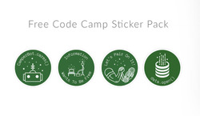

## Introduction aux défis de la conception Web réactive

[Responsive Web Design Principles | freeCodeCamp.org](https://www.freecodecamp.org/learn/responsive-web-design/responsive-web-design-principles)

Aujourd'hui, il existe de nombreux types d'appareils qui peuvent accéder au Web. Ils vont des gros ordinateurs de bureau aux petits téléphones mobiles. Ces  appareils ont des tailles d'écran, des résolutions et une puissance de  traitement différentes. Le Responsive Web Design est une approche de  conception de contenu Web qui répond aux contraintes de différents  appareils. La structure de la page et les règles CSS doivent être  flexibles pour s'adapter à ces différences. En général, concevez le CSS  de la page pour votre public cible. Si vous prévoyez que la majeure  partie de votre trafic proviendra d'utilisateurs mobiles, adoptez une  approche axée sur le mobile. Ajoutez ensuite des règles conditionnelles  pour des tailles d'écran plus grandes. Si vos visiteurs sont des  utilisateurs de bureau, créez des écrans plus grands avec des règles  conditionnelles pour les petites tailles. CSS vous donne les outils pour écrire différentes règles de style, puis les appliquer en fonction de  l'appareil affichant la page. Cette section couvrira les façons de base  d'utiliser CSS pour la conception Web réactive.

-----


## 1. Créer une requête multimédia

[Learn Responsive Web Design Principles: Create a Media Query | freeCodeCamp.org](https://www.freecodecamp.org/learn/responsive-web-design/responsive-web-design-principles/create-a-media-query)

Les requêtes multimédias sont une nouvelle technique introduite dans  CSS3 qui modifie la présentation du contenu en fonction de différentes  tailles de fenêtres. La fenêtre d'affichage est la zone visible de  l'utilisateur d'une page Web et diffère selon l'appareil utilisé pour  accéder au site.
Les requêtes multimédias consistent en un type  de support et si ce type de support correspond au type de périphérique  sur lequel le document est affiché, les styles sont appliqués. Vous  pouvez avoir autant de sélecteurs et de styles dans votre requête  multimédia que vous le souhaitez.
Voici un exemple de requête  multimédia qui renvoie le contenu lorsque la largeur de l'appareil est  inférieure ou égale à 100 pixels :

```css
@media (max-width: 100px) { /* Règles CSS */ }
```

et la requête multimédia suivante renvoie le contenu lorsque la hauteur de l'appareil est supérieure ou égale à 350 pixels :

```css
@media (min-height: 350px) { /* Règles CSS */ }
```

N'oubliez pas que le CSS à l'intérieur de la requête multimédia n'est appliqué  que si le type de support correspond à celui de l'appareil utilisé.

------

Ajoutez une requête multimédia, de sorte que la balise `p` ait une `font-size` de `10px` lorsque la hauteur de l'appareil est inférieure ou  égale à `800px`.

> Vous devez déclarer une requête `@media` pour les appareils dont `height` est inférieure ou égale à 800px.
> Votre élément `p` doit avoir une `font-size` de 10px lorsque `height` du périphérique est inférieure ou égale à 800px.
> Votre élément `p` doit avoir une `font-size` initiale de 20px lorsque `height` du périphérique est supérieure à 800px.

```html
<style>
  p {
    font-size: 20px;
  }
  /* Only change code below this line */
  /* Only change code above this line */
</style>
<p>Lorem ipsum dolor sit amet, consectetur adipiscing elit. Vivamus quis tempus massa. Aenean erat nisl, gravida vel vestibulum cursus, interdum sit amet lectus. Sed sit amet quam nibh. Suspendisse quis tincidunt nulla. In hac habitasse platea dictumst. Ut sit amet pretium nisl. Vivamus vel mi sem. Aenean sit amet consectetur sem. Suspendisse pretium, purus et gravida consequat, nunc ligula ultricies diam, at aliquet velit libero a dui.</p>
```

```html
<style>
  p {
    font-size: 20px;
  }
  @media (max-height: 800px) {
    p {
      font-size: 10px;
    }
  }
</style>
<p>Lorem ipsum dolor sit amet, consectetur adipiscing elit. Vivamus quis tempus massa. Aenean erat nisl, gravida vel vestibulum cursus, interdum sit amet lectus. Sed sit amet quam nibh. Suspendisse quis tincidunt nulla. In hac habitasse platea dictumst. Ut sit amet pretium nisl. Vivamus vel mi sem. Aenean sit amet consectetur sem. Suspendisse pretium, purus et gravida consequat, nunc ligula ultricies diam, at aliquet velit libero a dui.</p>
```

------


## 2. Rendre une image responsive

[Learn Responsive Web Design Principles: Make an Image Responsive | freeCodeCamp.org](https://www.freecodecamp.org/learn/responsive-web-design/responsive-web-design-principles/make-an-image-responsive)

Rendre les images responsives avec CSS est en fait très simple. Il vous suffit d'ajouter ces propriétés à une image :

```css
img {
  max-width: 100%;
  height: auto;
}
```

`max-width` de `100%` garantira que l'image n'est jamais plus large  que le conteneur dans lequel elle se trouve, et `height` `auto` fera que l'image conservera son rapport hauteur / largeur d'origine.

-----

Ajoutez les règles de style à la classe `responsive-img` pour la rendre réactive. Il ne doit jamais être plus large que son conteneur (dans ce cas, c'est la fenêtre d'aperçu) et il doit conserver son rapport hauteur / largeur d'origine. Après avoir ajouté votre code, redimensionnez l'aperçu pour  voir comment vos images se comportent.

> Votre classe `responsive-img` doit avoir une `max-width` définie sur `100%`.
> Votre classe `responsive-img` doit avoir une `height` définie sur `auto`.

```html
<style>
.responsive-img {
}
img {
  width: 600px;
}
</style>


```

```html
<style>
.responsive-img {
  max-width: 100%;
  height: auto;
}
img {
  width: 600px;
}
</style>


<!--
     
-->
```

-----


## 3. Utiliser une image Retina pour des écrans à haute résolution

[Learn Responsive Web Design Principles: Use a Retina Image for Higher Resolution Displays | freeCodeCamp.org](https://www.freecodecamp.org/learn/responsive-web-design/responsive-web-design-principles/use-a-retina-image-for-higher-resolution-displays)

Avec l'augmentation des appareils connectés à Internet, leurs tailles et leurs spécifications varient, et les écrans qu'ils utilisent pourraient être différents en externe et en interne. La densité de pixels est un  aspect qui pourrait être différent sur un appareil des autres et cette  densité est connue sous le nom de Pixel Per Inch (PPI) (pixels par pouce) or Dots Per Inch(DPI) (points  par pouce). Le plus célèbre de ces écrans est celui connu sous le nom d '« écran Retina » sur les derniers ordinateurs portables Apple  MacBook Pro et récemment sur les ordinateurs iMac. En raison de la  différence de densité de pixels entre les écrans "Retina" et "Non-Retina", certaines images qui n'ont pas été réalisées avec un  écran haute résolution à l'esprit peuvent sembler "pixélisées"  lorsqu'elles sont rendues sur un écran haute résolution.
Le moyen le plus simple de faire apparaître correctement vos images sur les  écrans haute résolution, tels que l'affichage retina du MacBook Pro,  consiste à définir leurs valeurs de `width` et de `height` comme  seulement la moitié de ce qu'est le fichier d'origine. Voici un exemple  d'image qui n'utilise que la moitié de la hauteur et de la largeur  d'origine :

```html
<style>
  img { height: 250px; width: 250px; }
</style>

```

-----

Définissez la `width` et la `height` de la balise `img` sur la moitié de leurs  valeurs d'origine. Dans ce cas, la `width` et la `height`  d'origine sont de `200px`.

> Votre balise `img` doit avoir une `width` de 100 pixels.
> Votre balise `img` doit avoir une `height` de 100 pixels.

```html
<style>
</style>

```

```html
<style>
  img { height: 100px; width: 100px; }
</style>

<!--
	
-->
```

-----


## 4. Rendre la typographie responsive

[Learn Responsive Web Design Principles: Make Typography Responsive | freeCodeCamp.org](https://www.freecodecamp.org/learn/responsive-web-design/responsive-web-design-principles/make-typography-responsive)

Au lieu d'utiliser `em` ou `px` pour dimensionner le texte, vous pouvez  utiliser des unités de fenêtre pour une typographie réactive. Les unités de la fenêtre, comme les pourcentages, sont des unités relatives, mais  elles sont basées sur des éléments différents. Les unités de la fenêtre  sont relatives aux dimensions de la fenêtre (largeur ou hauteur) d'un  appareil, et les pourcentages sont relatifs à la taille de l'élément de  conteneur parent.
Les quatre différentes unités de fenêtre sont :

- vw (viewport width - largeur de la fenêtre) : 10vw correspondrait à 10% de la largeur de la fenêtre.
- vh (viewport height - hauteur de la fenêtre) : 3vh correspondrait à 3% de la hauteur de la fenêtre.
- vmin (viewport minimum - minimum de la fenêtre) : 70vmin correspondrait à  70% de la plus petite dimension de la fenêtre (hauteur ou largeur).
- vmax (viewport maximum - maximum de la fenêtre) : 100vmax correspondrait à 100% de la plus grande dimension de la fenêtre (hauteur ou largeur).

Voici un exemple qui définit une balise de corps à 30% de la largeur de la fenêtre.

```css
body { width: 30vw; }
```

-----

Définissez la `width` de la balise `h2` à 80% de la largeur de la fenêtre et la `width` du paragraphe à 75% de la plus petite dimension de la fenêtre.

> Votre balise `h2` doit avoir une `width` de 80vw.
> Votre balise `p` doit avoir une `width` de 75vmin.

```html
<style>
</style>
<h2>Importantus Ipsum</h2>
<p>Lorem ipsum dolor sit amet, consectetur adipiscing elit. Vivamus quis tempus massa. Aenean erat nisl, gravida vel vestibulum cursus, interdum sit amet lectus. Sed sit amet quam nibh. Suspendisse quis tincidunt nulla. In hac habitasse platea dictumst. Ut sit amet pretium nisl. Vivamus vel mi sem. Aenean sit amet consectetur sem. Suspendisse pretium, purus et gravida consequat, nunc ligula ultricies diam, at aliquet velit libero a dui.</p>
```

```html
<style>
  h2 {
    width: 80vw;
  }
  p {
    width: 75vmin;
  }
</style>
<h2>Importantus Ipsum</h2>
<p>Lorem ipsum dolor sit amet, consectetur adipiscing elit. Vivamus quis tempus massa. Aenean erat nisl, gravida vel vestibulum cursus, interdum sit amet lectus. Sed sit amet quam nibh. Suspendisse quis tincidunt nulla. In hac habitasse platea dictumst. Ut sit amet pretium nisl. Vivamus vel mi sem. Aenean sit amet consectetur sem. Suspendisse pretium, purus et gravida consequat, nunc ligula ultricies diam, at aliquet velit libero a dui.</p>
```

