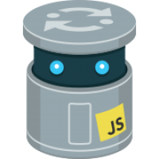

## Shell

:::info Bash

(acronyme de ***Bourne-Again shell***) est un interpréteur en ligne de
commande de type script. C'est le [shell Unix](https://fr.wikipedia.org/wiki/Shell_Unix) du projet
[GNU](https://fr.wikipedia.org/wiki/GNU).

Fondé sur le [Bourne shell](https://fr.wikipedia.org/wiki/Bourne_shell), Bash lui apporte de nombreuses améliorations,
provenant notamment du [Korn shell](https://fr.wikipedia.org/wiki/Korn_shell) et du [C shell](https://fr.wikipedia.org/wiki/Csh).
Bash est un [logiciel libre](https://fr.wikipedia.org/wiki/Logiciel_libre) publié sous
[licence publique générale GNU](https://fr.wikipedia.org/wiki/Licence_publique_générale_GNU).
Il est l'[interprète](https://fr.wikipedia.org/wiki/Interprète_(informatique))
[par défaut](https://fr.wikipedia.org/wiki/Par_défaut) sur de nombreux [Unix](https://fr.wikipedia.org/wiki/Unix)
libres, notamment sur les systèmes [GNU/Linux](https://fr.wikipedia.org/wiki/Linux). C'était aussi le shell par défaut
de [Mac OS X](https://fr.wikipedia.org/wiki/Mac_OS_X), remplacé avec Mac OS Catalina (v10.15) par
[zsh](https://fr.wikipedia.org/wiki/Zsh). Il a été d'abord porté sous
[Microsoft Windows](https://fr.wikipedia.org/wiki/Microsoft_Windows) par le projet
[Cygwin](https://fr.wikipedia.org/wiki/Cygwin), et depuis [Windows 10](https://fr.wikipedia.org/wiki/Windows_10)
constitue une option à part entière, nommée *Windows Subsystem for Linux* du système d'exploitation.
:::

:::info Oh My Zsh

Oh My Zsh est un framework open source, piloté par la communauté, pour gérer votre configuration zsh. 
 

https://github.com/ohmyzsh 
https://korben.info/oh-my-zsh-framework-booster-shell-zsh.html 
https://www.linuxed.net/installation-de-zsh-autojump-et-oh-my-zsh/
:::

:::info Terminator

Terminator est un terminal virtuel qui a la particularité de permettre  de partager la fenêtre selon
vos envies et ainsi organiser plus  simplement vos différentes fenêtres.

https://doc.ubuntu-fr.org/terminator
:::

------

## Logiciel de forges

:::info GitHub

**GitHub** est un service web d'[hébergement](https://fr.wikipedia.org/wiki/Hébergeur_web)
et de gestion de développement de logiciels, utilisant le
[logiciel de gestion de versions](https://fr.wikipedia.org/wiki/Logiciel_de_gestion_de_versions)
[Git](https://fr.wikipedia.org/wiki/Git). Ce site est développé en [Ruby on Rails](https://fr.wikipedia.org/wiki/Ruby_on_Rails)
et [Erlang](https://fr.wikipedia.org/wiki/Erlang_(langage)) par Chris Wanstrath, PJ Hyett et Tom Preston-Werner. GitHub
propose des comptes professionnels payants, ainsi que des comptes gratuits pour les projets de
[logiciels libres](https://fr.wikipedia.org/wiki/Logiciels_libres). Le site assure également un contrôle d'accès et des
fonctionnalités  destinées à la collaboration comme le suivi des bugs, les demandes de  fonctionnalités, la gestion de
tâches et un wiki pour chaque projet.
:::

:::info GitLab

**GitLab** est un [logiciel libre](https://fr.wikipedia.org/wiki/Logiciel_libre) de
[forge](https://fr.wikipedia.org/wiki/Forge_(informatique)) basé sur [git](https://fr.wikipedia.org/wiki/Git) proposant
les fonctionnalités de [wiki](https://fr.wikipedia.org/wiki/Wiki), un
[système de suivi des bugs](https://fr.wikipedia.org/wiki/Système_de_suivi_des_bugs),
l’[intégration continue](https://fr.wikipedia.org/wiki/Intégration_continue) et la
[livraison continue](https://fr.wikipedia.org/wiki/Livraison_continue). Développé par GitLab Inc et créé par
Dmitriy Zaporozhets et par Valery  Sizov, le logiciel est utilisé par plusieurs grandes entreprises  informatiques
incluant [IBM](https://fr.wikipedia.org/wiki/IBM), [Sony](https://fr.wikipedia.org/wiki/Sony), le
[centre de recherche de Jülich](https://fr.wikipedia.org/wiki/Centre_de_recherche_de_Jülich), la
[NASA](https://fr.wikipedia.org/wiki/NASA), [Alibaba](https://fr.wikipedia.org/wiki/Alibaba_Group),
[Oracle](https://fr.wikipedia.org/wiki/Oracle_(entreprise)), Invincea,
[O’Reilly Media](https://fr.wikipedia.org/wiki/O'Reilly_Media),
[Leibniz Rechenzentrum](https://fr.wikipedia.org/wiki/Leibniz_Rechenzentrum), le
[CERN](https://fr.wikipedia.org/wiki/CERN)[4](https://fr.wikipedia.org/wiki/GitLab#cite_note-4),
[5](https://fr.wikipedia.org/wiki/GitLab#cite_note-5),[6](https://fr.wikipedia.org/wiki/GitLab#cite_note-6),
[European XFEL](https://fr.wikipedia.org/wiki/European_X-ray_free-electron_laser), la
[GNOME Foundation](https://fr.wikipedia.org/wiki/GNOME_Foundation), [Boeing](https://fr.wikipedia.org/wiki/Boeing),
Autodata, [SpaceX](https://fr.wikipedia.org/wiki/SpaceX)[7](https://fr.wikipedia.org/wiki/GitLab#cite_note-7) et Altares.
:::

------

## Logiciel de gestion de versions

:::info Git

**Git** est un logiciel de gestion de versions  décentralisé. Il est conçu pour être
efficace tant avec les petits  projets, que les plus importants.

Git a spécialement été créé pour le développement du noyau linux.

Ce projet a débuté en 2005, Linus Torvalds voulait créer une alternative au logiciel propriétaire BitKeeper.
Depuis, Git a beaucoup évolué et  est utilisé par de nombreux projets.

Contrairement à des outils comme SVN ou CVS, Git fonctionne de façon  décentralisée, c'est-à-dire que le
développement ne se fait pas sur un  serveur centralisé, mais chaque personne peut développer sur son propre
dépôt. Git facilite ensuite la fusion (*merge*) des différents dépôts.
:::

-------

## Éditeur de code

:::info Visual Studio Code

 
 
 
:::

:::info VSCodium

 
 
 
:::

:::tip Mise en évidence de la syntaxe
Fira Code : police monospace gratuite avec ligatures de programmation

https://github.com/tonsky/FiraCode

vscode-language-babel

https://babeljs.io/docs/en/editors/

Thème : Theme - Oceanic Next

https://marketplace.visualstudio.com/items?itemName=naumovs.theme-oceanicnext

:::
------

## Plateforme logicielle

:::info Node.js

Node.js est un environnement [JavaScript](https://developer.mozilla.org/fr/docs/Glossaire/JavaScript) multiplateforme qui permet aux
développeurs de créer des applications réseaux et côté serveur en utilisant JavaScript.
 
 
 
:::

:::info npm

 
 
 
:::

:::info npx
 
 
 
:::

:::info yarn
 
 
 
:::

:::info JavaScript

 
 
 
:::

:::info Airbnb JavaScript Style Guide
https://github.com/airbnb/javascript
 
 
 
:::

:::info React
 
 

#### React Developer Tools - extension Firefox
React Developer Tools est un instrument qui vous permet d'inspecter un arbre React, en incluant la hiérarchie component,
props, state et plus. Pour commencer, ouvrez juste le Firefox devtools et basculez aux onglets 'Components' ou 'Profiler'.

https://addons.mozilla.org/fr/firefox/addon/react-devtools/
 
:::

:::info ECMAScript
 
 
 
:::

------

## Technologies web

:::info DOM

Le ***Document Object Model*** ou **DOM** (pour modèle objet de document) est une interface de programmation pour
les documents HTML, XML et SVG. Il fournit une représentation  structurée du document sous forme d'un arbre et
définit la façon dont la structure peut être manipulée par les programmes, en termes de style et de contenu. Le
DOM représente le document comme un ensemble de nœuds et d'objets possédant des propriétés et des méthodes. Les
nœuds peuvent  également avoir des gestionnaires d'événements qui se déclenchent  lorsqu'un événement se produit.
Cela permet de manipuler des pages web  grâce à des scripts et/ou des langages de programmation. Les nœuds peuvent
être associés à des gestionnaires d'événements. Une fois qu'un événement est déclenché, les gestionnaires d'événements
sont exécutés.
:::

:::info HTML

### html shell

http://htmlshell.com/

 

### htmlreference

https://htmlreference.io/
:::

:::info CSS

https://css-tricks.com/

https://cssauthor.com/

https://cssreference.io/
:::

------

## Validateurs W3C

:::info validator.w3

 
 
 
:::

------

## Wireframe

MockFlow

------

## Service d'hébergement de notes rapides

### Pastebin

 Pastebin

 
 
 

### Framabin

 
 
 

### Github Gist

------

## Texte et image de substitution

https://placeholder.com/

------

## Environnement de développement en ligne

### CodeSandbox

 CodeSandbox

 
 
 

### CodePen

 CodePen

 
 
 

### Repl.it

 Repl.it

 
 
 

jsfiddle.net/api/mdn

------

## Application Web en ligne

### JS Bin

 JS Bin

 
 
 

Bootstrap

------

## Firefox Developpement Edition

Les outils de développement peuvent être ouverts avec Ctrl + Shift + I ou F12 

https://wiki.developer.mozilla.org/fr/docs/Outils/Console_Web/The_command_line_interpreter#Le_mode_%C3%A9diteur_multiligne

------

## Outil de gestion de projet

 Trello

 
 
 

Scrum

Kanban

Tracker

Workflow

------

## Lexique

framework = infrastructure - cadre de travail

IDE = ***integrated development environment*** - environnement de développement

wireframe = maquette fonctionnelle - maquette de fil de fer

- [HTML](https://developer.mozilla.org/fr/docs/Web/HTML)

  **HyperText Markup Language** (langage de balisage hypertexte ou **HTML**) est le langage utilisé pour
  décrire et définir le *contenu* d'une page web.

- [CSS](https://developer.mozilla.org/fr/docs/Web/CSS)

  **Cascading Style Sheets** (feuilles de style en cascade ou **CSS**) est utilisé pour décrire l'apparence du
  contenu d'une page web.

- [HTTP](https://developer.mozilla.org/fr/docs/Web/HTTP)

  **Hypertext Transfer Protocol (HTTP)** est un protocole de
  [la couche application](https://fr.wikipedia.org/wiki/Couche_application), orienté client-serveur, qui
  permet le transfert de documents web tels que des documents HTML.

- [JavaScript](https://developer.mozilla.org/fr/docs/Web/JavaScript)

  **JavaScript** est le langage de programmation exécuté du côté de votre navigateur. Vous pouvez l'utiliser
  pour ajouter un  côté interactif et dynamique a votre site web ou application.

  Avec l'avènement de [Node.js](https://developer.mozilla.org/fr/docs/Glossaire/Node.js), vous pouvez également
  exécuter JavaScript sur le serveur.

- [Les API web](https://developer.mozilla.org/fr/docs/Web/API)

  Les **interfaces de programmation d'application Web (API Web)** sont utilisées pour effectuer une variété de
  tâches, telles que la manipulation du [DOM](https://developer.mozilla.org/fr/docs/DOM), la lecture audio ou
  vidéo, ou la génération de graphiques 3D.
  [La référence des interfaces des différentes API web](https://developer.mozilla.org/fr/docs/Web/API) : toutes
  les interfaces, triées par ordre alphabétique.  [WebAPI](https://developer.mozilla.org/fr/docs/WebAPI) : cette page
  liste les API d’accès aux composants des appareils, ainsi que d’autres API utiles pour les applications.
  [La référence des évènements](https://developer.mozilla.org/fr/docs/Web/Events) décrit l'ensemble des évènements
  qui peuvent être utilisés pour réagir  aux évènements marquants qui se sont produits dans une page web ou une application.

- [Web components](https://developer.mozilla.org/fr/docs/Web/Web_Components)

  **Web Components** est une suite de différentes  technologies vous permettant de créer des éléments personnalisés
  réutilisables - avec leurs fonctionnalités encapsulées à l'écart du  reste de votre code - et les utiliser dans vos
  applications Web.

URL (Uniform Resource Locator — littéralement « localisateur uniforme de ressource »)

HTTP signifie HyperText Transfert Protocol (« protocole de transfert hypertexte »)

{ } : curly braces : accolades

